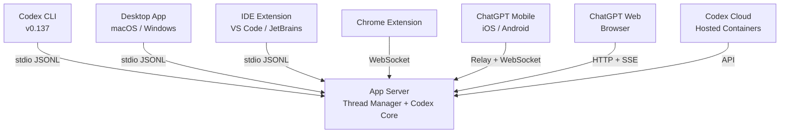
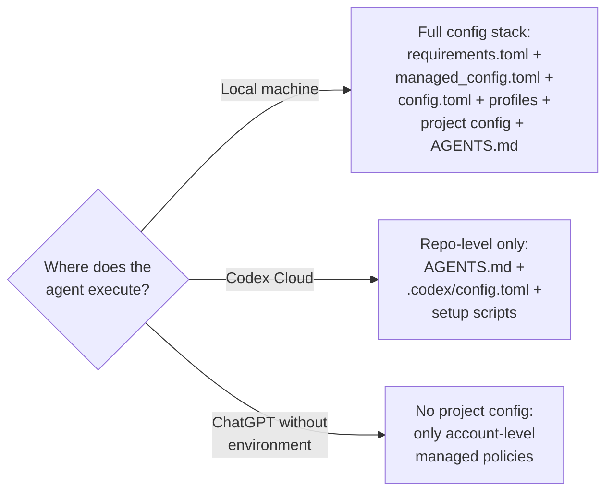

# Codex Inside ChatGPT: What the Platform Convergence Means for CLI-First Developer Workflows


---

On 2 June 2026, OpenAI announced at its *Intelligence at Work* livestream that Codex would be embedded directly into the ChatGPT application — desktop, mobile, and web — "in the next few weeks"[^1]. This is not a rebrand or a simple sidebar addition. It represents the final convergence of two product lines that have been drifting toward each other since the App Server architecture shipped in February 2026[^2]. For the five million weekly active Codex users[^3], and particularly for the CLI-first developers who have invested in AGENTS.md hierarchies, config.toml layering, and MCP server ecosystems, this raises practical questions about what changes, what survives, and what you should actually do about it.

This article unpacks the technical architecture enabling the merge, maps the seven-surface landscape that emerges, and provides concrete guidance for CLI developers navigating the transition.

---

## Why Now: The Demographic Trigger

The timing is deliberate. As of early June 2026, non-developers — financial analysts, marketers, operations staff, researchers — account for roughly 20% of Codex's weekly active users and are adopting the platform at three times the rate of traditional engineers[^3]. OpenAI's challenge is straightforward: businesses already know and use ChatGPT, but many are unaware of Codex or uncertain when to reach for it[^1]. Embedding Codex capabilities inside ChatGPT eliminates that decision entirely.

The strategic logic extends further. Greg Brockman's May 2026 internal memo confirmed OpenAI could not sustain separate product teams for capabilities that are converging[^4]. The June announcement is the public execution of that memo: one product surface, one subscription, one agent runtime that serves everyone from investment bankers running the new equity research plugin to staff engineers debugging kernel panics via the CLI[^5].

---

## The App Server: Why This Merge Is Architecturally Feasible

The convergence works because OpenAI built the right abstraction layer first. The **App Server**, open-sourced as part of the `codex-rs` crate, is a long-lived process that hosts threads, manages approvals, and streams events to any connected client[^2]. Every Codex surface — CLI, desktop app, VS Code extension, JetBrains plugin, Chrome extension, mobile relay — connects to the same backend via a bidirectional JSON-RPC 2.0 protocol streamed as JSONL over stdio or WebSocket[^2][^6].



Three conversation primitives underpin cross-surface portability[^2]:

| Primitive | Purpose |
|---|---|
| **Item** | Atomic unit of input or output with a lifecycle: started → delta → completed |
| **Turn** | Groups the sequence of items from a single unit of agent work |
| **Thread** | Durable container supporting creation, resumption, forking, and archival |

Because threads are owned by the App Server rather than by any individual surface, a thread started in the CLI can be resumed in the desktop app, steered from the mobile client, and — once the ChatGPT integration ships — continued from a ChatGPT conversation[^2][^7]. The protocol is backwards-compatible: older CLI versions talk safely to newer App Server releases[^2].

---

## The Seven-Surface Landscape

With Codex embedded in ChatGPT, the surface count rises to seven distinct entry points, each targeting a different context and audience:

| Surface | Best For | Local Execution | Cloud Execution | AGENTS.md | Config.toml |
|---|---|---|---|---|---|
| **CLI** | Terminal-native development, CI/CD, scripting | Yes | Via `codex cloud` | Yes | Yes |
| **Desktop App** | Visual thread management, worktrees, Computer Use | Yes | Yes | Yes | Yes |
| **IDE Extension** | In-editor completions, refactoring, buffer context | Yes | Yes | Yes | Yes |
| **Chrome Extension** | Browser-context screenshots, page interaction | Via relay | No | Partial | Partial |
| **Mobile (ChatGPT)** | Remote steering, approvals, on-the-go review | Via relay | Yes | Inherited | Inherited |
| **ChatGPT Web/Desktop** | Knowledge work, business plugins, Sites | No | Yes | ⚠️ TBC | ⚠️ TBC |
| **Codex Cloud** | Isolated long-running tasks, best-of-N | No | Yes | Via repo | Via repo |

The critical question for CLI developers is the "TBC" cells. When Codex runs inside a ChatGPT conversation, does it load your repository's AGENTS.md? Does it respect your config.toml model selection and sandbox policies? The answer depends on how the session is initiated.

---

## What CLI Developers Should Expect

### Thread Portability Is Bidirectional — With Caveats

The App Server already supports cross-surface thread resumption[^2]. If you start a thread in the CLI and it gets picked up in a ChatGPT conversation connected to the same account and environment, the full conversation history, including tool calls and file edits, travels with it[^7]. The reverse also holds: a thread initiated in ChatGPT that connects to a local environment will inherit the AGENTS.md files found in the project directory[^8].

The caveat is the **environment connection**. ChatGPT-embedded Codex sessions that run in Codex Cloud — the default for non-developer users — will check out your GitHub repository into a hosted container, where AGENTS.md from the repo root applies but your local `~/.codex/config.toml` does not[^9]. Sessions that relay to a local machine via the ChatGPT mobile pairing flow do inherit local configuration[^7].

### Configuration Inheritance Rules

For CLI-first developers, the practical rule is:



This means your investment in AGENTS.md files checked into the repository is portable across every surface[^8]. Your investment in local config.toml is portable only to surfaces that connect to your machine. The v0.137 cloud-managed configuration bundles — requirements.toml and managed_config.toml for Business, Enterprise, and EDU workspaces — apply regardless of surface, because they are fetched from OpenAI's servers at session start[^10].

### The CLI Remains the Power Surface

Despite the convergence narrative, the CLI retains capabilities that no other surface matches:

- **`codex exec`** for non-interactive, scriptable one-shot tasks with `--output-schema` JSON validation[^11]
- **`codex exec resume`** and **`codex exec fork`** for multi-stage automation pipelines[^11]
- **`codex sandbox`** as a standalone command-isolation utility independent of the agent loop[^12]
- **`codex doctor --json`** for machine-readable diagnostics[^13]
- **Full `--json` JSONL event streaming** for integration with downstream tools[^11]
- **SSH and remote-host execution** — the only option for developers on remote VPSes[^14]
- **Shell completion** (bash/zsh/fish) and terminal-native keyboard shortcuts[^15]

The ChatGPT-embedded Codex surface is optimised for knowledge workers building Sites, running business plugins, and annotating documents[^1]. It is not designed to replace `codex exec "migrate all CommonJS requires to ESM imports" --sandbox workspace-write --output-schema ./migration-report.json`. These workflows remain CLI territory.

---

## Practical Steps for CLI Developers

### 1. Invest in Repo-Level Configuration

Since AGENTS.md and `.codex/config.toml` travel with the repository and apply across all surfaces — including ChatGPT-initiated cloud sessions — this is the highest-leverage configuration surface[^8]:

```toml
# .codex/config.toml — travels with the repo
model = "gpt-5.5"
model_reasoning_effort = "high"
approval_policy = "on-request"

[features]
web_search = "cached"
```

### 2. Use Profiles for Surface-Specific Behaviour

If you want different model or sandbox settings when running in CI versus interactively, use named profiles rather than hardcoding into the base config[^15]:

```bash
# CI pipeline uses the 'ci' profile
codex exec --profile ci "Run the full test suite and report failures"

# Interactive development uses defaults
codex "Help me refactor the auth module"
```

### 3. Prepare for Cross-Surface Thread Handoffs

With Codex inside ChatGPT, non-developer colleagues may start threads against your repository. Ensure your AGENTS.md includes guardrails that protect against well-intentioned but dangerous operations[^8]:

```markdown
## Safety Rules
- NEVER modify files in `infrastructure/` without explicit approval
- ALWAYS run `make test` before proposing changes
- Do NOT commit directly to main — create a branch
```

### 4. Monitor via the Managed Configuration Stack

For Enterprise and Business teams, the v0.137 cloud-managed config bundles let administrators enforce policies that apply across every surface — CLI, App, IDE, and ChatGPT alike[^10]. If your organisation is rolling out Codex to non-developer teams via ChatGPT, these managed requirements are your primary governance lever:

```toml
# requirements.toml — admin-enforced, cannot be overridden
[requirements]
sandbox_mode = "workspace-write"
approval_policy = "on-request"

[requirements.network]
allow_domains = ["api.internal.corp", "registry.npmjs.org"]
```

---

## What This Means Strategically

The Codex-inside-ChatGPT move is not a deprecation signal for the CLI. It is an audience expansion that leaves the terminal surface untouched while opening Codex capabilities to the 900+ million ChatGPT users who would never install a CLI tool[^4]. The App Server architecture ensures that CLI developers benefit indirectly: every improvement to the thread runtime, model capabilities, and plugin ecosystem — driven by the much larger ChatGPT user base — flows back to the CLI through the shared backend.

The risk for CLI developers is not obsolescence but **context collision**. When non-developer colleagues start Codex sessions against your repositories via ChatGPT, the guardrails in your AGENTS.md files and managed configuration policies become the front line of defence. Invest in them now.

---

## Citations

[^1]: 9to5Mac, "OpenAI putting Codex inside ChatGPT, 6 new business plugins now available," 2 June 2026. [https://9to5mac.com/2026/06/02/openai-putting-codex-inside-chatgpt-app-everywhere-releasing-6-business-plugins/](https://9to5mac.com/2026/06/02/openai-putting-codex-inside-chatgpt-app-everywhere-releasing-6-business-plugins/)

[^2]: InfoQ, "OpenAI Publishes Codex App Server Architecture for Unifying AI Agent Surfaces," February 2026. [https://www.infoq.com/news/2026/02/openai-codex-app-server/](https://www.infoq.com/news/2026/02/openai-codex-app-server/)

[^3]: OpenAI, "Codex is becoming a productivity tool for everyone," June 2026. [https://openai.com/index/codex-for-knowledge-work/](https://openai.com/index/codex-for-knowledge-work/)

[^4]: AI Disruption, "The Merger of ChatGPT and Codex," May 2026. [https://aidisruption.ai/p/the-merger-of-chatgpt-and-codex](https://aidisruption.ai/p/the-merger-of-chatgpt-and-codex)

[^5]: OpenAI, "Introducing upgrades to Codex," June 2026. [https://openai.com/index/introducing-upgrades-to-codex/](https://openai.com/index/introducing-upgrades-to-codex/)

[^6]: GitHub, `codex-rs/app-server/README.md`, openai/codex repository. [https://github.com/openai/codex/blob/main/codex-rs/app-server/README.md](https://github.com/openai/codex/blob/main/codex-rs/app-server/README.md)

[^7]: OpenAI, "Work with Codex from anywhere," May 2026. [https://openai.com/index/work-with-codex-from-anywhere/](https://openai.com/index/work-with-codex-from-anywhere/)

[^8]: OpenAI Developer Documentation, "Custom instructions with AGENTS.md." [https://developers.openai.com/codex/guides/agents-md](https://developers.openai.com/codex/guides/agents-md)

[^9]: OpenAI Developer Documentation, "Web — Environments." [https://developers.openai.com/codex/cloud](https://developers.openai.com/codex/cloud)

[^10]: OpenAI Developer Documentation, "Managed configuration." [https://developers.openai.com/codex/enterprise/managed-configuration](https://developers.openai.com/codex/enterprise/managed-configuration)

[^11]: OpenAI Developer Documentation, "Non-interactive mode." [https://developers.openai.com/codex/noninteractive](https://developers.openai.com/codex/noninteractive)

[^12]: OpenAI Developer Documentation, "Sandbox." [https://developers.openai.com/codex/concepts/sandboxing](https://developers.openai.com/codex/concepts/sandboxing)

[^13]: OpenAI, Codex CLI v0.137.0 release notes, 4 June 2026. [https://github.com/openai/codex/releases](https://github.com/openai/codex/releases)

[^14]: Context Studios, "Codex App vs Codex CLI/IDE: Agent Command Center or Developer-Native Workflow?" [https://www.contextstudios.ai/comparisons/codex-app-vs-codex-cli-ide](https://www.contextstudios.ai/comparisons/codex-app-vs-codex-cli-ide)

[^15]: OpenAI Developer Documentation, "Best practices." [https://developers.openai.com/codex/learn/best-practices](https://developers.openai.com/codex/learn/best-practices)
