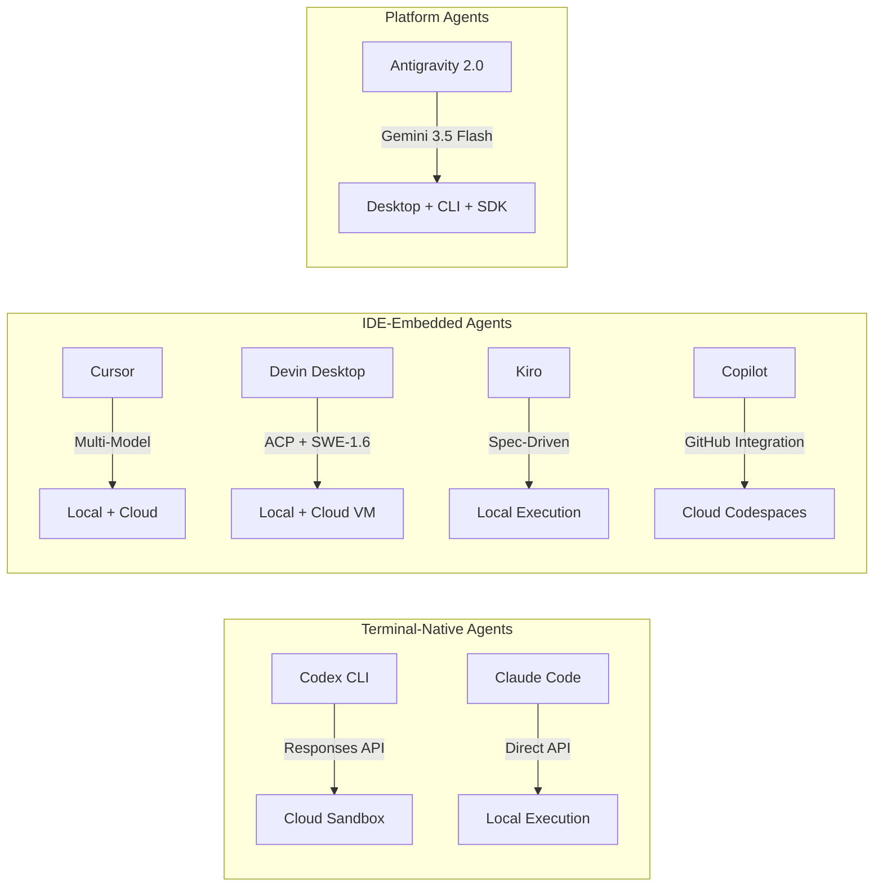
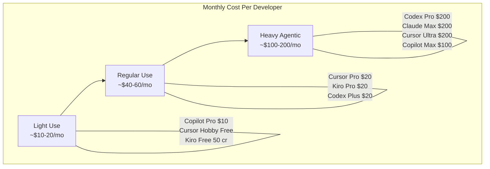

# Coding Agent Landscape, June 2026: How Codex CLI v0.137 Stacks Up Against Copilot Flex, Devin Desktop, Antigravity 2.0, and Kiro

---

The first week of June 2026 reshaped the coding agent market more dramatically than any seven-day stretch since the original Codex launch. GitHub Copilot switched every plan to usage-based billing on 1 June[^1]. Windsurf rebranded to Devin Desktop on 2 June, absorbing the Cognition acquisition into a single surface[^2]. Google's Antigravity 2.0 — launched at I/O on 19 May — hit its forced legacy-CLI deprecation deadline of 18 June[^3]. And Codex CLI shipped v0.137.0 stable on 4 June with cloud config bundles, multi-agent v2 persistence, and plugin JSON output[^4]. Meanwhile Anthropic pre-announced that Claude Code's programmatic usage moves to credit-metered billing on 15 June[^5], and AWS's Kiro quietly added Claude Opus 4.8 with adaptive thinking to its paid tiers[^6].

This article maps the landscape as it stands today, compares the tools on architecture, pricing, and workflow fit, and offers a decision framework for teams already running Codex CLI in production.

---

## The Seven Contenders

### Codex CLI (OpenAI)

Terminal-native agent with a cloud sandbox execution model. v0.137.0 runs GPT-5.5 by default, supports GPT-5.4 and GPT-5.4-mini for subagent delegation, and offers first-party Amazon Bedrock and custom provider routing[^4]. The agent loop uses the Responses API with `apply_patch` edits, parallel tool calling, and the `phase` parameter for structured reasoning[^7]. Enterprise teams get cloud-managed configuration bundles, EDU workspace support, and monthly credit-limit visibility[^4].

### GitHub Copilot (Microsoft/GitHub)

As of 1 June, every Copilot plan bills on GitHub AI Credits at \$0.01 per credit[^1]. Pro (\$10/month) includes a \$15 effective allowance during the flex-allotment window (June–September); Pro+ (\$39/month) gets \$70; the new Max tier (\$100/month) provides 20,000 credits[^8]. Copilot's advantage remains GitHub-native integration — issues, PRs, Actions, code owners — plus multi-model selection across GPT-5.5, Claude Opus 4.8, and Gemini models[^1].

### Devin Desktop (Cognition)

The Windsurf rebrand landed as an OTA update on 2 June[^2]. The classic Windsurf editor persists — extensions, keybindings, LSPs — but the default surface is now the Agent Command Centre: a Kanban-style view managing both local and cloud agents. Devin Local replaces Cascade as the primary local agent, bringing 30% better token efficiency and subagent support[^2]. The standout architectural move is Agent Client Protocol (ACP) support, which lets Codex CLI, Claude Code, OpenCode, or any ACP-compatible agent run inside the Devin Desktop shell[^2].

### Antigravity 2.0 (Google)

Shipped at I/O 2026 on 19 May as a five-component suite: desktop app, CLI (written in Go), SDK, Managed Agents API, and enterprise deployment path[^3]. Powered by Gemini 3.5 Flash at approximately 289 output tokens per second, it is comfortably the fastest-responding agent in the field[^9]. Multi-agent orchestration lets one agent code a site whilst another generates brand assets in parallel[^3]. The legacy Gemini CLI deprecates forcefully on 18 June — teams still on it need to migrate now[^3].

### Kiro (AWS)

The spec-driven IDE from AWS introduced parallel Spec task execution in May, claiming a 4x throughput improvement[^6]. Kiro's differentiator is structural: before writing code, it generates a requirements document, a design document, and a task list, then works through them methodically[^10]. Pricing is credit-based: Free (50 credits), Pro (\$20/month, 1,000 credits), Pro+ (\$40/month, 2,000 credits), Power (\$200/month, 10,000 credits)[^6].

### Claude Code (Anthropic)

Terminal-native like Codex CLI, defaulting to Claude Opus 4.8 since 28 May[^11]. Anthropic's headline cost figure is \$13 per developer per active day on average, with 90% of users below \$30[^5]. The 15 June billing change splits programmatic usage (Agent SDK, `claude -p`, GitHub Actions) onto separate credit pools metered at API rates — \$20 for Pro, \$100 for Max 5x, \$200 for Max 20x, with no rollover[^5].

### Cursor (Anysphere)

The largest community of any AI IDE, Cursor launched Composer 2.5 (its in-house model) on 18 May, benchmarking competitively against Opus 4.7 and GPT-5.5 at significantly lower token costs (\$0.50/\$2.50 per million tokens)[^9]. Pricing spans Hobby (free), Pro (\$20/month), Pro+ (\$60/month), Ultra (\$200/month), and Teams (\$40/user/month)[^12]. Auto-mode completions are unlimited; premium model access draws from the credit pool.

---

## Architecture Comparison

The fundamental split is between **terminal-native agents** (Codex CLI, Claude Code) that operate on your codebase through the shell, and **IDE-embedded agents** (Cursor, Devin Desktop, Kiro, Copilot) that wrap an editor around the agent loop. Antigravity 2.0 straddles both camps with its CLI, desktop app, and SDK[^3].

Key architectural differences that matter in practice:

| Dimension | Codex CLI | Claude Code | Copilot | Cursor | Devin Desktop | Antigravity | Kiro |
|-----------|-----------|-------------|---------|--------|---------------|-------------|------|
| Execution model | Cloud sandbox | Local | Cloud (Codespaces) | Local + Cloud | Local + Cloud VM | Local + Managed | Local |
| Default model | GPT-5.5 | Opus 4.8 | Multi-model | Composer 2.5 | SWE-1.6 | Gemini 3.5 Flash | Opus 4.8 |
| Multi-model | OpenAI only | Anthropic only | Yes | Yes | Yes | Mostly Google | AWS models |
| MCP support | Yes | Yes | Yes | Yes | Yes | Yes | Yes |
| Parallel agents | Multi-agent v2 | Dynamic Workflows | Yes | Build in Parallel | Devin Cloud | Multi-agent | Parallel Specs |

---

## Pricing: The New Maths

The shift to usage-based billing across the industry makes direct comparison harder, but the pattern is clear: the \$20/month entry point is now standard, and heavy agentic use costs \$100–\$200/month regardless of tool.

For a ten-developer team on annual billing:

| Tool | Plan | Annual cost |
|------|------|-------------|
| Copilot Business | \$19/seat/month | \$2,280 |
| Kiro Pro | \$20/seat/month | \$2,400 |
| Cursor Teams | \$32/seat/month (annual) | \$3,840 |
| Codex Business | \$20/seat/month | \$2,400 |
| Devin Desktop Teams | \$40/user/month | \$4,800 |

These figures represent base costs. Agentic usage — cloud tasks, parallel agents, premium model requests — adds variable spend on top. Codex CLI's token-based billing (switched 2 April 2026) aligns costs more transparently with actual model consumption than the credit-abstraction systems used by Cursor and Kiro[^13].

---

## Where Each Tool Wins

**Choose Codex CLI when** your workflow is terminal-centric, you want cloud sandbox isolation for untrusted operations, your organisation has OpenAI enterprise agreements, or you need the deepest GPT-5.5 integration. v0.137's cloud config bundles make it the strongest enterprise-managed option[^4].

**Choose Claude Code when** you value Anthropic's safety-first approach, need the 1M-token context window for large codebase analysis, or prefer Opus 4.8's reasoning depth. Watch the 15 June billing change — programmatic usage costs may surprise teams accustomed to subscription-pool pricing[^5].

**Choose Copilot when** your team lives in GitHub. The issue-to-PR pipeline, Actions integration, and native code-review hooks are unmatched. The flex-allotment window (June–September) makes this the cheapest entry point at \$10/month effective[^1].

**Choose Cursor when** you want an IDE-first experience with the broadest model selection. Composer 2.5's price-performance ratio is compelling, and the Build in Parallel feature suits large refactoring tasks[^12].

**Choose Devin Desktop when** you need cloud-VM-based execution for long-running tasks, want ACP interoperability with multiple agents, or were already using Windsurf. The Kanban agent management surface suits teams coordinating many parallel agent sessions[^2].

**Choose Antigravity 2.0 when** speed matters most. Gemini 3.5 Flash's token throughput is unmatched, the multi-agent orchestration is production-ready, and the SDK enables custom agent embedding[^3]. Migrate from the legacy CLI before 18 June.

**Choose Kiro when** you want structured, spec-driven development. The requirements-design-tasks pipeline enforces engineering rigour that free-form agents lack, and the AWS-native integration suits teams already on Bedrock or CDK[^10].

---

## The Convergence Signal

Every tool now supports MCP. Every tool offers some form of parallel agent execution. Every tool has moved or is moving to usage-based billing. The 2026 coding agent market is converging on a common capability floor whilst differentiating on execution model (cloud sandbox vs local), default model family, and workflow philosophy (terminal-native vs IDE-embedded vs spec-driven).

For Codex CLI users, the practical implication is clear: the tool's strengths — cloud sandbox isolation, GPT-5.5 depth, enterprise configuration management, and the Responses API architecture — remain distinctive. Its weaknesses — OpenAI-model lock-in and the absence of a built-in IDE — are structural choices, not oversights. The v0.137 release with cloud config bundles and multi-agent v2 persistence reinforces the enterprise-terminal-agent positioning[^4].

The market is no longer asking whether coding agents work. It is asking which agent fits which workflow. Choose accordingly.

---

## Citations

[^1]: GitHub Blog, "Updates to GitHub Copilot billing and plans," 1 June 2026. [https://github.blog/changelog/2026-06-01-updates-to-github-copilot-billing-and-plans/](https://github.blog/changelog/2026-06-01-updates-to-github-copilot-billing-and-plans/)

[^2]: Devin Blog, "Windsurf is now Devin Desktop," 2 June 2026. [https://devin.ai/blog/windsurf-is-now-devin-desktop/](https://devin.ai/blog/windsurf-is-now-devin-desktop/)

[^3]: TechCrunch, "Google launches Antigravity 2.0 with an updated desktop app and CLI tool at IO 2026," 19 May 2026. [https://techcrunch.com/2026/05/19/google-launches-antigravity-2-0-with-an-updated-desktop-app-and-cli-tool-at-io-2026/](https://techcrunch.com/2026/05/19/google-launches-antigravity-2-0-with-an-updated-desktop-app-and-cli-tool-at-io-2026/)

[^4]: GitHub Releases, "Codex CLI v0.137.0," 4 June 2026. [https://github.com/openai/codex/releases/tag/rust-v0.137.0](https://github.com/openai/codex/releases/tag/rust-v0.137.0)

[^5]: FindSkill.ai, "Claude Code Pricing After June 15: The Decision Table," June 2026. [https://findskill.ai/blog/claude-code-pricing-after-june-15-decision-table/](https://findskill.ai/blog/claude-code-pricing-after-june-15-decision-table/)

[^6]: Kiro Pricing, accessed 5 June 2026. [https://kiro.dev/pricing/](https://kiro.dev/pricing/)

[^7]: OpenAI Cookbook, "Codex Prompting Guide," 2026. [https://developers.openai.com/cookbook/examples/gpt-5/codex_prompting_guide](https://developers.openai.com/cookbook/examples/gpt-5/codex_prompting_guide)

[^8]: GitHub Blog, "GitHub Copilot individual plans: Introducing flex allotments in Pro and Pro+, and a new Max plan," June 2026. [https://github.blog/news-insights/company-news/github-copilot-individual-plans-introducing-flex-allotments-in-pro-and-pro-and-a-new-max-plan/](https://github.blog/news-insights/company-news/github-copilot-individual-plans-introducing-flex-allotments-in-pro-and-pro-and-a-new-max-plan/)

[^9]: Lushbinary, "AI Coding Agents 2026: Claude Code vs Antigravity 2.0 vs Codex vs Cursor vs Kiro vs Copilot vs Windsurf," June 2026. [https://lushbinary.com/blog/ai-coding-agents-comparison-cursor-windsurf-claude-copilot-kiro-2026/](https://lushbinary.com/blog/ai-coding-agents-comparison-cursor-windsurf-claude-copilot-kiro-2026/)

[^10]: ChatForest, "Amazon Kiro Review — The Agentic IDE That Writes the Spec Before the Code," 2026. [https://chatforest.com/reviews/amazon-kiro-aws-agentic-ide-spec-driven-review/](https://chatforest.com/reviews/amazon-kiro-aws-agentic-ide-spec-driven-review/)

[^11]: Anthropic, Claude Code documentation, 2026. [https://platform.claude.com/docs/en/about-claude/pricing](https://platform.claude.com/docs/en/about-claude/pricing)

[^12]: Cursor Pricing, accessed 5 June 2026. [https://cursor.com/pricing](https://cursor.com/pricing)

[^13]: OpenAI, "Codex Pricing," 2026. [https://developers.openai.com/codex/pricing](https://developers.openai.com/codex/pricing)
