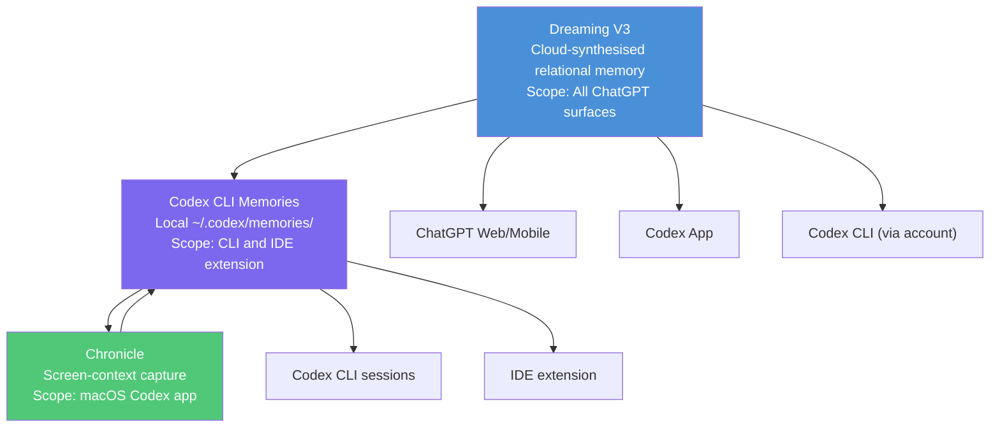
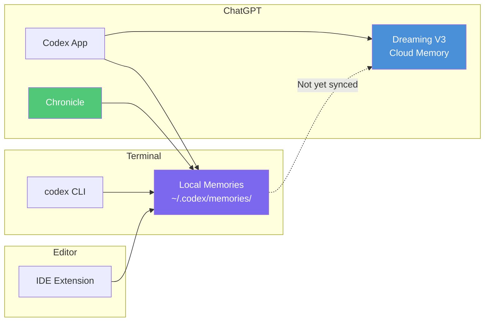
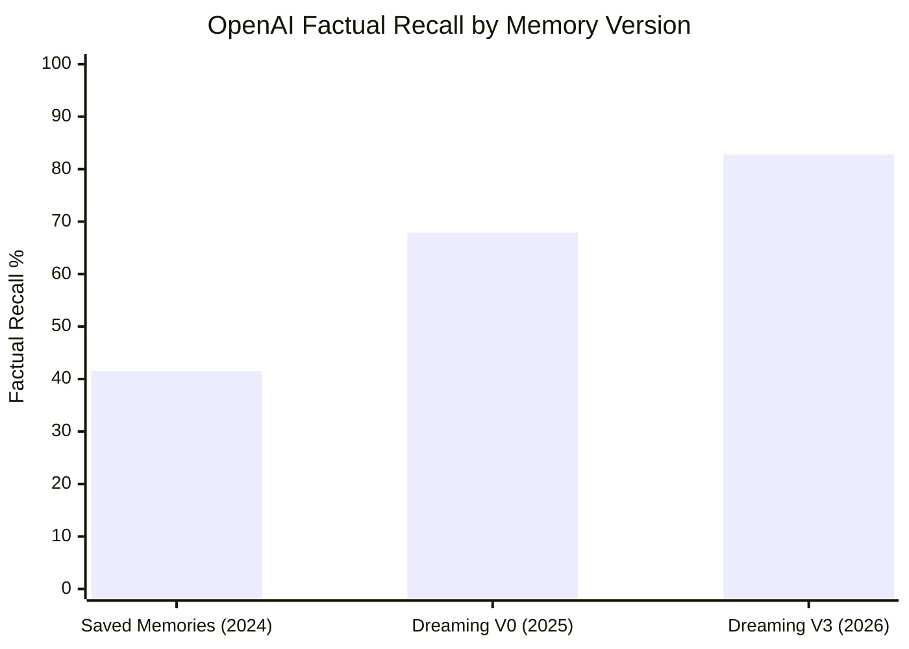

# Dreaming V3 and the Codex CLI Memory Stack: What the New Cross-Surface Memory Architecture Means for Developer Workflows


---

On 4 June 2026, OpenAI began rolling out **Dreaming V3** — the most significant memory architecture overhaul since ChatGPT launched in 2022 [^1]. Where the old saved-memories system waited for explicit "remember this" instructions, Dreaming V3 runs a background synthesis process that automatically distils useful context from conversations, self-corrects stale facts as time passes, and serves as the standalone memory foundation rather than supplementing a manual list [^2].

For Codex CLI developers, the announcement raises immediate questions. Codex CLI already has its own local memory system under `~/.codex/memories/`. Chronicle adds screen-context capture on macOS. Now Dreaming V3 introduces a third layer — cloud-synthesised relational memory — that spans every ChatGPT surface. Understanding how these layers interact is essential for anyone working across the CLI, IDE extension, and Codex app.

---

## The Three-Layer Memory Stack

Codex's memory capabilities now span three distinct layers, each with different scope, storage, and control characteristics.



### Layer 1: Dreaming V3 — Cloud Memory

Dreaming V3 operates at the ChatGPT account level. After conversations end, a background process synthesises what matters — preferences, constraints, ongoing projects, time-sensitive context — into a hierarchical structure with relational embeddings [^3]. Rather than storing "User prefers TypeScript" and "User works on microservices" as isolated snippets, V3 links these facts in a semantic network that captures their interconnections.

OpenAI reports factual recall rising from 41.5% (2024) to 82.8% (2026) on internal evals, with preference adherence at 71.3% and time-sensitive accuracy at 75.1% [^1]. These are vendor-stated figures from an unreleased methodology — treat them as directional rather than independently verified. ⚠️

Key characteristics:

- **Self-correcting**: memories update automatically as circumstances change (e.g. "going to Singapore in July" becomes "went to Singapore in July 2026" after the trip) [^1]
- **Governance defaults**: on for Free, Plus, Pro, and Team plans; **off** for Enterprise and Edu [^2]
- **Rollout**: US Plus/Pro from 4 June; expanding to additional countries and free tiers over subsequent weeks [^1]

### Layer 2: Codex CLI Memories — Local Persistence

The CLI's own memory system operates independently of Dreaming V3. After a session goes idle (defaulting to six hours), a background pass extracts useful context — tech stacks, project conventions, recurring workflows, known pitfalls — and writes it to `~/.codex/memories/` as unencrypted Markdown files [^4].

The generation pipeline splits into two phases:

1. **Phase 1 (per-session)**: conversation sampling with secret redaction before anything reaches disc
2. **Phase 2 (merge)**: a global lock and consolidation sub-agent merge new extractions with existing memories [^5]

These memories are injected into subsequent sessions automatically, reducing the need to restate project context.

### Layer 3: Chronicle — Screen-Context Capture

Chronicle, shipped as a research preview in April 2026, captures screen context via macOS Screen Recording permissions and processes captured images through sandboxed background agents to generate additional memory entries [^6]. Screenshots are stored temporarily under `$TMPDIR/chronicle/screen_recording/` and deleted after six hours; generated memories live at `$CODEX_HOME/memories_extensions/chronicle/` [^7].

Chronicle is only available to ChatGPT Pro subscribers on macOS and is unavailable in the EU, UK, and Switzerland [^7].

---

## How the Layers Interact

The critical question for developers: do these three systems share state?

**Currently, they do not fully merge.** Codex CLI memories are local files read at session startup. Dreaming V3 is a cloud-side system tied to your ChatGPT account. Chronicle feeds into Codex CLI's local memory store, not directly into Dreaming V3. The practical implication:

| Memory source | Where it appears | Developer control |
|---|---|---|
| Dreaming V3 | ChatGPT web, mobile, Codex app | Memory summary page; topic controls |
| Codex CLI memories | CLI sessions, IDE extension | `config.toml` keys; `/memories` commands |
| Chronicle | Feeds into Codex CLI memories | Menu bar pause/resume; macOS permissions |

This separation means preferences you express in ChatGPT web conversations will surface in future ChatGPT interactions via Dreaming V3, but they will **not** automatically appear in your CLI sessions. Conversely, project conventions your CLI learns from coding sessions stay local and do not propagate to ChatGPT.

With Codex now embedded inside ChatGPT [^8], this boundary is likely to blur. When you open a Codex task from the ChatGPT sidebar, the session runs in the Codex app surface — which has access to Dreaming V3 cloud memory. But firing up `codex` in your terminal still relies on local `~/.codex/memories/`. Developers who work across both surfaces should expect eventual convergence but plan for the current gap.

---

## Configuring the Memory Stack

### Enabling CLI Memories

Memories are disabled by default. Enable them in `~/.codex/config.toml`:

```toml
[features]
memories = true
```

### Tuning Generation Behaviour

The following keys control when and how aggressively the CLI generates memories [^4]:

```toml
[memories]
# Require threads to idle for at least 6 hours before processing
min_rollout_idle_hours = 6

# Process up to 16 threads per startup pass
max_rollouts_per_startup = 16

# Keep the last 256 raw memories for consolidation
max_raw_memories_for_consolidation = 256

# Skip generation if rate-limit headroom drops below 25%
min_rate_limit_remaining_percent = 25

# Exclude threads older than 30 days
max_rollout_age_days = 30

# Drop memories unused for 30 days from consolidation
max_unused_days = 30
```

The `min_rate_limit_remaining_percent` setting deserves attention. Chronicle users have reported the feature consuming significant quota overnight — one user found 572 background summaries generated, consuming 16% of their 5-hour Codex usage window without intentional use [^9]. Setting this threshold higher provides a safety margin.

### Excluding Sensitive Sessions

If your workflow involves MCP tools or web search that pull in external content you do not want memorised:

```toml
[memories]
disable_on_external_context = true
```

### Thread-Level Overrides

Within the TUI, `/memories` commands let you control per-thread behaviour without changing global settings — useful for one-off sessions handling sensitive client work [^4].

### Model Overrides for Memory Processing

Override the default models used for memory extraction and consolidation:

```toml
[memories]
extract_model = "codex-spark"                # fast extraction
consolidation_model = "gpt-5.5"              # thorough consolidation
```

Using a faster model for extraction keeps quota consumption manageable, while a more capable model for consolidation improves the quality of merged memories.

---

## The Dreaming V3 Control Surface

Dreaming V3 is managed entirely through ChatGPT's settings, not through `config.toml`. Developers who use the Codex app alongside the CLI should review their Dreaming V3 settings:

- **Memory summary page**: review, add, update, or delete what ChatGPT has synthesised about you [^1]
- **Topic controls**: specify which topics ChatGPT should raise and when [^1]
- **Enterprise/Edu**: Dreaming V3 is off by default; admins must explicitly enable it [^2]
- **Ghost mode**: suspends all memory storage for the current session [^3]

For teams on Enterprise or Edu plans, the default-off posture means Dreaming V3 will not interfere with existing Codex CLI memory configurations unless administrators opt in.

---

## Cross-Surface Memory Strategy

Given the current separation, here is a practical strategy for developers working across multiple Codex surfaces:



1. **Use AGENTS.md as the canonical source** for project conventions. Memories supplement but should not replace version-controlled instructions — they are generated state, not authored config [^4].

2. **Review `~/.codex/memories/` periodically.** The files are plain Markdown. Inspect them for stale or incorrect entries, especially after major project pivots.

3. **Set `disable_on_external_context = true`** if you routinely use MCP servers that pull in customer data, financial information, or other content you would not want persisted.

4. **Pause Chronicle before sensitive work.** Use the Codex menu bar icon before screen-sharing, reviewing credentials, or joining meetings with confidential content [^7].

5. **Check Dreaming V3 after onboarding to a new project.** If you discussed legacy architecture in ChatGPT and then pivoted, Dreaming V3 should self-correct — but verify via the memory summary page.

6. **Anticipate convergence.** The Codex-inside-ChatGPT integration [^8] signals that local and cloud memory will likely merge. Design your workflow so that AGENTS.md carries the durable, team-shared context while memories handle personal preferences and ephemeral knowledge.

---

## Privacy and Security Considerations

The three-layer stack introduces a layered threat surface:

| Layer | Storage | Encryption | Risk |
|---|---|---|---|
| Dreaming V3 | OpenAI cloud | At rest (OpenAI-managed) | Account-level data aggregation |
| CLI memories | Local disc | **None** (plain Markdown) | Exposure if home directory is shared |
| Chronicle | Local disc + temporary screenshots | **None** | Screen captures may contain credentials |

Codex CLI's memory generation pipeline includes secret redaction, but OpenAI's documentation advises reviewing memory files before sharing Codex home directories [^4]. Chronicle's temporary screenshots are deleted after six hours but are stored unencrypted while they exist [^7].

For enterprise deployments, the combination of requirements.toml (admin-enforced constraints) and managed_config.toml (starting values users may modify) provides policy levers to disable memories and Chronicle across an organisation [^10]. Dreaming V3's default-off posture for Enterprise and Edu plans adds a third control point.

---

## Performance: The Dreaming V3 Evolution

OpenAI's stated metrics across memory architecture versions [^1]:



The 5× reduction in compute cost for serving Dreaming V3 compared to earlier versions is what enables Free-tier access [^1]. For Codex CLI users, the direct impact is minimal since CLI memories use local models for extraction and consolidation. However, if and when cloud memory sync arrives for the CLI, the efficiency gains would reduce the quota impact of background memory processing.

---

## What to Expect Next

The trajectory is clear: OpenAI is building toward a unified memory layer that spans all surfaces. The current architecture — local CLI memories, Chronicle screen capture, and Dreaming V3 cloud synthesis operating in parallel — is an intermediate state.

When convergence arrives, expect:

- **Bidirectional sync** between `~/.codex/memories/` and Dreaming V3
- **Cross-surface context bleeding** — a project discussed in the Codex app becoming available in CLI sessions automatically
- **Granular opt-out controls** — likely extending the `disable_on_external_context` pattern to specific surfaces or project scopes

For now, the actionable guidance is straightforward: enable CLI memories if you have not already, keep AGENTS.md as your authoritative project context, review your Dreaming V3 memory summary, and watch the changelog for sync announcements.

---

## Citations

[^1]: OpenAI, "Dreaming: Better memory for a more helpful ChatGPT," openai.com, 4 June 2026. https://openai.com/index/chatgpt-memory-dreaming/
[^2]: Digital Applied, "ChatGPT 'Dreaming V3' Memory: Self-Updating AI Recall," digitalapplied.com, June 2026. https://www.digitalapplied.com/blog/chatgpt-memory-dreaming-v3-openai-2026-guide
[^3]: Windows News, "ChatGPT Dreaming V3: New memory architecture for smarter, persistent AI," windowsnews.ai, June 2026. https://windowsnews.ai/article/chatgpt-dreaming-v3-new-memory-architecture-for-smarter-persistent-ai.422983
[^4]: OpenAI, "Memories – Codex," developers.openai.com, accessed 5 June 2026. https://developers.openai.com/codex/memories
[^5]: Mem0, "Codex CLI Memory: How It Works + What Mem0 Adds," mem0.ai, 2026. https://mem0.ai/blog/how-memory-works-in-codex-cli
[^6]: OpenAI, "Chronicle – Codex," developers.openai.com, accessed 5 June 2026. https://developers.openai.com/codex/memories/chronicle
[^7]: OpenAI Community, "Codex Chronicle generated 572 background summaries overnight and consumed quota," community.openai.com, 2026. https://community.openai.com/t/codex-chronicle-generated-572-background-summaries-overnight-and-consumed-quota/1380899
[^8]: OpenAI, "Introducing upgrades to Codex," openai.com, June 2026. https://openai.com/index/introducing-upgrades-to-codex/
[^9]: GitHub Issue #23124, "Chronicle consumes 5-hour quota for Plus users without a UI disable control," github.com/openai/codex, 2026. https://github.com/openai/codex/issues/23124
[^10]: OpenAI, "Configuration Reference – Codex," developers.openai.com, accessed 5 June 2026. https://developers.openai.com/codex/config-reference
