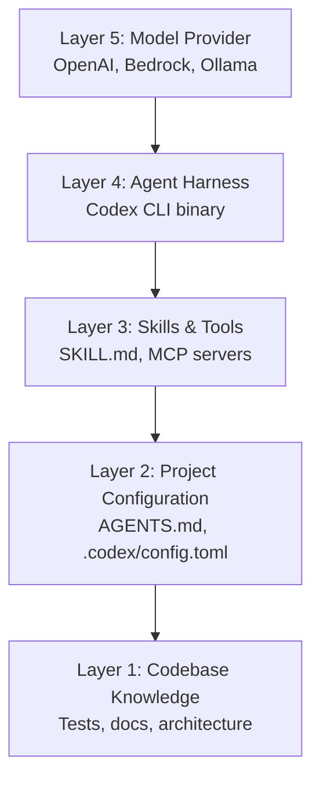

# The Gemini CLI Shutdown and the Open-Source Trust Crisis: Portability Lessons Every Codex CLI Developer Should Learn Before June 18


---

On 19 May 2026, Google announced that Gemini CLI — an Apache 2.0-licensed terminal coding agent with over 100,000 GitHub stars and 6,000 merged community pull requests — would stop serving requests for free and individual paid users on 18 June 2026[^1]. The replacement is Antigravity CLI, a closed-source Go binary with no public source code[^2]. Contributors who spent months improving Gemini CLI's extension system, subagent patterns, and hooks architecture now find their work absorbed into a proprietary platform they cannot inspect, fork, or self-host[^3].

This is not an article about migrating from Gemini CLI to Codex CLI — that guide already exists. This article examines why the shutdown matters as an industry-wide precedent, what structural properties make a coding agent resistant to this kind of rug-pull, and what defensive patterns Codex CLI developers should adopt *now* to protect their workflows regardless of which vendor changes terms next.

## What Happened: The Anatomy of an Open-Source Rug-Pull

The timeline is instructive:

| Date | Event |
|------|-------|
| June 2025 | Google releases Gemini CLI under Apache 2.0[^4] |
| June 2025 – May 2026 | Community contributes 6,000+ merged PRs; project reaches 100K stars[^3] |
| 19 May 2026 | Google I/O: Antigravity 2.0 announced; Gemini CLI deprecated for non-enterprise users[^1] |
| 23 May 2026 | Developer backlash begins; "bait-and-switch" framing goes viral[^3] |
| 29 May 2026 | Linux Foundation spotlights the controversy; FOSS Force publishes critique[^5] |
| 18 June 2026 | **Shutdown deadline**: free, Pro, and Ultra users lose API access[^1] |

The core betrayal is structural, not legal. Google did nothing that violated the Apache 2.0 licence. The code remains open. But the code was never the product — the product was the *service*: Google's models, authentication infrastructure, and API endpoints[^6]. When Google withdrew the service, the open-source code became, as one analyst put it, "a steering wheel without an engine"[^6].

## Why This Matters Beyond Google

The Gemini CLI shutdown exposes a vulnerability that affects every AI coding agent, including Codex CLI:

**The Service Dependency Problem.** Modern coding agents are not self-contained software. They are thin clients that orchestrate calls to proprietary model APIs. An open-source licence on the client means nothing if the service it depends on can be withdrawn unilaterally[^6]. This applies to:

- **Codex CLI** — depends on OpenAI's Responses API and model endpoints
- **Claude Code** — depends on Anthropic's API
- **Aider/OpenCode** — support multiple providers but still require *someone's* API
- **Antigravity CLI** — depends on Google's Gemini API (and is not even open-source)

The question is not *whether* your tool depends on a vendor, but *how many layers of defence* you have when that vendor changes course.

## The Portability Stack: Five Layers of Defence

Codex CLI developers who want to survive the next rug-pull — from any vendor — should think about portability across five layers:



### Layer 1: Codebase Knowledge (Fully Portable)

Your tests, documentation, architecture decision records, and code itself travel with you to any tool. This is the one layer that is completely vendor-neutral. Teams that invest in comprehensive test suites and clear documentation are inherently more portable than those that rely on agent memory or tool-specific context[^7].

### Layer 2: Project Configuration (Mostly Portable)

AGENTS.md is now governed by the Agentic AI Foundation (AAIF) under the Linux Foundation, with support across 20+ platforms including Codex CLI, Cursor, GitHub Copilot, Gemini CLI (while it lasted), Devin, Aider, and JetBrains Junie[^8]. Writing your project instructions in AGENTS.md rather than tool-specific files (`.codex/config.toml`, `CLAUDE.md`, `.cursorrules`) gives you immediate cross-tool portability.

**Defensive pattern:** Write AGENTS.md as the canonical source of truth. In tool-specific files, include only a single instruction to read AGENTS.md:

```toml
# .codex/config.toml — minimal tool-specific config
[instructions]
preamble = "Read and follow AGENTS.md in the repository root."
```

### Layer 3: Skills and Tools (Substantially Portable)

SKILL.md files are recognised by Codex CLI, Claude Code, Cursor (since 2.4), Cline, and Antigravity[^9]. MCP servers are universally supported — a server configured for one agent works with all others[^10]. The portability risk at this layer is *path conventions*, not format:

| Tool | Default skill path |
|------|--------------------|
| Codex CLI | `.codex/skills/` |
| Claude Code | `.claude/skills/` |
| Cursor | `.cursor/skills/` |
| Cross-tool | `.agents/skills/` (AAIF convention) |

**Defensive pattern:** Store skills under `.agents/skills/` and symlink to tool-specific directories. Alternatively, use the Vercel `skills` CLI installer which handles path resolution[^9]:

```bash
npx skills install your-org/your-skill
```

For MCP servers, use `mcp.json` at the repository root — Codex CLI, Claude Code, and Cursor all read it[^10].

### Layer 4: Agent Harness (Partially Portable)

The agent harness — Codex CLI itself — is Apache 2.0-licensed[^11]. Unlike Gemini CLI, Codex CLI's value proposition is not purely dependent on the harness; it is the combination of harness and model. However, the harness *can* be forked, audited, and extended without OpenAI's permission[^11].

Critically, Codex CLI supports alternative model providers:

```toml
# Use Amazon Bedrock instead of OpenAI directly
[model_provider]
name = "bedrock"
region = "eu-west-1"
```

```bash
# Use a local model via Ollama
codex --oss --model deepseek-coder-v3
```

This multi-provider support is what Gemini CLI lacked. When Google withdrew the service, there was no `--provider anthropic` flag to fall back on. Codex CLI's architecture supports OpenAI, Amazon Bedrock, and any OpenAI-compatible endpoint[^12], making a single-vendor shutdown survivable.

### Layer 5: Model Provider (Not Portable — Mitigate Instead)

You cannot make proprietary models portable. GPT-5.5 runs only on OpenAI's infrastructure (or via Bedrock's managed access). The defensive strategy here is *diversification*, not portability:

- **Configure Bedrock as a fallback** for enterprise environments with AWS commitments[^12]
- **Test critical workflows with alternative models** (DeepSeek V4 via custom provider, Claude via the cc plugin) to know your escape routes[^13]
- **Keep model-specific prompt tuning minimal** — prompts that work well across models are inherently more portable than those optimised for one model's quirks

## What Codex CLI Gets Right (and Where the Risks Remain)

### Structural Advantages Over Gemini CLI

Codex CLI has several properties that would have prevented the Gemini CLI scenario:

1. **Multi-provider architecture.** Codex CLI ships with OpenAI, Bedrock, and custom provider support. Gemini CLI was hard-wired to Google's API[^4].
2. **Apache 2.0 with a functional local stack.** The Rust codebase compiles to a standalone binary. Combined with `--oss` for local models, you can run Codex CLI without any cloud dependency[^11].
3. **Standards-first configuration.** AGENTS.md, SKILL.md, and MCP are cross-tool standards, not Codex-specific formats[^8][^9][^10].
4. **Transparent governance.** The openai/codex repository accepts external contributions under a standard CLA, and the contribution guidelines are published in the repository's own AGENTS.md[^14].

### Remaining Risks

1. **Cloud features require OpenAI.** `codex cloud`, Codex Web tasks, and the Codex App all depend on OpenAI's infrastructure. If OpenAI changed terms, local CLI usage would survive but cloud workflows would not.
2. **Model quality gap.** Running `--oss` with a local model produces meaningfully worse results than GPT-5.5 for complex tasks. Multi-provider support exists, but model parity does not[^13].
3. **Plugin ecosystem lock-in.** The Codex plugin marketplace uses a Codex-specific manifest format. Plugins with MCP servers inside are portable; plugins with Codex-specific app integrations are not.

## A Practical Portability Checklist

For teams currently running Codex CLI in production, here is a concrete checklist to reduce vendor risk:

- [ ] **AGENTS.md is the single source of project instructions** — tool-specific files contain only a pointer
- [ ] **Skills live in `.agents/skills/`** with symlinks to `.codex/skills/` and `.claude/skills/`
- [ ] **MCP servers are declared in `mcp.json`** at the repository root, not buried in tool-specific config
- [ ] **Bedrock provider is configured and tested** as a fallback, even if not used daily
- [ ] **Critical workflows have been test-run** with at least one alternative agent (Claude Code, Aider, or OpenCode) to verify portability
- [ ] **No business logic lives in Codex-specific hooks** that cannot be expressed as standard Git hooks or CI steps
- [ ] **Session transcripts and rollout files** are periodically exported; agent memory is not treated as durable storage

## The Broader Lesson

The Gemini CLI shutdown is a case study in the difference between *open-source code* and *open-source capability*. In the AI agent era, the code is the least valuable component. The model, the infrastructure, and the API contract are where the power sits. An Apache 2.0 licence on the client side is necessary but not sufficient for real portability.

Codex CLI's architecture — multi-provider support, standards-based configuration, a functional local fallback — provides more defensive depth than Gemini CLI ever offered. But no tool is immune to vendor risk. The developers who survive the next rug-pull will be those who treated portability as an engineering discipline, not an afterthought.

Thirteen days remain before the Gemini CLI shutdown. If you have not yet audited your own tool dependencies, today is the day to start.

---

## Citations

[^1]: Christine Hall, "Gemini CLI's Short Life and Google's Antigravity Bait-and-Switch," *FOSS Force*, 29 May 2026. [https://fossforce.com/2026/05/gemini-clis-short-life-and-googles-antigravity-bait-and-switch/](https://fossforce.com/2026/05/gemini-clis-short-life-and-googles-antigravity-bait-and-switch/)

[^2]: "Bye-bye, Gemini CLI; Google's gone and swapped you for a closed-source AI," *The Register*, 20 May 2026. [https://www.theregister.com/ai-ml/2026/05/20/bye-bye-gemini-cli-google-nudges-devs-toward-antigravity/](https://www.theregister.com/ai-ml/2026/05/20/bye-bye-gemini-cli-google-nudges-devs-toward-antigravity/)

[^3]: "Google Accepted 6,000 Gemini CLI Contributions, Then Closed Tool for Enterprise Only," *TechTimes*, 23 May 2026. [https://www.techtimes.com/articles/317056/20260523/google-accepted-6000-gemini-cli-contributions-then-closed-tool-enterprise-only.htm](https://www.techtimes.com/articles/317056/20260523/google-accepted-6000-gemini-cli-contributions-then-closed-tool-enterprise-only.htm)

[^4]: "Introducing Gemini CLI: your open-source AI agent," *Google Blog*, June 2025. [https://blog.google/technology/developers/introducing-gemini-cli-open-source-ai-agent/](https://blog.google/technology/developers/introducing-gemini-cli-open-source-ai-agent/)

[^5]: "Linux Foundation Tool Spotlighted: Furious Developers Accuse 'Sickening' Google Gemini CLI Bait-and-Switch," *TechTimes*, 29 May 2026. [https://www.techtimes.com/articles/317407/20260529/linux-foundation-tool-spotlighted-furious-developers-accuse-sickening-google-gemini-cli.htm](https://www.techtimes.com/articles/317407/20260529/linux-foundation-tool-spotlighted-furious-developers-accuse-sickening-google-gemini-cli.htm)

[^6]: "Google shuts down Gemini CLI, opening a crack in open source trust," *Cloud News*, June 2026. [https://cloudnews.tech/google-shuts-down-gemini-cli-opening-a-crack-in-open-source-trust/](https://cloudnews.tech/google-shuts-down-gemini-cli-opening-a-crack-in-open-source-trust/)

[^7]: "Best practices," *OpenAI Codex Developer Documentation*, June 2026. [https://developers.openai.com/codex/learn/best-practices](https://developers.openai.com/codex/learn/best-practices)

[^8]: "Top AI Agent Standards to Know in 2026," *Agentailor Blog*, 2026. [https://blog.agentailor.com/posts/top-ai-agent-standards-2026](https://blog.agentailor.com/posts/top-ai-agent-standards-2026)

[^9]: "Cross-Agent Skills: Portability in 2026," *MCP.Directory*, 2026. [https://mcp.directory/blog/cross-agent-skills-cursor-codex-cline-antigravity-gemini-mastra-portability](https://mcp.directory/blog/cross-agent-skills-cursor-codex-cline-antigravity-gemini-mastra-portability)

[^10]: "Agent Instruction Files: AGENTS.md, CLAUDE.md, and Cross-Tool Portability with Codex CLI," *Codex Knowledge Base*, 27 May 2026. [https://codex.danielvaughan.com/2026/05/27/agent-instruction-files-agents-md-claude-md-cross-tool-portability-codex-cli/](https://codex.danielvaughan.com/2026/05/27/agent-instruction-files-agents-md-claude-md-cross-tool-portability-codex-cli/)

[^11]: "openai/codex — Lightweight coding agent that runs in your terminal," *GitHub*. [https://github.com/openai/codex](https://github.com/openai/codex)

[^12]: "Amazon Bedrock as your model provider," *OpenAI Codex Developer Documentation*, June 2026. [https://developers.openai.com/codex/changelog](https://developers.openai.com/codex/changelog)

[^13]: "Best Open Source CLI Coding Agents in 2026," *Pinggy*, 2026. [https://pinggy.io/blog/best_open_source_cli_coding_agents/](https://pinggy.io/blog/best_open_source_cli_coding_agents/)

[^14]: "Codex CLI 0.137.0 Release Notes," *GitHub Releases*, 4 June 2026. [https://github.com/openai/codex/releases](https://github.com/openai/codex/releases)
