# The SpaceX-Cursor Deal: How a \$60 Billion Acquisition Reshapes the Coding Agent Market and What Codex CLI Developers Should Watch


---

When SpaceX announced on 21 April 2026 that it had secured the right to acquire Cursor for \$60 billion, it became the largest transaction in the history of developer tools — by an order of magnitude[^1]. For Codex CLI practitioners, the deal matters less for what it says about Cursor and more for what it signals about the structural forces now reshaping how coding agents are built, sold, and governed. This article unpacks the deal's mechanics, the competitive dynamics it sets in motion, and the practical implications for teams invested in terminal-first agent workflows.

## Deal Structure and Timeline

The agreement, disclosed alongside SpaceX's IPO filing, is structured as an option rather than a firm acquisition[^1][^2]:

| Term | Detail |
|---|---|
| **Option price** | \$60 billion, exercisable within 2026 |
| **Breakup fee** | \$10 billion if SpaceX declines to close |
| **Trigger** | ~30 days after SpaceX IPO (listed on Nasdaq, targeted 12 June 2026) |
| **Seller** | Anysphere Inc. (Cursor's parent) |
| **Prior valuation** | ~\$50 billion fundraising round (Andreessen Horowitz, Thrive Capital, Nvidia) |

SpaceX merged with xAI in February 2026 in an all-stock deal that valued the combined entity at \$1.25 trillion[^3]. The Cursor acquisition therefore folds an IDE-native coding agent into the same corporate umbrella as Grok, the Colossus supercomputer cluster, and xAI's research labs.

## Why It Matters: The Three-Way Arms Race

Before April, the coding agent market was essentially a two-horse contest between Microsoft/GitHub (Copilot, 37% market share, ~4.7 million paid subscribers) and Anthropic (Claude Code, the fastest-growing entrant)[^4][^5]. OpenAI's Codex — spanning the cloud app, CLI, and IDE extension — held a strong third position with over five million weekly users[^6]. Cursor, despite \$2 billion in annualised revenue and over one million paying customers, competed primarily on IDE experience rather than infrastructure depth[^7][^8].

The SpaceX deal changes this calculus by introducing a third vertically-integrated stack:

```mermaid
graph TD
    subgraph "Microsoft / GitHub"
        A[Azure Cloud] --> B[OpenAI Models via partnership]
        B --> C[GitHub Copilot]
    end
    subgraph "SpaceX / xAI"
        D[Colossus Supercomputer] --> E[Grok + V9-Medium Models]
        E --> F[Cursor IDE]
    end
    subgraph "OpenAI"
        G[OpenAI API Infrastructure] --> H[GPT-5.5 / GPT-5-Codex]
        H --> I[Codex CLI + App + IDE]
    end
    subgraph "Anthropic"
        J[Anthropic API] --> K[Claude 4 Opus]
        K --> L[Claude Code]
    end
```



Each major stack now controls its own compute, its own models, and its own developer surface. The strategic question for every team is which stack's assumptions best match their workflow.

## The Grok V9-Medium Wildcard

The deal's most immediate technical consequence is the Grok V9-Medium model, which completed training in late May 2026[^9]. Key specifications:

- **1.5 trillion parameters** — roughly triple the current production Grok v8-small (~500 billion)[^9]
- **Trained on Cursor data** — real-world developer workflows from Cursor's editor telemetry, supervised fine-tuning underway with reinforcement learning to follow[^9][^10]
- **Expected release: mid-June 2026** — approximately two to three weeks from the 25 May announcement[^9]

This is noteworthy because Cursor has historically relied on third-party models — primarily Claude and GPT-4.1 — rather than training its own[^11]. Moving to a vertically-integrated model trained specifically on coding workflows from one of the largest developer tool populations (64% of Fortune 500 companies use Cursor, per Cursor's own enterprise data) could meaningfully shift the capability frontier[^4][^12].

However, it remains unproven. Neither Cursor nor xAI has shipped proprietary models that match the leading coding benchmarks set by OpenAI's GPT-5.5 or Anthropic's Claude 4 Opus[^4]. The mid-June release will be the first real test.

## What This Means for Codex CLI Users

### 1. Terminal-First vs IDE-First Divergence Deepens

Cursor's acquisition reinforces its bet on the IDE as the primary developer surface. SpaceX's infrastructure investment will accelerate IDE-native features — real-time completions, inline diffs, visual context — where Cursor already leads[^11].

Codex CLI's architecture makes the opposite bet: terminal-native execution, headless automation via `codex exec`, cloud-sandboxed parallel tasks, and deep CI/CD integration[^13]. The two tools serve genuinely different workflows, and the acquisition makes it less likely that Cursor will pivot toward terminal-first patterns.

**Practical takeaway:** Teams already using Codex CLI for background automation, non-interactive pipelines, and multi-agent orchestration have less reason to worry about Cursor convergence. The tools are diverging, not converging.

### 2. Multi-Provider Resilience Becomes Strategic

Cursor's move toward xAI-trained models creates a new vendor lock-in surface. If V9-Medium becomes Cursor's default and its best-performing option, users who have built workflows around Claude or GPT-4.1 through Cursor face a model migration[^10].

Codex CLI's multi-provider architecture — supporting OpenAI direct, Amazon Bedrock, Azure OpenAI, and custom providers — offers structural resilience against this kind of platform shift[^14]. You can pin models, switch providers, and maintain configuration parity across environments:

```toml
# .codex/config.toml — provider-resilient configuration
[model]
default = "gpt-5.5"
fallback = ["gpt-5-codex", "o4-mini"]

[providers.bedrock]
enabled = true
region = "us-east-1"
```

### 3. Enterprise Procurement Gets More Complex

The deal adds a new enterprise sales motion. SpaceX — soon to be one of the world's most valuable public companies — will sell Cursor alongside Starlink, satellite services, and xAI's enterprise Grok tier. For procurement teams already evaluating Codex CLI, Claude Code, and Copilot, this introduces a fourth major vendor with very different contractual and compliance characteristics[^3].

OpenAI's response has been to deepen enterprise control surfaces: v0.137 added cloud-managed config bundles, EDU workspaces, and monthly credit limit visibility in admin flows[^15]. Amazon Bedrock integration (GA since 1 June 2026) means Codex CLI can run entirely within an organisation's existing AWS billing and governance framework[^16].

### 4. The Model Training Data Question

V9-Medium's training on Cursor user data raises questions about data governance that Codex CLI's local-first architecture sidesteps[^10]. Codex CLI sessions run locally or in user-controlled cloud sandboxes; code never leaves the sandbox boundary unless explicitly configured to do so. For teams in regulated industries, this distinction matters.

## The Competitive Scoreboard (June 2026)

| Dimension | Codex CLI | Cursor (post-acquisition) | Claude Code | GitHub Copilot |
|---|---|---|---|---|
| **Primary surface** | Terminal + headless | IDE (VS Code fork) | Terminal | IDE (VS Code, JetBrains) |
| **Model ownership** | OpenAI (GPT-5.5, o4-mini) | Moving to xAI (V9-Medium) + third-party | Anthropic (Claude 4 Opus) | Microsoft/OpenAI (GPT-5.3-Codex) |
| **Open source** | Yes (CLI) | No | No | No |
| **Background automation** | `codex exec`, cloud tasks | Limited (Composer agent) | `claude -p` | Copilot Workspace |
| **Multi-provider** | Yes (Bedrock, Azure, custom) | Historically yes, shifting to xAI | No | No |
| **Enterprise governance** | Config bundles, RBAC, Bedrock | TBD post-acquisition | Enterprise tier | GitHub Enterprise |
| **Weekly active users** | 5M+ (Codex platform) | 1M+ paying[^7] | Growing fastest[^5] | 4.7M paid[^4] |

## What to Watch

1. **V9-Medium benchmarks (mid-June)**: If the model matches GPT-5.5 on coding tasks, it validates the vertical integration thesis. If it falls short, Cursor will continue depending on third-party models — weakening the acquisition's strategic rationale[^9].

2. **SpaceX IPO execution (12 June)**: The acquisition is contingent on a successful IPO at ~\$1.75 trillion valuation. Market conditions or regulatory complications could delay or derail the \$60 billion option[^3].

3. **Cursor data governance policies**: How xAI handles Cursor's user data for model training will determine whether enterprise customers stay or migrate. Watch for data residency and opt-out announcements[^10].

4. **OpenAI's counter-moves**: The June 2 "Codex for every role" announcement — Sites, role-specific plugins, Annotations — signals OpenAI is broadening Codex beyond developers[^6]. Expect further platform investment to defend against a well-resourced SpaceX/Cursor competitor.

5. **Codex CLI v0.138 alpha**: Active development continues on the CLI, with four alpha releases on 4 June alone[^15]. The terminal-first surface is where OpenAI maintains the clearest competitive differentiation against an IDE-centric Cursor.

## The Bottom Line

The SpaceX-Cursor deal is the first genuine consolidation event in the coding agent market. It creates a third vertically-integrated stack — compute, models, and developer surface under one roof — competing directly with Microsoft/GitHub and OpenAI.

For Codex CLI users, the immediate impact is minimal: the tools target different workflows, and Codex CLI's open-source, multi-provider, terminal-native architecture is structurally insulated from IDE-market consolidation. The longer-term question is whether xAI's Colossus-trained models can close the capability gap with GPT-5.5 and Claude 4 Opus. Mid-June will tell us.

In the meantime, the best defensive strategy remains the same: build workflows around portable abstractions (AGENTS.md, MCP, structured TOML configuration), avoid model-specific lock-in, and keep your agent orchestration layer vendor-neutral. The coding agent market is consolidating. Your architecture should not.

## Citations

[^1]: The Next Web, "SpaceX to acquire AI coding startup Cursor for \$60B after IPO," 21 April 2026. [https://thenextweb.com/news/spacex-plans-to-buy-cursor-for-60-billion-once-its-record-ipo-wraps](https://thenextweb.com/news/spacex-plans-to-buy-cursor-for-60-billion-once-its-record-ipo-wraps)

[^2]: TechCrunch, "SpaceX is working with Cursor and has an option to buy the startup for \$60 billion," 21 April 2026. [https://techcrunch.com/2026/04/21/spacex-is-working-with-cursor-and-has-an-option-to-buy-the-startup-for-60-billion/](https://techcrunch.com/2026/04/21/spacex-is-working-with-cursor-and-has-an-option-to-buy-the-startup-for-60-billion/)

[^3]: CNBC, "SpaceX says it can buy Cursor later this year for \$60 billion or pay \$10 billion for 'our work together'," 21 April 2026. [https://www.cnbc.com/2026/04/21/spacex-says-it-can-buy-cursor-later-this-year-for-60-billion-or-pay-10-billion-for-our-work-together.html](https://www.cnbc.com/2026/04/21/spacex-says-it-can-buy-cursor-later-this-year-for-60-billion-or-pay-10-billion-for-our-work-together.html)

[^4]: The Next Web, "SpaceX to acquire AI coding startup Cursor for \$60B after IPO," 21 April 2026. [https://thenextweb.com/news/spacex-plans-to-buy-cursor-for-60-billion-once-its-record-ipo-wraps](https://thenextweb.com/news/spacex-plans-to-buy-cursor-for-60-billion-once-its-record-ipo-wraps)

[^5]: Build Fast with AI, "AI News Today – June 5, 2026: 9 Biggest Stories," 5 June 2026. [https://www.buildfastwithai.com/blogs/ai-news-today-june-5-2026](https://www.buildfastwithai.com/blogs/ai-news-today-june-5-2026)

[^6]: OpenAI, "Codex for every role, tool, and workflow," 2 June 2026. [https://openai.com/index/codex-for-every-role-tool-workflow/](https://openai.com/index/codex-for-every-role-tool-workflow/)

[^7]: TechCrunch, "Cursor has reportedly surpassed \$2B in annualized revenue," 2 March 2026. [https://techcrunch.com/2026/03/02/cursor-has-reportedly-surpassed-2b-in-annualized-revenue/](https://techcrunch.com/2026/03/02/cursor-has-reportedly-surpassed-2b-in-annualized-revenue/)

[^8]: Gradually.ai, "Cursor Statistics 2026: Key Numbers, Data & Facts," 2026. [https://www.gradually.ai/en/cursor-statistics/](https://www.gradually.ai/en/cursor-statistics/)

[^9]: TechTimes, "Grok AI New Model Triples Parameter Count, Targets Coding Lead: Release Expected Mid-June," 28 May 2026. [https://www.techtimes.com/articles/317328/20260528/grok-ai-new-model-triples-parameter-count-targets-coding-lead-release-expected-mid-june.htm](https://www.techtimes.com/articles/317328/20260528/grok-ai-new-model-triples-parameter-count-targets-coding-lead-release-expected-mid-june.htm)

[^10]: Cursor, "Cursor partners with SpaceX on model training," 21 April 2026. [https://cursor.com/blog/spacex-model-training](https://cursor.com/blog/spacex-model-training)

[^11]: WaveSpeed Blog, "Cursor vs Codex: IDE Copilot vs Cloud Agent - Which Wins in 2026?" 2026. [https://wavespeed.ai/blog/posts/cursor-vs-codex-comparison-2026/](https://wavespeed.ai/blog/posts/cursor-vs-codex-comparison-2026/)

[^12]: Cursor AI Statistics, "Cursor AI Statistics 2026: Users, Revenue and Adoption," 2026. [https://www.getpanto.ai/blog/cursor-ai-statistics](https://www.getpanto.ai/blog/cursor-ai-statistics)

[^13]: OpenAI, "CLI – Codex | OpenAI Developers," 2026. [https://developers.openai.com/codex/cli](https://developers.openai.com/codex/cli)

[^14]: OpenAI, "Advanced Configuration – Codex | OpenAI Developers," 2026. [https://developers.openai.com/codex/config-advanced](https://developers.openai.com/codex/config-advanced)

[^15]: OpenAI, "Changelog – Codex | OpenAI Developers," June 2026. [https://developers.openai.com/codex/changelog](https://developers.openai.com/codex/changelog)

[^16]: AWS Blog, "Get started with OpenAI GPT-5.5, GPT-5.4 models, and Codex on Amazon Bedrock," June 2026. [https://aws.amazon.com/blogs/aws/get-started-with-openai-gpt-5-5-gpt-5-4-models-and-codex-on-amazon-bedrock/](https://aws.amazon.com/blogs/aws/get-started-with-openai-gpt-5-5-gpt-5-4-models-and-codex-on-amazon-bedrock/)
