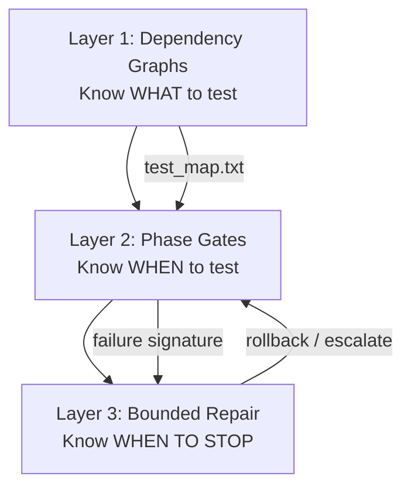
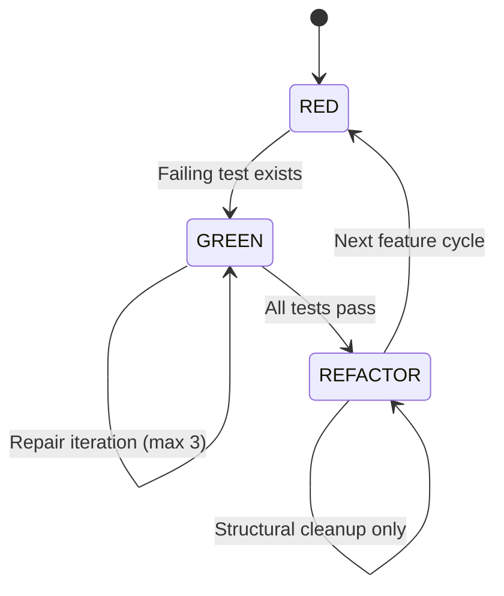
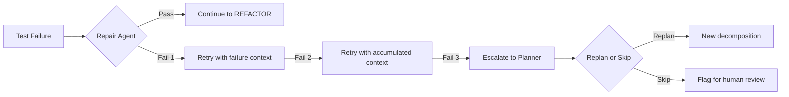
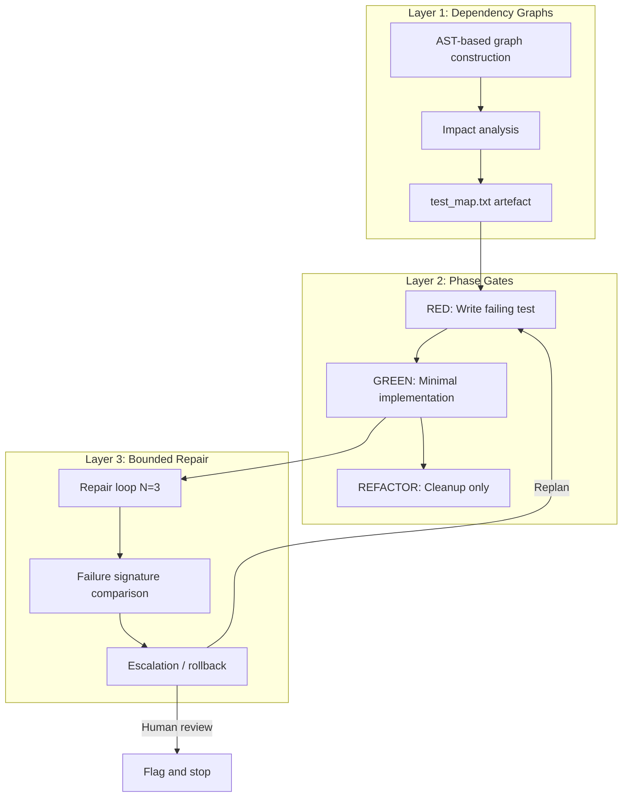

# The Three Layers of Agent Testing: Dependency Graphs, Phase Gates, and Bounded Repair


---

The standard advice for AI coding agents is simple: "always run the tests." But that instruction, dropped into an AGENTS.md without structure, actively makes things worse. Research published in March 2026 demonstrated that procedural TDD prompting *without* graph-based context increased regressions from 6.08% to 9.94% — a 63% jump in broken tests [^1]. The problem is not that agents should ignore tests; it is that testing discipline for agents requires architecture, not slogans.

Two recent papers — TDAD (Test-Driven Agentic Development) [^1] and TDD Governance for Multi-Agent Code Generation [^2] — together with practitioner patterns from the Elite AI-Assisted Coding community [^3] sketch a coherent three-layer testing architecture for agent pipelines. This article synthesises them into a practical framework that Codex CLI developers can adopt today.

## The Three Layers

The synthesis across these sources reveals three distinct layers, each solving a different failure mode:



Skipping a layer does not save time — it shifts failures downstream where they cost more tokens, produce more regressions, and are harder to diagnose.

## Layer 1: Dependency Graphs — Know What to Test

TDAD's central insight is that an agent must know *which* tests are affected by a proposed change before it touches a single file [^1]. Without this, "run the tests" means either running the entire suite (slow, noisy) or guessing (fragile, incomplete).

### AST-Based Graph Construction

TDAD builds a code-test dependency graph using four node types and five edge types [^1]:

| Node Type | Description |
|-----------|-------------|
| **File** | Python source files |
| **Function** | Callable units extracted via AST |
| **Class** | Structural containers with inheritance |
| **Test** | Test functions linked to code under test |

| Edge Type | Purpose |
|-----------|---------|
| `CONTAINS` | File → Function/Class structural membership |
| `CALLS` | Static function invocation chains |
| `IMPORTS` | File-level dependency tracking |
| `TESTS` | Test → code-under-test linkage |
| `INHERITS` | Class hierarchy edges |

Test linking uses three prioritised strategies: naming conventions (`test_foo.py` matches `foo.py`), prefix matching with progressive stem truncation, and directory proximity for disambiguation in monolithic test modules [^1].

### Impact Analysis at Runtime

The graph powers a pre-change impact analysis pipeline with four parallel strategies [^1]:

1. **Direct testing** — tests explicitly linked to changed functions
2. **Transitive call chains** — tests reachable through caller graphs
3. **File-level coverage** — tests in the same module graph neighbourhood
4. **Import-based analysis** — tests affected through dependency imports

Each strategy produces confidence-weighted scores. The output is a `test_map.txt` file plus a 20-line skill definition — no database, no API calls at runtime [^1]. This is critical: the entire dependency context fits inside the agent's context window as a static text artefact.

### The TDD Prompting Paradox

The most striking TDAD finding is what happens when you give an agent TDD instructions *without* the dependency graph. On SWE-bench Verified with Qwen3-Coder 30B across 100 instances [^1]:

| Configuration | P2P Failures | Regression Rate |
|---------------|-------------|-----------------|
| Vanilla (no TDD) | 562 | 6.08% |
| TDD prompting only | 799 | 9.94% |
| TDAD (graph + TDD) | 155 | 1.82% |

Procedural TDD instructions consumed context tokens that displaced repository awareness, and the resulting ambition without localisation caused collateral damage across untargeted files [^1]. The lesson: **context (which tests matter) outperforms procedure (how-to workflows)**. When TDAD simplified its SKILL.md from 107 lines to 20 lines of pure context, resolution quadrupled from 12% to 50% [^1].

## Layer 2: Phase Gates — Know When to Test

Once you know *what* to test, you need governance over *when* different types of work are permitted. TDD Governance [^2] formalises this as a multi-agent architecture with strict phase transitions.

### The Red-Green-Refactor Enforcement Model

The framework enforces three primary phases aligned with classical TDD discipline, but adapted for multi-agent systems [^2]:



**RED phase:** The test generation agent proposes failing tests to establish expected behaviour. The governance engine blocks code generation until failing test states exist [^2]. This prevents the common agent anti-pattern of writing implementation and tests simultaneously — where both may be wrong but appear to pass.

**GREEN phase:** The implementation agent proposes minimal code changes to satisfy failing tests. Every proposal passes through validation gates (structural checks, policy enforcement, phase consistency) before being applied atomically [^2].

**REFACTOR phase:** Permitted only after successful test passes. Changes are restricted to removing duplication; test modification and feature additions are explicitly prohibited [^2].

### The Separation of Proposal and Authority

The most architecturally significant pattern in TDD Governance is the split between two layers [^2]:

**Proposal Layer (non-authoritative):** The planner, test generator, implementation agent, and repair agent produce structured patches. Crucially, agents never write directly to the filesystem [^2].

**Governance Layer (authoritative):** A deterministic engine validates all proposals against schemas and policies, enforces phase consistency, applies mutations atomically after validation, and executes tests deterministically. Only the governance layer controls workspace state [^2].

This separation prevents generative variability from directly affecting the codebase — the same principle behind Codex CLI's sandbox model, where the agent proposes changes and a deterministic runtime applies them within controlled boundaries [^4].

### Multi-Agent Role Distribution

TDD Governance distributes the TDD cycle across five specialised agents [^2]:

| Agent | Phase | Constraint |
|-------|-------|------------|
| **Planner** | Pre-RED | Encodes test-first progression and phase transitions |
| **Test Generator** | RED | Restricted to test files only |
| **Implementation** | GREEN | Minimal changes satisfying failing tests |
| **Failure Repair** | GREEN (retry) | Localised corrections with structured failure context |
| **Reviewer** | Post-REFACTOR | Quality gate preventing production edits during review |

The orchestrator maintains sole authority over phase transitions and state mutation [^2].

## Layer 3: Bounded Repair — Know When to Stop

Unbounded retry loops are the most expensive failure mode in agent systems. An agent that fails a test, retries, fails differently, retries again, and spirals through its context window is burning tokens without converging. TDD Governance addresses this directly.

### The N=3 Repair Budget

TDD Governance caps repair iterations at three attempts per GREEN step [^2]. Termination triggers when any of these conditions are met:

1. **Same failure signature repeats** — the exception type, failing tests, and normalised message match a previous iteration
2. **No effective code change** — patch comparison detects semantic equivalence to a prior attempt
3. **Tests pass** — success terminates the loop
4. **Iteration cap reached** — hard stop at N=3

The failure signature `S` captures exception type, failing test identifiers, and normalised error messages for cross-iteration comparison [^2]. This prevents the common pattern where an agent produces syntactically different but functionally identical patches in successive retries.

### Escalation, Not Infinite Retry

When the repair budget is exhausted, the correct action is escalation — not another attempt. In a multi-agent pipeline, this means:



This maps directly to practitioner patterns documented in the Elite AI-Assisted Coding community: most "agent failures" are not model failures — they are loop design failures [^3]. Circuit breakers, token budgets, and explicit escalation paths are production necessities, not nice-to-haves [^5].

## Applying the Three Layers in Codex CLI

These patterns are not purely theoretical. Here is how to encode them in a Codex CLI workflow today.

### Layer 1: AGENTS.md with Dependency Context

Rather than writing "always run tests," provide the agent with impact context:

```markdown
# Testing

Before modifying any file, consult `test_map.txt` in the project root
to identify affected tests. Run ONLY those tests after your change.

If `test_map.txt` does not exist, run:
  python -m tdad index --output test_map.txt

Never run the full test suite unless explicitly asked.
```

This follows TDAD's finding that 20 lines of context outperform 107 lines of procedural TDD instructions [^1].

### Layer 2: Phase-Gated Task Decomposition

Structure prompts to enforce phase separation:

```markdown
# Task Governance

For any feature implementation:
1. RED: Write a failing test first. Do NOT write implementation code.
   Verify the test fails before proceeding.
2. GREEN: Write the minimum code to pass the failing test.
   Run only the affected tests from test_map.txt.
3. REFACTOR: If tests pass, clean up duplication only.
   Do not add features or modify test expectations.

Each phase is a separate commit.
```

### Layer 3: Bounded Repair in Practice

```markdown
# Repair Limits

If a test fails after your implementation:
- You have 3 attempts to fix it.
- If the same error repeats, STOP and report the failure.
- If you cannot fix it in 3 attempts, explain what you tried
  and suggest the likely root cause.
- Never retry silently. Each attempt must be a distinct approach.
```

### Combining with Codex CLI's Sandbox

Codex CLI's sandbox model already enforces the proposal-authority separation at the filesystem level [^4]. The agent proposes changes within a sandboxed environment; the runtime controls what actually reaches the working tree. Layering TDD governance on top means the agent is bounded both by sandbox permissions *and* by testing discipline — defence in depth for code quality.

## The Unified Architecture

When all three layers work together, you get a testing architecture that addresses each failure mode at the appropriate level:



Layer 1 feeds Layer 2 by telling the phase gates *which* tests to run. Layer 2 feeds Layer 3 by providing structured failure context when tests fail in the GREEN phase. Layer 3 feeds back into Layer 2 by escalating to the planner for redecomposition, or out to human review when the problem exceeds the agent's repair budget.

## Key Takeaways

1. **"Always run tests" is insufficient.** Without dependency context, TDD prompting increases regressions by 63% [^1]. Context beats procedure.

2. **Phase separation prevents compound errors.** Agents that write tests and implementation simultaneously can produce coherent but wrong code. Red-Green-Refactor enforcement catches this [^2].

3. **Bounded repair prevents token waste.** Three attempts with failure signature deduplication is the current best practice. After that, escalate — do not retry [^2].

4. **The three layers are complementary, not alternatives.** Dependency graphs without phase gates lead to correct test selection but undisciplined implementation. Phase gates without bounded repair lead to infinite retry loops. All three are needed.

5. **Encode these in AGENTS.md, not in hope.** Codex CLI reads AGENTS.md [^4]. Write the governance there, keep it concise, and let the agent's context window do the work.

## Citations

[^1]: P. Alonso, S. Yovine, V.A. Braberman, "TDAD: Test-Driven Agentic Development — Reducing Code Regressions in AI Coding Agents via Graph-Based Impact Analysis," arXiv:2603.17973v2, March 2026. [https://arxiv.org/abs/2603.17973](https://arxiv.org/abs/2603.17973)

[^2]: T. Hasanli et al., "TDD Governance for Multi-Agent Code Generation via Prompt Engineering," arXiv:2604.26615v1, submitted to PROMPT-SE 2026, April 2026. [https://arxiv.org/abs/2604.26615](https://arxiv.org/abs/2604.26615)

[^3]: E. Berger, M. Martini, "Elite AI-Assisted Coding," Agentic Ventures / Maven, 2026. [https://agentic-ventures.com/elite-ai-assisted-coding](https://agentic-ventures.com/elite-ai-assisted-coding)

[^4]: OpenAI, "Custom instructions with AGENTS.md — Codex," OpenAI Developers, 2026. [https://developers.openai.com/codex/guides/agents-md](https://developers.openai.com/codex/guides/agents-md)

[^5]: "Agentic Design Patterns: The 2026 Guide to Building Autonomous Systems," SitePoint, 2026. [https://www.sitepoint.com/the-definitive-guide-to-agentic-design-patterns-in-2026/](https://www.sitepoint.com/the-definitive-guide-to-agentic-design-patterns-in-2026/)
