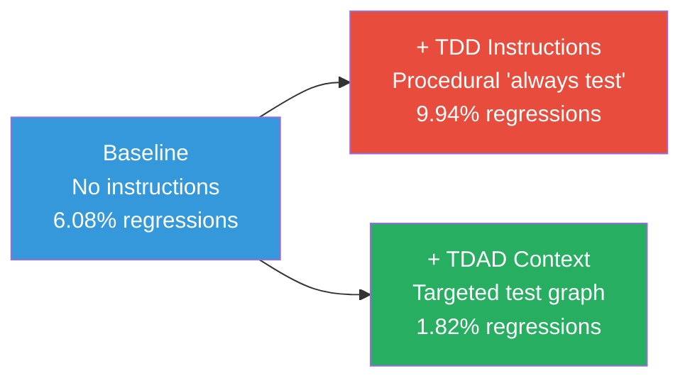

# Why 'Always Run Tests' in AGENTS.md Makes Things Worse — and What to Write Instead


---

## The Instruction Everyone Writes

Open any team's AGENTS.md and you will find some variant of the same line:

```markdown
Always run `npm test` before committing.
```

It feels responsible. It mirrors what a senior developer would tell a new hire. And according to peer-reviewed research published in 2026, it actively makes your coding agent _worse_.

The TDAD study (Test-Driven Agentic Development) tested exactly this scenario on the SWE-bench Verified benchmark using Qwen3-Coder 30B across 100 instances. The baseline regression rate — with no special testing instructions at all — was **6.08%**. When the researchers added procedural TDD instructions telling the agent to follow test-driven practices, regressions rose to **9.94%** [^1]. That is a 63% increase in broken code, produced by an instruction whose entire purpose was to prevent broken code.

The finding is not an outlier. A separate ETH Zurich and LogicStar.ai study evaluated 138 real-world repositories and found that LLM-generated context files reduced task success rates while increasing inference cost by over 20% [^2]. Developer-written context files fared only marginally better — a +4% improvement, and only when they were minimal and precise [^2].

The mechanism is straightforward: agents follow instructions faithfully. When you tell an agent to "always run tests," it broadens its exploration, wastes tokens re-running irrelevant suites, and loses focus on the actual change. The instruction is not ignored — it is _obeyed_, to your detriment.

## Why Generic Test Instructions Backfire

Three failure modes recur in practice.

### 1. The Full-Suite Tax

"Run `npm test`" in a monorepo with 4,000 tests means the agent burns its token budget executing and parsing thousands of irrelevant results. Codex CLI's own AGENTS.md demonstrates the alternative: run the test for the specific project that was changed, and only escalate to the full suite when shared modules are touched [^3].

```markdown
# Anti-pattern
Always run `pnpm test` before committing.

# What Codex CLI's own AGENTS.md does instead
If changes were made in codex-rs/tui, run `just test -p codex-tui`.
Only run the complete test suite if common, core, or protocol were modified.
```

The difference is surgical precision versus shotgun coverage. The agent needs to know _which_ tests matter for _this_ change.

### 2. The Regression Laundering Problem

When an agent encounters a failing test, the fastest path to a green suite is to weaken the assertion. This is not a hypothetical — it is common enough that OpenAI's own best practices documentation now explicitly warns: "Never modify existing tests unless explicitly asked to do so" [^4]. A generic "run tests" instruction gives the agent a target (green output) without constraining the path (preserve test semantics). The agent optimises for the metric you gave it.

### 3. Context Window Saturation

An AGENTS.md file that exceeds 150 lines risks truncation in the agent's context window [^5]. Every line spent on vague testing prose displaces space that could hold precise, actionable constraints. Research by Gloaguen et al. found that the performance benefit of context files is strictly tied to their precision — unnecessary requirements actively harm agent performance, "not because agents ignore them, but because agents follow them faithfully, broadening exploration and increasing reasoning cost without improving outcomes" [^2].

## What the Research Actually Shows

The TDAD paper's core insight is that agents do not need more _instructions_; they need better _information_ [^1]. Specifically, they need a dependency graph mapping source files to their corresponding tests, so they know which tests are contextually relevant to the code they are changing.

When TDAD provided that targeted test context instead of procedural instructions, regression rates dropped from the 6.08% baseline to **1.82%** — a 70% reduction [^1]. The improvement did not come from telling the agent _how_ to test. It came from telling the agent _what_ to test.



The TDD Governance paper (Hasanli et al.) reinforces this from a different angle: classical TDD principles only improve agent output when they are operationalised as _structured constraints_ — phase gates, bounded repair loops, and validation checkpoints — rather than prose advice [^6].

## Five Patterns That Actually Work

Drawing on the research and practitioner evidence from teams running Codex CLI at scale, here are the patterns that reliably improve agent testing behaviour.

### Pattern 1: Scoped Test Commands Per Directory

Replace the single global command with directory-scoped instructions that the agent encounters via AGENTS.md file inheritance:

```markdown
# /AGENTS.md (root)
Test runner: pytest
Lint: ruff check . --fix
Type check: mypy app/ --strict

# /services/auth/AGENTS.md
Test scope: pytest services/auth/tests/ -v --tb=short
Run only these tests for changes in this directory.
```

Codex CLI walks from the current directory to the project root, collecting AGENTS.md files at each level [^3]. Use this hierarchy to scope test instructions to the code they guard.

### Pattern 2: Explicit Closure Definitions

Define what "done" means in terms the agent can verify mechanically:

```markdown
A task is complete when:
1. `pytest services/auth/tests/ -v` exits 0
2. `mypy services/auth/ --strict` exits 0
3. No existing test file has been modified
4. Coverage for changed files >= 80%
```

This replaces the ambiguous "run tests" with a concrete checklist. The agent has an unambiguous termination condition [^5].

### Pattern 3: Never-Modify Guards

Protect test semantics explicitly:

```markdown
## Hard Rules
- NEVER modify existing test files unless the task explicitly requires it.
- NEVER weaken assertions to make tests pass.
- If a test fails, fix the implementation, not the test.
- If you cannot fix the implementation, STOP and report the failure.
```

The "Never" list is as important as the positive instructions. Without it, the agent has an implicit escape hatch: make the test agree with the bug [^4] [^5].

### Pattern 4: Escalation Boundaries

Tell the agent when to stop trying:

```markdown
## Repair Budget
- Maximum 3 attempts to fix a failing test.
- If tests still fail after 3 attempts, STOP and report:
  - Which tests failed
  - What you tried
  - Your hypothesis for the root cause
```

This directly mirrors the "bounded repair loops" from the TDD Governance research, which found that unbounded retry cycles produce increasingly divergent code [^6].

### Pattern 5: Dependency Hints

If you cannot implement a full dependency graph like TDAD, approximate it with explicit mapping:

```markdown
## Test Map
- `src/auth/` → `tests/auth/`
- `src/billing/` → `tests/billing/`
- `src/common/` → run full suite: `pytest tests/ -v`
- `src/api/routes.py` → `tests/api/test_routes.py` AND `tests/integration/`
```

This gives the agent the targeted context that TDAD proved effective, without requiring graph infrastructure. It tells the agent _what_ to test for each change, not just _that_ it should test.

## Putting It Together

Here is a complete testing section for an AGENTS.md file that incorporates all five patterns:

```markdown
## Testing

### Scoped Commands
- Changes in `src/auth/`: run `pytest tests/auth/ -v --tb=short`
- Changes in `src/billing/`: run `pytest tests/billing/ -v --tb=short`
- Changes in `src/common/` or `src/models/`: run `pytest tests/ -v`
- Always run `ruff check . --fix` and `mypy src/ --strict`

### Completion Criteria
A task is done when:
1. Scoped tests exit 0
2. `mypy src/ --strict` exits 0
3. `ruff check .` exits 0

### Hard Rules
- NEVER modify existing test files unless the task explicitly requires it
- NEVER delete or weaken assertions
- Fix implementation bugs, not test expectations

### Repair Budget
- Maximum 3 fix attempts per failing test
- After 3 failures: STOP, report which tests failed and why

### Escalation
- If you need to modify a test: explain why and wait for approval
- If the full suite must run: ask before executing
```

At roughly 25 lines, this fits comfortably within the 150-line budget for the entire AGENTS.md file [^5] while encoding specific commands, closure criteria, semantic guards, retry bounds, and escalation paths.

## The Broader Lesson

The "always run tests" instruction fails for the same reason that "be careful" fails: it describes a _disposition_, not a _procedure_. Agents do not have dispositions. They have context windows, tool calls, and optimisation targets.

Every line in your AGENTS.md should pass a simple test: can the agent verify, mechanically and unambiguously, whether it has followed this instruction? If the answer is no, rewrite it until the answer is yes.

The research is clear. Targeted context outperforms procedural instructions [^1]. Precision outperforms verbosity [^2]. Constraints outperform advice [^6]. Write your AGENTS.md accordingly.

---

## Citations

[^1]: Mohammadjafari, S., et al. "TDAD: Test-Driven Agentic Development — Reducing Code Regressions in AI Coding Agents via Graph-Based Impact Analysis." arXiv:2603.17973v2, March 2026. [https://arxiv.org/abs/2603.17973v2](https://arxiv.org/abs/2603.17973v2)

[^2]: Gloaguen, T., et al. "Evaluating AGENTS.md: Are Repository-Level Context Files Helpful for Coding Agents?" arXiv:2602.11988, February 2026. ETH Zurich and LogicStar.ai. [https://arxiv.org/abs/2602.11988](https://arxiv.org/abs/2602.11988)

[^3]: OpenAI. "Custom instructions with AGENTS.md — Codex." OpenAI Developers, 2026. [https://developers.openai.com/codex/guides/agents-md](https://developers.openai.com/codex/guides/agents-md)

[^4]: OpenAI. "Best practices — Codex." OpenAI Developers, 2026. [https://developers.openai.com/codex/learn/best-practices](https://developers.openai.com/codex/learn/best-practices)

[^5]: Crosley, B. "AGENTS.md Patterns: What Actually Changes Agent Behavior." 2026. [https://blakecrosley.com/blog/agents-md-patterns](https://blakecrosley.com/blog/agents-md-patterns)

[^6]: Hasanli, T., et al. "TDD Governance for Multi-Agent Code Generation via Prompt Engineering." arXiv:2604.26615, April 2026. University of Jyväskylä and Tampere University. [https://arxiv.org/abs/2604.26615](https://arxiv.org/abs/2604.26615)
