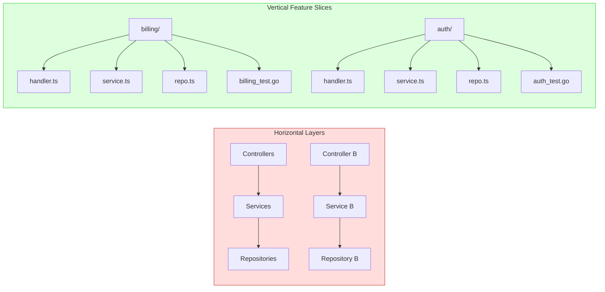

# Agent-Ready Repository Architecture: Codebase Patterns That Maximise Codex CLI Productivity


---

The single biggest determinant of Codex CLI productivity is not your prompt. It is not your model. It is the codebase the agent has to work in. A well-structured repository lets Codex resolve a feature ticket in one pass; a tangled one sends it into multi-turn spirals that burn tokens and produce brittle diffs. Context engineering — controlling what information the agent sees, when it sees it, and how it is structured — has replaced prompt engineering as the primary lever for agent effectiveness[^1].

This article codifies the repository patterns that consistently produce better outcomes with Codex CLI, drawn from production experience, the Marmelab "Agent Experience" framework[^2], the Sourcegraph agentic coding guide[^3], and the ACE research from Stanford and SambaNova on modular context retrieval[^4].

---

## Why Architecture Matters More Than Prompting

Research from Stanford and UC Berkeley demonstrates that model correctness degrades around 32,000 tokens of context, even for models with much larger windows[^5]. The problem is "lost-in-the-middle" attention: models attend strongly to the beginning and end of their context but struggle with material buried in the centre[^5]. This means a 192,000-token context window does not give you 192,000 tokens of useful working memory — it gives you perhaps 30,000 tokens of reliable attention, with the rest serving as noisy reference.

Every architectural decision you make either shrinks or expands the context Codex needs to do its job. Vertical feature slices reduce it. Horizontal layer scattering expands it. The goal is simple: **make each task solvable within a single module's worth of context**.



When a feature owns its own vertical slice — API handler, business logic, data access, tests — Codex can understand it, change it, and verify it within a manageable context window. When the same logic is scattered across `controllers/`, `services/`, and `repositories/`, the agent must read three separate directory trees, mentally reconstruct the dependency chain, and hope nothing relevant was lost in the middle[^3].

---

## The Six Patterns

### 1. Feature-Scoped Modules with Co-Located Tests

Organise code by domain, not by technical role. Each module directory should contain everything an agent needs to understand and modify a feature:

```
src/
  billing/
    handler.ts        # API endpoint
    service.ts        # Business logic
    repository.ts     # Data access
    types.ts          # Shared types
    billing.test.ts   # Unit tests
    AGENTS.md         # Module-specific instructions
  auth/
    handler.ts
    service.ts
    ...
```

Co-locating tests with source files eliminates the cross-directory search that agents otherwise perform when asked to add test coverage. The Marmelab framework found that agents produce higher-quality tests when the existing test file is immediately adjacent to the implementation file, because the agent naturally reads both before making changes[^2].

### 2. Small, Focused Files

Enterprise codebases averaging 400,000+ files defeat standard AI assistants because token-window limitations prevent architectural understanding[^6]. But the inverse problem — stuffing everything into 2,000-line files — is equally damaging. Codex reads entire files into context when they are referenced; a 2,000-line file consumes roughly 8,000 tokens before the agent has written a single character.

The practical sweet spot is **100–400 lines per file**. At this range, each file fits comfortably within the reliable attention window and typically maps to a single responsibility. When files grow beyond this, refactor:

```bash
# Codex CLI can do this for you
codex "Refactor src/billing/service.ts — extract the invoice
generation logic into a separate invoice-generator.ts module
while preserving all existing tests"
```

### 3. Explicit Type Contracts at Module Boundaries

Type annotations serve double duty: they catch bugs at compile time *and* they give Codex a machine-readable specification of what each function expects and returns. In untyped or loosely typed codebases, agents must infer contracts from usage patterns scattered across the repository — an inherently unreliable process.

```typescript
// ❌ Agent must guess the shape of 'options'
export function processPayment(options: any) { ... }

// ✅ Agent knows exactly what to pass
export interface PaymentRequest {
  amount: number;
  currency: 'GBP' | 'USD' | 'EUR';
  customerId: string;
  idempotencyKey: string;
}

export function processPayment(request: PaymentRequest): Promise<PaymentResult> { ... }
```

This principle extends beyond TypeScript. Python's type hints, Go's interfaces, Rust's traits, and Java's generics all serve the same function: they give the agent a compact, unambiguous specification without needing to read the implementation[^2].

### 4. Naming as Agent Search Optimisation

Agents discover code through search — both semantic (understanding what code does) and lexical (grep, ripgrep). Your naming conventions directly affect both.

**Use complete words, not abbreviations.** `OrderProcessor` is discoverable; `OrdProc` is not. When Codex searches for "order processing", it will find the former but miss the latter[^2].

**Avoid duplicate filenames.** If three directories each contain `utils.ts`, the agent must read all three to determine which one is relevant. Prefix with the domain: `billing-utils.ts`, `auth-utils.ts`[^2].

**Incorporate synonyms in doc comments.** If your codebase calls it a "ledger" but tickets refer to "transaction history", add a comment: `// Transaction history / audit ledger for billing events`. This bridges the vocabulary gap between how humans describe features and how the code names them[^2].

### 5. Tests as Agent-Readable Specifications

Tests are the strongest verification mechanism for agent-generated code. A passing test suite is an external source of truth that remains accurate regardless of how long an agentic session runs[^7]. Kent Beck has noted that AI agents may delete tests to make the suite pass — making well-structured tests a "superpower" precisely because they provide a constraint the agent cannot argue with[^7].

For maximum agent effectiveness, structure tests with three properties:

- **Descriptive names** that read as specifications: `test_expired_subscription_prevents_invoice_generation`
- **Isolated assertions** — one concept per test, so failures pinpoint the exact regression
- **Runnable with a single command** documented in AGENTS.md: `npm test -- --filter billing`

```toml
# .codex/config.toml — enforce test verification
[hooks.on_commit]
command = "npm test"
fail_action = "block"
```

### 6. Progressive AGENTS.md Disclosure

The ACE research formalises why layered instruction files outperform monolithic ones: treating each rule as a discrete unit with clear scope makes context selectively retrievable[^4]. The ETH Zurich study found that architectural overviews in AGENTS.md actually increased inference cost and encouraged broader file traversal without improving task success[^8]. Focus your instruction files on what the agent cannot discover by reading the code.

```markdown
<!-- Root AGENTS.md — loaded for every session -->
# Project: Billing Platform

## Commands
- Build: `pnpm build`
- Test: `pnpm test`
- Lint: `pnpm lint`

## Architecture Decisions
- We use the Repository pattern, NOT Active Record
- All monetary values are integers (pence/cents), never floats
- Every API endpoint must validate input with Zod schemas
```

```markdown
<!-- src/billing/AGENTS.md — loaded only in billing context -->
# Billing Module

## Conventions
- Invoice numbers use format INV-{YYYY}-{seq}
- All state transitions go through BillingStateMachine
- Never delete invoices; soft-delete with `cancelled_at` timestamp

## Anti-patterns
- Do NOT call PaymentGateway directly — always go through PaymentService
- Do NOT use raw SQL — use the repository methods
```

Keep each AGENTS.md under 2,000 tokens. Larger files push critical rules into the lost-in-the-middle zone where models pay least attention[^1].

---

## The Context Engineering Checklist

Before evaluating your repository's agent-readiness, run through this diagnostic:

| Signal | Agent-Ready | Agent-Hostile |
|--------|-------------|---------------|
| Module boundaries | Feature-scoped vertical slices | Horizontal technical layers |
| File size | 100–400 lines | 1,000+ line monoliths |
| Type annotations | Explicit contracts at boundaries | `any` / untyped interfaces |
| File naming | Complete words, unique names | Abbreviations, duplicate `utils.ts` |
| Test location | Co-located with source | Separate `__tests__/` tree |
| AGENTS.md | Layered, under 2,000 tokens each | Single monolithic file or absent |
| Build commands | Single-command documented | Tribal knowledge |
| Dead code | Pruned regularly | Accumulates across refactorings |

---

## Measuring the Impact

Context engineering is not a subjective exercise — it produces measurable outcomes. Track these metrics before and after restructuring:

- **First-pass success rate**: percentage of Codex tasks that produce a correct result without human correction
- **Token consumption per task**: lower consumption indicates the agent found what it needed faster
- **Turn count**: fewer turns suggest the agent did not need to search, backtrack, or ask clarifying questions
- **Test coverage of agent-modified files**: higher coverage means the agent has stronger verification signals

Use Codex CLI's OpenTelemetry export to capture these metrics automatically[^9]:

```toml
# ~/.codex/config.toml
[otel]
enabled = true
endpoint = "http://localhost:4317"
protocol = "grpc"
```

---

## Practical Migration Path

Restructuring a large codebase overnight is impractical. Apply these patterns incrementally:

1. **Start with AGENTS.md.** Write the root file with build commands, conventions, and anti-patterns. This is the highest-leverage, lowest-cost intervention[^1].
2. **Restructure the next module you touch.** When a ticket lands in a horizontally-sliced area, refactor it into a vertical slice as part of the implementation.
3. **Add types at boundaries.** When modifying a function's signature, add type annotations. Do not boil the ocean; annotate as you go.
4. **Prune dead code reactively.** When Codex references a function that no longer serves its original purpose, delete it and commit the cleanup separately.
5. **Review agent mistakes.** Every time Codex produces an incorrect result, ask whether a codebase change — not a prompt change — would have prevented it. Update AGENTS.md or refactor accordingly[^2].

---

## Conclusion

The developers who extract the most value from Codex CLI are not the ones writing the cleverest prompts. They are the ones who have structured their codebases so that any reasonable prompt succeeds. Feature-scoped modules, explicit type contracts, co-located tests, clear naming, and layered AGENTS.md files create a repository where the agent's reliable attention window covers everything it needs for each task. Prompt engineering optimises the last ten per cent; context engineering determines whether the first ninety per cent works at all.

---

## Citations

[^1]: Packmind, "Context Engineering Best Practices for AI-Powered Dev Teams (2026)," [https://packmind.com/context-engineering-ai-coding/context-engineering-best-practices/](https://packmind.com/context-engineering-ai-coding/context-engineering-best-practices/)

[^2]: Marmelab, "Agent Experience: Best Practices for Coding Agent Productivity," January 2026, [https://marmelab.com/blog/2026/01/21/agent-experience.html](https://marmelab.com/blog/2026/01/21/agent-experience.html)

[^3]: Sourcegraph, "Agentic Coding in 2026: A Practical Guide for Big Code," [https://sourcegraph.com/blog/agentic-coding](https://sourcegraph.com/blog/agentic-coding)

[^4]: Stanford / SambaNova, "ACE: Modular Context Retrieval for Agent Effectiveness," October 2025, referenced in Packmind context engineering guide[^1]

[^5]: Stanford / UC Berkeley, "Lost in the Middle: How Language Models Use Long Contexts," 2023, widely cited in context engineering literature including Faros, "Context Engineering for Developers," [https://www.faros.ai/blog/context-engineering-for-developers](https://www.faros.ai/blog/context-engineering-for-developers)

[^6]: Augment Code, "AI Coding Assistants for Large Codebases: A Complete Guide," [https://www.augmentcode.com/tools/ai-coding-assistants-for-large-codebases-a-complete-guide](https://www.augmentcode.com/tools/ai-coding-assistants-for-large-codebases-a-complete-guide)

[^7]: Kent Beck, referenced in Codex CLI TDD workflows; OpenAI, "Best Practices — Codex," [https://developers.openai.com/codex/learn/best-practices](https://developers.openai.com/codex/learn/best-practices)

[^8]: ETH Zurich study on AGENTS.md effectiveness, referenced in "When AGENTS.md Backfires," [https://notchrisgroves.com/when-agents-md-backfires/](https://notchrisgroves.com/when-agents-md-backfires/)

[^9]: OpenAI, "Codex CLI Features — OpenTelemetry," [https://developers.openai.com/codex/cli/features](https://developers.openai.com/codex/cli/features)
