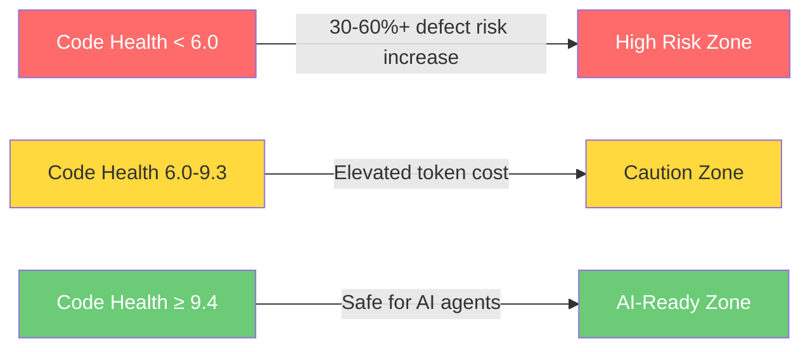
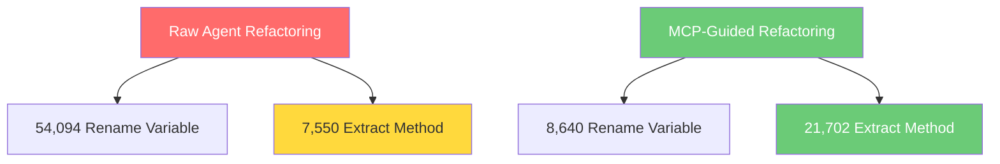
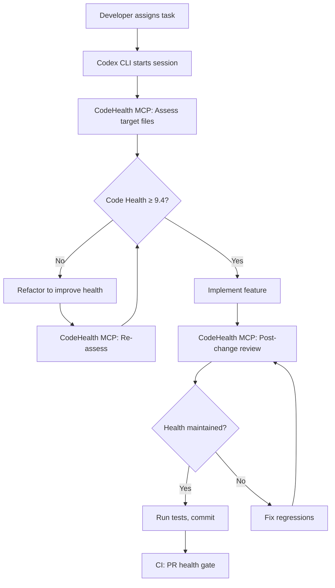

# AI-Ready Code: How Code Health Determines Codex CLI Agent Performance


Peer-reviewed research now quantifies what many teams have suspected: your codebase's structural health is the single strongest predictor of whether a coding agent will help or harm. CodeScene's 2026 study — "Code for Machines, Not Just Humans: Quantifying AI-Friendliness with Code Health Metrics" by Markus Borg and Adam Tornhill — provides hard numbers that every Codex CLI team should internalise before scaling agent-assisted development.[^1]

## The Research: Agents Amplify What They Find

The headline finding is stark: AI coding assistants increase defect risk by at least 30 per cent when applied to unhealthy code, with real-world risk likely far higher in legacy systems.[^2] This is not a tooling problem — it is a codebase problem. The same agents that accelerate development in healthy codebases actively degrade quality in unhealthy ones.

The study examined 25,000 source files across C++, Java, and Python, measuring both code quality outcomes and token consumption at different Code Health levels.[^3] Code Health is CodeScene's ten-point aggregated metric based on 25+ structural factors including cyclomatic complexity, nesting depth, function length, and coupling.[^4]

### The Threshold That Matters

The average hotspot Code Health in the IT sector sits at 5.15 on a 10.0 scale.[^4] Human readability requires a score above 9.0. But AI agents need even better: a minimum Code Health of 9.4 is required to keep AI-induced bugs in check.[^5] Below that threshold, defect risk climbs sharply — increasing by at least 60 per cent in unhealthy code.[^2]



## The Token Tax: Unhealthy Code Burns Your Budget

Beyond defect risk, unhealthy code imposes a direct financial penalty. Agents consume up to 50 per cent more tokens on unhealthy codebases while producing inferior results.[^6] The data is consistent across all three languages studied:

| Language | Healthy Code (CH ≥ 9.8) Coverage | Unhealthy Code (CH < 6) Coverage | Token Increase |
|----------|----------------------------------|----------------------------------|----------------|
| C++ | 35.2% | 3.2% | +43.8% |
| Java | 77.1% | 70.4% | +45.1% |
| Python | 46.6% | 19.4% | +35.4% |

*Table: Median line coverage from single-prompt unit test generation using Qwen3-Coder-30b across 10k C++, 10k Java, and 5k Python files.[^6]*

The output token effect is even more dramatic for iterative refactoring tasks. Java showed approximately 120 per cent additional output tokens when Code Health dropped below 8.[^6] For Codex CLI teams paying per token — whether through ChatGPT credits or API keys — this is a material cost multiplier hiding inside legacy codebases.

## The loveholidays Case: From Declining Health to 50% Agent-Assisted Code

The research has real-world validation. At loveholidays, early agentic coding with Claude led to declining code health — a pattern the research predicts.[^7] After introducing CodeScene's code health-aware safeguards, the team reversed the trend and scaled from zero to 50 per cent agent-assisted code within five months whilst increasing throughput and maintaining quality.[^2]

The lesson: scaling agent adoption without quality gates is a recipe for accelerated technical debt. Quality gates first, agent adoption second.

## Integrating CodeScene's CodeHealth MCP Server with Codex CLI

CodeScene ships an open-source MCP server that brings Code Health analysis directly into the agent loop.[^8] The server runs entirely locally — no source code leaves your machine — and exposes tools that Codex CLI can call mid-session to assess file quality and catch regressions before they land.

### Installation and Configuration

The server installs via npx, Homebrew, or direct binary download:[^8]

```bash
# Install globally
npm install -g @codescene/codehealth-mcp

# Or run directly
npx @codescene/codehealth-mcp
```

Register it in your Codex CLI configuration at `~/.codex/config.toml`:

```toml
[mcp_servers.codescene]
command = "npx"
args = ["@codescene/codehealth-mcp"]
env = { CS_TOKEN = "<your-codescene-token>" }
```

For teams using the standalone licence (no CodeScene Core instance required), set the access token via environment variable or inline configuration.[^9]

### Exposed Tools

The MCP server exposes several tools to the agent:[^8]

- **`code_health_review`** — assesses file quality and identifies maintainability issues with a numeric Code Health score
- **`pre_commit_code_health_safeguard`** — verifies changes before commits, blocking regressions
- **`set_config` / `get_config`** — runtime configuration management via the agent itself

### AGENTS.md Integration

CodeScene provides ready-made AGENTS.md guidance files that encode quality-aware workflows:[^9]

```bash
# Copy the appropriate guidance into your repository
cp codescene-mcp-server/docs/AGENTS-standalone.md ./AGENTS.md
```

This instructs the agent to run Code Health checks before and after modifications, entering refactoring loops when quality degrades. The key workflow becomes: **assess → implement → verify → refactor if needed**.

## Six Quality Gate Patterns for Codex CLI

Drawing from CodeScene's operational patterns[^3] and mapping them to Codex CLI's architecture:

### 1. Pre-Task Health Assessment

Before assigning complex tasks to Codex CLI, check the target files' Code Health. If scores fall below 9.4, refactor first:

```bash
# In your AGENTS.md
## Pre-Task Protocol
Before modifying any file, run code_health_review on the target.
If Code Health < 9.4, refactor the file to improve health before
implementing the requested change.
```

### 2. Three-Tiered Quality Safeguards

Implement quality checks at three levels using Codex CLI hooks:

```toml
# In ~/.codex/config.toml or project codex.toml

[[hooks]]
event = "pre-tool-use"
command = "npx @codescene/codehealth-mcp check --file $FILE"
description = "Real-time code health check during generation"

[[hooks]]
event = "post-tool-use"
command = "./scripts/code-health-gate.sh"
description = "Post-modification health verification"
```

The third tier runs in CI as a pull request pre-flight, using `codex exec` with the CodeHealth MCP server to gate merges on health thresholds.

### 3. Guided Refactoring Over Raw Refactoring

MCP-guided agents achieve 2–5× more Code Health improvements compared to raw refactoring attempts.[^10] The difference is structural: guided agents perform nearly 3× more `Extract Method` refactorings (structural impact) whilst reducing superficial `Rename Variable` changes by 84 per cent.[^10]



This means raw Codex CLI sessions performing refactoring will disproportionately choose cosmetic changes. With the CodeHealth MCP server providing structural feedback, the agent targets the changes that actually improve maintainability.

### 4. Coverage as a Behavioural Guardrail

Agents will sometimes weaken tests to make code changes pass. Enforce strict coverage gates on agent-generated pull requests:

```bash
# In AGENTS.md
## Test Coverage Policy
Never reduce test coverage below the current baseline.
After modifying any source file, run the test suite and verify
coverage has not decreased. If coverage drops, add tests before
proceeding.
```

### 5. Code Health as a Token Budget Proxy

Given that unhealthy code burns 35–50 per cent more tokens,[^6] teams can use Code Health scores as a proxy for estimating token budgets. Low-health files will cost more to work with — factor this into task planning and credit allocation.

### 6. Deterministic PR Refactoring

CodeScene recently announced deterministic PR refactoring agents — agents that apply targeted, repeatable refactorings to improve Code Health scores before feature work begins.[^11] This pairs naturally with Codex CLI's `codex exec` non-interactive mode for automated pre-task codebase preparation:

```bash
# Automated pre-task health uplift
codex exec "Refactor src/legacy/payment.ts to improve Code Health \
  above 9.4. Use the codescene MCP server to verify improvements. \
  Do not change external behaviour." \
  --approval-mode full-auto \
  --output-schema ./schemas/refactor-result.json
```

## Practical Implementation: A Codex CLI Code Health Workflow

Combining these patterns into a concrete workflow:



The critical insight from the research is that this workflow is not optional perfectionism — it is risk management backed by peer-reviewed evidence. Teams that skip the health assessment step are statistically likely to introduce 30–60 per cent more defects and spend 35–50 per cent more on tokens.[^2][^6]

## What This Means for Codex CLI Teams

The CodeScene research reframes technical debt from a long-term maintenance concern into an immediate agent performance bottleneck. Three actionable takeaways:

1. **Measure before you automate.** Install the CodeHealth MCP server and baseline your codebase. If average hotspot health sits below 9.4, invest in targeted refactoring before scaling agent adoption.

2. **Budget for the token tax.** Low-health files will consume 35–50 per cent more tokens. Account for this when setting credit limits and reasoning effort levels in `config.toml`.

3. **Gate, don't hope.** Codex CLI's hooks system and MCP integration give you the machinery to enforce quality gates at every stage. Use them. The loveholidays case study demonstrates that quality gates and agent scaling are complementary, not competing, priorities.[^7]

The age of "move fast and let the agent clean up later" is over. The data shows agents amplify what they find — healthy code gets healthier, unhealthy code gets worse. The codebase you feed your agent is the codebase you deserve.

## Citations

[^1]: Borg, M. and Tornhill, A. (2026) "Code for Machines, Not Just Humans: Quantifying AI-Friendliness with Code Health Metrics," peer-reviewed empirical study. [CodeScene whitepaper](https://codescene.com/hubfs/whitepapers/AI-Ready-Code-How-Code-Health-Determines-AI-Performance.pdf)

[^2]: "AI Coding Assistants Increase Defect Risk by 30% in Unhealthy Code, New Peer-Reviewed Research Finds," PR Newswire / CodeScene, June 2026. [PR Newswire](https://www.prnewswire.com/news-releases/ai-coding-assistants-increase-defect-risk-by-30-in-unhealthy-code-new-peer-reviewed-research-finds-302672355.html)

[^3]: CodeScene (2026) "Agentic AI Coding: Best Practice Patterns for Speed with Quality." [CodeScene Blog](https://codescene.com/blog/agentic-ai-coding-best-practice-patterns-for-speed-with-quality)

[^4]: CodeScene (2026) "Scale AI Coding Safely — AI Performance Framework." [CodeScene](https://codescene.com/use-cases/scale-ai-coding-safely)

[^5]: "AI Coding Assistants Raise Defect Risk 30%+ in Unhealthy Code," TechIntelPro, June 2026. [TechIntelPro](https://techintelpro.com/news/ai/agentic-ai/ai-coding-assistants-raise-defect-risk-30-in-unhealthy-code)

[^6]: CodeScene (2026) "Unhealthy code is burning your token usage — here's the data." [CodeScene Blog](https://codescene.com/blog/unhealthy-code-is-burning-your-token-usage-heres-the-data)

[^7]: "Rewriting the Rules of Code: loveholidays Validates that AI Scale Doesn't Have to Result in Technical Debt," IBTimes, 2026. [IBTimes](https://www.ibtimes.com/rewriting-rules-code-loveholidays-validates-that-ai-scale-doesnt-have-result-technical-debt-3793098)

[^8]: CodeScene (2026) "CodeHealth MCP Server — GitHub repository." [GitHub](https://github.com/codescene-oss/codescene-mcp-server)

[^9]: CodeScene (2026) "CodeScene MCP Server documentation — Configuration options." [GitHub](https://github.com/codescene-oss/codescene-mcp-server/blob/main/docs/configuration-options.md)

[^10]: CodeScene (2026) "Making Legacy Code AI-Ready: Benchmarks on Agentic Refactoring." [CodeScene Blog](https://codescene.com/blog/making-legacy-code-ai-ready-benchmarks-on-agentic-refactoring)

[^11]: CodeScene (2026) "Announcement: Deterministic PR Refactoring Agents." [CodeScene Blog](https://codescene.com/blog/deterministic-pr-refactoring-agents)
