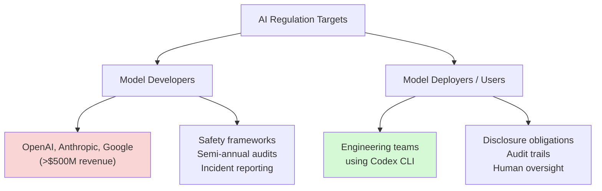
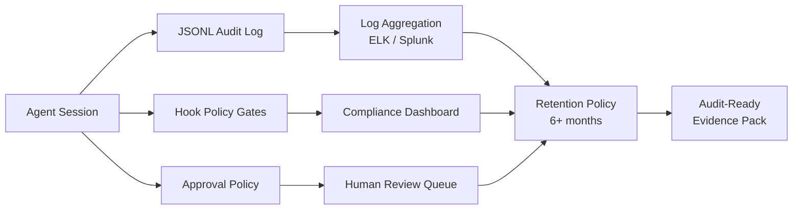

# AI Regulation and Codex CLI: The Great American AI Act, EU AI Act Enforcement, and What Enterprise Coding Agent Teams Must Prepare For


---

Two legislative events landed in the same week. On 4 June 2026, Representatives Obernolte and Trahan released the 269-page discussion draft of the **Great American AI Act** [^1]. Forty-eight hours later, engineering teams across the EU are reassessing the **EU AI Act's high-risk obligations** timeline after the 7 May Digital Omnibus agreement provisionally deferred the original 2 August 2026 enforcement date to late 2027 and 2028 [^2][^12]. Meanwhile, Colorado's original AI Act — once the most aggressive state-level regulation in the United States — was repealed and replaced by the lighter-touch **SB 189** before it could take effect [^3].

For teams running Codex CLI in production, the practical question is blunt: does any of this actually change what you need to build?

The answer is nuanced. Most AI coding agent usage falls outside the high-risk categories that trigger the heaviest obligations. But if your agents touch employment decisions, code review gates that affect hiring pipelines, or automated assessment tools in regulated sectors, you need to understand the new landscape — and Codex CLI's existing tooling already covers more of it than you might expect.

## Who the Regulations Target

The regulatory frameworks draw a sharp line between **model developers** and **model deployers** (or "users" in EU terminology). Understanding which side of that line you sit on determines almost everything about your compliance burden.



### The Great American AI Act

The draft targets **large frontier developers** — entities exceeding \$500 million in annual revenue [^1]. These companies must:

- Publish safety frameworks assessing whether models pose "catastrophic risk" (defined as foreseeable risk of death or injury to 50+ people, or \$1 billion+ in property damage) [^4]
- Retain a NIST-licensed **Independent Verification Organisation** (IVO) for semi-annual compliance audits [^4]
- Report critical safety incidents to the government [^1]
- Face penalties of up to **\$1 million per day** for non-compliance [^4]

Crucially, the bill **preempts state laws on AI model development for three years** whilst preserving state authority to regulate how AI systems are **deployed** [^1]. This means California's AB 2013 training data transparency requirements and portions of SB 942 content watermarking rules would be frozen [^4].

For Codex CLI users: you are deployers, not developers. The heaviest compliance obligations fall on OpenAI, not on your team. But deployment-side regulation is coming fast.

### EU AI Act: The Shifting Deadline

The EU AI Act's high-risk obligations — Articles 8 through 17, plus 26, 27, and 73 — were originally set to activate on **2 August 2026** [^2]. However, on 7 May 2026 the Council and European Parliament reached provisional political agreement on the **Digital Omnibus on AI**, which postpones these deadlines significantly [^12]:

- **Stand-alone Annex III high-risk systems** (recruitment, credit scoring, law enforcement, education): deferred to **2 December 2027**
- **AI embedded in regulated Annex I products** (medical devices, machinery, vehicles): deferred to **2 August 2028**

The Omnibus is pending formal adoption and Official Journal publication, expected before 2 August 2026. Until formally enacted, the original dates remain in legal text — so teams should continue preparing rather than relaxing [^12]. Transparency obligations for chatbots and some AI-generated content labelling requirements still take effect in August–December 2026.

If your AI system makes or materially influences "consequential decisions" in employment, education, financial services, healthcare, or housing, you are operating a high-risk system. The requirements — when they do apply — include:

- **Article 12**: Automatic recording of events (logs) over the system's lifetime, with a minimum 6-month retention period [^2]
- **Article 14**: Meaningful human oversight with the ability to override or halt the system [^5]
- **Article 9**: Documented risk management throughout the system lifecycle [^5]
- Penalties reaching **7% of global annual turnover** for the most serious violations [^2]

### Colorado SB 189: The Reset

Colorado's original AI Act (SB 24-205) was the most detailed state AI law in the US. Governor Polis signed SB 189 on 14 May 2026, **repealing and replacing** it before the 30 June effective date [^3]. The new law:

- Takes effect **1 January 2027** instead of 30 June 2026 [^3]
- Eliminates risk assessment programmes, impact assessments, and the duty to prevent algorithmic discrimination [^3]
- Adopts a **disclosure-based approach** — consumer notices and post-adverse-outcome transparency rather than preemptive system management [^3]
- Requires developers to provide documentation on system purpose, training data categories, known limitations, and usage instructions [^3]
- Mandates a **60-day cure period** before enforcement action [^3]

## When Codex CLI Falls Inside Regulated Scope

Most software engineering use of Codex CLI — writing features, generating tests, refactoring code, debugging — is not a "consequential decision" under any current framework. But edge cases exist:

| Use Case | Regulatory Risk | Framework |
|----------|----------------|-----------|
| Code generation for internal tools | Low | None currently applicable |
| Automated PR review gating deployments | Low | Possible EU AI Act if system affects employment |
| CV screening or hiring pipeline automation | **High** | EU AI Act Art. 6, Colorado SB 189 |
| Automated code assessment for developer evaluations | **Medium** | EU AI Act if linked to employment decisions |
| Compliance checking in regulated industries | **Medium** | Sector-specific regulation applies |
| Automated incident response in healthcare/finance | **High** | Sector regulation + EU AI Act |

The trigger is not whether you use an AI coding agent. It is whether the agent's output **materially influences a consequential decision** about a person.

## What Codex CLI Already Provides

Codex CLI's existing enterprise tooling maps surprisingly well onto the compliance requirements that deployers face. Here is what you already have:

### Audit Trails

Codex CLI writes **JSONL rollout files** for every session, recording each tool call, model response, and approval decision [^6]. Combined with `codex-trace` for visual inspection and `ccusage` for cost attribution, you have the raw material for Article 12 compliance [^6].

```bash
# List all sessions with metadata
codex sessions list --json | jq '.[] | {id, created, model, status}'

# Export a session's full transcript for audit
codex sessions export <session-id> --format jsonl > audit-trail.jsonl
```

### Human Oversight

The two-axis security model — **sandbox enforcement** controlling what the agent can technically do, and **approval policies** controlling when it must ask permission — maps directly onto Article 14's human oversight requirement [^7]. Permission profiles let you enforce these policies consistently:

```toml
# .codex/config.toml — regulated-workflow profile
[profile.regulated]
model = "o4-mini"
approval_policy = "unless-allow-listed"
sandbox = "full-auto-forbidden"

[profile.regulated.rules]
require_human_review = true
max_autonomous_steps = 5
```

### Managed Configuration

Enterprise admins can push **cloud-managed config bundles** that enforce security and operational policies across all Codex surfaces — CLI, App, and IDE extension [^8]. This ensures consistent governance even when individual developers configure their own local environments.

### Hooks for Policy Enforcement

Codex CLI's hook system fires at five lifecycle points: `SessionStart`, `PreToolUse`, `PostToolUse`, `UserPromptSubmit`, and `Stop` [^9]. A `PreToolUse` hook can block operations that violate policy and feed the reason back to the agent:

```bash
#!/bin/bash
# hooks/block-pii-export.sh — exit code 2 blocks the action
if echo "$CODEX_TOOL_INPUT" | grep -qiE '(ssn|passport|national.id)'; then
    echo "BLOCKED: Tool call references PII fields" >&2
    exit 2
fi
exit 0
```

## Building a Compliance-Ready Agent Deployment



For teams operating in regulated sectors, the practical steps are:

1. **Classify your use cases** against the table above. If none touch consequential decisions, your compliance burden is minimal — but document the classification.

2. **Enable structured logging**. Pipe JSONL session output to your existing log aggregation infrastructure. The EU AI Act requires 6-month retention minimum [^2]; most enterprise policies already exceed this.

3. **Deploy permission profiles**. Use `--profile regulated` for any workflow that could influence a consequential decision. Set `approval_policy = "unless-allow-listed"` to ensure human oversight by default.

4. **Implement policy hooks**. Write `PreToolUse` hooks that block operations violating your compliance requirements. The exit-code-2 pattern feeds block reasons back to the agent, so it can adapt rather than simply fail.

5. **Use managed configuration** for team-wide enforcement. Cloud config bundles ensure that individual developers cannot override compliance-critical settings locally [^8].

6. **Maintain a decision register**. Document where AI agents are used, what decisions they influence, and what human oversight controls are in place. Both the EU AI Act and the Great American AI Act's deployer provisions expect this.

## The Preemption Question

The Great American AI Act's three-year state preemption on model **development** regulation matters more for OpenAI than for Codex CLI users [^1]. However, the explicit preservation of state authority over **deployment** regulation means the compliance landscape for deployers will remain fragmented.

Teams operating across US states should monitor:

- **New York's RAISE Act** (effective 1 January 2027): transparency and governance requirements for frontier AI [^10]
- **Illinois**: moving towards mandatory AI safety audits [^10]
- **Colorado SB 189** (effective 1 January 2027): disclosure-based obligations for automated decision-making [^3]

For EU-based teams, data residency is already addressable through OpenAI's in-region GPU inference options in the US and Europe, and Codex CLI's `enforce_residency` configuration in managed requirements [^11].

## What Changes — and What Does Not

The regulatory wave changes the **documentation burden**, not the development workflow. Teams that already follow good engineering hygiene — structured logging, code review, human approval gates — are largely compliant by default.

What **does** change:

- You need **written justification** for where AI agents are and are not used in consequential decisions
- Audit trails must be **retained and retrievable**, not just technically generated
- Human oversight must be **documented and demonstrable**, not just theoretically possible
- Post-adverse-outcome disclosure timelines are now **legally defined** (30 days under Colorado SB 189) [^3]

What **does not** change:

- Standard software engineering use of Codex CLI remains unregulated
- The security model you already configure (sandbox + approval policies) satisfies human oversight requirements
- JSONL session logs already capture the event data regulators expect
- Model selection and prompt engineering remain your choice

## Practical Takeaway

The 2026 regulatory landscape is converging on a single principle: if an AI system influences a decision about a person, the deployer must be able to explain what happened, why, and what human oversight was in place. Codex CLI's existing hooks, permission profiles, audit logs, and managed configuration provide the technical primitives. The gap is not tooling — it is the **governance wrapper** around the tooling: classification registers, retention policies, and documented oversight procedures.

Build the wrapper now. The Digital Omnibus has bought extra time on high-risk obligations, but transparency rules still land in August and the Great American AI Act's deployer provisions are advancing in parallel. Start the governance work before the deadlines force it.

## Citations

[^1]: Obernolte, J. & Trahan, L. (2026, June 4). *Great American AI Act Discussion Draft*. [https://obernolte.house.gov/media/press-releases/obernolte-trahan-release-discussion-draft-great-american-ai-act](https://obernolte.house.gov/media/press-releases/obernolte-trahan-release-discussion-draft-great-american-ai-act)

[^2]: European Commission. (2024). *Regulation (EU) 2024/1689 — AI Act*. Articles 8-17, 26, 27, 73. High-risk obligations enforcement date: 2 August 2026. [https://dev.to/igorganapolsky/your-compliance-team-will-ask-for-an-ai-agent-audit-trail-before-august-2-heres-the-part-most-h2n](https://dev.to/igorganapolsky/your-compliance-team-will-ask-for-an-ai-agent-audit-trail-before-august-2-heres-the-part-most-h2n)

[^3]: Morrison Foerster. (2026, May 15). *Colorado Hits Reset on AI Regulation With a New AI Act: What Developers and Deployers Need to Know*. [https://www.mofo.com/resources/insights/260515-colorado-hits-reset-ai-regulation](https://www.mofo.com/resources/insights/260515-colorado-hits-reset-ai-regulation)

[^4]: *Bipartisan AI draft proposes three-year preemption of state laws*. Roll Call. (2026, June 4). [https://rollcall.com/2026/06/04/bipartisan-ai-draft-proposes-three-year-preemption-of-state-laws/](https://rollcall.com/2026/06/04/bipartisan-ai-draft-proposes-three-year-preemption-of-state-laws/)

[^5]: *The 2026 EU AI Act and AI-Generated Code: What Changes for Dev Teams*. Augment Code. [https://www.augmentcode.com/guides/eu-ai-act-2026](https://www.augmentcode.com/guides/eu-ai-act-2026)

[^6]: *Codex CLI Session Forensics: JSONL Post-Mortems, codex-trace, cass, and ccusage*. Codex Knowledge Base. (2026, June 5). [https://codex.danielvaughan.com/2026/06/05/codex-cli-session-forensics-jsonl-post-mortems-codex-trace-cass-ccusage/](https://codex.danielvaughan.com/2026/06/05/codex-cli-session-forensics-jsonl-post-mortems-codex-trace-cass-ccusage/)

[^7]: *Codex CLI Permission Profiles: Built-in Sandbox Modes, Custom Profiles, and the Two-Layer Security Model*. Codex Knowledge Base. (2026, May 8). [https://codex.danielvaughan.com/2026/05/08/codex-cli-permission-profiles-sandbox-modes-security-layers/](https://codex.danielvaughan.com/2026/05/08/codex-cli-permission-profiles-sandbox-modes-security-layers/)

[^8]: *Managed configuration — Codex*. OpenAI Developers. [https://developers.openai.com/codex/enterprise/managed-configuration](https://developers.openai.com/codex/enterprise/managed-configuration)

[^9]: *Hooks — Codex*. OpenAI Developers. [https://developers.openai.com/codex/hooks](https://developers.openai.com/codex/hooks)

[^10]: *Sprawling new House AI bill includes frontier model oversight, open-source security grants*. Cybersecurity Dive. (2026, June 4). [https://www.cybersecuritydive.com/news/house-ai-bill-regulation-cisa-nist-open-source/822131/](https://www.cybersecuritydive.com/news/house-ai-bill-regulation-cisa-nist-open-source/822131/)

[^11]: *Expanding data residency access to business customers worldwide*. OpenAI. [https://openai.com/index/expanding-data-residency-access-to-business-customers-worldwide/](https://openai.com/index/expanding-data-residency-access-to-business-customers-worldwide/)

[^12]: Council of the EU. (2026, May 7). *Artificial Intelligence: Council and Parliament agree to simplify and streamline rules*. [https://www.consilium.europa.eu/en/press/press-releases/2026/05/07/artificial-intelligence-council-and-parliament-agree-to-simplify-and-streamline-rules/](https://www.consilium.europa.eu/en/press/press-releases/2026/05/07/artificial-intelligence-council-and-parliament-agree-to-simplify-and-streamline-rules/)
