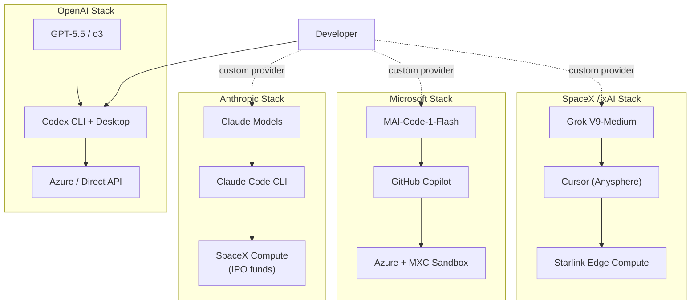
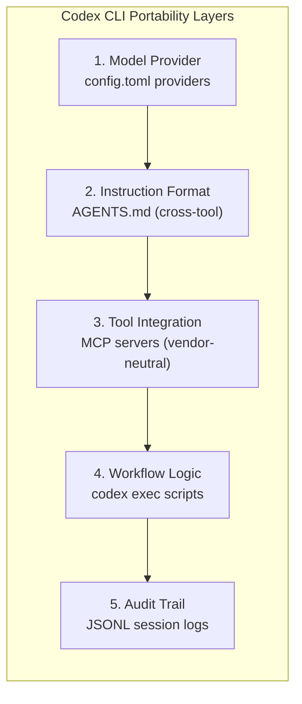

# The Anthropic IPO and the Trillion-Dollar Coding Agent Market: What a \$965 Billion Valuation Means for Codex CLI's Multi-Provider Strategy


---

Anthropic filed a confidential S-1 with the SEC on 1 June 2026, capping a week that also brought GitHub Copilot's shift to usage-based billing, Microsoft's first-party MAI coding models, and the continued fallout from the SpaceX-Cursor acquisition option[^1][^2]. Within five days the three largest platform vendors each redrew the economic terms under which developers consume AI coding assistance. For teams running Codex CLI, the practical question is not which company wins — it is how to architect workflows that remain portable regardless of who does.

## The Numbers Behind the Filing

Anthropic's Series H round, led by Altimeter Capital, Dragoneer, Greenoaks, and Sequoia Capital, closed at \$65 billion and valued the company at \$965 billion post-money — almost tripling the \$380 billion valuation from February[^3]. Run-rate revenue crossed \$47 billion in May 2026, up from roughly \$9 billion at the end of 2025[^4]. Claude Code alone exceeded a \$2.5 billion run-rate as of February, and daily Visual Studio Code installs surged from 17.7 million to 29 million over the first five months of the year[^5].

By contrast, OpenAI's run-rate revenue sits at approximately \$25 billion, and Codex has reached 5 million weekly active users — a sixfold increase since the desktop app launched in February[^6][^7]. The gap matters because post-IPO Anthropic will face public-market pressure to defend margins, which historically translates into pricing changes, tier restructuring, or feature gating.

## A Week That Changed the Economics

Three shifts landed almost simultaneously:

| Event | Date | Impact |
|---|---|---|
| GitHub Copilot moves to AI Credits | 1 June 2026 | Usage-based billing replaces flat per-seat pricing for premium features; 1 credit = \$0.01, consumed by token usage at model-specific rates[^8] |
| Microsoft unveils MAI-Code-1-Flash | 2–3 June 2026 | First-party 5B-active / 137B MoE coding model available via OpenRouter, reducing dependence on OpenAI models[^9] |
| Anthropic files confidential S-1 | 1 June 2026 | Signals October 2026 listing; introduces public-market revenue scrutiny to Claude pricing[^1] |

Each event nudges the market toward consumption-based economics. For the first time since agentic coding tools gained traction, every major provider prices agent work by the token rather than by the seat. Teams that locked into a single provider's pricing assumptions now face renegotiation risk on three fronts simultaneously.

## The Consolidation Pattern

The coding agent market is converging around vertically integrated stacks. Each major player now controls — or is acquiring — models, infrastructure, and the developer surface:



The solid line shows Codex CLI's native path. The dashed lines show what custom providers enable — and why provider agnosticism is no longer a theoretical nicety but a commercial necessity.

## Why Provider Agnosticism Is Now a Financial Decision

Anthropic currently commands roughly 54 per cent market share in coding agent usage, with OpenAI at 21 per cent[^10]. Post-IPO revenue pressure could push Claude Code pricing upward, particularly for enterprise tiers. Simultaneously, GitHub's credit system means Copilot costs now scale with agent intensity rather than headcount. Teams running high-throughput CI pipelines or multi-agent orchestrations face materially different cost profiles under consumption billing.

Codex CLI's `[model_providers]` configuration in `config.toml` offers a structural hedge:

```toml
# Primary provider — OpenAI direct
[model_providers.openai]
# Default, no configuration needed

# Secondary provider — Claude via Amazon Bedrock
[model_providers.bedrock-claude]
name = "Amazon Bedrock (Claude)"
base_url = "https://bedrock-runtime.us-east-2.amazonaws.com"
wire_api = "responses"

# Tertiary provider — MAI models via OpenRouter
[model_providers.openrouter-mai]
name = "OpenRouter (MAI)"
base_url = "https://openrouter.ai/api/v1"
wire_api = "chat"
env_key = "OPENROUTER_API_KEY"
```

Switching between providers is a single `--model` flag or a `config.toml` change — no code migration, no AGENTS.md rewrite, no pipeline restructuring. The February 2026 wire protocol change that removed Chat Completions support from Codex CLI means all providers now speak the Responses API (or are proxied through LiteLLM), creating a genuine abstraction layer rather than a compatibility shim[^11].

## The Five-Layer Portability Framework

Portability against vendor lock-in operates at five layers. Each must be addressed independently:



| Layer | Codex CLI mechanism | Portability rating |
|---|---|---|
| Model provider | `[model_providers]` in config.toml | High — swap with one config change |
| Instruction format | AGENTS.md | High — adopted by Claude Code, Cursor, Copilot[^12] |
| Tool integration | MCP servers via `.codex/mcp.json` | High — MCP is vendor-neutral under AAIF |
| Workflow logic | `codex exec` shell scripts | Medium — scripts are Codex-specific but thin |
| Audit trail | JSONL rollout files | Medium — format is Codex-specific but parseable |

The weakest points are layers four and five. Teams that wrap `codex exec` in thin shell scripts with structured `--output-schema` JSON contracts can migrate the orchestration layer to any agent runtime that accepts JSON. The JSONL audit logs require a format-specific parser but contain standard data (timestamps, tool calls, token counts) that maps to OpenTelemetry spans.

## Practical Defensive Moves for June 2026

### 1. Establish a provider rotation baseline

Run your most common workflow against two providers and measure quality, latency, and cost:

```bash
# Run the same task on GPT-5.5 and Claude via Bedrock
codex exec --model gpt-5.5 --output-schema schema.json \
  "Refactor auth module to use JWT rotation" > result-openai.json

codex exec --model us.anthropic.claude-sonnet-4-20250514 \
  --output-schema schema.json \
  "Refactor auth module to use JWT rotation" > result-claude.json

# Compare structured output
diff <(jq -S . result-openai.json) <(jq -S . result-claude.json)
```

This gives you a concrete switching cost estimate before you need to switch under pressure.

### 2. Audit your AGENTS.md for provider-specific language

AGENTS.md files that reference specific model names ("use GPT-5.5 for complex tasks") create implicit lock-in. Prefer capability-based instructions:

```markdown
## Model selection
- Use the highest-capability model available for architectural decisions
- Use a cost-efficient model for formatting, linting, and boilerplate generation
- Set reasoning effort to `high` for multi-file refactors
```

### 3. Pin MCP servers, not model providers

MCP servers under the Agentic AI Foundation (AAIF) provide vendor-neutral tool access[^13]. A GitHub MCP server, a PostgreSQL MCP server, or a Kubernetes MCP server works identically regardless of which model processes the tool calls. Investing in MCP-based tooling rather than provider-specific integrations pays compound returns as the market consolidates.

### 4. Track token economics across providers

With GitHub Copilot now billing per credit and Codex CLI billing per token, teams need unified cost visibility. Parse Codex CLI session logs to extract token counts:

```bash
# Extract token usage from the latest session
jq -r 'select(.type == "response.completed") |
  .response.usage |
  "\(.input_tokens) in, \(.output_tokens) out, \(.cached_tokens // 0) cached"' \
  ~/.codex/sessions/*/rollout.jsonl | tail -5
```

Cross-reference with your provider's billing dashboard to identify which workflows are cost-sensitive to provider choice.

## What the IPO Timeline Means

Analysts expect Anthropic to target an October 2026 listing[^14]. The S-1 quiet period restricts what Anthropic can announce publicly, but enterprise customers should watch for:

- **Pricing tier changes** before the roadshow (July–September) to optimise revenue metrics
- **Claude Code feature gating** that differentiates free, Pro, and Enterprise tiers
- **Compute cost pass-through** as Anthropic's \$15 billion annual spend on SpaceX compute services gets scrutinised by public-market analysts[^15]

Codex CLI teams that have already configured a secondary provider avoid the scramble if Claude pricing changes during the IPO window.

## The Strategic Picture

The coding agent market is entering a phase where the providers themselves are products of financial engineering as much as technical innovation. Anthropic's near-trillion-dollar valuation, OpenAI's \$122 billion raise in April, and SpaceX's potential \$60 billion acquisition of Cursor all signal that the economic stakes now dwarf the technical differentiation between models[^16].

For practitioners, the response is architectural rather than tribal. Codex CLI's provider-agnostic design — `config.toml` providers, AGENTS.md portability, MCP tool abstraction, and structured `codex exec` pipelines — is not a feature list. It is an insurance policy against a market where the rules change quarterly.

The developers who thrive in the trillion-dollar coding agent market will not be those who picked the right vendor. They will be those who made the vendor choice reversible.

## Citations

[^1]: [Anthropic Files Confidential S-1: Joins \$3 Trillion AI IPO Race](https://finance.yahoo.com/markets/stocks/articles/anthropic-files-confidential-1-joins-161008569.html) — Yahoo Finance, June 2026
[^2]: [Updates to GitHub Copilot billing and plans](https://github.blog/changelog/2026-06-01-updates-to-github-copilot-billing-and-plans/) — GitHub Changelog, 1 June 2026
[^3]: [Anthropic raises \$65B in Series H funding at \$965B post-money valuation](https://www.anthropic.com/news/series-h) — Anthropic, May 2026
[^4]: [Anthropic tops OpenAI as most valuable AI startup, nears \$1 trillion valuation](https://www.cnbc.com/2026/05/28/anthropic-open-ai-startup-value.html) — CNBC, 28 May 2026
[^5]: [Claude AI Statistics 2026: Revenue, Users & Market Share](https://www.getpanto.ai/blog/claude-ai-statistics) — Panto, 2026
[^6]: [Codex is becoming a productivity tool for everyone](https://openai.com/index/codex-for-knowledge-work/) — OpenAI, 2 June 2026
[^7]: [OpenAI Release Notes - June 2026](https://releasebot.io/updates/openai) — Releasebot, June 2026
[^8]: [GitHub Copilot is moving to usage-based billing](https://github.blog/news-insights/company-news/github-copilot-is-moving-to-usage-based-billing/) — GitHub Blog, 2026
[^9]: [Microsoft Build 2026: MAI-Code-1-Flash announcement](https://www.cnbc.com/2026/06/01/microsoft-and-google-take-on-anthropic-and-openai-in-ai-coding-models.html) — CNBC, 1 June 2026
[^10]: [Enterprise Agentic AI Landscape 2026: Trust, Flexibility, and Vendor Lock-in](https://www.kai-waehner.de/blog/2026/04/06/enterprise-agentic-ai-landscape-2026-trust-flexibility-and-vendor-lock-in/) — Kai Waehner, April 2026
[^11]: [Deprecating chat/completions support in Codex](https://github.com/openai/codex/discussions/7782) — GitHub Discussion, February 2026
[^12]: [Agent Skills Open Standard Explained](https://www.paperclipped.de/en/blog/agent-skills-open-standard-interoperability/) — Paperclipped, 2026
[^13]: [Agentic AI Foundation under Linux Foundation](https://zed.dev/acp) — Zed, 2026
[^14]: [Anthropic IPO: \$965 Billion Valuation, Revenue, Risks](https://univest.in/blogs/anthropic-ipo-valuation-965-billion-june-2026) — Univest, June 2026
[^15]: [Anthropic raises \$65 billion, nears \$1T valuation ahead of IPO](https://techcrunch.com/2026/05/28/anthropic-raises-65-billion-nears-1t-valuation-ahead-of-ipo/) — TechCrunch, 28 May 2026
[^16]: [OpenAI tells employees it is growing again, with Codex eating into Claude Code's market share](https://sherwood.news/tech/report-openai-tells-employees-it-is-growing-again-with-codex-eating-into/) — Sherwood News, 2026
