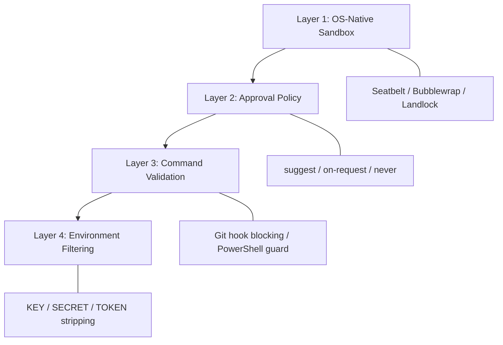

# Codex CLI Command Safety: Defence in Depth from Shell Injection to Sandbox Containment


---

Every command a coding agent executes is a trust decision. When Codex CLI runs `npm test` or `git diff`, it does so on *your* machine, with *your* credentials in memory and *your* cloud tokens a `printenv` away. The question is not whether the agent will run commands — it is how many layers of containment sit between a model's tool call and your kernel.

This article maps Codex CLI's command safety architecture as of v0.138, from the outer sandbox boundary down to the most recent hardening patches that block repository-provided Git helpers and browser-origin WebSocket handshakes. It draws on disclosed vulnerabilities, the community hardening cheat sheet, and OpenAI's own security documentation to give senior developers a practical understanding of what protects them — and where the remaining gaps lie.

## The Four-Layer Command Safety Model

Codex CLI's command execution security is not a single mechanism but a stack of four complementary layers. A failure in any one layer should be contained by the others — the classic defence-in-depth principle [^1].



Each layer operates independently: the sandbox enforces at kernel level regardless of what the approval policy decides, and environment filtering strips secrets even when the sandbox is set to `danger-full-access` [^2].

## Layer 1: OS-Native Sandbox

Every command Codex spawns — whether it is a `grep`, a test runner, or a package manager — inherits the sandbox policy of the session [^3]. This is not an application-level wrapper; it is kernel-enforced containment.

### Platform-Specific Enforcement

| Platform | Mechanism | Network Isolation | Filesystem Isolation |
|----------|-----------|-------------------|---------------------|
| macOS | Seatbelt via `sandbox-exec` | Seatbelt profile blocks network syscalls | Profile restricts write paths to workspace |
| Linux | Bubblewrap + Landlock + seccomp-BPF | seccomp filter blocks `connect`, `accept`, `bind`, `listen`, `sendto`, `sendmsg` | Landlock restricts filesystem access; Bubblewrap provides namespace isolation where Landlock is unavailable |
| Windows | Native restricted tokens + ACLs; WSL2 falls back to Linux sandbox | Restricted token limits network operations | ACL-based write restrictions |

A critical implementation detail: `AF_UNIX` sockets are exempted from the seccomp network filter on Linux [^3]. Without this exemption, basic shell operations would break — pipes, `git` credential helpers, and language server communication all rely on Unix domain sockets. This is a deliberate trade-off: local IPC is preserved while outbound network access is denied.

### Sandbox Modes

Three modes control the containment boundary [^4]:

```toml
# Read-only: agent can inspect but not modify
sandbox_mode = "read-only"

# Workspace-write (default): edits permitted within project directory
sandbox_mode = "workspace-write"

# Full access: no containment — use only in controlled environments
sandbox_mode = "danger-full-access"
```

Even in `workspace-write` mode, certain paths remain read-only regardless:

- `.git/` — prevents the agent from rewriting history, adding hooks, or modifying configuration
- `.agents/` — protects agent instruction files from self-modification
- `.codex/` — prevents the agent from escalating its own permissions by editing local config [^2]

These protections are **recursive and unconditional**. An agent cannot `chmod` its way out of them.

## Layer 2: Approval Policy

The sandbox defines *what is technically possible*; the approval policy defines *when the agent must stop and ask* [^2].

```toml
# Default: agent works autonomously within sandbox, asks when crossing boundaries
approval_policy = "on-request"

# Conservative: agent must ask before any state-mutating command
approval_policy = "untrusted"

# Headless/CI: agent never prompts (sandbox must be the sole constraint)
approval_policy = "never"
```

When `approval_policy = "untrusted"`, Codex automatically executes known-safe read operations (`ls`, `cat`, `grep`) but requires explicit approval for state-mutating commands, destructive Git operations, and any command with output-override flags [^2].

### Auto-Review: The Automated Approval Gate

For teams that need headless operation but want more than sandbox-only protection, the auto-review feature routes approval requests through a secondary reviewer agent [^5]:

```toml
approvals_reviewer = "auto_review"
```

The reviewer applies risk classification (low/medium/high/critical) and checks for data exfiltration patterns, credential probing, and destructive operations [^2]. It evaluates only actions that already require approval — it cannot override the sandbox.

## Layer 3: Command Validation and Safety Hardening

This is where the most recent and most targeted protections live. While the sandbox provides broad containment and the approval policy gates user consent, command validation catches specific attack patterns that exploit the gap between "permitted by sandbox" and "safe to execute".

### The v0.138 Command-Safety Hardening

Three specific hardening patches landed in v0.138 (June 2026) [^6]:

**1. Git helper/hook isolation for `/diff`**

The `/diff` slash command now executes Git operations with `GIT_CONFIG_NOSYSTEM=1` and explicit `--no-ext-diff` flags, preventing repository-provided `.gitconfig` entries from invoking external diff tools or custom merge drivers [^6]. Before this patch, a malicious repository could define a `diff.*.textconv` entry in `.gitattributes` that pointed to an arbitrary script — the agent would trigger it simply by running `/diff` to inspect changes.

**2. PowerShell parser guard on non-Windows hosts**

Codex CLI now validates the host platform before routing commands through the PowerShell parser [^6]. This closes a cross-platform confusion vector where a repository's `.codex/config.toml` could specify PowerShell-format commands on a macOS or Linux host, potentially reaching unexpected shell interpreters through `pwsh` compatibility layers.

**3. Browser-origin WebSocket rejection**

The exec-server — the local HTTP/WebSocket endpoint that the TUI and IDE extensions connect to — now rejects handshake requests with browser-origin headers [^6]. This prevents a malicious web page from establishing a WebSocket connection to the local Codex exec-server and issuing commands, a variant of the DNS rebinding class of attacks.

### Historical Vulnerabilities and Lessons

These hardening patches did not emerge in a vacuum. Two significant vulnerabilities shaped the current architecture:

**CVE-2025-61260: Configuration injection via `.env` redirection** [^7]

Discovered by Check Point Research in December 2025, this vulnerability allowed a malicious repository to include a `.env` file setting `CODEX_HOME=./.codex`, redirecting Codex to load a repository-provided `config.toml`. Any `mcp_servers` entries in that config would execute immediately — no approval prompt, no sandbox check. The fix, shipped in v0.23.0 (August 2025), blocks project-local redirection of `CODEX_HOME` entirely.

**GitHub branch name injection** [^8]

BeyondTrust's Phantom Labs discovered that the Codex cloud environment passed GitHub branch names to shell commands without sanitisation. Attackers could create branches containing Unicode ideographic spaces (U+3000) that rendered identically to ASCII spaces in terminals, enabling command injection through the branch name parameter. This resulted in exposure of GitHub User Access Tokens.

Both vulnerabilities share a common pattern: **trust was derived from location rather than content**. A file's presence in a repository or a parameter's presence in an API request was treated as implicit authorisation. The current architecture explicitly rejects this model.

## Layer 4: Environment Filtering

The final layer protects secrets that might be visible in the shell environment. Even when `shell_environment_policy.inherit = "all"`, Codex applies an automatic filter that strips any variable whose name contains `KEY`, `SECRET`, or `TOKEN` (case-insensitive) [^9]:

```toml
[shell_environment_policy]
inherit = "all"
ignore_default_excludes = false  # keep the safety filter active
```

Setting `ignore_default_excludes = true` disables this filter and should be treated as a security-critical configuration change. The `env_allowlist` provides a safer alternative for selectively exposing specific variables:

```toml
[shell_environment_policy]
inherit = "none"
set = { PATH = "/usr/bin:/usr/local/bin", HOME = "/home/dev" }
env_allowlist = ["GOPATH", "JAVA_HOME", "NODE_ENV"]
```

## Practical Hardening Configuration

The community-maintained hardening cheat sheet [^10] recommends a baseline that activates all four layers:

```toml
# ~/.codex/config.toml — hardened baseline
approval_policy = "on-request"
sandbox_mode = "workspace-write"
allow_login_shell = false

[sandbox_workspace_write]
exclude_slash_tmp = true
exclude_tmpdir_env_var = true
writable_roots = []
network_access = false

[shell_environment_policy]
inherit = "none"
ignore_default_excludes = false
```

### Named Profiles for Context Switching

The cheat sheet recommends three profiles [^10]:

```toml
# Inspection-only: safe for reviewing untrusted repositories
[profiles.readonly_quiet]
sandbox_mode = "read-only"
approval_policy = "never"

# Local development: standard daily-driver configuration
[profiles.local_write]
sandbox_mode = "workspace-write"
approval_policy = "on-request"

# Network-enabled: for tasks requiring API calls or package installs
[profiles.remote_enabled]
sandbox_mode = "workspace-write"
approval_policy = "on-request"

[profiles.remote_enabled.sandbox_workspace_write]
network_access = true
```

Switch at launch: `codex --profile readonly_quiet`. This prevents the common mistake of retaining broader permissions from a previous session.

### Enterprise Audit Trail

For teams operating under compliance requirements, the OpenTelemetry integration provides an audit trail of every command execution and approval decision [^11]:

```toml
[otel]
exporter = "otlp-http"
endpoint = "https://otel-collector.internal:4318"
log_user_prompt = false  # redact prompts by default
```

The JSONL session logs under `~/.codex/sessions/` persist locally regardless of OTel configuration, providing a fallback audit record [^10].

## The Trust Boundary Hierarchy

A useful mental model: Codex CLI treats trust as a five-level hierarchy, where each level requires explicit opt-in [^2] [^4]:

```mermaid
graph LR
    A["Untrusted repo"] -->|"trust project"| B["Trusted project config"]
    B -->|"trust hooks"| C["Project hooks active"]
    C -->|"workspace-write"| D["Agent can modify files"]
    D -->|"network_access = true"| E["Agent can reach network"]
    E -->|"danger-full-access"| F["No containment"]

    style A fill:#ff6b6b,color:#fff
    style B fill:#ffa07a,color:#fff
    style C fill:#ffd700,color:#000
    style D fill:#98fb98,color:#000
    style E fill:#87ceeb,color:#000
    style F fill:#ff4444,color:#fff
```



Project-scoped configuration files (`.codex/config.toml`, project-local hooks, project-local rules) only load when the project is explicitly trusted [^2]. Untrusted projects run under global defaults only — a direct response to CVE-2025-61260.

## What the Sandbox Does Not Cover

No security architecture is complete without acknowledging its boundaries:

- **Instruction-level files are prompts, not policy.** `AGENTS.md` and `.codex/instructions.md` influence model behaviour but cannot enforce it. Do not rely on them for security constraints — use `config.toml` sandbox and approval settings instead [^10].
- **DNS rebinding protections are best-effort.** The browser-origin WebSocket rejection in v0.138 mitigates the most common vector, but sophisticated DNS rebinding attacks against the local exec-server remain a theoretical concern in hostile network environments [^2].
- **Containerised environments may disable sandboxing.** When running inside Docker or CI containers that lack user namespace support, Codex may require `danger-full-access`. Container-level isolation should compensate [^4].
- **The auto-reviewer is an LLM.** It applies heuristic risk classification, not formal verification. Treat it as an additional signal, not a security guarantee [^2].

## Conclusion

Codex CLI's command safety architecture has evolved through real-world vulnerability disclosures into a genuinely layered defence system. The v0.138 hardening patches — blocking Git helper execution in `/diff`, guarding against cross-platform PowerShell confusion, and rejecting browser-origin WebSocket connections — close specific attack vectors that sit above the sandbox layer. Combined with kernel-enforced containment, configurable approval policies, and automatic secret filtering, the stack provides meaningful protection for teams running an autonomous coding agent on production developer machines.

The practical takeaway: start with the hardened baseline configuration, use named profiles for context switching, and remember that `AGENTS.md` is a suggestion — `config.toml` is the law.

---

## Citations

[^1]: [Codex CLI Hardening Cheat Sheet — okdt/codex-cli-hardening-cheatsheet](https://github.com/okdt/codex-cli-hardening-cheatsheet/blob/main/Codex_CLI_Hardening_Cheat_Sheet.en.md)
[^2]: [Agent Approvals & Security — OpenAI Developers](https://developers.openai.com/codex/agent-approvals-security)
[^3]: [Sandboxing Implementation — openai/codex DeepWiki](https://deepwiki.com/openai/codex/5.6-sandboxing-implementation)
[^4]: [Sandbox Concepts — OpenAI Developers](https://developers.openai.com/codex/concepts/sandboxing)
[^5]: [Advanced Configuration — OpenAI Developers](https://developers.openai.com/codex/config-advanced)
[^6]: [Codex CLI Changelog — OpenAI Developers](https://developers.openai.com/codex/changelog)
[^7]: [OpenAI Codex CLI Command Injection Vulnerability (CVE-2025-61260) — Check Point Research](https://research.checkpoint.com/2025/openai-codex-cli-command-injection-vulnerability/)
[^8]: [OpenAI Codex Command Injection Vulnerability — BeyondTrust](https://www.beyondtrust.com/blog/entry/openai-codex-command-injection-vulnerability-github-token)
[^9]: [Codex CLI Shell Environment Policy — Codex Knowledge Base](https://codex.danielvaughan.com/2026/04/28/codex-cli-shell-environment-policy-subprocess-secrets-defence/)
[^10]: [Codex CLI Hardening Cheat Sheet — okdt/codex-cli-hardening-cheatsheet](https://github.com/okdt/codex-cli-hardening-cheatsheet/blob/main/Codex_CLI_Hardening_Cheat_Sheet.en.md)
[^11]: [Codex CLI OpenTelemetry: Observability and Metrics in Production — Codex Knowledge Base](https://codex.danielvaughan.com/2026/03/28/codex-cli-opentelemetry-observability/)
