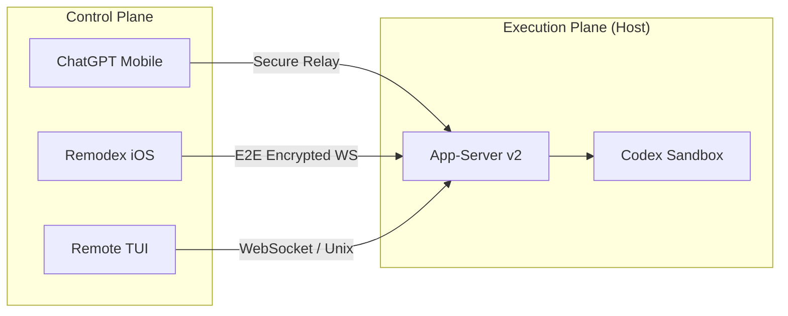
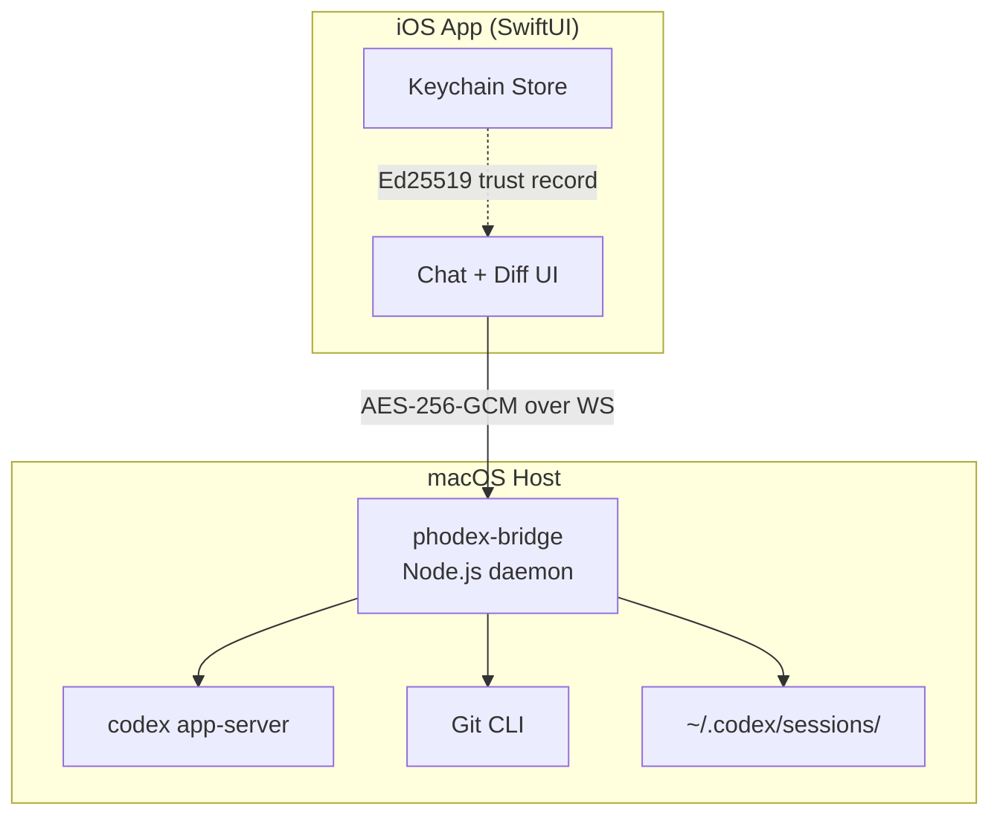
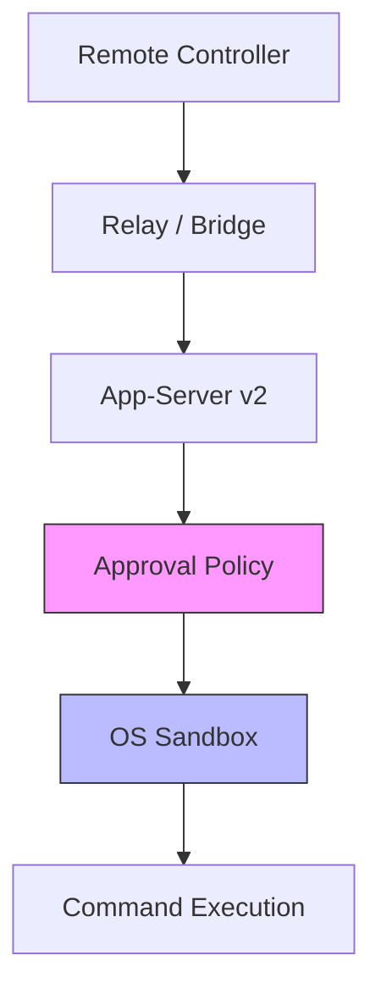

# Codex CLI Remote Control and Mobile Pairing: App-Server v2 RPCs, ChatGPT Mobile, and the Remodex Ecosystem


---

Codex CLI v0.137 shipped a set of app-server v2 RPCs that promote remote control from an experimental curiosity to a first-class workflow surface [^1]. Developers can now initiate pairing, enumerate connected controllers, and revoke device grants — all without leaving the terminal or the ChatGPT mobile app. Combined with the third-party Remodex bridge for iOS, this creates a layered remote-control stack that lets you steer an agent from your phone, a second terminal, or a CI runner while the sandbox, approval policy, and audit trail remain intact on the host.

This article maps the architecture end to end: the official remote-control primitives, the ChatGPT mobile integration, the Remodex ecosystem, the underlying security model, and the practical patterns that make mobile pairing genuinely useful rather than a novelty.

## Why Remote Control Matters

A terminal agent that can only be driven from the machine it runs on is constrained in three ways:

1. **Mobility** — step away from the desk and your agent stalls at the next approval gate.
2. **Long-running tasks** — overnight migrations on an always-on server need a way to approve commands remotely.
3. **Team visibility** — a colleague cannot observe or intervene in a session without SSH access to the host.

Remote control solves all three by decoupling the *control plane* (where you type and approve) from the *execution plane* (where commands run inside the sandbox).



## The App-Server v2 Remote-Control RPCs

The app-server is the JSON-RPC 2.0 daemon that sits between the TUI (or any client) and the Codex agent loop [^2]. Version 0.137 added six remote-control RPCs [^1]:

### Lifecycle

| RPC | Purpose |
|-----|---------|
| `remoteControl/enable` | Activate remote control; returns a status snapshot |
| `remoteControl/disable` | Deactivate (does **not** revoke enrolled devices) |
| `remoteControl/status/read` | Read current status: `disabled`, `connecting`, `connected`, or `errored` |

### Pairing

| RPC | Parameters | Returns |
|-----|-----------|---------|
| `remoteControl/pairing/start` | `manualCode: true` for a human-typeable code | `pairingCode`, `manualPairingCode`, `environmentId`, `expiresAt` (Unix seconds) |
| `remoteControl/pairing/status` | Exactly one of `pairingCode` or `manualPairingCode` | `{ claimed: boolean }` |

### Client Management

| RPC | Parameters | Returns |
|-----|-----------|---------|
| `remoteControl/client/list` | `environmentId`, optional `cursor`, `limit`, `order` | Client metadata array, `nextCursor` |
| `remoteControl/client/revoke` | `environmentId`, `clientId` | `{}` |

A `remoteControl/status/changed` notification fires whenever the status or environment ID changes, and newly connected clients receive the current snapshot immediately [^2].

### Example: Scripted Pairing

```bash
# Start the app-server with remote control enabled
codex remote-control

# From a second terminal, call the pairing RPC
codex rpc remoteControl/pairing/start '{"manualCode": true}'
# → { "pairingCode": "abc123...", "manualPairingCode": "WOLF-PINE-7482",
#     "environmentId": "env_xyz", "expiresAt": 1749225600 }
```

The `manualPairingCode` is a short, human-readable phrase intended for scenarios where QR scanning is impractical — such as pairing over a voice call with a colleague [^3].

## ChatGPT Mobile Integration

The official path uses the ChatGPT app on iOS or Android as the controller [^3]:

1. Open Codex App on the host and select **Set up Codex mobile** in the sidebar.
2. A QR code appears containing the relay URL, session ID, and environment identity.
3. Scan it from the ChatGPT mobile app; complete MFA/SSO/passkey authentication.
4. The phone connects via OpenAI's secure relay infrastructure.

Once paired, the mobile app provides:

- Thread creation and resumption
- Instruction input and command approval
- Diff review, test output, and screenshot viewing
- Task completion notifications [^3]

### Supported Configurations

| Controller | Host | Status |
|-----------|------|--------|
| iOS ChatGPT | macOS Codex App | ✅ Supported |
| Android ChatGPT | macOS Codex App | ✅ Supported |
| iOS ChatGPT | Windows Codex App | ✅ Supported |
| Mac Codex App | Windows Codex App | ✅ Supported |
| Windows Codex App | macOS Codex App | ❌ Not supported |

The relay layer keeps the host reachable across network boundaries without exposing the app-server transport directly on a public interface [^3].

### Security Constraints

The existing sandbox configuration, approval policy, and permission profile remain active on the host [^3]. A mobile controller does not bypass `suggest` or `ask-every-time` approval modes — the phone simply becomes the surface where you tap "Approve" instead of pressing Enter in the TUI.

**Important:** workspace administrators can disable Remote Control access for their organisation via admin settings [^3]. If pairing fails with an authorisation error, check with your workspace admin.

## The Remodex Ecosystem

Remodex is an open-source iOS app and macOS bridge that provides an alternative remote-control surface, independent of the ChatGPT app [^4]. It targets developers who want deeper Git integration, end-to-end encryption under their own control, and the ability to pair without an OpenAI relay.

### Architecture



The bridge (`phodex-bridge`) runs as a `launchd` service on macOS, spawning or connecting to an existing `codex app-server` instance [^4]. It handles:

- **Git operations** — commit, push, pull, branch, stash, all driven from the phone
- **Workspace undo** — revert-patch preview and application
- **Session persistence** — threads stored as JSONL under `~/.codex/sessions/`

### Pairing Protocol

Remodex implements its own cryptographic pairing, independent of OpenAI's relay [^4] [^5]:

1. The bridge generates a QR code containing: connection URL, session ID, and Ed25519 identity public key.
2. Both devices exchange fresh **X25519 ephemeral keys** and nonces.
3. The bridge signs the handshake transcript with its **Ed25519 identity key**; the iPhone verifies against the QR-embedded public key (first pair) or the stored trusted record (reconnection).
4. The iPhone signs a client-auth transcript; the bridge verifies before accepting.
5. Both sides derive directional **AES-256-GCM** session keys via **HKDF-SHA256**.

After the handshake, the relay transport cannot read prompts, tool calls, agent responses, or Git output [^5].

### Trusted Reconnection

Once paired, the iPhone stores the Mac as a Keychain record (`WhenUnlockedThisDeviceOnly`), and the bridge persists the phone's identity locally [^4]. Subsequent connections skip the QR scan entirely — the bridge, running as a `launchd` daemon, remains reachable for automatic reconnection.

### Environment Variables

| Variable | Purpose |
|----------|---------|
| `REMODEX_RELAY` | WebSocket relay endpoint |
| `REMODEX_CODEX_ENDPOINT` | Custom Codex server (bypasses local spawn) |
| `REMODEX_PUSH_SERVICE_URL` | Optional APNs push registration |
| `REMODEX_REFRESH_ENABLED` | Desktop app deep-link refresh workaround |

## Authentication: Server Tokens Replace ChatGPT Tokens

Version 0.136 introduced a significant security improvement: remote-control WebSockets now use **short-lived server tokens** instead of long-lived ChatGPT access tokens [^6]. This reduces the blast radius of a compromised relay session — a stolen token expires quickly and cannot be reused to access the broader ChatGPT platform.

Additionally, v0.136 added `CODEX_API_KEY` registration for approved OpenAI hosts [^6], enabling API-key-based authentication as an alternative for CI/CD and headless environments where browser-based OAuth is impractical.

## Practical Patterns

### Pattern 1: Overnight Migration Monitor

```toml
# config.toml — always-on server profile
[profile.migration-server]
approval_policy = "unless-allow-listed"
model = "o3"

[profile.migration-server.shell_environment_policy]
inherit = "core"
```

Launch the migration on your server, pair from your phone, and approve each migration step from bed. The `unless-allow-listed` policy ensures read operations proceed automatically whilst destructive commands require explicit mobile approval.

### Pattern 2: Team Code Review Handoff

Start a review session on your workstation:

```bash
codex --profile review
# ... work through the review ...
codex remote-control
```

Share the manual pairing code with a colleague:

```
WOLF-PINE-7482
```

They connect from their ChatGPT mobile app, pick up where you left off, and the full conversation transcript carries over in the thread.

### Pattern 3: CI-Triggered Approval Gates

For regulated deployments requiring human sign-off, a GitHub Actions workflow can start a Codex cloud task, then pause at an approval gate. The developer approves from their phone via the paired ChatGPT app, and the pipeline continues — maintaining an auditable trail in the JSONL session log.

## Security Considerations

### Defence in Depth

Remote control adds a new attack surface — the relay connection — but it does **not** weaken the existing security layers:



- The **approval policy** still gates every command — remote approval is functionally identical to local approval [^3].
- The **OS sandbox** (Landlock on Linux, Seatbelt on macOS) constrains filesystem and network access regardless of how the approval arrived [^7].
- **JSONL audit logs** record every turn, including the approval source, so compliance teams can verify that remote approvals were legitimate.

### Revoking Access

```bash
# List connected controllers
codex rpc remoteControl/client/list '{"environmentId": "env_xyz"}'

# Revoke a specific device
codex rpc remoteControl/client/revoke '{"environmentId": "env_xyz", "clientId": "client_abc"}'
```

Disabling remote control (`remoteControl/disable`) stops new connections but does **not** revoke enrolled devices [^2]. To fully remove a device, use the `revoke` RPC.

### Remodex vs Official Relay

| Aspect | ChatGPT Mobile (Official) | Remodex |
|--------|--------------------------|---------|
| Relay | OpenAI-hosted | Self-hosted or Tailscale |
| Encryption | TLS to relay, relay sees plaintext ⚠️ | End-to-end (relay is blind) |
| Authentication | OpenAI account + MFA | QR + Ed25519 device trust |
| Platform | iOS, Android | iOS only |
| Git operations | Via Codex agent | Native bridge integration |
| Open source | No | Yes [^4] |

⚠️ The official relay's exact encryption guarantees are not fully documented. OpenAI describes a "secure relay layer" [^3] but does not specify whether the relay can inspect message content. Remodex's end-to-end encryption is independently verifiable from its open-source implementation [^5].

## What Is Coming

The v0.138 alpha series (six alpha releases in two days as of 6 June 2026 [^8]) suggests rapid iteration on the remote-control surface. Community discussion on GitHub (#9200) has requested deeper integration between the ChatGPT mobile app and Codex CLI, including voice-driven approvals via the realtime API [^9]. The app-server already exposes experimental `thread/realtime/start` with WebRTC SDP negotiation [^2], hinting at a future where you approve a database migration by speaking to your phone.

## Citations

[^1]: [Codex CLI v0.137.0 Release Notes — GitHub Releases](https://github.com/openai/codex/releases)
[^2]: [Codex App-Server README — openai/codex repository](https://github.com/openai/codex/blob/main/codex-rs/app-server/README.md)
[^3]: [Remote Connections — OpenAI Codex Developer Documentation](https://developers.openai.com/codex/remote-connections)
[^4]: [Remodex — Remote Control for Codex (GitHub)](https://github.com/Emanuele-web04/remodex)
[^5]: [Using iPhone to Remotely Control Codex, Remodex Might Be the Best Tool Currently — Medium](https://piedpay.medium.com/using-iphone-to-remotely-control-codex-remodex-might-be-the-best-tool-currently-368b33865dbe)
[^6]: [Codex CLI v0.136.0 Release Notes — GitHub Releases](https://github.com/openai/codex/releases/tag/rust-v0.136.0)
[^7]: [Sandbox — OpenAI Codex Developer Documentation](https://developers.openai.com/codex/concepts/sandboxing)
[^8]: [Codex Updates June 2026 — Releasebot](https://releasebot.io/updates/openai/codex)
[^9]: [Add the ability to remote control codex from ChatGPT app — GitHub Discussion #9200](https://github.com/openai/codex/discussions/9200)
