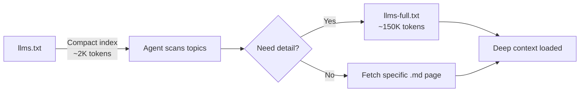
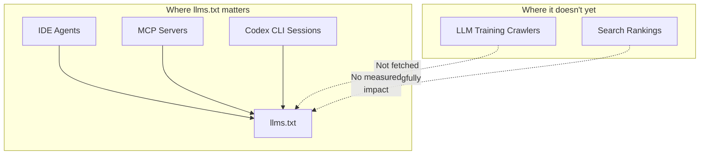

# The llms.txt Specification and Codex CLI: Machine-Readable Documentation for Agent-Assisted Development


---

Every Codex CLI session begins with a context-gathering phase: the agent reads AGENTS.md, scans the repository, and ingests whatever documentation you surface. The quality of that context determines the quality of the output. Yet most library documentation is locked inside HTML pages optimised for human reading — not for the 128k-token context window of GPT-5.5.

The **llms.txt specification** addresses this gap. Proposed by Jeremy Howard in September 2024 [^1], it defines a Markdown file at a website's root that provides LLM-friendly content — a curated index of a project's most important pages, each with a one-line description. By June 2026, the specification has reached version 1.7.0 [^2], and adoption among developer-tool companies has crossed a critical threshold: Anthropic, Stripe, Vercel, Cloudflare, Supabase, Cursor, and OpenAI itself all ship llms.txt files [^3].

This article explains the specification, examines OpenAI's own Codex documentation as a reference implementation, and walks through practical patterns for using llms.txt within Codex CLI workflows.

## What llms.txt Actually Is

The specification is deliberately minimal [^1]. A conforming file contains these sections in order:

1. **H1 heading** with the project or site name (the only required element)
2. **Blockquote** with a one-paragraph summary
3. **Zero or more free-form Markdown sections** (paragraphs, lists — no headings)
4. **H2-delimited link lists** grouping pages by topic, each as a bullet with title, URL, and a colon-separated description

```markdown
# Acme SDK

> Acme SDK provides type-safe HTTP clients for the Acme API.

## Getting Started

- [Quickstart](https://acme.dev/docs/quickstart): Install, authenticate, and make your first API call
- [Authentication](https://acme.dev/docs/auth): OAuth2, API keys, and service account flows

## API Reference

- [Users](https://acme.dev/docs/api/users): CRUD operations for user resources
- [Webhooks](https://acme.dev/docs/api/webhooks): Event subscription and payload schemas

## Optional

- [Changelog](https://acme.dev/docs/changelog): Release history and migration notes
```

The `## Optional` section signals content that an agent can skip when context is tight [^1]. A companion file, `llms-full.txt`, concatenates the full Markdown content of every linked page into a single document — useful when an agent needs deep context rather than just a map [^4].

## OpenAI's Codex Documentation as Reference Implementation

OpenAI ships both files for the Codex documentation surface [^5]:

- **`https://developers.openai.com/codex/llms.txt`** — A compact index of every Codex documentation page, grouped by topic (CLI, IDE, Cloud, Security, Enterprise, Integrations). Each entry links to a `.md` twin of the HTML page [^5].
- **`https://developers.openai.com/codex/llms-full.txt`** — A single-file Markdown export of the entire Codex documentation set across CLI, IDE, cloud, and SDK [^6].

This is a textbook "index + export" pattern [^3]: the slim llms.txt serves as a table of contents for quick orientation, whilst the full export provides exhaustive context when needed.



## Three Patterns for Consuming llms.txt in Codex CLI

### Pattern 1: Direct Fetch with Web Search

Codex CLI's built-in web search tool can fetch llms.txt directly. In an interactive session:

```
Fetch https://developers.openai.com/codex/llms.txt and summarise
the available documentation topics.
```

The agent retrieves the index, parses the Markdown links, and can then fetch individual pages as needed. This works well for ad-hoc lookups but does not persist across sessions.

### Pattern 2: Context7 MCP Server

The **Context7** MCP server from Upstash provides structured, version-specific documentation lookups backed by a curated index that includes llms.txt content from hundreds of libraries [^7]. Adding it to Codex CLI takes one command:

```bash
codex mcp add context7 -- npx -y @upstash/context7-mcp
```

Or in `~/.codex/config.toml`:

```toml
[mcp_servers.context7]
command = "npx"
args = ["-y", "@upstash/context7-mcp"]
startup_timeout_sec = 20
```

Context7 exposes two tools [^7]:

| Tool | Purpose |
|------|---------|
| `resolve-library-id` | Maps a library name to a Context7-compatible identifier |
| `query-docs` | Retrieves version-specific documentation for the resolved library |

When you prompt Codex CLI with "use the Next.js 15 App Router to build a dashboard", the agent calls `resolve-library-id("next.js")`, then `query-docs` with the resolved ID — pulling live documentation rather than relying on training data that may be months stale.

### Pattern 3: Custom MCP Server Wrapping Your Own llms.txt

For internal projects, you can write a lightweight MCP server that serves your own llms.txt and linked pages. The server needs just two tools:

```python
# Minimal MCP server pseudocode
@tool
def get_docs_index() -> str:
    """Return the project's llms.txt content."""
    return Path("docs/llms.txt").read_text()

@tool
def get_doc_page(path: str) -> str:
    """Return a specific documentation page by path."""
    return Path(f"docs/{path}").read_text()
```

Register it in your project's `.codex/config.toml`:

```toml
[mcp_servers.internal-docs]
command = "python"
args = ["tools/docs_mcp_server.py"]
```

This gives every Codex CLI session in the repository instant access to up-to-date internal documentation without pasting content into prompts or AGENTS.md.

## Creating llms.txt for Your Own Projects

The specification is intentionally low-ceremony. For a typical project:

1. **List 20–50 key pages** — API references, getting-started guides, architecture docs, configuration references
2. **Write one-sentence descriptions** explaining what each page answers, not what it is
3. **Organise into 3–6 H2 sections** by priority: core concepts first, optional material last
4. **Mark secondary content** under `## Optional`
5. **Generate llms-full.txt** by concatenating the Markdown source of every linked page

```bash
# Generate llms-full.txt from linked pages
grep -oP '\((https?://[^)]+)\)' docs/llms.txt \
  | while read url; do curl -s "$url"; echo -e "\n---\n"; done \
  > docs/llms-full.txt
```

For projects using documentation generators (Docusaurus, VitePress, MkDocs), several tools can auto-generate a starter file. Mintlify and Fern both offer llms.txt generation as a built-in feature [^8]. Treat auto-generated files as drafts — curate the descriptions manually to maximise signal density.

### Quality Checklist

| Criterion | Why it matters |
|-----------|---------------|
| Under 100 lines for llms.txt | Keeps the index within a single context read |
| Descriptions answer "what question does this page solve?" | Helps the agent decide which page to fetch |
| No marketing language | LLMs process content literally; superlatives waste tokens |
| Links point to `.md` variants where available | Raw Markdown is cheaper to parse than HTML |
| `## Optional` section for changelogs, migration guides | Prevents context bloat on routine tasks |

## The Adoption Reality in June 2026

The honest assessment: llms.txt is a **developer-experience play, not an SEO play** [^3]. Major LLM crawlers (GPTBot, ClaudeBot, Google-Extended) do not meaningfully request llms.txt files during training data collection [^3]. A 300,000-domain study by SERanking in November 2025 found no measurable improvement in AI citations from having the file [^3].

Where llms.txt delivers real value is in **IDE agents and MCP integrations** [^3]. Cursor, Continue, Cline, and Codex CLI's MCP ecosystem actively consume these files. Context7 alone indexes llms.txt content from hundreds of libraries and serves it to any connected agent [^7].



For developer-tool companies and open-source maintainers, the calculus is straightforward: shipping an llms.txt file costs half a day of effort and immediately improves the experience for the millions of developers using AI coding agents [^9].

## Connecting llms.txt to AGENTS.md

The two specifications are complementary. AGENTS.md tells the agent how to work in your repository — build commands, conventions, constraints. llms.txt tells the agent where to find accurate documentation about your dependencies.

A practical AGENTS.md pattern:

```markdown
## Documentation Access

When you need documentation for any dependency, check Context7 first
via the `query-docs` tool. For internal APIs, use the `internal-docs`
MCP server. Do not rely on training data for version-specific APIs —
always verify against live documentation.

Key documentation indexes:
- Our API: `docs/llms.txt`
- OpenAI Codex: `https://developers.openai.com/codex/llms.txt`
```

This creates a documentation-first workflow where the agent is explicitly directed to machine-readable sources rather than guessing from training data.

## What Comes Next

The llms.txt specification is following the adoption curve typical of early web standards [^2]. Version 1.7.0, released May 2026, is described as a "Phase 6 standardisation release" [^2]. The Agentic AI Foundation — which now governs AGENTS.md and MCP under Linux Foundation stewardship — has not yet formally adopted llms.txt, but the overlap in goals is obvious: all three standards aim to make software projects legible to autonomous agents [^10].

For Codex CLI developers, the actionable step is simple: ship an llms.txt for your project's documentation, configure Context7 for third-party library lookups, and add documentation access instructions to your AGENTS.md. The total investment is under an hour. The return — fewer hallucinated API calls, fewer stale dependency references, fewer wasted tokens on training-data guesswork — compounds across every session.

## Citations

[^1]: Howard, J. (2024). "The /llms.txt file". llmstxt.org. [https://llmstxt.org/](https://llmstxt.org/)

[^2]: AI Visibility. (2026). "llms.txt Specification — Version 1.7.0". [https://www.ai-visibility.org.uk/specifications/llms-txt/](https://www.ai-visibility.org.uk/specifications/llms-txt/)

[^3]: Codersera. (2026). "llms.txt Explained (May 2026): The Honest Guide to the Spec, Adoption, and How to Ship One". [https://codersera.com/blog/llms-txt-complete-guide-2026/](https://codersera.com/blog/llms-txt-complete-guide-2026/)

[^4]: OpenAI. (2026). "Codex — full documentation (llms-full.txt)". [https://developers.openai.com/codex/llms-full.txt](https://developers.openai.com/codex/llms-full.txt)

[^5]: OpenAI. (2026). "Codex — llms.txt". [https://developers.openai.com/codex/llms.txt](https://developers.openai.com/codex/llms.txt)

[^6]: OpenAI. (2026). "Codex Documentation". [https://developers.openai.com/codex/](https://developers.openai.com/codex/)

[^7]: Upstash. (2026). "Context7: Up-to-date code documentation for LLMs and AI code editors". GitHub. [https://github.com/upstash/context7](https://github.com/upstash/context7)

[^8]: Fern. (2026). "API Docs for AI Agents: llms.txt Guide May 2026". [https://buildwithfern.com/post/optimizing-api-docs-ai-agents-llms-txt-guide](https://buildwithfern.com/post/optimizing-api-docs-ai-agents-llms-txt-guide)

[^9]: Presenc AI. (2026). "State of llms.txt 2026: Adoption, Standards, and Practice". [https://presenc.ai/research/state-of-llms-txt-2026](https://presenc.ai/research/state-of-llms-txt-2026)

[^10]: OpenAI. (2026). "Codex Changelog". [https://developers.openai.com/codex/changelog](https://developers.openai.com/codex/changelog)
