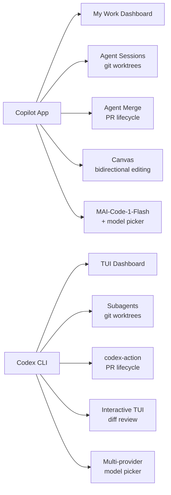
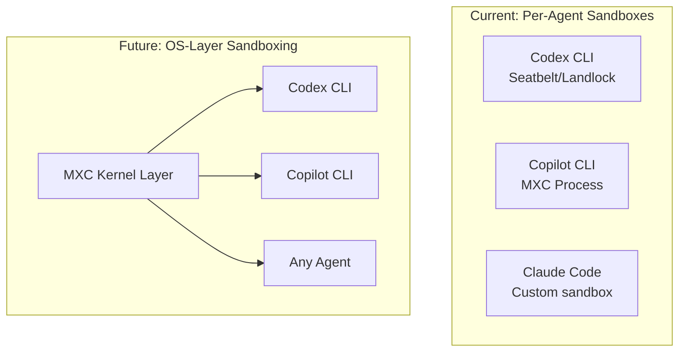

# Microsoft Build 2026 and the MAI Model Family: What MAI-Code-1-Flash, MAI-Thinking-1, and MXC Mean for Codex CLI Developers


---

On 2 June 2026 Microsoft used Build to announce something it has never shipped before: a complete family of in-house foundation models trained without OpenAI weights, data, or infrastructure.[^1] Seven models under the **MAI** brand span reasoning, coding, image generation, voice synthesis, and transcription. Two of those — **MAI-Thinking-1** and **MAI-Code-1-Flash** — land squarely in the territory that matters to Codex CLI developers: agentic code generation and multi-step reasoning over large codebases.

This article examines the two coding-relevant models, the new GitHub Copilot desktop app they power, the MXC sandbox layer that underpins agent isolation on Windows, and the practical steps a Codex CLI team should take to fold these developments into its multi-model strategy.

---

## MAI-Code-1-Flash: A 5 Billion Parameter Coding Specialist

MAI-Code-1-Flash is a sparse Mixture-of-Experts model with 137 billion total parameters but only 5 billion active per forward pass.[^2] The architecture is purpose-built for the latency-sensitive inner loop of code completion — autocomplete, inline refactoring, and short-horizon generation tasks that benefit from fast time-to-first-token.

### Key specifications

| Property | Value |
|---|---|
| Active parameters | 5 B |
| Total parameters (MoE) | 137 B |
| Context window | 256,000 tokens |
| Training period | March – May 2026 |
| Training data | Commercially licensed, no third-party distillation[^2] |

### Benchmark positioning

Microsoft reports a +16-point lead over Claude Haiku 4.5 on SWE-Bench Pro (51.2 % vs 35.2 %) and 60 % fewer tokens on complex SWE-Bench Verified tasks.[^2] Instruction following scores +28.9 points above Haiku 4.5 on IF Bench.[^3] These are self-reported figures against a deliberately chosen baseline — Haiku 4.5 is a latency-optimised model, not a frontier one — so treat them as directional rather than definitive. ⚠️

### Availability

MAI-Code-1-Flash is live today in the GitHub Copilot model picker inside VS Code, rolling out across Free, Pro, Pro+, and Max tiers.[^2] It is also accessible via OpenRouter,[^4] which means Codex CLI developers can route to it today via a custom provider block.

---

## MAI-Thinking-1: Microsoft's First Reasoning Model

MAI-Thinking-1 is a much larger beast: approximately 1 trillion total parameters with 35 billion active per token, again using a sparse MoE architecture.[^5] It targets the reasoning-heavy end of the spectrum — multi-step mathematical proofs, complex code architecture decisions, and long-horizon planning.

### Benchmark positioning

| Benchmark | MAI-Thinking-1 | Comparison |
|---|---|---|
| AIME 2025 | 97.0 % | — |
| AIME 2026 | 94.5 % | — |
| GPQA Diamond | 84.2 % | — |
| LiveCodeBench v6 | 87.7 % | — |
| SWE-Bench Verified | 73.5 % | — |
| SWE-Bench Pro | 52.8 % | Narrowly beats Claude Sonnet 4.6; trails Opus 4.6[^5] |

In a 1,276-task blind evaluation conducted by Surge, MAI-Thinking-1 narrowly beat Claude Sonnet 4.6 but trailed Claude Opus 4.6.[^5] The AIME 2025 flagship figure has not been independently confirmed. ⚠️

### Availability

MAI-Thinking-1 is in private preview via Microsoft Foundry (formerly Azure AI Foundry) and will expand to Fireworks AI, Baseten, and OpenRouter.[^5] Until OpenRouter access is live, Codex CLI developers cannot route to it without a Foundry endpoint.

---

## The Seven MAI Models at a Glance

For completeness, the full family announced at Build:[^1]

| Model | Domain | Active Params | Status |
|---|---|---|---|
| MAI-Thinking-1 | Reasoning | 35 B | Private preview (Foundry) |
| MAI-Code-1-Flash | Coding | 5 B | GA (Copilot, OpenRouter) |
| MAI-Image-2.5 | Image generation | — | Foundry |
| MAI-Image-2.5-Flash | Image generation (fast) | — | Foundry |
| MAI-Voice-2 | Text-to-speech | — | GA |
| MAI-Voice-2-Flash | Text-to-speech (fast) | — | Coming soon |
| MAI-Transcribe-1.5 | Speech-to-text (43 langs) | — | GA |

---

## Connecting MAI-Code-1-Flash to Codex CLI via OpenRouter

Since MAI-Code-1-Flash is already available on OpenRouter,[^4] you can point Codex CLI at it today. Add an OpenRouter provider block to `~/.codex/config.toml`:

```toml
model_provider = "openrouter"
model = "microsoft/mai-code-1-flash"

[model_providers.openrouter]
base_url = "https://openrouter.ai/api/v1"
wire_api = "chat"
env_key = "OPENROUTER_API_KEY"
```

Export your key:

```bash
export OPENROUTER_API_KEY  # set to your OpenRouter key
```

Then launch Codex normally:

```bash
codex "Refactor the auth middleware to use the new session store"
```

### When to use MAI-Code-1-Flash vs OpenAI models

MAI-Code-1-Flash occupies the **fast-and-cheap** tier — comparable in role to `o4-mini` or Claude Haiku 4.5. It is not a frontier reasoning model. Use it for:

- Inline refactoring and boilerplate generation
- Autocomplete-style tasks where latency matters
- Bulk file transformations where token cost is the constraint

For complex architectural decisions, multi-file planning, or agentic loops that require strong tool-calling, stick with `o3`, `o4-mini`, or `gpt-5.5` via the native OpenAI provider. MAI-Code-1-Flash's tool-calling support through OpenRouter should be verified on your specific workflow before production use. ⚠️

---

## GitHub Copilot App: The Competitive Surface

Build 2026 also launched the **GitHub Copilot app** — a standalone, agent-native desktop application available in technical preview for Windows 11, macOS, and Linux.[^6] It is built around several concepts that directly mirror Codex CLI features:



The Copilot app uses git worktrees for session isolation (Codex CLI has done this since v0.124), offers an "Agent Merge" flow for carrying PRs through review and CI (comparable to `codex-action`), and provides a Canvas surface for human-agent interaction (analogous to Codex CLI's interactive TUI with `/review` and `/diff`).[^6]

The key architectural difference: the Copilot app is a GUI-first, GitHub-coupled surface; Codex CLI remains terminal-first and provider-agnostic. Teams using both can share the same `AGENTS.md` instructions and git worktree conventions.

---

## MXC: Microsoft Execution Containers and the Sandbox Convergence

The most architecturally significant Build announcement for agent developers is **Microsoft Execution Containers (MXC)** — an OS-level, kernel-enforced sandbox for AI agents on Windows and WSL.[^7]

MXC provides a declarative policy model:

```toml
# Conceptual MXC policy (simplified)
[filesystem]
allow_read = ["/repo", "/home/user/.config"]
deny_write = ["/etc", "/usr/bin"]

[network]
allow_domains = ["api.openai.com", "github.com"]
deny_all_other = true
```

Launch partners include **OpenAI**, Nvidia, Manus, and Nous Research.[^7] GitHub Copilot CLI already uses MXC's fast process isolation mode.[^7]

### Why this matters for Codex CLI

Codex CLI already ships its own platform-native sandbox — Seatbelt on macOS, Landlock on Linux, and an alpha Windows sandbox via `codex sandbox setup --elevated`.[^8] MXC represents Microsoft's attempt to standardise agent sandboxing at the OS layer, which could eventually replace or complement Codex CLI's built-in isolation:



OpenAI's participation as a launch partner suggests Codex CLI may adopt MXC on Windows in a future release — though this is speculative. ⚠️ For now, Codex CLI's own sandbox remains the primary isolation mechanism.

---

## Strategic Implications: The Three-Stack Era

Build 2026 crystallises what has been forming throughout 2026 — the coding agent market now has three vertically integrated stacks:

1. **OpenAI**: GPT/o-series models → Codex CLI/App → OpenAI sandbox
2. **Microsoft**: MAI models → GitHub Copilot app/CLI → MXC sandbox
3. **Anthropic**: Claude models → Claude Code → Anthropic sandbox

Each stack owns models, a developer surface, and an isolation layer. Codex CLI's strategic advantage remains its **provider-agnostic architecture** — it can consume models from any of these stacks (and others via OpenRouter or LiteLLM) whilst competitors lock you into their own model ecosystem.[^9]

The practical advice for Codex CLI teams:

1. **Test MAI-Code-1-Flash on your codebase** — its MoE architecture may give better cost-per-token for simple tasks than `o4-mini`
2. **Watch MAI-Thinking-1 availability on OpenRouter** — when it lands, evaluate it as an alternative reasoning backend for complex planning tasks
3. **Keep AGENTS.md portable** — both Codex CLI and the Copilot app consume markdown instruction files, so well-structured AGENTS.md works across surfaces
4. **Monitor MXC maturity** — if Microsoft ships GA sandbox policies, Codex CLI on Windows may benefit from standardised OS-level isolation

---

## Citations

[^1]: Microsoft, "Building a hill-climbing machine: Launching seven new MAI models", *Microsoft AI Blog*, 2 June 2026. [https://microsoft.ai/news/building-a-hillclimbing-machine-launching-seven-new-mai-models/](https://microsoft.ai/news/building-a-hillclimbing-machine-launching-seven-new-mai-models/)

[^2]: Microsoft, "Introducing MAI-Code-1-Flash", *Microsoft AI*, 2 June 2026. [https://microsoft.ai/news/introducingmai-code-1-flash/](https://microsoft.ai/news/introducingmai-code-1-flash/)

[^3]: ChatForest, "MAI-Code-1-Flash: Microsoft's Copilot-Native Coding Model Has Different Benchmarks Than You'd Expect", 2 June 2026. [https://chatforest.com/builders-log/microsoft-mai-code-1-flash-github-copilot-coding-model-build-2026/](https://chatforest.com/builders-log/microsoft-mai-code-1-flash-github-copilot-coding-model-build-2026/)

[^4]: OpenRouter, "Integration with Codex CLI", *OpenRouter Documentation*, accessed 6 June 2026. [https://openrouter.ai/docs/guides/coding-agents/codex-cli](https://openrouter.ai/docs/guides/coding-agents/codex-cli)

[^5]: Microsoft, "Introducing MAI-Thinking-1", *Microsoft AI*, 2 June 2026. [https://microsoft.ai/news/introducing-mai-thinking-1/](https://microsoft.ai/news/introducing-mai-thinking-1/)

[^6]: GitHub, "GitHub Copilot app: The agent-native desktop experience", *The GitHub Blog*, 2 June 2026. [https://github.blog/news-insights/product-news/github-copilot-app-the-agent-native-desktop-experience/](https://github.blog/news-insights/product-news/github-copilot-app-the-agent-native-desktop-experience/)

[^7]: VentureBeat, "Microsoft launches MXC, an OS-level sandbox for AI agents, with OpenAI and Nvidia already on board", 2 June 2026. [https://venturebeat.com/security/microsoft-launches-mxc-an-os-level-sandbox-for-ai-agents-with-openai-and-nvidia-already-on-board](https://venturebeat.com/security/microsoft-launches-mxc-an-os-level-sandbox-for-ai-agents-with-openai-and-nvidia-already-on-board)

[^8]: OpenAI, "Codex CLI Changelog — v0.136.0", *OpenAI Developers*, 1 June 2026. [https://developers.openai.com/codex/changelog](https://developers.openai.com/codex/changelog)

[^9]: OpenAI, "Advanced Configuration — Codex CLI", *OpenAI Developers*, accessed 6 June 2026. [https://developers.openai.com/codex/config-advanced](https://developers.openai.com/codex/config-advanced)
