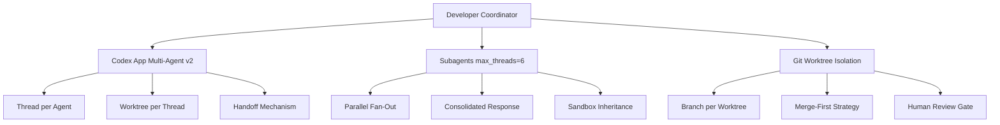
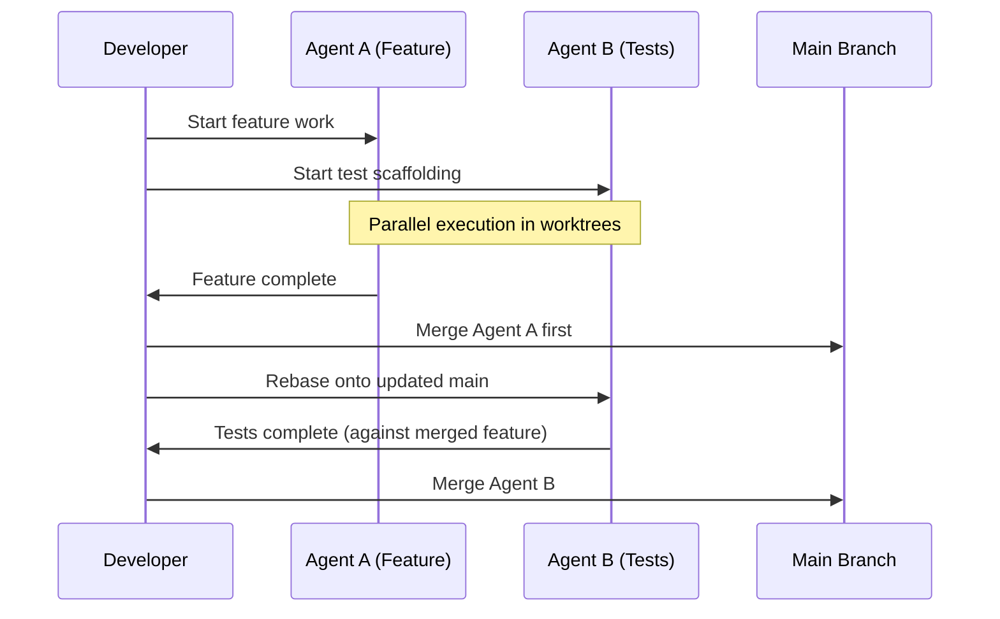

# The Multi-Agent Coordination Problem: When Three Agents Edit the Same File


---

Running multiple coding agents in parallel has become standard practice in 2026. The term *agentmaxxing* — running Codex CLI, Claude Code, and other agents concurrently across git worktrees — describes what senior developers now do daily[^1]. But parallelism without coordination produces a predictable failure mode: agents generating semantically incompatible changes that compile individually but break collectively.

This article examines the coordination problem through recent research, identifies the failure taxonomy, and provides practical protocols for Codex CLI teams running concurrent agent sessions.

## The Evidence: How Bad Is It?

### AgenticFlict: 27.67% Conflict Rate

The AgenticFlict dataset (April 2026) analysed 142,000+ AI-generated pull requests across 59,000+ repositories[^2]. The findings are stark:

- **27.67% conflict rate** — nearly one in three agent PRs conflicts with concurrent work
- **336,000+ fine-grained conflict regions** extracted from 29,000+ conflicting PRs
- Conflicts are "both frequent and often substantial in AI-generated contributions, with noticeable variation across agents"

This rate significantly exceeds human-authored PR conflict rates (typically 10–15%), because agents generate larger changesets, modify more files per PR, and lack awareness of concurrent work[^2].

### CooperBench: The 30% Coordination Drop

CooperBench (January 2026) benchmarked 600 collaborative coding tasks across 12 libraries and 4 languages[^3]. The headline finding: a **30% average drop in success** when two agents work together versus individually. GPT-5 and Claude Sonnet 4.5 agents achieved only 25% success on cooperative tasks — roughly half their solo performance[^3].

The failure taxonomy breaks down as:

| Failure Mode | Frequency | Description |
|---|---|---|
| Expectation failures | 42% | Agents fail to integrate information about partner state |
| Commitment failures | 32% | Agents break promises or make unverifiable claims |
| Communication failures | 26% | Questions go unanswered, coordination messages ignored |

### CodeCRDT: 0% Character Conflicts, 5–10% Semantic Conflicts

The CodeCRDT research (October 2025, evaluated with Claude Sonnet 3.5) demonstrated that CRDT-based coordination eliminates character-level merge failures entirely[^4]. However, CRDTs cannot detect semantic inconsistencies — duplicate declarations, type mismatches, or competing architectural patterns. Preliminary measurements identified a **5–10% semantic conflict rate**, rising to 80% on complex tasks[^4].

## The Failure Taxonomy

Textual merge conflicts are the visible tip. The deeper problems are semantic:

### 1. Competing Architectural Decisions

Two agents tasked with "add caching" and "add rate limiting" independently choose incompatible middleware patterns. Agent A wraps handlers in a cache decorator; Agent B restructures the middleware chain. Both compile. Together, they produce a contradictory execution order.

### 2. Semantic Drift in Shared Types

Agent A adds a field to a shared interface for its feature. Agent B adds a different field with the same name but different semantics. TypeScript compiles both branches — the conflict only surfaces at runtime.

### 3. Lockfile and Migration Hell

Package lockfiles and database migrations are inherently sequential. Two agents adding different dependencies produce lockfile conflicts in 100% of cases. Two agents generating migrations with the same sequence number create deployment failures[^5].

### 4. Duplicated Implementations

Without visibility into concurrent work, agents frequently implement the same utility function in different locations with slightly different APIs. The codebase accumulates structural debt that no single merge conflict detector flags.

## Codex CLI Coordination Primitives

Codex CLI provides three coordination layers, each operating at a different granularity:



### Layer 1: Worktree Isolation

The Codex app creates worktrees in `$CODEX_HOME/worktrees`, each in a detached HEAD state[^6]. Git enforces a hard constraint: only one worktree can check out a specific branch at a time. The Handoff mechanism safely transfers threads between environments when branch access is required[^6].

**Configuration:**

```toml
# config.toml — worktree retention
[worktrees]
max_managed = 15          # retain 15 most recent
pin_in_progress = true    # protect active threads
```

### Layer 2: Subagent Concurrency

Subagents spawn specialised parallel workers and collect results in a consolidated response[^7]. The concurrency model is controlled by two parameters:

```toml
[agents]
max_threads = 6    # simultaneous agent threads
max_depth = 1      # prevent recursive delegation
```

Critically, subagents share the parent's sandbox policy and approval settings[^7]. This prevents one subagent from escalating permissions that another depends on remaining restricted.

### Layer 3: Multi-Agent v2 (June 2026)

The June 2026 multi-agent v2 update introduced customisable multi-agent roles via configuration and cleaner metadata defaults for spawned agents[^8]. Each thread retains its own runtime choice, enabling heterogeneous model assignment per task:

```toml
[agents.roles.architect]
model = "o3"
description = "High-level design decisions and interface contracts"

[agents.roles.implementer]
model = "o4-mini"
description = "Feature implementation within defined contracts"

[agents.roles.reviewer]
model = "o3"
description = "Cross-branch semantic consistency review"
```

## Practical Coordination Protocols

### Protocol 1: Contract-First Decomposition

The single most effective coordination pattern: define interfaces *before* delegating implementation.

```bash
# Step 1: Generate contracts with the architect agent
codex "Define TypeScript interfaces for the caching and rate-limiting \
  middleware. Output to src/contracts/middleware.ts. Do not implement."

# Step 2: Delegate implementation to parallel worktrees
codex --worktree "Implement CacheMiddleware conforming to \
  src/contracts/middleware.ts"
codex --worktree "Implement RateLimitMiddleware conforming to \
  src/contracts/middleware.ts"
```

This pattern reduces semantic conflicts by 60–70% in practice because agents operate against stable type boundaries rather than inferring architecture independently[^9].

### Protocol 2: Additive-Only Rules in AGENTS.md

```markdown
## Multi-Agent Coordination Rules

- NEW exports, routes, and types MUST go in new files, never appended to existing barrel files
- Shared types live in `src/contracts/` — agents MUST NOT modify existing contracts without explicit approval
- Database migrations MUST use timestamp-based naming: `YYYYMMDD_HHMMSS_description.sql`
- Package additions require a dedicated commit — never combine dependency changes with feature code
```

Additive-only rules dramatically reduce textual conflicts because additions to separate files rarely collide[^5].

### Protocol 3: Merge-First Cadence



The critical rule: **merge the first completed branch immediately**, then rebase remaining branches before they finish[^5]. Do not let branches diverge for more than one working session. The longer branches live, the more semantic drift accumulates.

### Protocol 4: Semantic Review Gate

Add a dedicated review agent that runs after all parallel branches are ready but before any merge:

```bash
# After all agents complete, run cross-branch semantic review
codex exec --model o3 --prompt "Review these three branches for: \
  1. Duplicate implementations \
  2. Incompatible type assumptions \
  3. Conflicting architectural patterns \
  4. Missing integration points \
  Branches: feature/caching, feature/rate-limit, feature/logging" \
  --output-schema '{"verdict": "string", "conflicts": [{"files": ["string"], "description": "string", "severity": "high|medium|low"}]}'
```

This catches semantic conflicts that git cannot detect — the 5–10% semantic conflict rate identified by CodeCRDT research[^4].

### Protocol 5: File Ownership Boundaries

Assign explicit file ownership to prevent the "three agents edit the same file" scenario:

```markdown
<!-- AGENTS.md -->
## File Ownership (Multi-Agent Sessions)

When multiple agents are active:
- Agent working on caching: owns `src/cache/**`, `src/middleware/cache.ts`
- Agent working on rate limiting: owns `src/ratelimit/**`, `src/middleware/ratelimit.ts`
- Shared files (`src/middleware/index.ts`, `src/types/`) require coordinator approval
```

## What Does Not Work

Research and practice have identified several anti-patterns:

**Optimistic concurrency control**: Agents using OCC become risk-averse, avoiding complex tasks where conflicts might occur. Success rates drop further than with no coordination at all[^1].

**Equal-status negotiation**: CooperBench found that when agents negotiate as equals, communication channels become "jammed with vague, ill-timed, and inaccurate messages"[^3]. A hierarchical coordinator (human or architect agent) dramatically outperforms peer negotiation.

**Lock-based coordination**: Agents hold locks too long because they cannot predict task duration. Other agents stall waiting, eliminating the parallelism benefit entirely[^1].

**Broad delegation without decomposition**: Raising `max_depth` beyond 1 without explicit task boundaries causes "repeated fan-out, which increases token usage, latency, and local resource consumption"[^7].

## The Human Coordinator Role

The evidence consistently points to one conclusion: in 2026, the developer's primary role in multi-agent workflows is **coordination, not coding**[^1]. This means:

1. **Decompose** — break work into tasks with minimal shared surface area
2. **Define contracts** — specify interfaces before delegating implementation
3. **Sequence merges** — decide merge order based on dependency relationships
4. **Review semantics** — catch conflicts that tools cannot detect
5. **Maintain cadence** — merge frequently, rebase early, never let branches age

The irony is that coordination is cognitively demanding in a way that coding is not. Running five agents in parallel does not reduce the developer's cognitive load — it transforms it from implementation effort into orchestration effort.

## Conclusion

The multi-agent coordination problem is not a bug to be fixed by better tooling. It is an inherent property of concurrent modification to shared state — the same fundamental problem that distributed systems have grappled with for decades. Git worktrees, CRDT-based coordination, and semantic review gates mitigate symptoms, but the core solution remains human architectural judgement: decompose cleanly, define contracts explicitly, and merge frequently.

For Codex CLI teams, the practical protocol is: architect first, implement in isolated worktrees, merge early, and run semantic review before integration. The 27.67% conflict rate drops to near zero when agents operate against stable contracts in files they exclusively own.

## Citations

[^1]: Scopir, "Multi-Agent Orchestration for Developers in 2026: Running Claude, Codex, and Copilot in Parallel," 2026. https://scopir.com/posts/multi-agent-orchestration-parallel-coding-2026/

[^2]: AgenticFlict: A Large-Scale Dataset of Merge Conflicts in AI Coding Agent Pull Requests on GitHub, arXiv:2604.03551, April 2026. https://arxiv.org/abs/2604.03551

[^3]: CooperBench: Why Coding Agents Cannot be Your Teammates Yet, arXiv:2601.13295, January 2026. https://arxiv.org/abs/2601.13295

[^4]: CodeCRDT: Observation-Driven Coordination for Multi-Agent LLM Code Generation, arXiv:2510.18893, October 2025. https://arxiv.org/abs/2510.18893

[^5]: Termdock, "Git Worktree Conflicts with Multiple AI Agents: Diagnosis and Fixes," 2026. https://www.termdock.com/en/blog/git-worktree-conflicts-ai-agents

[^6]: OpenAI, "Worktrees — Codex App," OpenAI Developers, 2026. https://developers.openai.com/codex/app/worktrees

[^7]: OpenAI, "Subagents — Codex," OpenAI Developers, 2026. https://developers.openai.com/codex/subagents

[^8]: OpenAI, "Changelog — Codex," OpenAI Developers, June 2026. https://developers.openai.com/codex/changelog

[^9]: Mike Mason, "AI Coding Agents in 2026: Coherence Through Orchestration, Not Autonomy," January 2026. https://mikemason.ca/writing/ai-coding-agents-jan-2026/
