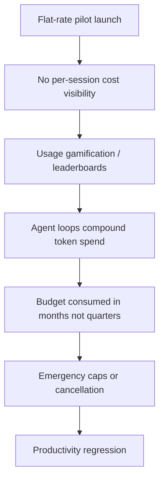
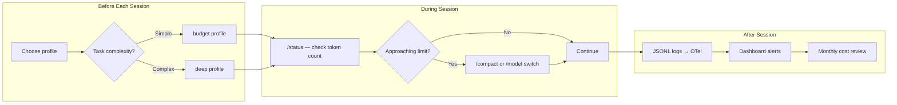

# The Token Cost Crisis: What Microsoft and Uber's Claude Code Budget Blowouts Teach Every Codex CLI Team About Cost Defence


---

In the space of a fortnight, two of the world's largest engineering organisations publicly admitted that AI coding agent costs had spiralled beyond control. Microsoft's Experiences & Devices division cancelled its Claude Code licences after burning through an entire annual AI budget in months [^1]. Uber's COO told Fortune the company had exhausted its 2026 AI coding budget in four months, triggering a hard \$1,500 monthly cap per engineer [^2]. Together, these disclosures mark the first enterprise-scale token cost crisis — and they carry urgent lessons for every team running Codex CLI.

This article dissects what went wrong, maps the structural differences between Claude Code's billing model and Codex CLI's credit system, and provides concrete configuration patterns to prevent the same fate.

## What Happened at Microsoft

Microsoft launched a Claude Code pilot inside its Experiences & Devices division in December 2025, the organisation responsible for Windows, Surface, and Microsoft 365 apps [^1]. The goal was straightforward: benchmark Claude Code against GitHub Copilot CLI on production engineering work.

The division's annual AI tooling budget was effectively spent by spring — token-based billing consumed the budget far ahead of schedule [^1]. On 2 June 2026, Microsoft confirmed it would discontinue internal Claude Code licences by 30 June, migrating developers back to GitHub Copilot CLI [^1].

The root cause was not reckless engineers. It was a structural mismatch: flat seat licensing obscured true token consumption, meaning nobody had visibility into per-session costs until the aggregate bill arrived [^4]. The scale at which employees adopted Claude Code — reportedly preferring it to Microsoft's own Copilot — made the cost unsustainable [^3].

## What Happened at Uber

Uber's story followed a similar arc but with an additional accelerant. The company deployed Claude Code to approximately 5,000 engineers, with monthly usage rates reaching 84–95% by April 2026 [^5]. Management actively incentivised adoption through an internal leaderboard ranking teams by total AI tool usage [^2][^5]. Per-engineer API costs ranged between \$500 and \$2,000 per month [^5]. A single CTO demonstration consumed \$1,200 in tokens during a two-hour session — a moment Uber's COO Andrew Macdonald described as a "head-exploding moment" [^5].

By April 2026 the company had burned through its entire 2026 AI coding budget. Macdonald's public admission was striking: "That link is not there yet" — referring to the connection between rising Claude Code usage and measurable product innovation [^2]. Uber's response was a hard \$1,500 monthly cap on AI coding tool spend per engineer [^5].

## Why This Keeps Happening

The pattern is consistent across both cases:



Three structural factors drive token cost blowouts:

1. **Opaque billing.** Seat-based licensing hides the per-token reality. A developer running a complex refactor has no idea whether they have just spent \$2 or \$200.

2. **Agent loop amplification.** Unlike autocomplete, an agentic coding tool can recursively call the model hundreds of times per task — spawning subagents, running tests, retrying failures. Each loop multiplies cost exponentially.

3. **Missing budget guardrails.** Neither Microsoft nor Uber had per-engineer or per-session spending limits in place until after the damage was done.

## Anthropic's June 15 Billing Split

Anthropic's response to the crisis arrived on 13 May 2026: effective 15 June, all programmatic Claude usage — the Agent SDK, `claude -p` headless mode, Claude Code GitHub Actions, and third-party agent integrations — moves off the shared subscription pool onto a separate monthly credit billed at full API rates [^6]:

| Plan | Monthly Agent Credit |
|------|---------------------|
| Pro (\$20/mo) | \$20 |
| Max 5x (\$100/mo) | \$100 |
| Max 20x (\$200/mo) | \$200 |

No rollover. Once the credit is exhausted, requests are rejected unless the user explicitly enables overflow billing at API rates [^6]. Interactive terminal use (typing at the Claude Code prompt) remains on the subscription pool, but any automated or headless use hits the new cap.

This split acknowledges a fundamental truth: a human sends dozens of prompts per day; an autonomous agent can generate thousands [^6].

## How Codex CLI's Billing Model Differs

Codex CLI adopted token-based billing in April 2026 [^7], which — counterintuitively — provides better cost transparency than Claude Code's original flat-rate model. Every session's token consumption is visible, and the credit system makes the cost of each model explicit:

| Model | Input (credits/1M tokens) | Cached Input | Output |
|-------|--------------------------|--------------|--------|
| GPT-5.5 | 125 | 12.50 | 750 |
| GPT-5.4 | 62.50 | 6.25 | 375 |
| GPT-5.4-mini | 18.75 | 1.875 | 113 |
| GPT-5.3-Codex | 43.75 | 4.375 | 350 |

Source: OpenAI Codex rate card [^7]

Two structural advantages stand out:

1. **Cached input tokens cost ~90% less.** Codex CLI's prompt caching means repeated context (AGENTS.md, file contents already in the conversation) is billed at roughly one-tenth the standard input rate [^8]. This is the single most impactful cost lever in agentic workflows.

2. **Per-session visibility.** The `/status` command and session JSONL logs record running token totals per turn, tagged with the active model [^9]. There is no mystery bill at month-end.

However, Codex CLI is not immune to the same blowout dynamics. Without deliberate configuration, an uncapped `codex exec` pipeline or a long interactive session with GPT-5.5 can consume credits rapidly.

## Seven Cost Defence Patterns for Codex CLI

### 1. Route by Task Complexity

The simplest cost reduction: use cheaper models for routine work.

```toml
# ~/.codex/config.toml — default to the cost-efficient model
model = "gpt-5.4-mini"
```

Reserve GPT-5.5 or GPT-5.3-Codex for complex debugging, large refactors, or multi-file reasoning. Switch mid-session with `/model gpt-5.5` when you need the heavier model, then switch back.

### 2. Tune Reasoning Effort

Every model supports reasoning effort levels. Dropping from `high` to `medium` for routine tasks can reduce output token counts significantly [^10].

```toml
# Default to medium reasoning; override per-session with -c
model_reasoning_effort = "medium"
```

For `codex exec` pipelines processing repetitive tasks:

```bash
codex exec -c model_reasoning_effort='"low"' "add copyright headers to all .go files"
```

### 3. Set Compaction Thresholds

Codex CLI's `/compact` command and `model_auto_compact_token_limit` setting force context summarisation before the window fills. Compacted context re-enters as cached tokens at the 90% discount [^8].

```toml
# Compact earlier than default to keep costs down
model_auto_compact_token_limit = 60000
```

### 4. Enforce Budget Caps in Automation

For `codex exec` pipelines, constrain maximum turns and token budgets:

```bash
codex exec \
  --sandbox workspace-write \
  -c model='"gpt-5.4-mini"' \
  -c model_reasoning_effort='"low"' \
  "run linting fixes on changed files"
```

In enterprise environments, the v0.137 cloud-managed configuration bundles support monthly credit limits per user, enforced server-side [^11].

### 5. Maximise Cache Hits

Structure your workflow to exploit prompt caching. Two practices help:

- **Keep AGENTS.md stable.** Frequently changing project instructions invalidate the cache prefix. Treat AGENTS.md as a versioned artefact, not a scratch pad.
- **Resume rather than restart.** `codex resume --last` carries forward the cached context. Starting a fresh session on the same codebase means re-sending all file context at full input rates.

### 6. Use Profiles for Cost Tiers

Named profiles let you switch between cost-optimised and quality-optimised configurations:

```toml
# ~/.codex/budget.config.toml
model = "gpt-5.4-mini"
model_reasoning_effort = "low"
model_reasoning_summary = "concise"
```

```toml
# ~/.codex/deep.config.toml
model = "gpt-5.5"
model_reasoning_effort = "high"
model_reasoning_summary = "detailed"
```

```bash
# Quick fix — budget profile
codex --profile budget

# Complex debugging — deep profile
codex --profile deep
```

### 7. Monitor with OpenTelemetry

Export session telemetry to your observability stack to track token consumption trends before they become budget crises:

```toml
[otel]
exporter = "otlp-http"
otlp_endpoint = "https://otel.internal.example.com"
environment = "production"
```

This gives finance and engineering leadership the per-engineer, per-project cost visibility that Microsoft and Uber lacked [^12].

## The Cost Visibility Flowchart



## The Lesson

The Microsoft and Uber stories are not cautionary tales about AI coding agents being too expensive. They are cautionary tales about deploying agents without cost instrumentation. The agents worked — engineers used them heavily because they genuinely accelerated work. The failure was organisational: no per-session visibility, no budget guardrails, and incentive structures (leaderboards) that rewarded consumption over efficiency.

Codex CLI's token-based billing, cached input discounts, configurable reasoning effort, and OpenTelemetry export provide the cost defence infrastructure that both organisations lacked. But infrastructure only works if you configure it. The seven patterns above are the minimum viable cost defence for any team running Codex CLI in production.

The \$1,500 monthly cap Uber eventually imposed [^5] is a blunt instrument. A better approach is to build cost awareness into the workflow itself — choosing the right model per task, tuning reasoning effort, maximising cache hits, and monitoring trends before they become crises.

---

## Citations

[^1]: [Microsoft Drops Claude Code Over Runaway AI Token Costs](https://dapta.ai/blog-posts/ai-news-microsoft-claude-code/) — Dapta, June 2026
[^2]: [Uber burned through its entire 2026 AI budget in four months](https://fortune.com/2026/05/26/uber-coo-ai-spending-tokens-claude-code/) — Fortune, 26 May 2026
[^3]: [Microsoft reports are exposing AI's real cost problem](https://fortune.com/2026/05/22/microsoft-ai-cost-problem-tokens-agents/) — Fortune, 22 May 2026
[^4]: [Microsoft's quiet Claude Code retreat and the real cost of enterprise AI](https://thenextweb.com/news/microsoft-claude-code-retreat-ai-cost) — The Next Web, June 2026
[^5]: [Uber Introduces \$1,500 Monthly Cap On AI Coding Tools After Budget Blowout](https://www.zerohedge.com/ai/uber-introduces-1500-monthly-cap-ai-coding-tools-after-budget-blowout) — ZeroHedge, June 2026
[^6]: [Anthropic Ends Subscription Subsidy for Agents June 15](https://www.techtimes.com/articles/317625/20260602/anthropic-ends-subscription-subsidy-agents-june-15-credit-pool-replaces-flat-rate-access.htm) — TechTimes, 2 June 2026
[^7]: [Codex Pricing — Credit Rates](https://developers.openai.com/codex/pricing) — OpenAI Developer Documentation, accessed 6 June 2026
[^8]: [Codex CLI Performance Optimisation: Token Overhead, Hidden Costs and Tuning Tactics](https://codex.danielvaughan.com/2026/04/08/codex-cli-performance-optimization/) — Codex Knowledge Base, April 2026
[^9]: [Codex CLI Session Forensics: JSONL Post-Mortems](https://codex.danielvaughan.com/2026/06/05/codex-cli-session-forensics-jsonl-post-mortems-codex-trace-cass-ccusage/) — Codex Knowledge Base, 5 June 2026
[^10]: [Codex CLI Configuration Reference](https://developers.openai.com/codex/config-reference) — OpenAI Developer Documentation, accessed 6 June 2026
[^11]: [Codex CLI v0.137 Stable Release: Cloud Config Bundles and Multi-Agent Runtime](https://codex.danielvaughan.com/2026/06/04/codex-cli-v0137-stable-release-cloud-config-bundles-multi-agent-runtime-plugin-json/) — Codex Knowledge Base, 4 June 2026
[^12]: [Codex CLI Agent Observability: OpenTelemetry, Cost Attribution, and SLA Monitoring](https://codex.danielvaughan.com/2026/05/25/codex-cli-agent-observability-opentelemetry-cost-attribution-alerting-sla-monitoring/) — Codex Knowledge Base, 25 May 2026
