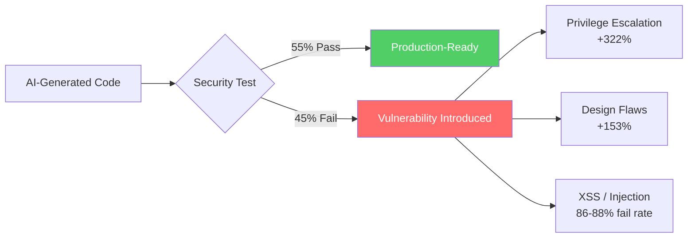

# The Vibe Coding Security Debt Crisis: What the CSA Research, Georgia Tech's CVE Tracker, and the 10x Vulnerability Rate Mean for Codex CLI Teams


---

The numbers are no longer anecdotal. In April 2026, the Cloud Security Alliance published a research note documenting that AI-assisted developers in Fortune 50 enterprises introduce security findings at **ten times the rate** of their peers[^1]. Georgia Tech's Vibe Security Radar has confirmed 74 CVEs directly attributable to AI coding tools, with the trend accelerating — 6 in January, 15 in February, 35 in March[^2]. Veracode tested over 150 large language models across 80 security-sensitive coding tasks and found that 45% of AI-generated code samples fail security tests[^3]. The gap between "code that compiles" and "code that is secure" is not closing; it is widening.

This article examines the research, maps the attack surface, and shows how Codex CLI teams can configure their way out of the worst outcomes.

## The Evidence: Three Independent Data Sources

### CSA Research Note — The 10x Finding

The CSA's headline statistic comes from instrumented Fortune 50 development environments. AI-assisted developers produce commits at 3–4x the rate of peers but introduce security findings at 10x the rate[^1]. Monthly security findings surged from roughly 1,000 to over 10,000 within six months. Architectural flaws — not just surface-level bugs — increased: privilege escalation paths rose 322%, design flaws 153%[^1].

The critical insight: this is not a story about sloppy prompts. The AI generates syntactically correct, functionally working code that passes compilation, linting, and often unit tests. What it misses is the security context — input validation, authentication boundaries, authorisation checks, cryptographic hygiene.

### Georgia Tech's Vibe Security Radar — 74 Confirmed CVEs

The Systems Software & Security Lab at Georgia Tech launched the Vibe Security Radar in May 2025 to trace real-world CVEs back to AI-generated commits[^2]. Their methodology monitors CVE.org, the National Vulnerability Database, the GitHub Advisory Database, Open Source Vulnerabilities, and RustSec. When a vulnerability is fixed, researchers trace the fix back through commit history to identify the introducing commit.

Across 74 confirmed cases, **Claude Code was responsible for 27**, GitHub Copilot for 4, Devin for 2, and Cursor and Aether for 1 each[^2]. Researcher Hanqing Zhao estimates the actual count is 5–10x higher because many AI-assisted commits lack the metadata signatures needed for attribution[^2].

### Veracode — 45% Failure Across 150+ Models

Veracode's cross-model study is the most systematic attempt to benchmark AI code security. Java had the worst performance at over 70% failure rate. Cross-site scripting defences failed in 86% of relevant samples; 88% were vulnerable to log injection[^3]. Critically, newer models (GPT-5.1, GPT-5.2) remain within the margin of error of GPT-4.1 on security performance despite dramatic improvements in reasoning capability[^3]. Security pass rates have stayed flat at roughly 55% across testing cycles.



## The Attack Surface: What Goes Wrong

### The Perception Gap

Eighty percent of developers surveyed believe AI generates more secure code than humans write[^1]. Stanford research found developers using Copilot were more likely to submit insecure code **with greater confidence**[^1]. This gap between perception and reality is the most dangerous finding in the entire body of research. It means developers are less likely to review AI-generated code critically — precisely when they should be reviewing it more.

### Slopsquatting — Hallucinated Package Attacks

Approximately 20% of AI-generated code samples reference non-existent packages[^1]. Forty-three percent of hallucinated package names are consistently reproduced across prompts and models, making them predictable targets[^1]. Attackers register these phantom names on npm, PyPI, or crates.io and inject malicious post-install scripts.

The `unused-imports` npm package is the canonical example: AI models hallucinate this name instead of the legitimate `eslint-plugin-unused-imports`, and as of February 2026 the malicious package was still recording approximately 233 weekly downloads[^4]. In January 2026, a hallucinated npm package called `react-codeshift` spread through 237 repositories via AI-generated agent skill files with nobody deliberately planting it[^4].

### Credential Sprawl

Escape.tech scanned 5,600 publicly available vibe-coded applications and found over 2,000 high-impact vulnerabilities, 400+ exposed secrets including API keys and access tokens, and 175 instances of personal data exposure containing medical records and bank account numbers[^5]. Every vulnerability was in a live production system, discoverable within hours.

AI-assisted developers exposed credentials nearly 2x more frequently than non-AI-assisted developers[^1].

## How Codex CLI's Architecture Defends

Codex CLI's security model was designed with a defence-in-depth philosophy that directly addresses several classes of vulnerability documented in this research. The architecture operates on two independent layers: a sandbox controlling what the agent can technically do, and an approval policy controlling when it must ask permission[^6].

### Layer 1 — OS-Level Sandbox

By default, Codex CLI runs with **network access turned off** and filesystem writes restricted to the workspace directory[^6]. The sandbox implementation is platform-specific:

- **macOS**: Seatbelt policies via `sandbox-exec`
- **Linux**: Bubblewrap (`bwrap`) plus `seccomp`
- **Windows**: WSL2 or native Windows sandbox

This means that even if AI-generated code attempts credential exfiltration, DNS rebinding, or supply-chain callouts, the sandbox blocks the network path. This is a structural advantage over tools that run with full network access by default.

```toml
# .codex/config.toml — recommended security baseline
[sandbox]
mode = "workspace-write"  # default, restricts writes to project

[features.network_proxy]
enabled = true
domains = { "registry.npmjs.org" = "allow", "pypi.org" = "allow" }
# All other domains denied by default
```

### Layer 2 — Approval Policy

The `on-request` approval mode (default) requires human confirmation before the agent can edit files outside the workspace, run network-accessing commands, or execute destructive operations[^6]. For CI/CD pipelines where human approval is impractical, the `auto_review` guardian subagent can evaluate requests for data exfiltration, credential probing, persistent security weakening, and destructive actions[^6].

### Layer 3 — Hooks for Security Gates

Codex CLI's hook system enables pre-execution security scanning. A `PreToolUse` hook fires before the agent executes any shell command, allowing teams to inject SAST scanning, secret detection, or dependency validation[^7]:

```toml
# .codex/config.toml — PreToolUse hook for secret detection
[[hooks]]
event = "PreToolUse"
command = "bash .codex/hooks/secret-scan.sh"
timeout_ms = 10000
```

```bash
#!/bin/bash
# .codex/hooks/secret-scan.sh
# Scan staged changes for hardcoded secrets
if git diff --cached | grep -iE '(api[_-]?key|secret|password|token)\s*[:=]' ; then
    echo "BLOCKED: Potential secret detected in staged changes"
    exit 1
fi
exit 0
```

### Layer 4 — Permission Profiles

Named permission profiles (available since v0.129) make security configurations reusable and enforceable across teams[^8]. A `security-review` profile can mandate read-only sandbox mode with no network access for code review tasks, while a `build` profile allows workspace writes with network access restricted to package registries.

```toml
[profile.security-review]
sandbox = "read-only"
approval_policy = "on-request"

[profile.build]
sandbox = "workspace-write"
approval_policy = "on-request"

[profile.build.features.network_proxy]
enabled = true
domains = { "registry.npmjs.org" = "allow" }
```

## Mapping SHIELD to Codex CLI

Unit 42's SHIELD framework provides a governance structure for secure AI-assisted development[^9]. Here is how each component maps to Codex CLI capabilities:

| SHIELD Principle | Codex CLI Implementation |
|---|---|
| **S**eparation of Duties | Sandbox modes isolate agent from production systems; `read-only` mode for review |
| **H**uman in the Loop | `on-request` approval policy; `/review` slash command for pre-push review |
| **I**nput/Output Validation | `PreToolUse` hooks for SAST scanning; `--output-schema` for structured output validation |
| **E**nforce Security Helpers | `auto_review` guardian subagent; Snyk MCP server for dependency scanning |
| **L**east Agency | Workspace-write sandbox; network disabled by default; domain allowlists |
| **D**efensive Controls | `.codexignore` for sensitive file exclusion; `env_allowlist` for environment variable control |

## A Practical Defence Configuration

The following configuration addresses the top vulnerability classes identified in the CSA research:

```toml
# .codex/config.toml — hardened security baseline

[sandbox]
mode = "workspace-write"

[approval]
policy = "on-request"

# Block credential exfiltration
[features.network_proxy]
enabled = true
domains = { "registry.npmjs.org" = "allow", "pypi.org" = "allow" }

# Restrict environment variable exposure
[features]
env_allowlist = ["PATH", "HOME", "NODE_ENV", "LANG"]

# Security scanning hooks
[[hooks]]
event = "PreToolUse"
command = "bash .codex/hooks/sast-gate.sh"
timeout_ms = 15000

[[hooks]]
event = "PostToolUse"
command = "bash .codex/hooks/dependency-audit.sh"
timeout_ms = 30000
```

Pair this with an AGENTS.md addendum that explicitly instructs the model on security expectations:

```markdown
## Security Requirements

- Never hardcode secrets, API keys, or credentials
- Always use parameterised queries for database access
- Validate and sanitise all user input at trust boundaries
- Use established cryptographic libraries; never implement custom crypto
- Run `npm audit` or equivalent before committing dependency changes
- Flag any code that handles authentication or authorisation for human review
```

## The Slopsquatting Defence

For slopsquatting specifically, Codex CLI teams should:

1. **Restrict network access** to known-good registries via domain allowlists
2. **Run dependency audits** as a `PostToolUse` hook after any `npm install` or `pip install`
3. **Use lockfiles** (`package-lock.json`, `poetry.lock`) and review diffs for unexpected new packages
4. **Configure Snyk MCP** or equivalent to scan dependencies before they reach the lockfile

```bash
#!/bin/bash
# .codex/hooks/dependency-audit.sh
# Post-execution dependency audit
if [ -f package.json ]; then
    npx audit-ci --moderate 2>&1
    if [ $? -ne 0 ]; then
        echo "WARNING: npm audit found vulnerabilities"
        exit 1
    fi
fi
exit 0
```

## What the Research Misses

The CSA and Veracode studies share a methodological limitation: they test AI code generation in isolation, without the layered guardrails that tools like Codex CLI provide. A 45% security failure rate for raw model output is alarming, but it is not the failure rate for code that passes through a sandbox, approval policy, SAST hook, and human review. The actual production risk depends entirely on the governance layer surrounding the model.

⚠️ No published study has yet measured the residual vulnerability rate for AI-generated code that passes through a fully configured Codex CLI pipeline with hooks, approval modes, and sandbox restrictions. This is a critical gap in the research.

## Recommendations

1. **Treat AI-generated code as untrusted input.** The 80% developer confidence figure is the most dangerous finding. Configure approval modes to enforce review.
2. **Run SAST on every agent-generated commit.** The `PreToolUse` hook is the right integration point.
3. **Restrict network access by default.** Most AI-generated vulnerabilities escalate through network exfiltration.
4. **Audit dependencies after every install.** Slopsquatting is a structural problem that lockfiles and audit tools can catch.
5. **Never allow AI to write authentication, authorisation, or cryptographic code without human review.** The CSA explicitly recommends prohibiting AI assistance for these categories without mandatory review[^1].
6. **Measure your own security posture.** Run the Veracode benchmark against your model and prompt configuration to establish a baseline.

## Citations

[^1]: Cloud Security Alliance, "Vibe Coding's Security Debt: The AI-Generated CVE Surge," CSA Research Note, April 4, 2026. [https://labs.cloudsecurityalliance.org/research/csa-research-note-ai-generated-code-vulnerability-surge-2026/](https://labs.cloudsecurityalliance.org/research/csa-research-note-ai-generated-code-vulnerability-surge-2026/)

[^2]: Georgia Tech Systems Software & Security Lab, "Vibe Security Radar," live CVE tracker, updated continuously. [https://vibe-radar-ten.vercel.app/](https://vibe-radar-ten.vercel.app/) — see also Georgia Tech Research News, "Bad Vibes: AI-Generated Code is Vulnerable, Researchers Warn." [https://research.gatech.edu/bad-vibes-ai-generated-code-vulnerable-researchers-warn](https://research.gatech.edu/bad-vibes-ai-generated-code-vulnerable-researchers-warn)

[^3]: Veracode, "We Asked 100+ AI Models to Write Code. Here's How Many Failed Security Tests," GenAI Code Security Report, 2026. [https://www.veracode.com/blog/genai-code-security-report/](https://www.veracode.com/blog/genai-code-security-report/) — see also Veracode, "Spring 2026 GenAI Code Security Update." [https://www.veracode.com/blog/spring-2026-genai-code-security/](https://www.veracode.com/blog/spring-2026-genai-code-security/)

[^4]: Cloud Security Alliance, "Slopsquatting: AI Code Hallucinations Fuel Supply Chain Attacks," CSA Research Note, April 19, 2026. [https://labs.cloudsecurityalliance.org/research/csa-research-note-slopsquatting-ai-supply-chain-20260419-csa/](https://labs.cloudsecurityalliance.org/research/csa-research-note-slopsquatting-ai-supply-chain-20260419-csa/)

[^5]: Escape.tech, "Methodology: 2k+ Vulnerabilities in Vibe-Coded Apps," October 2025. [https://escape.tech/blog/methodology-how-we-discovered-vulnerabilities-apps-built-with-vibe-coding/](https://escape.tech/blog/methodology-how-we-discovered-vulnerabilities-apps-built-with-vibe-coding/)

[^6]: OpenAI, "Agent Approvals & Security," Codex Developer Documentation, 2026. [https://developers.openai.com/codex/agent-approvals-security](https://developers.openai.com/codex/agent-approvals-security)

[^7]: OpenAI, "Hooks," Codex Developer Documentation, 2026. [https://developers.openai.com/codex/hooks](https://developers.openai.com/codex/hooks)

[^8]: OpenAI, "Advanced Configuration," Codex Developer Documentation, 2026. [https://developers.openai.com/codex/config-advanced](https://developers.openai.com/codex/config-advanced)

[^9]: Palo Alto Networks Unit 42, "Securing Vibe Coding Tools: Scaling Productivity Without Scaling Risk," 2026. [https://unit42.paloaltonetworks.com/securing-vibe-coding-tools/](https://unit42.paloaltonetworks.com/securing-vibe-coding-tools/)
