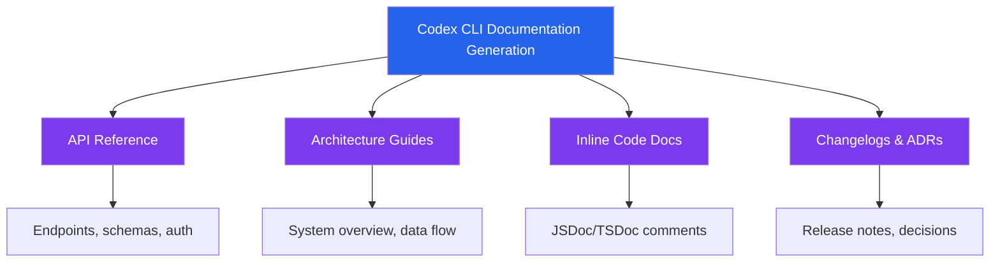
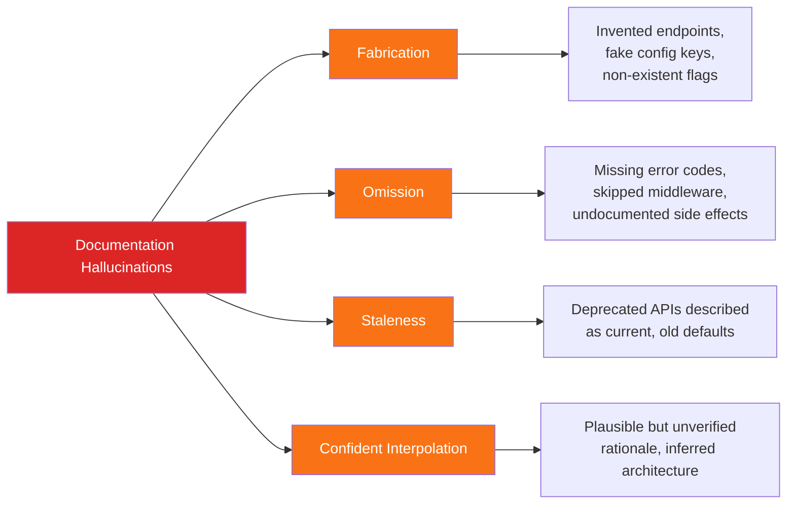
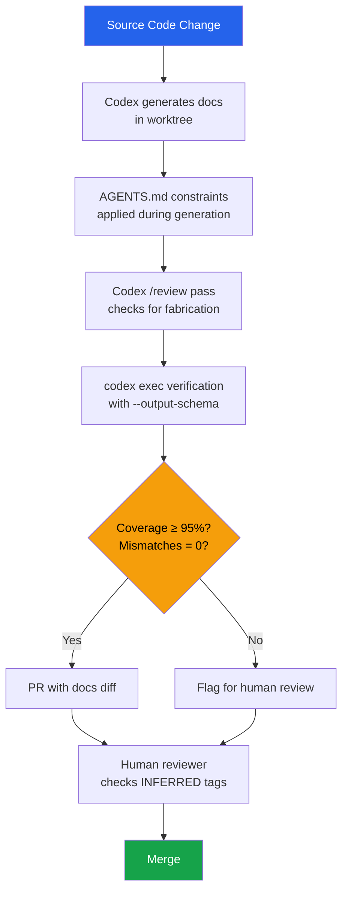

# Agent-Generated Documentation: Quality, Trust, and Verification Patterns for Codex CLI Teams


---

Codex CLI can draft a README, generate API reference from route handlers, produce architectural decision records, and keep changelogs current — all from a single prompt. But should you trust what it writes? The State of Docs 2026 report found that 62% of documentation professionals cite hallucinations as their primary concern with AI-generated content [^1], and the Vectara HHEM benchmark shows even the best models hallucinate at 3–5% on summarisation tasks [^2]. Documentation carries a higher accuracy bar than almost any other content type: a single wrong endpoint path or fabricated configuration key sends a developer down a rabbit hole that costs hours.

This article examines the four documentation types Codex CLI generates well, the failure modes that undermine trust, and the verification patterns that make agent-generated documentation production-safe.

## The Four Documentation Types

Codex CLI excels at four categories of developer documentation, each with distinct quality characteristics [^3]:



### API reference

API documentation is the highest-value target because the agent reads actual route handlers and schema definitions rather than guessing at types [^3]. A worktree-isolated prompt such as:

```bash
codex "Generate comprehensive API documentation for all endpoints in src/routes/. \
  For each endpoint include method, path, request/response schemas from Zod definitions, \
  authentication requirements, and curl examples. Output as docs/API.md organised by route group."
```

produces documentation grounded in source code. The risk is not fabrication of endpoints — Codex reads the files — but *omission* of edge cases, error responses, and rate-limit headers that exist only in middleware.

### Architecture guides

System overviews, component maps, and data-flow diagrams benefit from the agent's ability to traverse an entire repository in seconds. The failure mode here is *confident interpolation*: the agent may describe a message queue between two services that share a database table but no actual queue.

### Inline code documentation

JSDoc, TSDoc, and docstring generation is where Codex CLI is most reliable. The function signature constrains the output, and type information acts as a natural guardrail against hallucination [^4].

### Changelogs and ADRs

Changelogs generated from git history are mechanically accurate. Architectural Decision Records are more dangerous: the agent will produce plausible-sounding rationale for decisions it never witnessed, filling the "Context" and "Consequences" sections with reasonable but unverified reasoning.

## The Trust Deficit in Numbers

The evidence for caution is substantial:

| Metric | Finding | Source |
|--------|---------|--------|
| Developer trust in AI output | Only 3% "highly trust" AI-generated code | Sonar State of Code 2025 [^5] |
| Active distrust trend | 50% of developers actively distrust AI output in 2026, up from 31% in 2024 | Sonar/ShiftMag survey [^5] |
| Hallucination rate (best model) | 3.3% on summarisation tasks | Vectara HHEM 2026 [^2] |
| Hallucination rate (hard tasks) | ~30% in multi-turn research settings | HalluHard 2026 benchmark [^2] |
| Review time increase | 35% more time spent reviewing since AI adoption | McKinsey Technology Report 2026 [^6] |
| Documentation governance gap | Only 44% of teams have AI documentation guidelines | State of Docs 2026 [^1] |
| AI usage for full documents | Only 25% use AI to write entire documents | State of Docs 2026 [^1] |

The State of Docs 2026 report captures the shift precisely: documentation professionals now spend less time drafting and more time fact-checking, validating, and building context systems that make AI output worth refining [^1]. The writing-to-review ratio has inverted.

## Documentation Hallucination Taxonomy

Not all documentation errors are equal. Understanding the failure modes helps target verification effort:



**Fabrication** is the most feared but least common failure mode when Codex CLI operates on local source code. The agent reads your files; it does not invent endpoints from training data alone.

**Omission** is the most common and hardest to detect. The agent generates documentation for what it sees, but middleware chains, environment-specific behaviour, and implicit conventions may not appear in the files it reads.

**Staleness** occurs when documentation references deprecated patterns. Codex CLI's training data has a cutoff, and even with current source code, the agent may describe configuration keys or CLI flags that existed in earlier versions.

**Confident interpolation** is the most dangerous for ADRs and architecture documents. The agent produces grammatically perfect, technically plausible explanations for decisions it never observed. These read as authoritative but are essentially fiction.

## Verification Patterns for Codex CLI

### Pattern 1: Source-grounded generation with AGENTS.md constraints

The most effective defence is constraining the agent's behaviour through AGENTS.md:

```markdown
# Documentation Rules

## API Documentation
- Read actual route handlers and Zod/TypeSpec schemas — do NOT guess at types
- Include all error responses defined in error middleware
- Mark any undocumented behaviour with ⚠️ UNVERIFIED
- Every endpoint must reference its source file path

## Architecture Documentation
- Only describe components you can verify from source code
- Mark inferred relationships with [INFERRED] prefix
- Do not fabricate rationale for design decisions

## Changelogs
- Generate exclusively from git log — do not summarise from memory
- Include commit hashes for traceability
```

This turns the agent from a creative writer into a constrained reporter [^7].

### Pattern 2: Automated freshness verification

Set up a weekly `codex exec` automation that validates existing documentation against current source code [^3]:

```bash
codex exec "Compare docs/API.md against the current route handlers in src/routes/. \
  Report: (1) endpoints in code but missing from docs, \
  (2) endpoints in docs but removed from code, \
  (3) schema mismatches between Zod definitions and documented types. \
  Output as JSON." \
  --output-schema ./doc-drift-schema.json \
  -o ./reports/doc-drift-$(date +%Y%m%d).json
```

The `--output-schema` flag ensures structured, parseable output that can feed a CI dashboard or Slack notification [^8]. Since v0.137, `codex exec resume` also accepts `--output-schema`, enabling resumed verification sessions that maintain context across runs [^9].

### Pattern 3: Section markers for human-owned content

Protect manually authored sections from agent overwriting:

```markdown
<!-- BEGIN GENERATED BY CODEX -->
## API Endpoints
...
<!-- END GENERATED BY CODEX -->

<!-- HUMAN-MAINTAINED -->
## Deployment Notes
These notes reflect operational experience and must not be auto-generated.
<!-- END HUMAN-MAINTAINED -->
```

This pattern, recommended in the Developer Toolkit documentation guide, preserves institutional knowledge that agents cannot reconstruct [^3].

### Pattern 4: Diff-review before merge

Generate documentation in a worktree to isolate changes from your working directory [^3]:

```bash
# Create isolated worktree for doc generation
git worktree add ../docs-update docs-branch

# Generate docs in isolation
cd ../docs-update
codex "Update all API documentation from current source code. \
  Preserve human-maintained sections marked with <!-- HUMAN-MAINTAINED -->."

# Review the diff before merging
git diff --stat
codex "/review Focus on: fabricated endpoints, missing error responses, \
  schema mismatches with Zod definitions"
```

The `/review` command provides a second-pass verification using the agent itself as a reviewer — not perfect, but effective at catching obvious fabrications [^10].

### Pattern 5: Structured output for CI gating

For teams running documentation quality checks in CI, combine `codex exec` with structured output schemas:

```json
{
  "type": "object",
  "properties": {
    "endpoints_documented": { "type": "number" },
    "endpoints_in_code": { "type": "number" },
    "coverage_percentage": { "type": "number" },
    "schema_mismatches": { "type": "array", "items": { "type": "string" } },
    "stale_references": { "type": "array", "items": { "type": "string" } },
    "unverified_claims": { "type": "array", "items": { "type": "string" } }
  },
  "required": ["endpoints_documented", "endpoints_in_code", "coverage_percentage"]
}
```

This schema feeds a CI gate that blocks merges when documentation coverage drops below a threshold or stale references appear [^8].

## The Documentation Quality Pipeline

Combining these patterns into a coherent workflow:



## What the Industry Is Getting Wrong

The State of Docs 2026 report reveals that 25% of MCP server investments in documentation teams target AI-powered search and chatbots [^1]. This is the right direction — but most teams are investing in *consumption* tools (chatbots that answer questions about docs) whilst neglecting *creation* quality gates.

The governance gap is stark: 22% of teams have no plans to create AI documentation guidelines, and among heavy AI users, 15% operate without any guidelines at all [^1]. This is the documentation equivalent of deploying to production without tests.

For Codex CLI teams, the minimum viable governance is:

1. **AGENTS.md documentation rules** — constrain what the agent can and cannot claim
2. **Section markers** — protect human-authored operational knowledge
3. **Weekly drift detection** — catch documentation that has fallen behind the code
4. **CI-gated coverage checks** — prevent documentation debt from accumulating silently

## Conclusion

Agent-generated documentation is not a binary choice between "trust everything" and "write everything manually." The practical middle ground is *constrained generation with structured verification*: let Codex CLI do the mechanical work of reading source code and producing structured output, then apply automated checks and human review to the claims that matter most.

The 62% hallucination concern rate is real, but it reflects a world where most teams generate documentation without constraints, without verification, and without governance. Apply the five patterns above, and agent-generated documentation becomes the most consistently maintained part of your codebase — precisely because an agent never forgets to run the freshness check.

## Citations

[^1]: GitBook, "The State of Docs Report 2026 — AI and Documentation Creation," stateofdocs.com, 2026. [https://www.stateofdocs.com/2026/ai-and-documentation-creation](https://www.stateofdocs.com/2026/ai-and-documentation-creation)

[^2]: Suprmind, "AI Hallucination Statistics 2026: 50+ Sourced Data Points," suprmind.ai, 2026. [https://suprmind.ai/hub/insights/ai-hallucination-statistics-research-report-2026/](https://suprmind.ai/hub/insights/ai-hallucination-statistics-research-report-2026/)

[^3]: Developer Toolkit, "Documentation Generation with Codex," developertoolkit.ai, 2026. [https://developertoolkit.ai/en/codex/lessons/documentation/](https://developertoolkit.ai/en/codex/lessons/documentation/)

[^4]: Mintlify, "AI Hallucinations: What They Are, Why They Happen, and How Accurate Documentation Prevents Them," mintlify.com, 2026. [https://www.mintlify.com/blog/ai-hallucinations](https://www.mintlify.com/blog/ai-hallucinations)

[^5]: ShiftMag, "42% of Code Is AI-Assisted — But 96% Don't Fully Trust It," shiftmag.dev, 2025. [https://shiftmag.dev/state-of-code-2025-7978/](https://shiftmag.dev/state-of-code-2025-7978/)

[^6]: McKinsey, "Technology Report 2026: Developer Productivity and AI Adoption," referenced in talent500.com analysis. [https://talent500.com/blog/ai-generated-code-trust-and-verification-gap/](https://talent500.com/blog/ai-generated-code-trust-and-verification-gap/)

[^7]: OpenAI, "Custom Instructions with AGENTS.md," developers.openai.com, 2026. [https://developers.openai.com/codex/guides/agents-md](https://developers.openai.com/codex/guides/agents-md)

[^8]: OpenAI, "Non-interactive Mode — Codex CLI," developers.openai.com, 2026. [https://developers.openai.com/codex/noninteractive](https://developers.openai.com/codex/noninteractive)

[^9]: OpenAI, "Codex CLI Changelog," developers.openai.com, June 2026. [https://developers.openai.com/codex/changelog](https://developers.openai.com/codex/changelog)

[^10]: OpenAI, "Codex CLI Features," developers.openai.com, 2026. [https://developers.openai.com/codex/cli/features](https://developers.openai.com/codex/cli/features)
