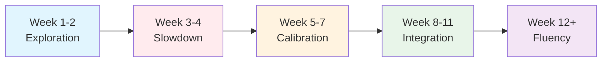

# The Agent Learning Curve: What the Research Says About Your First Eleven Weeks with Codex CLI


---

Every developer who adopts an agentic coding tool passes through the same arc: initial excitement, a disorienting slowdown, a calibration period, and — if they persist — an inflection point where the tool becomes genuinely faster than working alone. The research now quantifies each phase. This article maps those findings to specific Codex CLI configuration and workflow patterns for each stage of proficiency.

## The Data: A 37-Point Productivity Swing

METR's longitudinal study tracked the same cohort of experienced open-source developers from early 2025 through early 2026. The initial randomised controlled trial measured a **19% slowdown** when developers used AI coding tools[^1]. One year later, using improved tools and refined workflows, the same developers showed an **18% speedup** — a 37-point swing[^2].

This is not a story about better models alone. The developers changed how they worked. They learned when to delegate, when to verify, and when to override.

Separately, DX's longitudinal dataset across 400 companies shows Time to 10th PR dropping from 86 days in Q1 2024 to **33 days** in Q1 2026[^3]. For developers using AI tools daily, the figure drops further: from 91 days to 49 days — a 46% reduction[^4]. The tools accelerate onboarding, but only after the developer crosses a proficiency threshold.

That threshold, synthesised across multiple studies, sits at approximately **50 hours of deliberate practice** with a specific tool — roughly 11 weeks at one hour per day[^5].

## The Five Phases



### Phase 1: Exploration (Weeks 1–2)

**What the research shows:** Developers report high satisfaction and perceive immediate productivity gains. However, METR's data shows perceived speed-up diverges sharply from measured speed-up — developers believe they are 20% faster while actually being measurably slower[^1].

**What is happening:** The developer is learning the tool's interaction model. Every prompt is novel. The novelty itself creates cognitive engagement that masks overhead.

**Codex CLI configuration for this phase:**

```toml
# ~/.codex/config.toml — Phase 1: Maximum guardrails
[defaults]
approval_policy = "unless-allow-listed"
model = "gpt-5.5"

[defaults.sandbox]
mode = "full"
```

At this stage, keep `approval_policy` restrictive. The developer needs to see what the agent proposes before it executes. This builds the mental model of what the agent can and cannot do safely.

**AGENTS.md pattern:**

```markdown
# Review Rules
- Always show your plan before implementing
- Explain why you chose this approach
- Flag any assumptions about architecture
```

The goal is not speed — it is calibration. The developer is training their intuition about agent reliability.

### Phase 2: The Slowdown (Weeks 3–4)

**What the research shows:** This is where METR's 19% slowdown manifests. The developer has exhausted simple use cases (boilerplate, test scaffolding, documentation) and begins attempting complex tasks. The agent's output requires extensive review. The developer spends more time verifying than they would have spent writing[^6].

Anthropic's 2026 Agentic Coding Trends Report identifies this as the **delegation gap** in action: developers use AI in 60% of their work but can fully delegate only 0–20% of tasks[^7]. The gap is widest during this phase because the developer has not yet learned which tasks fall in the delegatable 20%.

**What is happening:** The developer is debugging their own prompts and discovering that context engineering — not prompt engineering — determines output quality.

**Codex CLI configuration for this phase:**

```toml
[defaults]
approval_policy = "unless-allow-listed"
model = "gpt-5.5"

[defaults.sandbox]
mode = "full"

# Reduce scope per interaction
[defaults.context]
max_read_files = 20
```

**Key workflow shift:** Stop asking the agent to "implement feature X." Start asking it to "plan the implementation of feature X, then wait for approval before writing code." The `/plan` command exists precisely for this phase:

```bash
codex --approval-policy unless-allow-listed
# Then in the TUI:
/plan Refactor the payment module to use the new gateway interface
```

### Phase 3: Calibration (Weeks 5–7)

**What the research shows:** Instruqt's 2026 State of Developer Adoption Report found that developers using hands-on, experiential learning formats are 50% more likely to reach productivity within two months[^8]. This correlates with the calibration phase — the developer has enough experience to categorise tasks by delegatability.

DX reports that satisfaction scores are lowest at 1–2 months of tool use, then rise sharply between months 3–6[^9]. The developer is building a personal taxonomy of "agent-safe" versus "human-required" tasks.

**What is happening:** The developer begins using profiles to match configuration to task type. They write better AGENTS.md files because they have experienced what the agent gets wrong without guidance.

**Codex CLI configuration for this phase:**

```toml
# ~/.codex/profiles/explore.toml — For exploratory tasks
[defaults]
approval_policy = "unless-allow-listed"
model = "gpt-5.5"

# ~/.codex/profiles/delegate.toml — For known-delegatable tasks
[defaults]
approval_policy = "auto-edit"
model = "gpt-5.4-mini"

[defaults.sandbox]
mode = "full"
```

```bash
# Use profiles to match task to trust level
codex --profile explore "What's the best approach for migrating this to TypeScript?"
codex --profile delegate "Add unit tests for the PaymentGateway class"
```

**AGENTS.md pattern:**

```markdown
# Delegation Boundaries
## Fully delegatable (auto-edit safe)
- Unit test generation for existing functions
- Type annotation additions
- Import reorganisation
- Documentation updates

## Requires review (unless-allow-listed)
- Any architectural change
- Database migration generation
- Security-sensitive code paths
- Public API surface changes
```

### Phase 4: Integration (Weeks 8–11)

**What the research shows:** The Accenture randomised controlled trial across 4,867 developers found that developers completed **26% more tasks** with AI tools, with the effect concentrated in developers who had crossed the proficiency threshold[^10]. At this stage, the developer is no longer thinking about the tool — they are thinking about the problem, with the tool as an extension of their workflow.

METR's May 2026 survey of 349 technical workers found that experienced AI-tool users report spending 30–40% of their coding time on verification and prompt refinement[^11]. This is not overhead — it is the new workflow. The developer has internalised that their role has shifted from writer to director.

**What is happening:** The developer uses Goal mode for multi-step tasks, hooks for automated verification, and the full approval spectrum. They have internalised the Plan → Implement → Verify loop.

**Codex CLI configuration for this phase:**

```toml
[defaults]
approval_policy = "auto-edit"
model = "gpt-5.5"

[defaults.sandbox]
mode = "full"

# Enable goal mode for long-running tasks
[features]
goals = true
unified_exec = true
```

```bash
# Goal-driven workflow
codex --approval-policy auto-edit
/goal Migrate the authentication module from Express middleware to Hono middleware.
      Success: all existing auth tests pass, no Express imports remain in src/auth/.
```

**Hooks for automated verification:**

```toml
# ~/.codex/hooks.toml
[[hooks]]
event = "post_tool_use"
tool = "apply_patch"
command = "npm test -- --bail"
on_failure = "stop"
```

### Phase 5: Fluency (Week 12+)

**What the research shows:** METR's longitudinal data shows the 18% speedup emerging after approximately 12 months of regular use with improving tools[^2]. However, with current-generation tools (which are substantially better than those available in early 2025), the timeline compresses. The Stanford AI Index 2026 reports 14–26% measured productivity gains across mature users, consistent with the Integration phase becoming the steady state[^12].

Projects with well-maintained context files see **40% fewer agent errors** and **55% faster task completion**[^7]. At this stage, the developer invests in durable context (AGENTS.md, skills, hooks) as a force multiplier.

**Codex CLI configuration for this phase:**

```toml
[defaults]
approval_policy = "full-auto"
model = "gpt-5.5"

[defaults.sandbox]
mode = "full"

[features]
goals = true
unified_exec = true

# Subagents for parallel work
[agents.test-writer]
model = "gpt-5.4-mini"
approval_policy = "full-auto"

[agents.reviewer]
model = "gpt-5.5"
approval_policy = "unless-allow-listed"
```

## The Configuration Progression

The core insight: **approval policy is a proxy for trust**, and trust must be earned through experience, not granted at installation.

```mermaid
graph TD
    A[unless-allow-listed<br/>Phase 1-2] -->|"Developer sees patterns"| B[auto-edit<br/>Phase 3-4]
    B -->|"Developer builds verification hooks"| C[full-auto + hooks<br/>Phase 5]

    D[Single model<br/>gpt-5.5] -->|"Task taxonomy emerges"| E[Profiles<br/>gpt-5.5 + gpt-5.4-mini]
    E -->|"Subagents for bounded tasks"| F[Multi-agent<br/>model per role]

    G[Manual /plan] -->|"Internalised loop"| H[/goal with success criteria]
    H -->|"Background automation"| I[Automations + exec]
```

## Organisational Implications

The Instruqt data carries a clear message: documentation alone does not drive adoption. Hands-on practice does[^8]. For teams rolling out Codex CLI:

1. **Budget the slowdown.** Do not measure ROI in weeks 1–4. The 19% overhead is real and expected.
2. **Pair experienced users with newcomers.** The 37-point swing compresses when developers learn from someone who has already calibrated.
3. **Provide bounded starter tasks.** Test generation, documentation updates, and refactoring within a single file are ideal Phase 1 assignments.
4. **Do not skip to full-auto.** The Anthropic delegation gap research shows that premature trust leads to unverified output accumulating as technical debt[^7].
5. **Track Time to Confident Delegation**, not Time to First Use. The meaningful metric is when a developer can correctly predict whether a task is safely delegatable.

## The Floor Effect

DX's data suggests onboarding acceleration may be approaching a natural floor[^3]. Time to 10th PR dropped 62% in two years but the rate of improvement is decelerating. This implies that the remaining friction is not tool-shaped — it is organisational (codebase complexity, review processes, domain knowledge). Codex CLI can compress the tool-shaped portion of onboarding, but the human-shaped portion requires human investment.

## Practical Takeaways

| Phase | Duration | Approval Policy | Model Strategy | Key Practice |
|-------|----------|----------------|----------------|--------------|
| Exploration | Weeks 1–2 | `unless-allow-listed` | Single (gpt-5.5) | Watch what the agent does |
| Slowdown | Weeks 3–4 | `unless-allow-listed` | Single (gpt-5.5) | Use `/plan` before implementation |
| Calibration | Weeks 5–7 | Mixed via profiles | Profiles emerge | Write delegation boundaries in AGENTS.md |
| Integration | Weeks 8–11 | `auto-edit` | Task-matched | Enable `/goal`, add verification hooks |
| Fluency | Week 12+ | `full-auto` + hooks | Multi-agent | Invest in durable context, automations |

The 37-point swing is available to every developer. It requires 11 weeks of deliberate practice, not 11 weeks of calendar time. The configuration should match the developer's current phase, not their aspirational phase.

---

## Citations

[^1]: METR. "Measuring the Impact of Early-2025 AI on Experienced Open-Source Developer Productivity." Published December 2025. [https://metr.org/blog/2025-12-11-measuring-ai-developer-productivity/](https://metr.org/blog/2025-12-11-measuring-ai-developer-productivity/)

[^2]: METR. "We are Changing our Developer Productivity Experiment Design." Published 24 February 2026. [https://metr.org/blog/2026-02-24-uplift-update/](https://metr.org/blog/2026-02-24-uplift-update/)

[^3]: DX. "Developer ramp-up time continues to accelerate with AI." April 2026. [https://newsletter.getdx.com/p/developer-ramp-up-time-continues](https://newsletter.getdx.com/p/developer-ramp-up-time-continues)

[^4]: DX. "AI cuts onboarding time in half for new hires in the enterprise." 2026. [https://getdx.com/blog/ai-cuts-developer-onboarding-time-in-half/](https://getdx.com/blog/ai-cuts-developer-onboarding-time-in-half/)

[^5]: Faros AI. "What METR's Study Missed About AI Productivity in the Wild." 2026. [https://www.faros.ai/blog/lab-vs-reality-ai-productivity-study-findings](https://www.faros.ai/blog/lab-vs-reality-ai-productivity-study-findings)

[^6]: Dubach, Philipp. "AI Coding Productivity Paradox: 93% Adoption, 10% Gains." 2026. [https://philippdubach.com/posts/93-of-developers-use-ai-coding-tools.-productivity-hasnt-moved./](https://philippdubach.com/posts/93-of-developers-use-ai-coding-tools.-productivity-hasnt-moved./)

[^7]: Anthropic. "2026 Agentic Coding Trends Report." 2026. [https://resources.anthropic.com/2026-agentic-coding-trends-report](https://resources.anthropic.com/2026-agentic-coding-trends-report)

[^8]: Instruqt / SlashData. "The 2026 State of Developer Adoption Report." Published 1 June 2026. [https://instruqt.com/blog/the-2026-state-of-developer-adoption-ai-is-shipping-faster-than-developers-can-adopt-heres-whats-working](https://instruqt.com/blog/the-2026-state-of-developer-adoption-ai-is-shipping-faster-than-developers-can-adopt-heres-whats-working)

[^9]: SoftwareSeni. "What the Research Actually Shows About AI Coding Assistant Productivity." 2026. [https://www.softwareseni.com/what-the-research-actually-shows-about-ai-coding-assistant-productivity/](https://www.softwareseni.com/what-the-research-actually-shows-about-ai-coding-assistant-productivity/)

[^10]: Microsoft Research / Accenture. "Large-scale field experiment across 4,867 professional developers." Referenced in DX AI-Assisted Engineering Hub. [https://getdx.com/blog/ai-assisted-engineering-hub/](https://getdx.com/blog/ai-assisted-engineering-hub/)

[^11]: METR. "Survey of 349 technical workers on AI tool usage patterns." May 2026. [https://metr.org/research/](https://metr.org/research/)

[^12]: Stanford HAI. "AI Index Report 2026." April 2026. [https://aiindex.stanford.edu/report/](https://aiindex.stanford.edu/report/)
