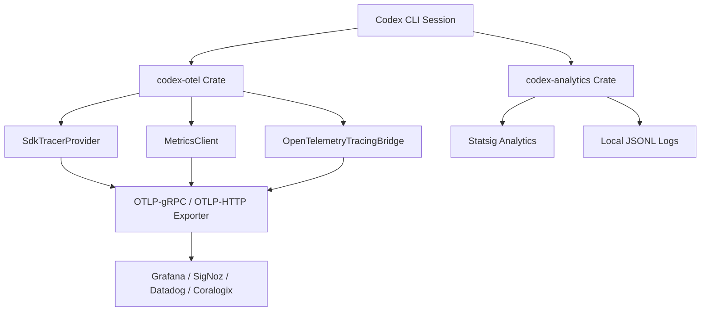
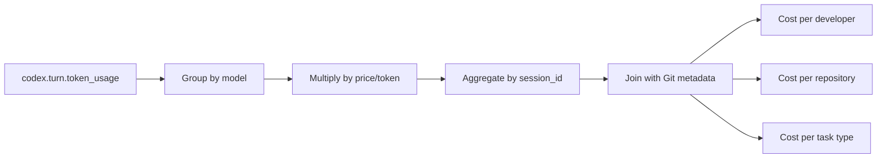

# The Agent Observability Gap: Session Tracing, Cost Attribution, and Anomaly Detection with Codex CLI's OpenTelemetry Stack


---

Your agent ran for forty-five minutes. It consumed 1.2 million tokens. It touched thirty-seven files. Do you know what it did?

Traditional application monitoring watches metrics, logs, and request traces for deterministic services. Agent observability is fundamentally different: agents fail in ways that look like success — well-formed but incorrect outputs, unnecessary tool calls, and actions that are syntactically valid but semantically wrong [^1]. The observability gap is not a tooling problem; it is an architectural blind spot. Codex CLI ships a comprehensive OpenTelemetry stack that, when properly configured, closes this gap. This article shows you how.

## The Four Dimensions of Agent Observability

Agent observability for coding workflows requires structured tracing across four dimensions that traditional APM tools cannot capture [^2]:

1. **Execution traces** — the full chain of model calls, tool invocations, and approval decisions within a session
2. **Output evaluations** — whether the agent's artefacts are correct, not merely syntactically valid
3. **Token cost attribution** — per-task, per-model, per-developer cost breakdowns
4. **Per-agent identity tracking** — distinguishing concurrent agents modifying the same codebase



## Codex CLI's Telemetry Architecture

Codex implements observability through two internal crates: `codex-otel` for OpenTelemetry integration and `codex-analytics` for usage event tracking [^3]. The `OtelProvider` wraps three components — traces via `SdkTracerProvider`, metrics via an internal `MetricsClient`, and logs bridged through `OpenTelemetryTracingBridge` — initialised by `build_provider`, which maps `Config` to `OtelSettings` [^3].

A `codex_export_filter` ensures only events targeting `codex_otel` are exported, suppressing noise from third-party dependencies [^3].

### Enabling OTel Export

OTel export is disabled by default. Enable it by adding an `[otel]` section to `~/.codex/config.toml` or your project-level `.codex/config.toml` [^4]:

```toml
[otel]
environment = "production"     # defaults to "dev"
log_user_prompt = false         # redact prompts unless explicitly enabled

# gRPC exporter (recommended for high throughput)
exporter = { otlp-grpc = {
  endpoint = "https://otel-collector.internal:4317",
  headers = { "x-otlp-api-key" = "${OTLP_TOKEN}" }
}}
```

For HTTP backends:

```toml
[otel]
exporter = { otlp-http = {
  endpoint = "https://otel.example.com/v1/logs",
  protocol = "binary",
  headers = { "x-otlp-api-key" = "${OTLP_TOKEN}" }
}}
```

TLS is supported via CA certificate, client certificate, and client private key path options [^4].

### Default Metadata Tags

Every event carries these tags automatically: `auth_mode`, `originator`, `session_source`, `model`, and `app.version` [^4]. The `x-codex-turn-metadata` header on outbound model requests includes session lineage (`session_id`, `thread_id`, `forked_from_thread_id`, `parent_thread_id`) and workspace Git metadata (remote URLs, commit hashes, dirty status) [^3].

## Event Types and What They Reveal

Codex emits structured log events across the agent lifecycle [^4]:

| Event | Key Fields | Observability Use |
|-------|-----------|-------------------|
| `codex.conversation_starts` | model, reasoning mode, sandbox/approval settings | Session configuration audit |
| `codex.api_request` | attempt, status, duration, error | API reliability and latency |
| `codex.sse_event` | event kind, token counts | Streaming health and throughput |
| `codex.websocket_request` | request duration | WebSocket transport monitoring |
| `codex.user_prompt` | length (content redacted by default) | Prompt size tracking |
| `codex.tool_decision` | approved/denied, decision source | Security policy enforcement |
| `codex.tool_result` | duration, success, output snippet | Tool reliability and latency |

## Metrics Reference

The metrics pipeline exposes counters and histograms that form the basis of any agent dashboard [^3] [^4]:

| Metric | Type | Purpose |
|--------|------|---------|
| `codex.tool.call` | Counter | Total tool invocations by name and outcome |
| `codex.tool.call.duration_ms` | Histogram | Tool execution latency distribution |
| `codex.api_request` | Counter | Outgoing LLM API calls |
| `codex.api_request.duration_ms` | Histogram | API call latency including TTFT |
| `codex.turn.e2e_duration_ms` | Histogram | Total time per conversation turn |
| `codex.turn.token_usage` | Counter | Tokens consumed per turn |
| `codex.hooks.run` | Counter | Hook execution counts |
| `codex.startup.phase.duration_ms` | Histogram | Startup phase timing |
| `codex.process.start` | Counter | Process lifecycle tracking |

## Cost Attribution: From Token Counts to Developer Budgets

Since September 2025, Codex CLI emits cumulative token count events in its session JSONL files, with each turn recording running totals for input, cached input, output, and reasoning tokens tagged with the active model [^5]. The `codex.turn.token_usage` metric makes this data available via OTel.

### Per-Session Cost Logging with Hooks

The hooks framework lets you inject cost records at session boundaries. A `postTaskComplete` hook can compute and log session cost:

```bash
#!/usr/bin/env bash
# .codex/hooks/postTaskComplete.sh

SESSION_FILE=$(ls -t ~/.codex/sessions/*.jsonl | head -1)
TOKENS=$(jq -s '[.[] | select(.token_usage) | .token_usage] | last' "$SESSION_FILE")

INPUT=$(echo "$TOKENS" | jq '.input_tokens // 0')
OUTPUT=$(echo "$TOKENS" | jq '.output_tokens // 0')
REASONING=$(echo "$TOKENS" | jq '.reasoning_tokens // 0')
MODEL=$(echo "$TOKENS" | jq -r '.model // "unknown"')

# Log to your cost tracking system
curl -s -X POST https://cost-api.internal/sessions \
  -H "Content-Type: application/json" \
  -d "{\"model\":\"$MODEL\",\"input\":$INPUT,\"output\":$OUTPUT,\"reasoning\":$REASONING,\"timestamp\":\"$(date -u +%Y-%m-%dT%H:%M:%SZ)\"}"
```

For richer analysis, the open-source `ccusage` tool parses local JSONL session files with per-model breakdowns, daily/monthly/session reports, and JSON output for automation pipelines [^6].

### Cost Attribution by Task

Combine `codex.turn.token_usage` with session metadata to build cost attribution dashboards:



## Anomaly Detection Patterns

With traces and metrics flowing into an observability backend, you can define alerting rules for the failure modes that matter most.

### The Silent Regression

An agent completes without errors but introduces a subtle defect. Detection pattern: alert when `codex.tool.call` count exceeds 2× the session's p95 baseline — agents trapped in retry loops often produce syntactically valid but semantically wrong output.

### The Runaway Session

Token consumption spirals beyond budget. Detection pattern: alert on `codex.turn.token_usage` exceeding a per-session threshold. This is particularly important given that enterprise teams have experienced budget blowouts when agent sessions run unchecked [^7].

### The Approval Bypass

A tool call is approved that should have been denied. Detection pattern: monitor `codex.tool_decision` events where `decision_source` is `auto-approve` and cross-reference with your security policy. Guardian review decisions — tracked as `GuardianReviewDecision` (Approved, Denied, Aborted) with failure reasons — provide the audit trail [^3].

### Context Window Exhaustion

The agent hits context limits mid-task. Detection pattern: alert on `CodexErrKind::ContextWindowExceeded` events in the analytics pipeline. The `codex-analytics` crate categorises errors by kind, including `ContextWindowExceeded`, `UsageLimitReached`, and policy violations [^3].

## Platform Integration: Three Production Stacks

### Grafana Cloud

Grafana ships a prebuilt OpenAI Codex integration with three dashboards — overview, usage, and performance — installed automatically via the Connections UI [^8]. Configuration requires three distinct OTLP endpoints (logs, metrics, traces) with Basic authentication headers.

### SigNoz

SigNoz accepts Codex telemetry via OTLP-gRPC with a single endpoint and ingestion key [^9]. Data batching means telemetry appears 10–30 seconds after API calls.

### Coralogix

Coralogix lists Codex CLI as a first-class code agent integration under its AI observability section, streaming API requests, tool calls, and session traces via built-in OpenTelemetry support [^10].

All three platforms sit atop the same OTel pipeline — switching backends requires only changing the `[otel]` exporter configuration, not modifying application code.

## Aligning with OpenTelemetry GenAI Semantic Conventions

The OpenTelemetry GenAI Semantic Conventions (currently at v1.41.1) define standardised span types for agent workflows [^11]:

- **`invoke_agent`** — individual agent invocations
- **`invoke_workflow`** — grouped multi-agent invocations (e.g., CrewAI crews)
- **CLIENT** spans for remote model calls, **INTERNAL** for local framework execution

The conventions specify required attributes for `gen_ai.agent.id`, `gen_ai.agent.name`, token usage metrics, and tool call spans [^11]. Codex's internal span structure predates these conventions but maps cleanly: `codex.api_request` aligns with CLIENT GenAI spans, `codex.tool.call` with tool execution spans, and session metadata with agent identity attributes.

As the OTel GenAI SIG stabilises (every release from v1.37 to v1.41 has touched GenAI conventions), expect Codex CLI to converge on these standard span names, making cross-tool observability dashboards — comparing Codex CLI, Copilot, and Claude Code sessions in the same trace viewer — increasingly practical [^12].

## Known Limitations

Two observability gaps remain as of the current release [^13]:

1. **`codex exec`** does not emit OTel metrics — headless batch runs are invisible to your dashboards unless you parse JSONL files separately
2. **`codex mcp-server`** emits no OTel telemetry at all — MCP server mode is a blind spot

⚠️ These gaps are tracked in [GitHub issue #12913](https://github.com/openai/codex/issues/12913). Until they are resolved, teams running `codex exec` in CI pipelines should supplement OTel with JSONL parsing via `ccusage` or custom scripts.

## Operational Checklist

For teams deploying Codex CLI with full observability:

1. **Enable OTel export** — add `[otel]` to your shared `config.toml` with your backend's OTLP endpoint
2. **Set `log_user_prompt = false`** unless your security policy permits prompt storage
3. **Tag environments** — use `environment = "production"` vs `"staging"` to separate telemetry streams
4. **Deploy cost hooks** — add a `postTaskComplete` hook to log session cost records
5. **Set up anomaly alerts** — configure alerts on `codex.turn.token_usage` thresholds and `codex.tool.call` count anomalies
6. **Monitor approval decisions** — dashboard `codex.tool_decision` events to audit security policy enforcement
7. **Supplement `codex exec` gaps** — parse JSONL session files for CI pipeline observability until OTel support lands

## Citations

[^1]: [Braintrust — Agent Observability: The Complete Guide for 2026](https://www.braintrust.dev/articles/agent-observability-complete-guide-2026)
[^2]: [Augment Code — Agent Observability for AI Coding](https://www.augmentcode.com/guides/agent-observability-for-ai-coding)
[^3]: [DeepWiki — OpenAI Codex: Observability and Telemetry](https://deepwiki.com/openai/codex/9.4-observability-and-telemetry)
[^4]: [OpenAI — Codex CLI Advanced Configuration](https://developers.openai.com/codex/config-advanced)
[^5]: [Aman Mittal — TIL About Tracking Your Codex Tokens Usage](https://amanhimself.dev/blog/codex-tokens-usage/)
[^6]: [ccusage — Coding (Agent) CLI Usage Analysis](https://ccusage.com/guide/codex/)
[^7]: [Daniel Vaughan — The Token Cost Crisis: Microsoft and Uber Budget Blowouts](https://codex.danielvaughan.com/2026/06/06/codex-cli-token-cost-crisis/)
[^8]: [Grafana Cloud — OpenAI Codex Integration](https://grafana.com/docs/grafana-cloud/monitor-infrastructure/integrations/integration-reference/integration-openai-codex/)
[^9]: [SigNoz — OpenAI Codex Observability & Monitoring with OpenTelemetry](https://signoz.io/docs/codex-monitoring/)
[^10]: [Coralogix — Codex CLI AI Observability Integration](https://coralogix.com/docs/integrations/ai-observability/codex-cli/)
[^11]: [OpenTelemetry — Semantic Conventions for GenAI Agent and Framework Spans](https://opentelemetry.io/docs/specs/semconv/gen-ai/gen-ai-agent-spans/)
[^12]: [Greptime — How OpenTelemetry Traces LLM Calls, Agent Reasoning, and MCP Tools](https://greptime.com/blogs/2026-05-09-opentelemetry-genai-semantic-conventions)
[^13]: [GitHub — codex exec emits no OTel metrics; codex mcp-server emits no OTel telemetry at all (Issue #12913)](https://github.com/openai/codex/issues/12913)
