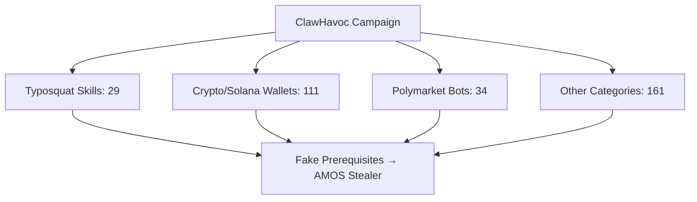
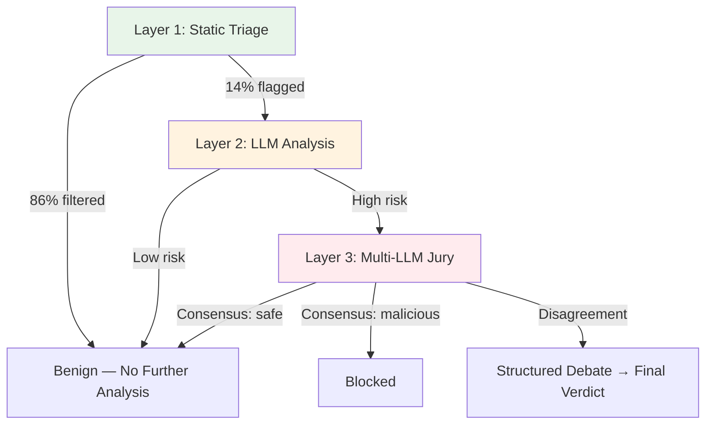

# The Agent Skill Supply Chain Crisis: ClawHavoc, ToxicSkills, SkillSieve, and Defending Your Codex CLI Skill Stack


---

The npm ecosystem had `event-stream`. PyPI had `ctx`. Now the agent skill ecosystem has ClawHavoc — and the numbers are worse. Between January and June 2026, three independent security audits converged on the same finding: roughly one in seven community-published agent skills contains a critical security vulnerability, and coordinated malware campaigns have weaponised the SKILL.md format at scale[^1][^2][^3]. For Codex CLI teams installing third-party skills from ClawHub, Skills.sh, or GitHub-hosted marketplaces, this is the article that explains what happened, what the research says, and how to harden your skill stack.

## The Numbers That Should Alarm You

The headline statistics from three separate research efforts paint a consistent picture:

| Study | Sample Size | Critical Rate | Any Vulnerability |
|-------|-------------|---------------|-------------------|
| Snyk ToxicSkills (Feb 2026) | 3,984 ClawHub skills | 13.4% (534) | 36.82% (1,467) |
| Liu et al. Empirical Study (Feb 2026) | 98,380 skills | — | 157 confirmed malicious (632 vulns) |
| SkillSieve Audit (Apr 2026) | ~49,592 ClawHub skills | 13–26% harbour vulnerabilities | — |

The Snyk ToxicSkills audit identified 76 confirmed malicious payloads and found that 10.9% of all ClawHub skills contained exposed credentials[^1]. The Liu et al. study went further, constructing the first labelled dataset of malicious agent skills through behavioural verification, finding that malicious skills average 4.03 vulnerabilities across a median of three kill-chain phases[^3].

## The ClawHavoc Campaign

On 1 February 2026, Koi Security researcher Oren Yomtov published a complete audit of ClawHub, the official skill marketplace for the OpenClaw AI agent. Of 2,857 skills available at the time, 341 were malicious — 11.9% of the entire registry[^4]. Of those, 335 traced back to a single coordinated campaign now tracked as **ClawHavoc**.

The attack was not sophisticated. Week-old GitHub accounts uploaded skills with fake `Prerequisites` sections instructing users to install password-protected archives containing Atomic Stealer (AMOS), a macOS credential-harvesting malware[^4]. The campaign targeted three verticals:



The barrier to entry for attackers was seven days and a SKILL.md template[^4]. By June 2026, the count had more than doubled — from 341 to 824 malicious skills — as the marketplace grew from 2,857 to over 10,700 entries[^4].

## Two Archetypes of Malicious Skills

The Liu et al. empirical study categorised malicious skills into two dominant archetypes[^3]:

### Data Thieves

These skills exfiltrate credentials through traditional supply-chain techniques: hardcoded exfiltration endpoints, base64-encoded commands that steal environment variables, SSH keys, and cloud credentials. The Snyk audit found that 32% of confirmed malicious samples include deliberately embedded exfiltration tokens[^1].

### Agent Hijackers

These skills subvert the agent's decision-making through instruction manipulation — prompt injection embedded in SKILL.md files that redirect the agent to disable security settings, install additional malicious dependencies, or modify system configurations[^1]. Critically, 91% of confirmed malicious skills employ prompt injection *alongside* traditional malware, creating a dual-vector attack that evades both conventional static analysis and pure prompt-injection scanners[^1].

## The Clinejection Vector: Agents Attacking Agents

On 17 February 2026, a malicious version of the Cline CLI — `cline@2.3.0` — was published to npm. It silently installed OpenClaw on every machine that updated during an eight-hour window[^4]. The attack chain, dubbed **Clinejection** by researcher Adnan Khan, demonstrated a new class of supply-chain risk: AI agents attacking AI agents. One compromised tool installing another compromised tool, each with its own skill surface, creates a transitive trust chain that no single point of vetting can catch.

## SkillSieve: A Detection Framework

The research community has responded. SkillSieve, published in April 2026 by Hou et al. at Peking University, proposes a three-layer hierarchical triage framework that applies progressively deeper analysis only where needed[^2]:



**Layer 1** runs regex, AST, and metadata checks through a recall-tuned heuristic scorer, eliminating 86% of the volume without deeper analysis — in under 40 milliseconds per skill at zero API cost[^2].

**Layer 2** routes flagged skills to an LLM that splits the analysis into four parallel sub-tasks: intent alignment, permission justification, covert behaviour detection, and cross-file consistency. Each sub-task uses its own prompt and structured output, raising recall to 0.854[^2].

**Layer 3** convenes a jury of three LLMs that vote independently and engage in structured debate when they disagree[^2].

The framework achieves an F1 score of 0.920 (precision 0.912, recall 0.929) at a cost of \$0.006 per skill assessment, and runs on hardware as modest as a \$440 ARM single-board computer[^2]. An optional XGBoost fast-track reduces LLM calls by 32% with only a 1.6-point F1 reduction whilst maintaining perfect recall[^2].

## Codex CLI's Built-In Defences

Codex CLI's two-layer security model — sandbox enforcement plus approval policy — provides meaningful protection against malicious skills, but only if configured correctly[^5][^6].

### Sandbox Containment

The OS-level sandbox (macOS Seatbelt, Linux bwrap + seccomp, Windows WSL2/native) constrains what any skill-triggered command can access[^5]. In `workspace-write` mode, file access is limited to the current workspace directory. A malicious skill that attempts to read `~/.ssh/id_rsa` or `~/.aws/credentials` is blocked at the kernel level.

```toml
# config.toml — baseline safe configuration
[sandbox]
mode = "workspace-write"   # default, read + write within workspace only
```

### Skill Approval Gates

The `skill_approval` granular policy controls whether third-party skill scripts require explicit user approval before execution[^6]:

```toml
[approval]
granular = { skill_approval = true, sandbox_approval = true, mcp_elicitations = true }
```

With `skill_approval = true`, every skill script invocation surfaces a prompt showing exactly what will run. This catches the ClawHavoc pattern — a fake prerequisites section triggering a `curl | bash` payload — before execution.

### Deny-Read Credential Protection

The `requirements.toml` mechanism lets administrators enforce deny-read policies that users cannot weaken[^6]. For skill-heavy environments, denying access to credential stores is essential:

```toml
# requirements.toml — enforced by admin, cannot be overridden
[[deny_read]]
glob = "**/.env*"
reason = "Environment files may contain secrets"

[[deny_read]]
glob = "**/.aws/**"
reason = "AWS credentials must not be accessible to agent"

[[deny_read]]
glob = "**/.ssh/**"
reason = "SSH keys must not be accessible to agent"
```

### Auto-Review Subagent

The `auto_review` feature routes approval requests through a reviewer agent that checks for data exfiltration, credential probing, and destructive actions before execution[^6]. This provides a programmatic second opinion on skill behaviour without requiring constant human attention:

```toml
[approval]
auto_review = true
```

## A Practical Defence Checklist

For teams using Codex CLI with third-party skills, the following eight-step checklist maps research findings to concrete configuration:

### 1. Audit Installed Skills

Use Snyk's `mcp-scan` tool to scan your current skill inventory for known malicious patterns[^1]:

```bash
npx mcp-scan --skills ~/.codex/skills/
```

### 2. Pin Skill Sources with gh skill

Use `gh skill install --pin <ref>` to version-lock every skill to a specific commit hash rather than tracking a branch[^7]. This prevents supply-chain updates from silently introducing malicious content.

### 3. Enable Granular Approval

Set `skill_approval = true` and `sandbox_approval = true` in your `config.toml` to require explicit approval for skill actions[^6].

### 4. Enforce Deny-Read Policies

Deploy `requirements.toml` with deny-read rules covering `.env`, `.aws`, `.ssh`, `.gnupg`, and any other credential stores[^6].

### 5. Prefer Curated Marketplaces

The OpenAI plugin directory and `gh skill` registry apply security review before publication[^7]. ClawHub operates with minimal vetting — any user can submit a skill with no mandatory security review[^4].

### 6. Restrict Network Access

Skills that require outbound network access should raise immediate suspicion. Codex CLI's sandbox blocks network access by default in the agent phase; do not escalate to `danger-full-access` for skill installation[^5].

### 7. Review Skill Contents Before Installation

Every SKILL.md is a text file. Before installing, read the `Prerequisites` section, any shell scripts, and check for obfuscated content (base64-encoded strings, packed commands, or external download URLs)[^1].

### 8. Monitor for Known Threat Actors

The Snyk ToxicSkills report identified specific threat actors: `zaycv`, `Aslaep123`, `pepe276`, and `moonshine-100rze`[^1]. Block skills from these accounts and rotate any credentials if you have previously installed their skills.

## The Structural Problem

The agent skill supply chain crisis is not merely a tooling problem — it is a structural one. The SKILL.md format was designed for portability and progressive disclosure, not for security verification[^8]. A skill's instructions are natural-language text that can contain prompt injection indistinguishable from legitimate guidance. Traditional static analysers cannot parse these instructions, and regex scanners fail against obfuscated payloads[^2].

SkillSieve's multi-layer approach — combining traditional static analysis with LLM-powered semantic understanding — points toward the eventual solution: marketplace-level continuous scanning that treats every skill submission as potentially adversarial. Until that infrastructure matures across all major registries, the burden falls on individual teams to vet, pin, and sandbox their skill dependencies as rigorously as they would any npm package or Docker image.

The agent skill ecosystem is replaying the npm supply-chain security timeline at compressed speed. The ClawHavoc campaign is the `event-stream` moment. What comes next depends on how quickly the tooling catches up — and whether teams treat skill dependencies with the same suspicion they have learned to apply to every other link in the software supply chain.

## Citations

[^1]: Snyk, "ToxicSkills: Malicious AI Agent Skills — ClawHub Supply Chain Compromise Study," February 2026. [https://snyk.io/blog/toxicskills-malicious-ai-agent-skills-clawhub/](https://snyk.io/blog/toxicskills-malicious-ai-agent-skills-clawhub/)

[^2]: Y. Hou, Z. Yang, Z. Pang, X. Ma, "SkillSieve: A Hierarchical Triage Framework for Detecting Malicious AI Agent Skills," arXiv:2604.06550, April 2026 (revised May 2026). [https://arxiv.org/abs/2604.06550](https://arxiv.org/abs/2604.06550)

[^3]: Liu et al., "Malicious Agent Skills in the Wild: A Large-Scale Security Empirical Study," arXiv:2602.06547, February 2026. [https://arxiv.org/abs/2602.06547](https://arxiv.org/abs/2602.06547)

[^4]: Termdock, "ClawHub Incident: 341 Malicious Skills Exposed," February 2026. [https://www.termdock.com/en/blog/clawhub-malicious-skills-incident](https://www.termdock.com/en/blog/clawhub-malicious-skills-incident)

[^5]: OpenAI, "Agent Approvals & Security — Codex," June 2026. [https://developers.openai.com/codex/agent-approvals-security](https://developers.openai.com/codex/agent-approvals-security)

[^6]: OpenAI, "Configuration Reference — Codex," June 2026. [https://developers.openai.com/codex/config-reference](https://developers.openai.com/codex/config-reference)

[^7]: GitHub, "gh skill: Supply-Chain-Secure Agent Skills from GitHub CLI," April 2026. Documented in Codex Knowledge Base article, 18 April 2026.

[^8]: Agensi, "SKILL.md: The Open Standard for AI Agent Skills," 2026. [https://www.agensi.io/learn/agent-skills-open-standard](https://www.agensi.io/learn/agent-skills-open-standard)
