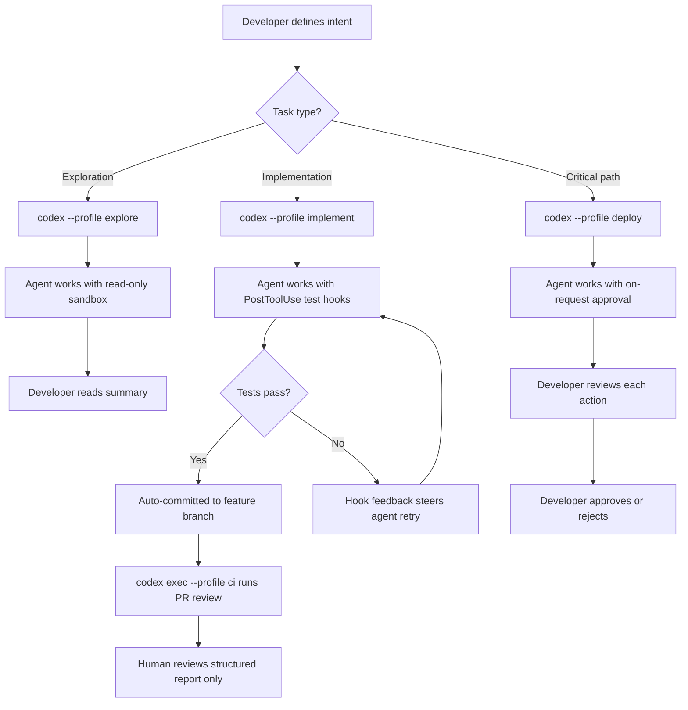

# Agentic Fatigue and the Verification Gap: Sustainable AI-Assisted Development with Codex CLI


---

## The Problem No One Budgeted For

AI coding agents have delivered on their promise of accelerating code production. They have not delivered on the implicit promise of making developers' lives easier. Sonar's 2026 State of Code Developer Survey — covering over 1,100 professional developers — reveals the core paradox: 96% of developers do not fully trust AI-generated code, yet only 48% always verify it before committing [^1]. Meanwhile, AI now accounts for 42% of committed code, projected to reach 65% by 2027 [^1].

The gap between what gets generated and what gets properly reviewed has a name: the **verification gap**. And it is burning developers out.

Evil Martians' widely cited analysis frames the mechanics bluntly: AI-first workflows compress the planning-crafting-result cycle into planning-result, eliminating the meditative code-writing phase that provided both comprehension and satisfaction [^2]. Developers report that reviewing AI output requires *more* mental effort than writing code themselves, while providing less fulfilment [^2]. Harvard Business Review research confirms that "cognitive exhaustion from intensive oversight of AI agents is both real and significant" [^2].

Anthropic's 2026 Agentic Coding Trends Report quantifies the delegation paradox: developers use AI in roughly 60% of their work but report being able to *fully delegate* only 0–20% of tasks [^3]. The remaining 40–60% sits in a twilight zone — agent-assisted but human-verified — where fatigue accumulates.

## Anatomy of Agentic Fatigue

Agentic fatigue is not ordinary tiredness. It is the cognitive overload from managing AI coding agents: constant micro-decisions on whether to trust output, context switching between agent tasks, and reviewing code you did not write but must ship anyway [^4].

Three mechanisms drive it:

### 1. Cognitive Debt

When you work with an agent, as it gains context, you lose it [^2]. The architecture, edge cases, and reasoning behind past decisions start living outside your head. You delegate not just writing the code but understanding the system. When something breaks, you lack the intuition to diagnose it quickly — and the agent's context window has long since compacted away the relevant history.

### 2. Compressed Decision Density

A developer using AI agents can produce 7x more code than teammates working without them [^4]. That 7x does not reduce the review burden — it multiplies it. Senior engineers become bottlenecks as they absorb disproportionate quality-assurance load from increasingly large agent-generated pull requests [^2]. Smartsheet's CPTO reports that "80% of AI-generated content requires manual editing before finalisation" [^4].

### 3. False Expectation Escalation

Initial productivity spikes become baseline expectations. When the inevitable slowdown arrives — complex domain logic, ambiguous requirements, integration edge cases — developers experience it as personal failure rather than the natural limit of agent capability [^2].

## The Verification Bottleneck in Numbers

Sonar's survey paints a stark operational picture [^1]:

| Metric | Value |
|--------|-------|
| Developers who do not fully trust AI-generated code | 96% |
| Developers who always verify before committing | 48% |
| AI's share of committed code (2026) | 42% |
| Developers reporting AI review requires more effort than human-code review | 38% |
| Weekly time spent checking, fixing, and validating AI output | 24% |
| Reduction in AI-caused outages for teams using automated quality gates | 44% |

The last row is the most important. Teams that shift verification from human eyeballs to automated tooling see measurably better outcomes. This is where Codex CLI's architecture becomes a genuine defence.

## Codex CLI as a Fatigue Defence Layer

Codex CLI was not designed to solve agentic fatigue, but its hook system, permission profiles, and `codex exec` pipeline provide the machinery to automate the verification that would otherwise land on a human reviewer's desk.

### Strategy 1: PostToolUse Hooks for Continuous Verification

Rather than reviewing agent output after the fact, intercept it during generation. A `PostToolUse` hook fires after every tool call — including shell commands and file writes — and can run tests, linters, or type checks automatically [^5].

```toml
# config.toml — auto-verify after every file write
[[hooks]]
event = "PostToolUse"
match_tool = "apply_patch"
command = "npm test -- --bail --watchAll=false 2>&1 | tail -20"
timeout_ms = 30000
```

When a PostToolUse hook exits with code 2, it does not undo the edit — it injects the error output as feedback to the model, steering the next iteration without human intervention [^5]. This creates a tight verify-correct loop that catches regressions before they reach a pull request.

### Strategy 2: PreToolUse Guards for Dangerous Operations

Rather than reviewing every command, codify your team's safety rules as PreToolUse hooks that block known-bad patterns automatically [^5]:

```toml
# Block database mutations outside migration files
[[hooks]]
event = "PreToolUse"
match_tool = "bash"
command = """
echo "$CODEX_EXEC_COMMAND" | grep -qE '(DROP|TRUNCATE|DELETE FROM)' && \
  echo '{"decision":"deny","reason":"Direct DB mutations blocked — use migration files"}' || \
  echo '{"decision":"approve"}'
"""
```

This eliminates an entire category of review anxiety. You stop worrying about what the agent *might* do because the hook system enforces boundaries mechanically.

### Strategy 3: Permission Profiles for Context-Appropriate Trust

Different tasks warrant different levels of agent autonomy. Rather than choosing a single approval policy and context-switching mentally, encode the trust levels as named profiles [^6]:

```toml
# ~/.codex/explore.config.toml — high trust for read-only exploration
model = "gpt-5.4-mini"
approval_policy = "unless-allow-listed"
sandbox_mode = "read-only"

# ~/.codex/implement.config.toml — moderate trust with test gates
model = "gpt-5.5"
approval_policy = "on-failure"
sandbox_mode = "workspace-write"

# ~/.codex/deploy.config.toml — low trust, human approval required
model = "gpt-5.5"
approval_policy = "on-request"
sandbox_mode = "workspace-write"
```

```bash
# Switch cognitive context with a flag, not a mental model
codex --profile explore "What does the auth middleware do?"
codex --profile implement "Add rate limiting to the API gateway"
codex --profile deploy "Prepare the release candidate"
```

Profiles externalise the trust decision. Instead of constantly evaluating "should I trust this output?", you decide once per task category and let the configuration enforce it.

### Strategy 4: codex exec Pipelines for Unattended Verification

The heaviest fatigue comes from monitoring long-running agent sessions. Move verification-heavy workflows to `codex exec` with `--output-schema` to get structured, machine-parseable results [^7]:

```bash
# Run a security audit unattended, get structured output
codex exec "Audit all API endpoints for authentication gaps. \
  For each gap, provide the file, line, endpoint, and severity." \
  --profile ci \
  --output-schema ./security-audit-schema.json \
  -o ./audit-results.json
```

```json
{
  "type": "object",
  "properties": {
    "gaps": {
      "type": "array",
      "items": {
        "type": "object",
        "properties": {
          "file": { "type": "string" },
          "line": { "type": "integer" },
          "endpoint": { "type": "string" },
          "severity": { "enum": ["critical", "high", "medium", "low"] }
        },
        "required": ["file", "line", "endpoint", "severity"]
      }
    }
  }
}
```

The structured output feeds directly into dashboards, Slack notifications, or CI gates — removing the human from the loop entirely for routine checks.

## The Sustainable Workflow Pattern

Combining these strategies produces a workflow that respects human cognitive limits:



The key insight: humans review *reports*, not *code*. The hook system handles line-by-line verification. The permission profiles handle trust calibration. The `codex exec` pipeline handles the gap between "code written" and "code shipped". What remains for the developer is architectural judgement, domain decisions, and the creative work that AI cannot reliably delegate.

## Practical Boundaries for Sustainable Development

Evil Martians' research [^2] and the Sonar data [^1] converge on actionable practices:

1. **Limit agent iterations to 3–4 per task.** If the agent has not converged after four attempts, the problem needs human decomposition, not more tokens.

2. **Reserve "craft hours" for manual coding.** Not every task should go through an agent. Deliberately writing code by hand maintains system comprehension and professional satisfaction.

3. **Track hours, not lines.** Goodhart's Law applies ruthlessly to AI-assisted development. Measuring output by lines of code or tokens consumed incentivises exactly the wrong behaviour [^4].

4. **Schedule review blocks, not review streams.** Batching agent-generated PRs into dedicated review sessions prevents the constant context-switching that drives fatigue.

5. **Use `codex doctor` as a daily health check.** A clean diagnostic report removes one category of ambient anxiety — "is my tooling even configured correctly?" — from the day [^8].

## The Delegation Gap Will Close — But Not Today

Anthropic's report predicts that agents will progress from short, one-off tasks to work that continues for hours or days, with humans checking progress at key points rather than reviewing every line [^3]. That future requires better verification tooling, not more human attention.

Codex CLI's hook system, permission profiles, and exec pipelines are not a complete solution to agentic fatigue. But they shift the burden from the most exhausting kind of work — line-by-line review of code you did not write — to the kind of work developers are actually good at: defining constraints, encoding team standards, and making architectural decisions.

The developers who thrive in the agent era will not be the ones who review the most code. They will be the ones who build the best verification infrastructure — and then step away from the screen.

---

## Citations

[^1]: Sonar, "2026 State of Code Developer Survey Report: The Current Reality of AI Coding," 2026. [https://www.sonarsource.com/blog/state-of-code-developer-survey-report-the-current-reality-of-ai-coding](https://www.sonarsource.com/blog/state-of-code-developer-survey-report-the-current-reality-of-ai-coding)

[^2]: Evil Martians, "AI-assisted engineers are burning out, is this fine?" Martian Chronicles, 2026. [https://evilmartians.com/chronicles/ai-assisted-engineers-are-burning-out-is-this-fine](https://evilmartians.com/chronicles/ai-assisted-engineers-are-burning-out-is-this-fine)

[^3]: Anthropic, "2026 Agentic Coding Trends Report," 2026. [https://resources.anthropic.com/2026-agentic-coding-trends-report](https://resources.anthropic.com/2026-agentic-coding-trends-report)

[^4]: Dev|Journal, "The Cost of AI-Generated Code: Solving Developer Decision Fatigue," 21 May 2026. [https://earezki.com/ai-news/2026-05-21-coding-agents-are-giving-everyone-decision-fatigue/](https://earezki.com/ai-news/2026-05-21-coding-agents-are-giving-everyone-decision-fatigue/)

[^5]: OpenAI, "Hooks — Codex CLI," OpenAI Developers, 2026. [https://developers.openai.com/codex/hooks](https://developers.openai.com/codex/hooks)

[^6]: OpenAI, "Advanced Configuration — Codex CLI," OpenAI Developers, 2026. [https://developers.openai.com/codex/config-advanced](https://developers.openai.com/codex/config-advanced)

[^7]: OpenAI, "Non-interactive mode — Codex CLI," OpenAI Developers, 2026. [https://developers.openai.com/codex/noninteractive](https://developers.openai.com/codex/noninteractive)

[^8]: OpenAI, "Command line options — Codex CLI," OpenAI Developers, 2026. [https://developers.openai.com/codex/cli/reference](https://developers.openai.com/codex/cli/reference)
