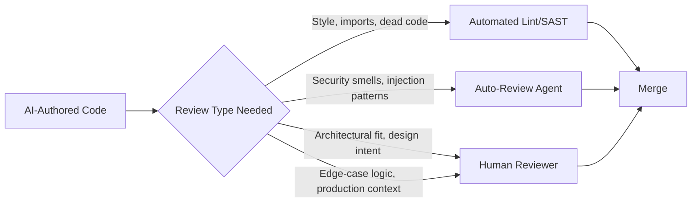
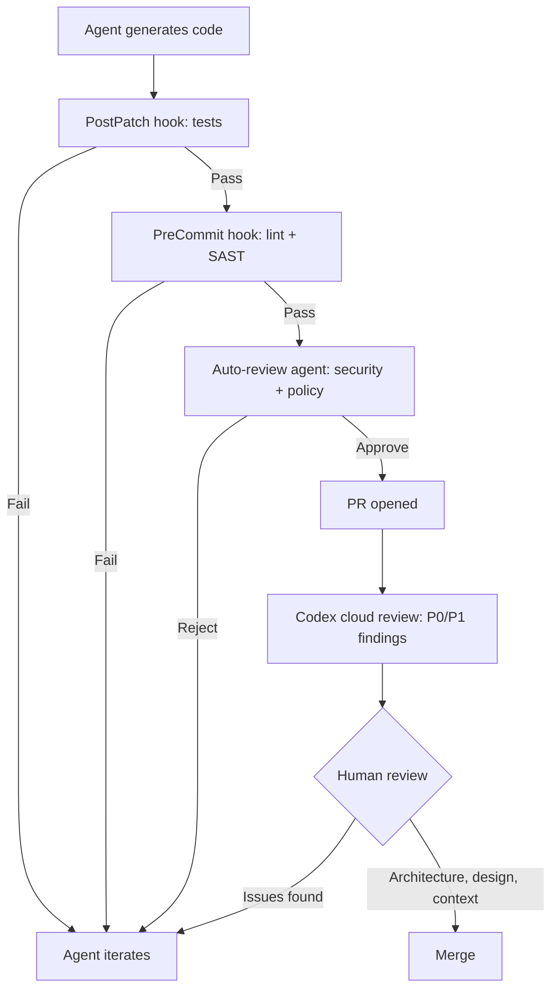

# The 80% Threshold: What Anthropic's AI-Builds-Itself Report Means for Your Codex CLI Review Workflows


---

On 4 June 2026, Anthropic published *When AI Builds Itself*, disclosing that more than 80% of the code merged into its production systems in May 2026 was authored by Claude [^1]. Engineers at the company now merge roughly eight times as much code per quarter as they did during the 2021–2025 baseline [^1]. Whether or not your team is anywhere near that ratio, the report crystallises a problem every team using Codex CLI will eventually face: **when the majority of your merged code is machine-generated, traditional review processes collapse under the volume**.

This article examines the data, maps it to the review bottleneck research, and provides concrete Codex CLI configuration patterns for teams scaling past the point where every diff can receive a careful human read.

## The Numbers Behind the Threshold

Anthropic's report contains several data points that matter for practitioners:

| Metric | Value | Source period |
|---|---|---|
| Share of merged code authored by AI | >80% | May 2026 [^1] |
| Productivity multiplier per engineer | 8× code merged per quarter | Q2 2026 vs 2021–2025 [^1] |
| Success rate on open-ended engineering problems | 76% | May 2026, up 50 points in six months [^1] |
| Automated review catch rate for past production bugs | ~33% | Retrospective analysis [^1] |
| Task duration capability (Claude Opus 4.6) | 12-hour tasks | March 2026 [^1] |

Meanwhile, independent research quantifies the review cost. Teams with high AI adoption merge 98% more pull requests, but PR review time increases by 91% [^2]. The Faros AI Productivity Paradox report projects that by mid-2026, AI-generated code volume will outstrip human review capacity by 40% [^2].

The mismatch is clear: agents produce code faster than humans can verify it.

## Why Traditional Code Review Breaks

The 80% threshold is not merely a quantity problem. AI-authored code shifts the *type* of errors reviewers must catch. Anthropic's own retrospective found that automated review would have caught approximately one-third of bugs behind past production incidents [^1] — meaning two-thirds required the kind of architectural judgement, team-context awareness, and system-level reasoning that remains a human skill [^3].



The practical implication: you need a **tiered review architecture** where machines handle the 70–80% of review surface they are good at, freeing human reviewers for the 20–30% that requires judgement. Codex CLI ships the primitives for exactly this.

## Configuring Codex CLI for High-Volume AI-Authored Code

### Layer 1: Auto-Review at the Sandbox Boundary

Codex CLI's auto-review mode replaces synchronous human approval with a secondary agent that evaluates boundary-crossing actions. OpenAI's own data shows a 99.1% approval rate on escalated actions and a 99.93% effective approval rate across all actions — reducing human interruptions by approximately 200× versus manual approval mode [^4].

The auto-review agent uses GPT-5.4 Thinking at low reasoning effort, targeting data exfiltration, credential exposure, irreversible deletions, and prompt injection attacks with 99.3% recall [^4].

Enable it in `config.toml`:

```toml
[codex]
approval_policy = "on-request"
approvals_reviewer = "auto_review"

[auto_review]
policy = """
Reject any action that:
- Reads or transmits files matching *.env, *credentials*, *secret*
- Executes curl/wget to external hosts not in the project's allow list
- Runs git push --force to main or master
- Deletes files outside the working directory
"""
```

### Layer 2: The Review Model for Diff Analysis

The `review_model` configuration key lets you assign a separate model to the `/review` command without changing your primary session model [^5]. This is critical for cost control: your generation model might be GPT-5.5 for quality, but your review model can be GPT-5.4-mini for speed and cost when reviewing high volumes.

```toml
[codex]
model = "gpt-5.5"
review_model = "gpt-5.4-mini"
```

Run reviews from the terminal:

```bash
# Review staged changes before commit
codex review

# Review against a base branch
codex review --base main

# Review with a specific focus
codex review --prompt "Focus on error handling and resource cleanup"
```

### Layer 3: Hooks as Automated Quality Gates

Codex CLI hooks execute at lifecycle events — `PostPatch`, `PreCommit`, `PostToolUse` — and can enforce verification without human intervention [^5]. When 80% of code is agent-authored, hooks become your automated regression net.

```toml
# Run tests after every patch application
[[hooks.PostPatch]]
description = "Run affected tests after each patch"

[[hooks.PostPatch.hooks]]
type = "command"
command = "make test-affected"

# Lint and type-check before any commit
[[hooks.PreCommit]]
description = "Enforce lint and type safety"

[[hooks.PreCommit.hooks]]
type = "command"
command = "npm run lint && npm run typecheck"

# Security scan after each tool execution
[[hooks.PostToolUse]]
description = "SAST scan on modified files"

[[hooks.PostToolUse.hooks]]
type = "command"
command = "semgrep --config auto --error $(git diff --name-only HEAD)"
```

### Layer 4: GitHub Integration for PR-Level Review

For teams using GitHub, Codex cloud review catches issues before human reviewers see the PR [^6]. Enable automatic reviews so that every PR receives an initial AI pass:

1. Enable "Automatic reviews" in Codex settings for the repository
2. Add review guidelines to your `AGENTS.md`:

```markdown
## Review guidelines

- Flag any function exceeding 50 lines without extracted helpers
- Reject hardcoded credentials or API keys in any form
- Require error handling on all async operations
- Verify that new public APIs have corresponding test coverage
```

Codex reacts with 👀, posts findings prioritised as P0/P1, and can push fixes if you reply `@codex fix the P1 issue` [^6].

## The Tiered Review Architecture

Combining these layers creates a pipeline where the human reviewer is the *last* gate, not the only one:



This architecture addresses the 91% review time increase [^2] by ensuring that by the time a human sees the diff, style issues, security smells, test failures, and policy violations have already been caught and resolved.

## What the Optimal Ratio Actually Is

The industry data suggests that 25–40% AI-authored code is the "optimal range" for most mature engineering teams, delivering 10–15% productivity gains whilst keeping review overhead manageable [^2]. Anthropic's 80% figure comes from an organisation that is *building the AI doing the writing* — a context few teams share.

The practical question is not "how do I get to 80%" but "how do I scale my verification infrastructure as the ratio climbs." The answer is the same at 30% as at 80%: **automate the automatable review surface and reserve human attention for judgement calls**.

⚠️ Anthropic's report omits methodology details on how the 80% figure was calculated, what proportion of AI-authored code required significant human revision before merge, and whether productivity gains distribute uniformly across task categories [^7]. Treat the headline figure as directional rather than prescriptive.

## Practical Recommendations

1. **Measure your ratio.** Before optimising review workflows, know what percentage of your merged code is agent-authored. Git attribution and Codex session logs make this trackable.

2. **Start with hooks, not auto-review.** `PostPatch` test hooks and `PreCommit` lint gates catch the highest volume of issues with the lowest configuration overhead.

3. **Use `review_model` for cost control.** At 80% AI-authored code, review token costs compound fast. A smaller, faster model for `/review` keeps costs proportional.

4. **Write `AGENTS.md` review guidelines for agents, not humans.** Agent reviewers need explicit, rule-based instructions — "reject functions over 50 lines" rather than "keep functions small."

5. **Shift human review to architecture.** The 33% of bugs that automated review catches are not the ones that cause production incidents. Train your reviewers to focus on design intent, system interaction, and edge cases that require production context [^3].

6. **Monitor auto-review rejection rates.** A sustained rejection rate above 5% signals either overly aggressive policy or a model that needs better AGENTS.md guidance.

## Citations

[^1]: Anthropic, "When AI builds itself — progress toward recursive self-improvement and its implications," 4 June 2026. [https://www.anthropic.com/institute/recursive-self-improvement](https://www.anthropic.com/institute/recursive-self-improvement)

[^2]: Faros AI, "The AI Productivity Paradox Research Report," 2026. [https://www.faros.ai/blog/ai-software-engineering](https://www.faros.ai/blog/ai-software-engineering)

[^3]: Nimbalyst, "AI Code Review Tools for Engineering Teams (2026)." [https://nimbalyst.com/blog/ai-code-review-tools-for-engineering-teams-2026/](https://nimbalyst.com/blog/ai-code-review-tools-for-engineering-teams-2026/)

[^4]: OpenAI Alignment, "Auto-review of agent actions without synchronous human oversight," April 2026. [https://alignment.openai.com/auto-review/](https://alignment.openai.com/auto-review/)

[^5]: OpenAI, "Configuration Reference – Codex," 2026. [https://developers.openai.com/codex/config-reference](https://developers.openai.com/codex/config-reference)

[^6]: OpenAI, "Code review in GitHub – Codex," 2026. [https://developers.openai.com/codex/integrations/github](https://developers.openai.com/codex/integrations/github)

[^7]: ChatForest, "When AI Builds Itself: Anthropic's 80% Code Threshold and What It Means for Your Engineering Team," June 2026. [https://chatforest.com/builders-log/anthropic-when-ai-builds-itself-80-percent-code-recursive-self-improvement-builder-guide/](https://chatforest.com/builders-log/anthropic-when-ai-builds-itself-80-percent-code-recursive-self-improvement-builder-guide/)
