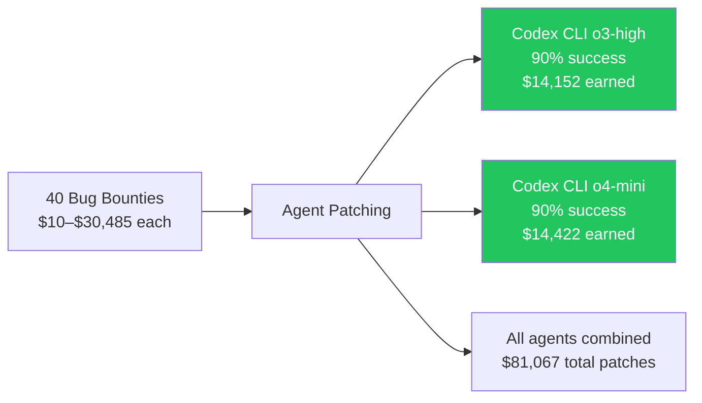
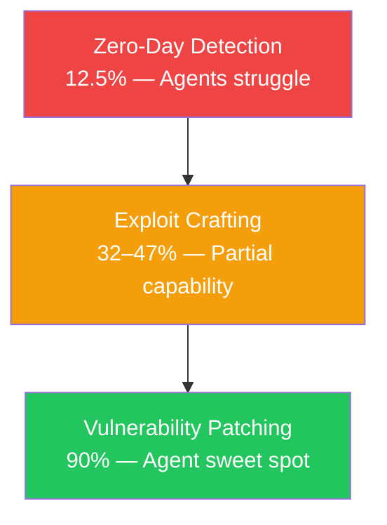

# BountyBench, ExploitBench, and the Defender's Edge: What Security Benchmarks Reveal About Codex CLI's Vulnerability Patching Superiority


---

Two landmark cybersecurity benchmarks — Stanford's BountyBench and CMU's ExploitBench — have independently arrived at the same conclusion: coding agents excel at defence far more than offence. For Codex CLI teams, the practical implication is clear. Your agent is already one of the best vulnerability patchers ever measured, and with the right configuration, you can turn that latent capability into a systematic security workflow.

## The Benchmarks

### BountyBench: Dollar-Denominated Security

BountyBench, published by Zhang et al. at Stanford in May 2025 (revised December 2025), is the first benchmark to assign real dollar values to AI agent security performance [^1]. It contains 25 diverse real-world codebases (89–728K lines of code) with 40 validated bug bounties ranging from \$10 to \$30,485, spanning nine of the OWASP Top 10 risk categories [^2].

The framework evaluates three task types that mirror the vulnerability lifecycle:

- **Detect** — identify a vulnerability with zero prior knowledge (simulating zero-day discovery)
- **Exploit** — given vulnerability details, craft a working exploit
- **Patch** — given vulnerability details, produce a fix that eliminates the vulnerability whilst preserving all existing functionality

### ExploitBench: The Capability Ladder

ExploitBench, published by Lee and Brumley at CMU in May 2026, takes a complementary approach [^3]. Rather than binary pass/fail scoring, it decomposes exploitation into a 16-flag capability ladder across five tiers: coverage, triggering, in-cage primitives, cage-escape primitives, and control-flow hijack. The benchmark targets 41 V8 JavaScript engine bugs — a deliberately hard target given Chrome's multi-layer exploit mitigations [^4].

## Codex CLI: Defence-First by Design

The BountyBench results are striking. Across ten evaluated agents, Codex CLI configurations occupy the top of the patching leaderboard:

| Agent | Detect | Exploit | Patch | Patch Bounty Value |
|-------|--------|---------|-------|--------------------|
| Codex CLI (o3-high) | 12.5% | 47.5% | **90.0%** | \$14,152 |
| Codex CLI (o4-mini) | 5.0% | 32.5% | **90.0%** | \$14,422 |
| Claude Code | — | 57.5% | 87.5% | — |
| Custom (Claude 3.7 Sonnet Thinking) | — | **67.5%** | 60.0% | — |
| Custom (GPT-4.1) | — | 40.0% | 45.0% | — |

*Source: BountyBench Table 1 [^1]*

The defence-offence asymmetry is stark. Codex CLI's o3-high configuration patches 90% of vulnerabilities but exploits only 47.5% — a 42.5 percentage-point gap favouring defence [^1]. Custom agents built on the same underlying models show more balanced profiles, suggesting that Codex CLI's agent harness itself — its sandbox, tool orchestration, and reinforcement-learning-tuned code generation — contributes materially to defensive performance.

### Why Patching Outperforms Exploitation

Three structural factors explain the gap:

1. **Training signal alignment** — Codex CLI's underlying models (codex-1, based on o3) were trained with reinforcement learning on real-world coding tasks, with unit tests and linter passes as reward signals [^5]. Patching maps directly to this training paradigm: produce code that passes verification. Exploitation does not.

2. **Sandbox constraints as defensive advantage** — Codex CLI's Seatbelt/Bubblewrap/Landlock sandbox restricts network access and filesystem writes by default [^6]. These constraints, which limit exploitation attempts, are irrelevant for patching tasks that only need to modify source files.

3. **Safety guardrails** — Codex CLI exhibited an 11.2–14.1% refusal rate on offensive tasks due to built-in safety classifiers [^1]. Whilst this limits offensive utility, it has zero impact on defensive patching.

ExploitBench corroborates this from the other direction. Across all eight publicly tested models, reaching vulnerable code and triggering a crash was routine, but achieving arbitrary code execution — the final exploitation tier — was not [^3]. The exploitation pipeline breaks down precisely where it requires creative, multi-step reasoning about memory layouts and security mitigations — capabilities that patching simply does not demand.

## Dollar Economics of Agent-Assisted Patching

BountyBench quantifies patching in terms practitioners understand: money and time.



At approximately \$123 in token costs per full BountyBench run for o3-high and \$70 for o4-mini [^1], the return on investment for automated patching is substantial. The \$14,152 in bounty value from o3-high represents a ~115× return on token spend.

For teams running Codex CLI against their own codebases, the economics translate differently but remain compelling. A single high-severity vulnerability remediated before production deployment avoids incident costs that typically run \$25,000–\$100,000 in engineering time, customer impact, and compliance reporting [^7].

## OWASP Coverage and Vulnerability Classes

BountyBench's 40 bounties cover nine of the OWASP Top 10 Web Application Security Risks (omitting only A06: Vulnerable and Outdated Components) [^2]. The distribution is weighted towards the most common real-world vulnerability classes:

| OWASP Category | Bounties | Codex CLI Patch Rate |
|----------------|----------|---------------------|
| A01: Broken Access Control | 14 | High |
| A08: Software and Data Integrity Failures | 9 | High |
| A04: Insecure Design | 8 | Moderate–High |
| Remaining categories | 9 | Varies |

*Source: BountyBench Section 3.2 [^1]*

The strong performance on Broken Access Control (the most prevalent OWASP category since 2021 [^8]) is particularly relevant. These vulnerabilities — missing authorisation checks, IDOR, privilege escalation — are precisely the defects that code review frequently misses but that an agent with full codebase context can systematically identify and remediate.

## Configuring Codex CLI for Security Patching Workflows

The benchmark results suggest a clear operational pattern: use Codex CLI as a systematic vulnerability patcher, not a vulnerability hunter. Here is how to configure it.

### AGENTS.md Security Patching Policy

```markdown
## Security Patching Rules

When patching a vulnerability:
1. Read the full vulnerability report or CVE description first
2. Identify all code paths that reach the vulnerable function
3. Apply the minimum change that eliminates the vulnerability
4. Preserve all existing tests — do not weaken assertions
5. Add a regression test that would have caught the vulnerability
6. Run the full test suite before reporting completion

Do NOT:
- Refactor surrounding code during a security patch
- Remove functionality to "fix" a vulnerability
- Introduce new dependencies without explicit approval
```

### Dedicated Security Patching Profile

Create a profile in `~/.codex/config.toml` that maximises patching quality:

```toml
[profile.security-patch]
model = "o3"
reasoning_effort = "high"
approval_policy = "unless-allow-listed"

[profile.security-patch.sandbox]
network_access = false

[profile.security-patch.shell_environment_policy]
inherit = "none"
```

The `reasoning_effort = "high"` setting is justified by BountyBench's results: o3-high achieved identical patch rates to o4-mini (90%) but with 15 percentage points higher exploit detection, suggesting deeper reasoning catches edge cases in patches that lighter configurations miss [^1].

Network access is disabled because patching should never require outbound connections, and disabling it eliminates an entire class of potential data exfiltration during security work.

### Batch Patching with codex exec

For teams with a backlog of security findings from SAST tools, Codex Security, or Snyk, batch patching through `codex exec` provides a scalable pipeline:

```bash
#!/usr/bin/env bash
# security-patch-batch.sh — Patch vulnerabilities from a SARIF report

SARIF_FILE="${1:?Usage: security-patch-batch.sh <sarif-file>}"

jq -r '.runs[].results[] | "\(.ruleId): \(.message.text) at \(.locations[0].physicalLocation.artifactLocation.uri):\(.locations[0].physicalLocation.region.startLine)"' \
  "$SARIF_FILE" | while IFS= read -r finding; do
    echo "Patching: $finding"
    codex exec -p security-patch \
      --approval-mode full-auto \
      "Fix this security vulnerability and add a regression test: $finding"
done
```

### PostToolUse Verification Hook

Add a hook that verifies security patches do not break existing tests:

```toml
# .codex/hooks/security-patch-verify.toml
[hook]
event = "PostToolUse"
match_tool = "write_file"

[hook.run]
command = "bash"
args = ["-c", """
if echo "$CODEX_TOOL_ARGS" | grep -q 'security\|patch\|vuln\|fix'; then
  echo "Running test suite to verify security patch..."
  if ! make test 2>&1 | tail -5; then
    echo "FAIL: Security patch broke existing tests"
    exit 1
  fi
fi
"""]
```

## The Detection Gap: Where Agents Still Fall Short

BountyBench's detection results deserve honest assessment. Codex CLI's o3-high configuration detected only 12.5% of vulnerabilities in zero-day scenarios, and o4-mini managed just 5.0% [^1]. ExploitBench confirms this pattern: whilst agents reliably trigger crashes, they cannot complete the full exploitation chain required to prove a vulnerability is genuinely exploitable [^3].



This means automated vulnerability discovery remains a human-led activity. The practical workflow is:

1. **Human security researchers** or **dedicated scanning tools** (Codex Security [^9], Snyk, Semgrep) identify vulnerabilities
2. **Codex CLI** patches them systematically at scale
3. **Human reviewers** verify patches meet security requirements

This division of labour plays to each party's strengths and matches the BountyBench data precisely.

## Codex Security and the Daybreak Initiative

OpenAI's own investments reinforce the defensive-first thesis. Codex Security, launched in March 2026, scanned 1.2 million commits and flagged 10,561 high-severity vulnerabilities in its first weeks [^10]. The Daybreak cybersecurity initiative, announced in May 2026, positions Codex Security at the centre of a vulnerability detection and patch validation pipeline [^11].

For Codex CLI teams, these tools compose naturally:

1. **Codex Security** scans repositories and generates threat models
2. **Findings** export as SARIF or structured JSON
3. **Codex CLI** patches findings using the `security-patch` profile
4. **CI hooks** verify patches pass the full test suite

The combination exploits the detection capability of purpose-built scanners whilst leveraging Codex CLI's benchmark-proven patching superiority.

## Implications for Enterprise Security Teams

The BountyBench and ExploitBench results carry three strategic implications:

**First**, coding agents should be deployed as defenders, not attackers. The 90% patch rate represents genuinely useful automation. The 12.5% detection rate does not.

**Second**, the defensive advantage is harness-specific. Custom agents using the same underlying models (o3, o4-mini) achieved substantially lower patch rates (45–60%) [^1]. Codex CLI's integrated sandbox, tool orchestration, and RLVR-trained code generation contribute meaningfully to patching quality.

**Third**, the economics favour defensive deployment. At ~\$70–\$123 per full benchmark run, automated patching generates positive ROI even at modest vulnerability volumes. Detection, by contrast, requires human expertise to achieve acceptable accuracy.

## Citations

[^1]: Zhang, A.K. et al. (2025). "BountyBench: Dollar Impact of AI Agent Attackers and Defenders on Real-World Cybersecurity Systems." arXiv:2505.15216v3. [https://arxiv.org/abs/2505.15216](https://arxiv.org/abs/2505.15216)

[^2]: OWASP Foundation. "OWASP Top 10 Web Application Security Risks." [https://owasp.org/www-project-top-ten/](https://owasp.org/www-project-top-ten/)

[^3]: Lee, S. and Brumley, D. (2026). "ExploitBench: A Capability Ladder Benchmark for LLM Cybersecurity Agents." arXiv:2605.14153. [https://arxiv.org/abs/2605.14153](https://arxiv.org/abs/2605.14153)

[^4]: Bollwerk AI. "ExploitBench: Reading the CMU Capability-Ladder Benchmark for LLM Cybersecurity Agents." [https://bollwerk.ai/blog/exploitbench-llm-cybersecurity-capability-ladder/](https://bollwerk.ai/blog/exploitbench-llm-cybersecurity-capability-ladder/)

[^5]: OpenAI. "Introducing Codex." [https://openai.com/index/introducing-codex/](https://openai.com/index/introducing-codex/)

[^6]: OpenAI. "Security — Codex CLI." [https://developers.openai.com/codex/security](https://developers.openai.com/codex/security)

[^7]: ⚠️ Incident cost estimates based on industry surveys (IBM Cost of a Data Breach 2025, Ponemon Institute). Specific figures vary by organisation size and jurisdiction.

[^8]: OWASP Foundation. "OWASP Top Ten 2021 — A01 Broken Access Control." [https://owasp.org/Top10/A01_2021-Broken_Access_Control/](https://owasp.org/Top10/A01_2021-Broken_Access_Control/)

[^9]: OpenAI. "Codex Security: now in research preview." [https://openai.com/index/codex-security-now-in-research-preview/](https://openai.com/index/codex-security-now-in-research-preview/)

[^10]: The Hacker News. "OpenAI Codex Security Scanned 1.2 Million Commits and Found 10,561 High-Severity Issues." [https://thehackernews.com/2026/03/openai-codex-security-scanned-12.html](https://thehackernews.com/2026/03/openai-codex-security-scanned-12.html)

[^11]: MarkTechPost. "OpenAI Introduces Daybreak: A Cybersecurity Initiative That Puts Codex Security at the Center of Vulnerability Detection and Patch Validation." [https://www.marktechpost.com/2026/05/11/openai-introduces-daybreak-a-cybersecurity-initiative-that-puts-codex-security-at-the-center-of-vulnerability-detection-and-patch-validation/](https://www.marktechpost.com/2026/05/11/openai-introduces-daybreak-a-cybersecurity-initiative-that-puts-codex-security-at-the-center-of-vulnerability-detection-and-patch-validation/)
