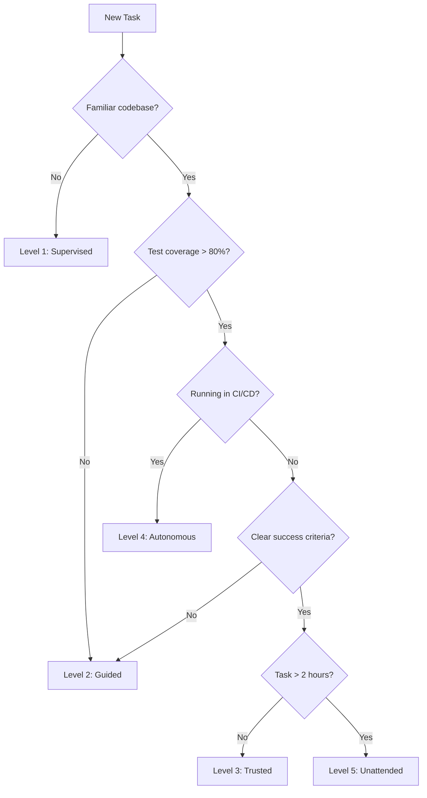

# The Codex CLI Delegation Spectrum: Five Levels of Agent Autonomy and How to Configure Each One


---

The data is in, and it tells an awkward story. Anthropic's 2026 Agentic Coding Trends Report found that developers use AI in roughly 60% of their work — but report being able to fully delegate only 0–20% of tasks [^1]. The METR productivity studies, redesigned in February 2026, measured a net effect that ranged from modest gains to a statistically insignificant -4% in their controlled experiment [^2]. Meanwhile, the Stanford HAI AI Index 2026 reports SWE-bench Verified scores jumping from 60% to near 100% in a single year [^3].

The gap between what agents *can* solve on benchmarks and what developers *actually* delegate is not a tooling failure. It is a configuration problem. Most teams run Codex CLI at a single autonomy level — usually whatever the default shipped — and wonder why the agent either interrupts too often or produces unreliable output. The fix is to treat delegation as a spectrum, with distinct configuration profiles for each level.

This article defines five delegation levels, maps each to specific Codex CLI configuration, and provides the `config.toml` profiles you need to move between them deliberately.

## Why a Spectrum Matters

The delegation gap exists because different tasks demand different levels of human oversight [^1]. A formatting fix needs no supervision. A database migration touching production schemas needs every command reviewed. Running the same approval policy for both wastes either human attention or safety margin.

Codex CLI's configuration system — `approval_policy`, `sandbox_mode`, `model`, `model_reasoning_effort`, and named profiles — gives you the machinery to express these distinctions precisely [^4]. The problem is that most developers never move beyond the default.


## Level 1: Supervised — Every Action Reviewed

**Use when:** Exploring unfamiliar codebases, working in regulated environments, onboarding new team members to agent-assisted workflows.

At this level the agent suggests; the human decides. Every file edit and every shell command requires explicit approval. This is the METR study configuration — and it is where measured productivity gains are smallest, because the human review overhead dominates [^2].

```toml
# ~/.codex/supervised.config.toml
model = "gpt-5.5"
model_reasoning_effort = "high"
approval_policy = "untrusted"
sandbox_mode = "read-only"
```

Activate with:

```bash
codex --profile supervised "Explain the authentication flow in this codebase"
```

**Key configuration choices:**

- `approval_policy = "untrusted"` requires approval for every tool call [^4].
- `sandbox_mode = "read-only"` prevents any filesystem writes, even accidental ones.
- `model_reasoning_effort = "high"` is worth the token cost here because you want thorough explanations, not rapid iteration.

This level maps to what Anthropic calls the "assistant" mode — AI as a search engine with code understanding [^1]. It is appropriate for the first hour with any new codebase.

## Level 2: Guided — Auto-Edit, Confirm Commands

**Use when:** Day-to-day feature development, refactoring, writing tests where the code changes are low-risk but shell commands need oversight.

This is where most productive daily work happens. The agent writes and edits files freely but pauses before executing shell commands. You review `npm test` before it runs, but you do not review every line insertion.

```toml
# ~/.codex/guided.config.toml
model = "gpt-5.5"
model_reasoning_effort = "medium"
approval_policy = "on-request"
sandbox_mode = "workspace-write"

[sandbox_workspace_write]
writable_roots = ["."]
network_access = false
```

```bash
codex --profile guided "Add input validation to the user registration endpoint"
```

**Key configuration choices:**

- `approval_policy = "on-request"` auto-approves file edits but prompts for shell commands [^4].
- `sandbox_mode = "workspace-write"` constrains writes to the current workspace, preventing the agent from modifying files outside the project.
- `model_reasoning_effort = "medium"` balances speed and accuracy — you are iterating, not producing a final answer.
- `network_access = false` prevents the agent from making outbound requests, a sensible default when you are editing application code.

The Stanford AI Index's 14–26% productivity gain figure likely reflects this level of delegation [^3]. The agent handles the mechanical work; the developer steers.

## Level 3: Trusted — Full Auto with Safety Rails

**Use when:** Well-tested codebases with CI gates, experienced developers working on familiar code, tasks with clear success criteria (passing tests, linting, type checks).

At this level you let the agent run. It edits files, executes commands, and iterates on test failures without asking. The safety net shifts from human approval to automated verification — hooks, test suites, and sandbox constraints.

```toml
# ~/.codex/trusted.config.toml
model = "gpt-5.5"
model_reasoning_effort = "medium"
approval_policy = "never"
sandbox_mode = "workspace-write"

[sandbox_workspace_write]
writable_roots = ["."]
network_access = false
```

```bash
codex --profile trusted "Fix the failing test in src/auth/__tests__/login.test.ts"
```

**Critical prerequisite:** This level only works safely with hooks that enforce verification:

```toml
# In your project's .codex/config.toml
[[hooks]]
event = "on_agent_turn_end"
command = "npm test -- --bail"
policy = "stop-on-fail"
```

The hook ensures the agent cannot declare success without passing the test suite [^5]. Without hooks, Level 3 is Level 5 in disguise — and that is where token budgets explode and code quality degrades.

This is the level where Anthropic's delegation gap begins to close. The human is not reviewing individual actions; they are reviewing outcomes [^1].

## Level 4: Autonomous — Batch Pipeline Execution

**Use when:** CI/CD pipelines, scheduled maintenance tasks, code review automation, bulk operations across repositories.

At this level the agent runs without a human present, typically via `codex exec` in a pipeline. The configuration shifts to emphasise determinism and cost control.

```toml
# ~/.codex/autonomous.config.toml
model = "gpt-5.4"
model_reasoning_effort = "low"
approval_policy = "never"
sandbox_mode = "workspace-write"

[sandbox_workspace_write]
writable_roots = ["."]
network_access = false
```

```bash
codex exec \
  --profile autonomous \
  --max-turns 30 \
  --output-schema '{"result": "string", "files_changed": ["string"]}' \
  "Update all deprecated API calls from v2 to v3 format"
```

**Key configuration choices:**

- `model = "gpt-5.4"` trades frontier capability for cost efficiency in batch operations [^6]. For most rote transformations, the smaller model is sufficient.
- `model_reasoning_effort = "low"` reduces token consumption further — batch tasks are usually well-defined and do not need deep reasoning.
- `--max-turns 30` caps runaway loops. In unattended mode, loop detection is your primary safety mechanism.
- `--output-schema` forces structured output, making the result parseable by downstream pipeline steps [^7].

This level corresponds to the GitHub Actions integration pattern: Codex runs as a step in your workflow, produces structured output, and the pipeline decides what to do with it [^8].

## Level 5: Unattended — Goal-Driven Long-Horizon Tasks

**Use when:** Multi-hour engineering tasks with clear specifications, overnight code modernisation, large-scale migrations where human review happens at completion rather than during execution.

This is Codex CLI's goal mode, which became generally available in v0.136 [^9]. The agent pursues an objective over hours, managing its own context window, compacting history, and persisting progress.

```toml
# ~/.codex/unattended.config.toml
model = "gpt-5.5"
model_reasoning_effort = "high"
plan_mode_reasoning_effort = "xhigh"
approval_policy = "never"
sandbox_mode = "workspace-write"

[sandbox_workspace_write]
writable_roots = ["."]
network_access = true
```

```bash
codex goal \
  --profile unattended \
  --budget 50000 \
  "Migrate the authentication module from Express middleware to Hono middleware, maintaining all existing test coverage"
```

**Key configuration choices:**

- `model_reasoning_effort = "high"` is justified for long-horizon tasks where a wrong turn wastes thousands of tokens.
- `plan_mode_reasoning_effort = "xhigh"` gives the agent maximum reasoning depth during planning phases [^4].
- `network_access = true` enables the agent to fetch documentation, check API endpoints, and verify external dependencies.
- `--budget 50000` sets a hard token ceiling to prevent runaway costs [^9].

This is the 0–20% of tasks that Anthropic found developers can fully delegate [^1]. The key insight: it is 0–20% of *task volume*, not 0–20% of *value*. A well-configured Level 5 run that completes a multi-day migration overnight can deliver more business value than a week of Level 2 pair programming.

## Choosing Your Level: A Decision Framework



The framework is deliberately conservative. Moving up a level should feel earned, not defaulted. The Stanford data shows that even experienced developers overestimate their own productivity gains by roughly 2x [^3] — which means they also overestimate how much they can safely delegate.

## Profile Management in Practice

Store all five profiles in `~/.codex/`:

```bash
ls ~/.codex/
# config.toml                  # base configuration
# supervised.config.toml       # Level 1
# guided.config.toml           # Level 2 (default for most teams)
# trusted.config.toml          # Level 3
# autonomous.config.toml       # Level 4
# unattended.config.toml       # Level 5
```

Set your team's default in the project's `.codex/config.toml`:

```toml
# .codex/config.toml — committed to repository
profile = "guided"
```

Individual developers override with `--profile` when they need a different level. Enterprise teams can enforce maximum autonomy levels via `requirements.toml`:

```toml
# requirements.toml — admin-enforced, cannot be overridden
approval_policy = "on-request"  # prevents anyone from running Level 3+
```

This is particularly relevant after v0.137's cloud-managed config bundle support, which lets enterprise administrators push `requirements.toml` constraints to all CLI installations without touching individual machines [^10].

## The Research-Configuration Feedback Loop

The METR studies highlight a critical methodological problem: most productivity measurements test a *single* delegation level [^2]. When METR measured a -4% effect, they were measuring Level 1 supervision overhead. When teams self-report 2x productivity gains, they are likely averaging across Levels 2–4 without disaggregating.

The practical implication for Codex CLI users: track which profile you use for which tasks. The `codex` CLI writes session metadata to `~/.codex/sessions/`, and tools like `ccusage` and `codex-trace` can correlate profile choice with session cost and outcome [^11]. Over time, this data tells you where to move up the spectrum — and more importantly, where to stay put.

## Conclusion

The delegation gap is not an inherent limitation of AI coding agents. It is the gap between what is possible with deliberate configuration and what happens when teams use a single `approval_policy` for everything. Codex CLI gives you the configuration surface to close that gap — five profiles, five levels of autonomy, each mapped to specific task characteristics and risk tolerances.

Start with Level 2 as your daily driver. Earn Level 3 with test coverage and hooks. Reserve Level 5 for tasks with clear specifications and budget constraints. The spectrum is not a ladder to climb; it is a toolkit to select from.

---

## Citations

[^1]: Anthropic, "2026 Agentic Coding Trends Report," February 2026. [https://resources.anthropic.com/hubfs/2026%20Agentic%20Coding%20Trends%20Report.pdf](https://resources.anthropic.com/hubfs/2026%20Agentic%20Coding%20Trends%20Report.pdf)

[^2]: METR, "We are Changing our Developer Productivity Experiment Design," February 2026. [https://metr.org/blog/2026-02-24-uplift-update/](https://metr.org/blog/2026-02-24-uplift-update/)

[^3]: Stanford HAI, "The 2026 AI Index Report," April 2026. [https://hai.stanford.edu/ai-index/2026-ai-index-report](https://hai.stanford.edu/ai-index/2026-ai-index-report)

[^4]: OpenAI, "Configuration Reference — Codex CLI," 2026. [https://developers.openai.com/codex/config-reference](https://developers.openai.com/codex/config-reference)

[^5]: OpenAI, "Hooks — Codex CLI Features," 2026. [https://developers.openai.com/codex/cli/features](https://developers.openai.com/codex/cli/features)

[^6]: OpenAI, "Models — Codex," 2026. [https://developers.openai.com/codex/models](https://developers.openai.com/codex/models)

[^7]: OpenAI, "CLI Reference — Command Line Options," 2026. [https://developers.openai.com/codex/cli/reference](https://developers.openai.com/codex/cli/reference)

[^8]: OpenAI, "GitHub Action — Codex," 2026. [https://developers.openai.com/codex/github-action](https://developers.openai.com/codex/github-action)

[^9]: OpenAI, "Codex Changelog — v0.136.0," June 2026. [https://developers.openai.com/codex/changelog](https://developers.openai.com/codex/changelog)

[^10]: OpenAI, "Managed Configuration — Codex Enterprise," 2026. [https://developers.openai.com/codex/enterprise/managed-configuration](https://developers.openai.com/codex/enterprise/managed-configuration)

[^11]: Daniel Vaughan, "Codex CLI Session Forensics: JSONL Post-Mortems," June 2026. [https://codex.danielvaughan.com/2026/06/05/codex-cli-session-forensics-jsonl-post-mortems-codex-trace-cass-ccusage/](https://codex.danielvaughan.com/2026/06/05/codex-cli-session-forensics-jsonl-post-mortems-codex-trace-cass-ccusage/)
