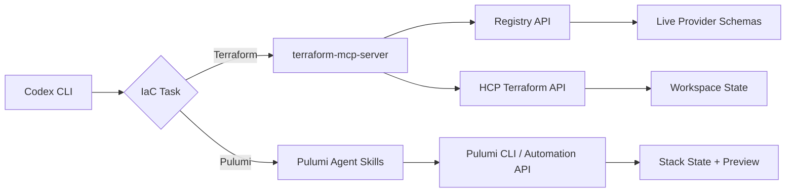
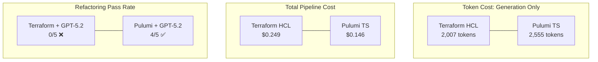

# Codex CLI for Infrastructure as Code: Terraform MCP, Pulumi Agent Skills, and the Agentic IaC Stack


---

Over one-fifth of all Pulumi operations are now handled by AI agents, up from virtually zero a year ago[^1]. HashiCorp ships an official MCP server at v0.5.2 that gives coding agents real-time registry access[^2]. TerraShark's 600-token activation cost means a Terraform skill session barely dents your context window[^3]. The infrastructure-as-code surface is no longer something you point an agent at and hope for the best — it is a first-class agentic workflow with dedicated tooling on both sides of the HCL-vs-general-purpose-language divide.

This article maps the three layers of that tooling — MCP servers for live registry data, Agent Skills for codified best practices, and Codex CLI configuration for safe execution — into a unified IaC workflow for senior practitioners.

## The Problem: Why Agents Hallucinate Infrastructure

LLMs trained on code corpora know the shape of Terraform and Pulumi configurations, but their training data is a snapshot. Provider APIs change between model releases. Resource arguments get deprecated. Module interfaces evolve. The result is plausible-looking HCL or TypeScript that references non-existent attributes or uses outdated provider syntax[^3].

Pulumi's own benchmarks quantify the gap. In refactoring tasks, GPT-5.2-Codex achieved a 0/5 pass rate with Terraform HCL versus 4/5 with Pulumi TypeScript — not because HCL is harder to write, but because TypeScript's type errors gave the model enough information to self-correct while HCL's plan errors did not[^4].

The fix is not to choose one IaC framework over another. It is to give the agent live registry data (MCP), structured best-practice knowledge (Skills), and a safe execution sandbox (Codex CLI's approval and sandbox layers).

## Layer 1: MCP Servers for Live Registry Data

### Terraform MCP Server

HashiCorp's official `terraform-mcp-server` (v0.5.2) connects Codex CLI to the Terraform Registry and HCP Terraform APIs[^2]. It supports both stdio and StreamableHTTP transports.

Add it to your project's `.codex/config.toml`:

```toml
[mcp_servers.terraform]
command = "docker"
args = [
  "run", "-i", "--rm",
  "-e", "TFE_TOKEN=${TFE_TOKEN}",
  "hashicorp/terraform-mcp-server:0.5.2"
]
```

The server exposes toolsets for:

- **Registry operations** — provider and module search, version details, schema introspection
- **Workspace management** — create, update, list, and delete HCP Terraform workspaces
- **Run management** — trigger and monitor Terraform runs from inside the agent session
- **Stacks support** — added in v0.4, enabling multi-component deployment orchestration[^5]

For teams using HCP Terraform or Terraform Enterprise, set the `TFE_ADDRESS` environment variable to your instance URL. The server authenticates via `TFE_TOKEN` using standard HashiCorp API tokens[^2].

### Pulumi MCP Integration

Pulumi takes a different approach. Rather than a standalone MCP server, Pulumi's agent integration works through the Pulumi CLI itself and the new `pulumi do` command for direct resource operations[^1]. The Pulumi Automation API — exposed as an Agent Skill — allows programmatic stack management from within the agent session[^6].



## Layer 2: Agent Skills for Codified Best Practices

MCP gives the agent live data. Skills give it judgement. Three skill ecosystems now target IaC workflows.

### HashiCorp Agent Skills

HashiCorp's official skill collection covers Terraform code generation, module design, provider development, and a style guide enforcing documented conventions[^7]. Install via the skills CLI:

```bash
npx skills add hashicorp/agent-skills/terraform/code-generation
npx skills add hashicorp/agent-skills/terraform/refactor-module
```

For Codex CLI, these install into `.codex/skills/` and activate automatically when the agent detects Terraform context in the working directory.

### Pulumi Agent Skills

Pulumi ships eight skills in two groups[^6]:

**Authoring** (4 skills):
- Best practices — outputs, components, secrets, aliases
- ComponentResource design and multi-language support
- Automation API — programmatic orchestration patterns
- Pulumi ESC — secrets and configuration management with OIDC

**Migration** (4 skills):
- Terraform to Pulumi
- CloudFormation to Pulumi
- AWS CDK to Pulumi
- Azure Resource Manager / Bicep to Pulumi

Install for Codex CLI:

```bash
npx skills add pulumi/agent-skills --skill '*'
```

Skills activate based on context. When Codex detects a `Pulumi.yaml` in the project root, the authoring skills load automatically. Migration skills activate when the prompt mentions conversion or when Terraform files are present alongside Pulumi configuration.

### TerraShark: The Anti-Hallucination Skill

TerraShark takes a different approach from the vendor skills. Rather than providing reference documentation, it imposes a structured diagnostic workflow that forces the agent through seven steps before generating any infrastructure code[^3]:

1. Problem decomposition
2. Failure-mode identification (before code generation)
3. Solution design
4. Explicit risk controls for every change
5. Implementation
6. Validation
7. Output contract with assumptions, trade-offs, and rollback notes

TerraShark maps every piece of guidance to one of five failure modes: identity churn, secret exposure, blast radius, CI drift, and compliance gate gaps[^3]. It includes explicit mappings for ISO 27001, SOC 2, FedRAMP, GDPR, PCI DSS, and HIPAA.

The token economics matter. TerraShark activates at roughly 600 tokens and uses 19 granular reference files loaded on demand, compared to approximately 4,400 tokens for the broader `terraform-skill` package[^3].

Install by cloning into your skills directory:

```bash
git clone https://github.com/LukasNiessen/terrashark.git \
  .codex/skills/terrashark
```

## Layer 3: Codex CLI Configuration for Safe IaC Execution

Infrastructure changes are irreversible. A `terraform apply` or `pulumi up` against a production workspace cannot be undone with `git revert`. Codex CLI's sandbox and approval layers are essential here.

### Approval Policy

For IaC work, use `suggest` mode to review every command before execution:

```toml
# .codex/config.toml
approval_policy = "suggest"
```

This ensures `terraform plan`, `terraform apply`, `pulumi preview`, and `pulumi up` all require explicit approval. Never use `auto-edit` or `full-auto` for production infrastructure operations.

### Sandbox Configuration

Terraform and Pulumi require network access to reach cloud provider APIs, which means the default read-only sandbox will not work. Use `workspace-write` for plan operations and elevate to `danger-full-access` only for apply operations that need credentials:

```toml
# Profile for IaC planning (safe)
# .codex/iac-plan.config.toml
sandbox_mode = "workspace-write"
approval_policy = "suggest"
model_reasoning_effort = "high"
```

```toml
# Profile for IaC apply (dangerous — requires explicit approval)
# .codex/iac-apply.config.toml
sandbox_mode = "danger-full-access"
approval_policy = "suggest"
model_reasoning_effort = "high"
```

Switch profiles at invocation:

```bash
# Planning — agent can read state, write files, but you approve commands
codex --profile iac-plan "Review the Terraform plan for the staging VPC module"

# Applying — agent has full access but every command requires approval
codex --profile iac-apply "Apply the approved plan for staging VPC"
```

### Environment Filtering

Use `env_allowlist` to expose only the credentials the agent needs:

```toml
env_allowlist = [
  "AWS_ACCESS_KEY_ID",
  "AWS_SECRET_ACCESS_KEY",
  "AWS_SESSION_TOKEN",
  "AWS_REGION",
  "TFE_TOKEN",
  "PULUMI_ACCESS_TOKEN",
]
```

This prevents credential leakage from unrelated environment variables into agent-generated configurations or logs.

### Hooks for Validation Gates

Use Codex CLI hooks to enforce validation before and after infrastructure changes:

```toml
[[hooks]]
event = "PreToolUse"
command = "bash -c 'echo \"⚠️  IaC command detected — review carefully\"'"
match_tools = ["shell"]

[[hooks]]
event = "PostToolUse"
command = "bash -c 'terraform validate 2>&1 || true'"
match_tools = ["shell"]
```

## The Cognitive Efficiency Trade-Off

Pulumi's benchmark data reveals a counterintuitive finding[^4]. Terraform HCL produces 21–33% fewer output tokens in initial generation — Claude Opus 4.6 used 2,007 tokens for Terraform versus 2,555 for Pulumi TypeScript. But when the task involves refactoring into reusable components, the picture inverts. Pulumi required 20% fewer tokens for refactoring, and the total pipeline cost (including self-repair cycles) was 41% cheaper with Pulumi TypeScript (\$0.146 versus \$0.249 with Claude Opus 4.6)[^4].

The explanation: TypeScript's compiler provides structured error messages that agents can act on directly. HCL's `terraform plan` output is designed for human operators, not machine consumption.



This does not mean teams should abandon Terraform. It means teams using Terraform with Codex CLI should invest more heavily in the MCP + Skills stack to compensate for the feedback loop gap. The Terraform MCP server provides the live schema data that prevents hallucinated attributes, while TerraShark's structured workflow prevents the agent from generating code before it has identified failure modes.

## A Complete IaC Configuration

Here is a project-level `.codex/config.toml` that assembles all three layers:

```toml
# .codex/config.toml — IaC project configuration

model = "o3"
model_reasoning_effort = "high"
approval_policy = "suggest"
sandbox_mode = "workspace-write"

env_allowlist = [
  "AWS_ACCESS_KEY_ID",
  "AWS_SECRET_ACCESS_KEY",
  "AWS_SESSION_TOKEN",
  "AWS_REGION",
  "TFE_TOKEN",
]

[mcp_servers.terraform]
command = "docker"
args = [
  "run", "-i", "--rm",
  "-e", "TFE_TOKEN=${TFE_TOKEN}",
  "hashicorp/terraform-mcp-server:0.5.2"
]

[[hooks]]
event = "PostToolUse"
command = "bash -c 'if [ -f main.tf ]; then terraform validate 2>&1; fi'"
match_tools = ["shell"]
```

Pair this with an `AGENTS.md` that sets IaC-specific constraints:

```markdown
## Infrastructure as Code Rules

- NEVER run `terraform apply` or `pulumi up` without explicit user approval
- ALWAYS run `terraform plan` or `pulumi preview` before any apply operation
- ALWAYS validate configurations with `terraform validate` after modifications
- Use variables for all environment-specific values — never hardcode
- Tag all resources with `managed_by = "codex"` for audit trail
- Prefer modules from the verified registry over inline resource blocks
```

## What Comes Next

Pulumi expects agent-handled operations to exceed 50% before the end of 2026[^1]. HashiCorp's Terraform MCP server added Stacks support in v0.4, signalling that multi-component deployment orchestration is becoming an agent-native workflow[^5]. ⚠️ The convergence point — where agents routinely execute full plan-approve-apply cycles without human intervention — depends on improvements in agent reliability that current benchmarks do not yet support. The 0/5 Terraform refactoring score with GPT-5.2-Codex[^4] suggests that for now, the `suggest` approval policy remains essential for any production infrastructure workflow.

## Citations

[^1]: J. Duffy, "The Agentic Infrastructure Era," Pulumi Blog, 2026. [https://www.pulumi.com/blog/the-agentic-infrastructure-era/](https://www.pulumi.com/blog/the-agentic-infrastructure-era/)

[^2]: HashiCorp, "terraform-mcp-server," GitHub, v0.5.2, 2026. [https://github.com/hashicorp/terraform-mcp-server](https://github.com/hashicorp/terraform-mcp-server)

[^3]: L. Niessen, "TerraShark: How I Fixed LLM Hallucinations in Terraform Without Burning All My Tokens," Medium, 2026. [https://lukasniessen.medium.com/terrashark-how-i-fixed-llm-hallucinations-in-terraform-without-burning-all-my-tokens-6c52a9910234](https://lukasniessen.medium.com/terrashark-how-i-fixed-llm-hallucinations-in-terraform-without-burning-all-my-tokens-6c52a9910234)

[^4]: Pulumi, "Token Efficiency vs Cognitive Efficiency: Choosing IaC for AI Agents," Pulumi Blog, 2026. [https://www.pulumi.com/blog/token-efficiency-vs-cognitive-efficiency-choosing-iac-for-ai-agents/](https://www.pulumi.com/blog/token-efficiency-vs-cognitive-efficiency-choosing-iac-for-ai-agents/)

[^5]: HashiCorp, "Terraform MCP Server Updates: Stacks Support, New Tools, and Tips," HashiCorp Blog, 2026. [https://www.hashicorp.com/en/blog/terraform-mcp-server-updates-stacks-support-new-tools-and-tips](https://www.hashicorp.com/en/blog/terraform-mcp-server-updates-stacks-support-new-tools-and-tips)

[^6]: Pulumi, "Pulumi Agent Skills: Best Practices and More for AI Coding Assistants," Pulumi Blog, 2026. [https://www.pulumi.com/blog/pulumi-agent-skills/](https://www.pulumi.com/blog/pulumi-agent-skills/)

[^7]: HashiCorp, "Introducing HashiCorp Agent Skills," HashiCorp Blog, 2026. [https://www.hashicorp.com/en/blog/introducing-hashicorp-agent-skills](https://www.hashicorp.com/en/blog/introducing-hashicorp-agent-skills)
