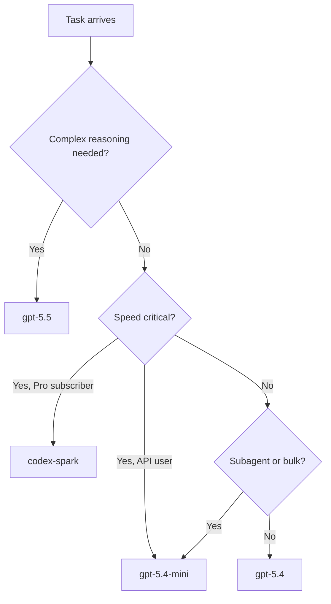
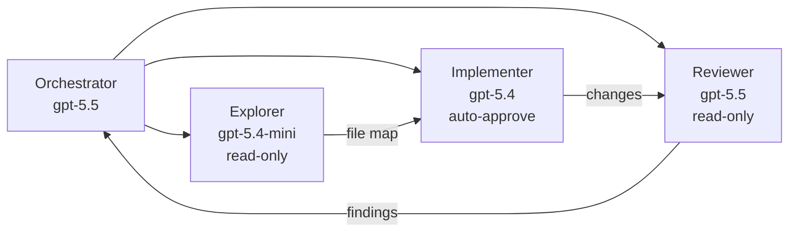

# Multi-Model Daily Workflows with Codex CLI: Routing GPT-5.5, Spark, Mini, and Open-Weight Models for Cost, Speed, and Quality


---

Most Codex CLI users set a default model in `config.toml` and never touch it again. That single decision silently shapes every session's cost, latency, and output quality — and it is almost certainly wrong for at least half of what they do each day. The model landscape as of June 2026 gives practitioners four meaningfully different tiers, each suited to distinct task profiles[^1]. This article maps those tiers to concrete daily workflows and shows how to configure Codex CLI so the right model fires for the right job without manual intervention.

## The June 2026 Model Landscape

Codex CLI supports four primary models via OpenAI, plus third-party providers for open-weight alternatives[^1][^2]:

| Model | Input / Output (per 1M tokens) | Cached Input | Latency | Sweet Spot |
|-------|-------------------------------|--------------|---------|------------|
| `gpt-5.5` | \$5.00 / \$30.00 | \$0.50 | Medium | Complex refactors, architecture, multi-file reasoning |
| `gpt-5.4` | ⚠️ Available but pricing varies | — | Medium | General-purpose coding, tool use |
| `gpt-5.4-mini` | \$0.75 / \$4.50 | \$0.075 | Fast | Subagents, boilerplate, quick edits, test generation |
| `codex-spark` | \$0.15 / \$0.60 | \$0.015 | Very fast (~1,000 tok/s) | Real-time pair programming, rapid iteration |

The cost difference is stark: a typical session on `gpt-5.5` with 45,000 input tokens, 38,000 cached, and 13,000 output costs roughly \$0.62 — about the same as a `gpt-5.4-mini` session processing ten times the volume[^3]. Choosing the right model per task is the single highest-leverage cost optimisation available.



## Configuring the Default Stack

The foundation is a `config.toml` that sets sensible defaults and overrides for specific contexts[^4]:

```toml
# ~/.codex/config.toml

model = "gpt-5.5"                    # daily driver for interactive work
review_model = "gpt-5.5"            # heavier reasoning for code review

[agents]
max_threads = 6

# Subagents default to mini for cost efficiency
```

The `review_model` key pins a separate model for every `/review` invocation[^5]. This matters because reviews benefit from deep reasoning but run non-interactively — you pay the premium only where it yields measurable quality gains.

### Named Profiles for Task Switching

Named profiles let you switch your entire configuration in one flag[^4]. Define profiles that match your daily workflow:

```toml
# ~/.codex/config.toml

[profiles.deep]
model = "gpt-5.5"
reasoning_effort = "high"

[profiles.quick]
model = "gpt-5.4-mini"
reasoning_effort = "medium"

[profiles.spark]
model = "codex-spark"
reasoning_effort = "medium"
```

Launch with the appropriate profile:

```bash
# Complex architectural refactor
codex --profile deep

# Quick boilerplate generation
codex --profile quick

# Real-time pair programming (Pro subscribers)
codex --profile spark
```

## Mid-Session Model Switching

The `/model` slash command switches models without restarting your session[^6]. This is the escape hatch when a task's complexity changes mid-flight:

```
/model gpt-5.4-mini    # switch to mini for a quick test scaffold
/model gpt-5.5         # switch back for the complex integration logic
```

The switch takes effect immediately for the next turn. Context from prior turns is preserved, though the new model may interpret it differently — a consideration when switching between models with different reasoning capabilities[^6].

### When to Switch Mid-Session

Three patterns reliably benefit from mid-session switching:

1. **Scaffold then refine**: Start with `gpt-5.4-mini` to generate boilerplate (test files, CRUD endpoints, configuration templates), then switch to `gpt-5.5` for the complex business logic that sits inside the scaffolding.

2. **Investigate then fix**: Use `gpt-5.5` with high reasoning effort to diagnose a subtle bug, then switch to `gpt-5.4-mini` to apply the mechanical fix across multiple files.

3. **Review then iterate**: Run `/review` (which uses `review_model` automatically), then drop to `gpt-5.4-mini` to address the straightforward findings while keeping `gpt-5.5` reserved for the architectural concerns.

## Subagent Model Configuration

Custom agent definitions in TOML files create a natural cost hierarchy where each specialist uses the cheapest model that meets its quality threshold[^7]:

```toml
# .codex/agents/explorer.toml
name = "explorer"
description = "Read-only codebase investigation — identifies relevant files, maps dependencies, summarises modules"
model = "gpt-5.4-mini"
sandbox_mode = "read_only"
```

```toml
# .codex/agents/implementer.toml
name = "implementer"
description = "Writes code changes — implements features, fixes bugs, updates tests"
model = "gpt-5.4"
```

```toml
# .codex/agents/reviewer.toml
name = "reviewer"
description = "Reviews code changes for correctness, security, and convention compliance"
model = "gpt-5.5"
developer_instructions = "Focus on logic errors, security vulnerabilities, and missing edge cases. Do not comment on style."
```

When you spawn subagents with a prompt like *"Spawn an explorer to map the authentication module, an implementer to add rate limiting, and a reviewer to check the result"*, each agent uses its configured model automatically[^7]. The explorer on `gpt-5.4-mini` reads cheaply, the implementer on `gpt-5.4` writes competently, and the reviewer on `gpt-5.5` catches the subtle issues.



## Open-Weight Models via Custom Providers

Codex CLI supports custom model providers for teams that want to run open-weight models locally or through third-party APIs[^8]. The key constraint: Codex now uses the Responses API exclusively, and Chat Completions support is deprecated[^9]. Open-weight models that expose only the Chat Completions interface require a translation proxy.

### Local Models with Ollama

For models like Qwen 2.5 Coder (32B) that implement the OpenAI tool-calling specification[^10]:

```toml
# ~/.codex/config.toml

[model_providers.local-ollama]
base_url = "http://localhost:11434/v1"
name = "Local Ollama"

[profiles.local]
model = "qwen2.5-coder:32b"
model_provider = "local-ollama"
```

⚠️ Local models currently require a Responses API–compatible proxy or a provider that translates between protocols. Tools such as Unsloth Studio and llama.cpp provide inference backends, but the Responses API translation layer remains the integration bottleneck[^9].

### DeepSeek V4 via Proxy

DeepSeek V4 offers frontier-class coding performance at a fraction of GPT-5.5's cost[^11]. Since DeepSeek exposes a Chat Completions interface, you need a translation layer:

```toml
# ~/.codex/config.toml

[model_providers.deepseek-proxy]
base_url = "http://localhost:8080/v1"
name = "DeepSeek via CCX proxy"

[profiles.deepseek]
model = "deepseek-coder-v4"
model_provider = "deepseek-proxy"
```

The practical trade-off: open-weight models avoid per-token API costs but require local GPU resources and the operational overhead of maintaining a proxy service. For air-gapped environments or teams with strict data residency requirements, this overhead is justified[^8].

## The Daily Routing Playbook

Here is a concrete workflow pattern that a senior developer might follow across a typical day:

### Morning: Architecture and Planning

```bash
codex --profile deep
```

Start with `gpt-5.5` and high reasoning effort. Review the day's tickets, ask Codex to analyse the codebase for the planned feature, and use `/plan` to generate an implementation plan. The higher token cost is justified by the reasoning quality needed for architectural decisions.

### Midday: Implementation Sprint

```bash
codex --profile quick
```

Switch to `gpt-5.4-mini` for the mechanical implementation work — generating boilerplate, writing tests, updating configuration files. The model handles these tasks competently at roughly one-sixth the cost per output token.

### Afternoon: Review and Polish

```
/review
```

The `/review` command automatically uses `review_model` from your config — `gpt-5.5` in this setup. After addressing the review findings, stay on `gpt-5.5` for any complex logic refinements that emerged from the review.

### Background: Subagent Delegation

Throughout the day, spawn subagents for parallel work. The agent definitions ensure each specialist uses the appropriate model tier without manual intervention.

## Measuring the Impact

Track your model usage with `codex doctor`, which reports session-level token consumption and model distribution as of v0.135.0[^12]. For aggregate analysis, the JSONL session transcripts stored under `~/.codex/sessions/` contain per-turn token counts and model identifiers that you can query with standard command-line tools[^13]:

```bash
# Sum output tokens per model across today's sessions
find ~/.codex/sessions/2026/06/07 -name '*.jsonl' \
  -exec jq -r 'select(.type == "usage") | [.model, .output_tokens] | @tsv' {} + \
  | awk '{sums[$1]+=$2} END {for(m in sums) print m, sums[m]}'
```

Teams running mixed-model workflows consistently report 40–60% cost reductions compared to single-model configurations, with no measurable quality degradation on routine tasks[^3].

## Configuration Anti-Patterns

Three mistakes account for most wasted spend in multi-model setups:

1. **Using `gpt-5.5` for everything**: The default trap. Plan mode, test generation, and code formatting do not benefit from frontier reasoning and cost 6–8× more than `gpt-5.4-mini`.

2. **Forgetting `review_model`**: Without it, `/review` uses whatever model your session happens to be running. Reviews on `gpt-5.4-mini` miss subtle logic errors that `gpt-5.5` catches.

3. **Leaving subagent models at the default**: Subagents inherit the parent session's model unless overridden in their TOML definition. An explorer agent on `gpt-5.5` reads the same files at 6× the cost.

## Deprecated Models: Clean Up Your Config

GPT-5.2 and GPT-5.3-codex are deprecated for ChatGPT sign-in as of June 2026[^1]. If your `config.toml`, profiles, or agent definitions still reference these identifiers, update them:

- `gpt-5.2-codex` → `gpt-5.4` or `gpt-5.4-mini`
- `gpt-5.3-codex` → `gpt-5.5` (for heavy tasks) or `gpt-5.4` (for general use)

Run `codex doctor` to surface any configuration warnings related to deprecated model references[^12].

---

The model you choose shapes every session's cost, speed, and quality. With four distinct tiers now available and named profiles making switching trivial, there is no reason to run a single model for every task. Configure once, route automatically, and let each model do what it does best.

## Citations

[^1]: OpenAI, "Models – Codex," OpenAI Developers, June 2026. [https://developers.openai.com/codex/models](https://developers.openai.com/codex/models)

[^2]: OpenAI, "Pricing – Codex," OpenAI Developers, June 2026. [https://developers.openai.com/codex/pricing](https://developers.openai.com/codex/pricing)

[^3]: DevTk.AI, "GPT-5.5 in Codex Pricing: API Costs, Model IDs, and DeepSeek Routing," May 2026. [https://devtk.ai/en/blog/gpt-5-5-codex-pricing-guide-2026/](https://devtk.ai/en/blog/gpt-5-5-codex-pricing-guide-2026/)

[^4]: OpenAI, "Advanced Configuration – Codex," OpenAI Developers, June 2026. [https://developers.openai.com/codex/config-advanced](https://developers.openai.com/codex/config-advanced)

[^5]: OpenAI, "Code review in GitHub – Codex," OpenAI Developers, June 2026. [https://developers.openai.com/codex/integrations/github](https://developers.openai.com/codex/integrations/github)

[^6]: OpenAI, "Features – Codex CLI," OpenAI Developers, June 2026. [https://developers.openai.com/codex/cli/features](https://developers.openai.com/codex/cli/features)

[^7]: OpenAI, "Subagents – Codex," OpenAI Developers, June 2026. [https://developers.openai.com/codex/subagents](https://developers.openai.com/codex/subagents)

[^8]: OpenAI, "Configuration Reference – Codex," OpenAI Developers, June 2026. [https://developers.openai.com/codex/config-reference](https://developers.openai.com/codex/config-reference)

[^9]: Unsloth, "How to Run Local LLMs with OpenAI Codex," Unsloth Documentation, 2026. [https://unsloth.ai/docs/basics/codex](https://unsloth.ai/docs/basics/codex)

[^10]: Qwen, "Model Providers – Qwen Code Docs," 2026. [https://qwenlm.github.io/qwen-code-docs/en/users/configuration/model-providers/](https://qwenlm.github.io/qwen-code-docs/en/users/configuration/model-providers/)

[^11]: DevTk.AI, "DeepSeek V4 Agent Setup: OpenCode, Codex, Copilot CLI, Cline, Kilo," 2026. [https://devtk.ai/en/blog/deepseek-v4-agent-setup-2026/](https://devtk.ai/en/blog/deepseek-v4-agent-setup-2026/)

[^12]: Blake Crosley, "Codex CLI v0.135 Reference: history search, doctor, profiles," May 2026. [https://blakecrosley.com/guides/codex](https://blakecrosley.com/guides/codex)

[^13]: OpenAI, "CLI – Codex," OpenAI Developers, June 2026. [https://developers.openai.com/codex/cli](https://developers.openai.com/codex/cli)
