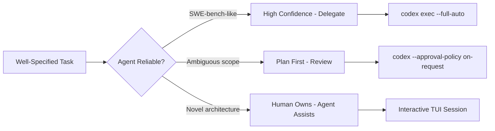
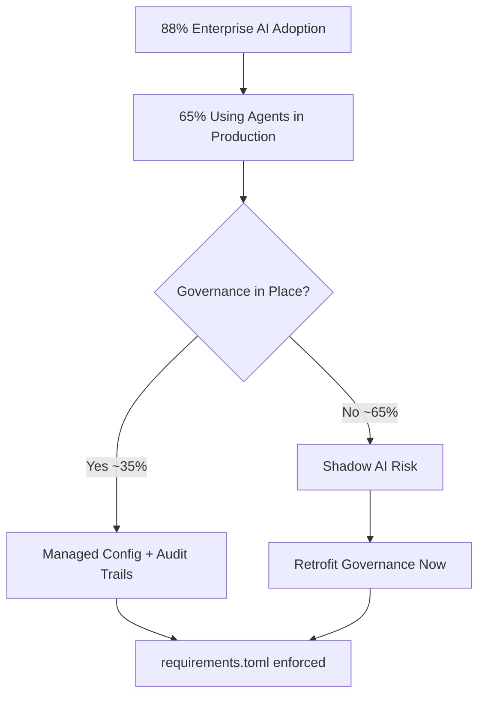

# The Stanford AI Index 2026 and Codex CLI: What SWE-bench at 100%, the Entry-Level Contraction, and the Productivity Paradox Mean for Your Team


---

Stanford HAI's ninth annual AI Index Report landed in April 2026 [^1]. At 350-odd pages it covers everything from model transparency to energy consumption, but three findings land directly in the laps of engineering teams running coding agents: SWE-bench Verified scores rising from 60% to near 100% in a single year, entry-level developer positions for workers aged 22–25 falling nearly 20% since 2024, and a persistent paradox between self-reported productivity gains and what controlled studies actually measure. This article unpacks each finding, cross-references the evidence with METR's latest research, and maps the practical implications to Codex CLI configuration and team workflow.

## SWE-bench at Near-100%: What the Benchmark Ceiling Means

SWE-bench Verified—the industry standard for evaluating whether a model can resolve real GitHub issues end-to-end—climbed from roughly 60% to near 100% of verified solutions in twelve months [^1]. That is an extraordinary trajectory. For context, the benchmark requires an agent to read an issue description, navigate a repository, identify the relevant files, produce a working patch, and pass the project's existing test suite.

The practical implication is not that coding agents are infallible. SWE-bench tasks are well-specified, self-contained, and come with deterministic test suites. Production engineering work rarely looks like that. But the signal is clear: for tasks that *can* be fully specified—bug fixes with reproduction steps, feature implementations with typed interfaces and existing tests, refactors bounded by linting rules—agents are now demonstrably reliable.



### Codex CLI mapping

The SWE-bench ceiling validates the delegation model already baked into Codex CLI's approval policies. For SWE-bench-class tasks—well-scoped, test-backed, convention-following—`full-auto` mode with a PostToolUse hook running the project's test suite is a reasonable default:

```toml
# .codex/config.toml — project-level
approval_policy = "full-auto"

[hooks.post_tool_use]
command = "npm test -- --bail"
```

For everything else, the data argues for `on-request` or `suggest` mode, where Codex proposes changes but waits for human judgement before executing.

## The Entry-Level Contraction: 20% and Counting

The report's most politically charged finding: employment for software developers aged 22–25 has fallen nearly 20% from its 2024 peak [^1][^2]. Workers aged 26–30 show a roughly 5% decline; those over 31 are flat or slightly up [^2]. One-third of surveyed organisations expect further headcount reductions, particularly in software engineering [^1].

This is the first white-collar job category to show measurable contraction attributable to AI adoption [^2]. The mechanism is straightforward: the work that entry-level developers historically cut their teeth on—writing boilerplate, implementing well-specified features, drafting tests, fixing linting violations—is precisely the work that coding agents now handle at production quality [^2].

The data does not say "stop hiring juniors." It says the *shape* of junior work is changing. Organisations that still hire entry-level developers are redefining the role around review, specification writing, and agent orchestration rather than raw code production [^3].

### What this means for Codex CLI teams

Teams using Codex CLI should reconsider how they structure onboarding:

1. **Specification writing becomes a core skill.** Junior developers who can write a tight `AGENTS.md` section or a well-scoped `codex exec` prompt are more productive than those who can only write boilerplate by hand.
2. **Review replaces production.** The OpenAI "Building an AI-Native Engineering Team" guide frames the shift explicitly: engineers become "strategic reviewers and decision-makers rather than code generators" [^3].
3. **Agent fluency is a hiring signal.** The Stanford data shows that "AI-fluent developers" using tools daily are hired faster than those avoiding AI integration [^2].

## The Productivity Paradox: 14–26% or 2x?

The Index reports productivity gains of 14–26% in software development, based on controlled studies [^1]. Meanwhile, self-reported surveys consistently produce much higher numbers—METR's May 2026 survey of 349 technical workers found a median 2x self-reported value gain [^4]. Who is right?

Both, within their methodological limits. METR's own research has repeatedly found that developers overestimate productivity gains by approximately 40 percentage points on average [^5]. Their February 2026 redesigned study—800+ tasks across 57 developers—showed a -4% measured effect with a confidence interval of -15% to +9%, leading them to conclude that "AI likely provides productivity benefits in early 2026" but that the effect is modest and highly variable [^5].

The paradox resolves when you stratify by task type:

| Task Category | Measured Gain | Agent Suitability |
|---|---|---|
| Boilerplate/scaffolding | 40–55% | High — delegate fully |
| Bug fixes with repro steps | 25–35% | High — SWE-bench territory |
| Feature implementation (typed) | 15–25% | Medium — review critical |
| Architectural decisions | ~0% or negative | Low — agent assists, human owns |
| Novel problem-solving | Negative in some studies | Minimal — context engineering overhead |

⚠️ *The 14–26% aggregate figure masks enormous variance. Teams that delegate well-scoped tasks and review outputs efficiently will see the upper bound. Teams that use agents for ill-defined architectural work may see no gain or even a slowdown.*

### Configuring for the sweet spot

Codex CLI's profile system lets teams encode this stratification directly:

```toml
# ~/.codex/profiles/delegate.config.toml
# For well-scoped, test-backed tasks
approval_policy = "full-auto"
model = "gpt-5.3-codex"
model_reasoning_effort = "medium"

# ~/.codex/profiles/review.config.toml
# For complex or ambiguous work
approval_policy = "on-request"
model = "gpt-5.5"
model_reasoning_effort = "high"
```

Switch between them with `codex --profile delegate` or `codex --profile review`. The profile names signal intent to the team: this task is delegation-grade, or this task requires human judgement at every step.

## Enterprise Adoption at 88%: The Governance Gap

Organisational AI adoption reached 88% in 2026, up from 55% two years earlier [^1]. But the Index simultaneously reports declining model transparency—the Foundation Model Transparency Index fell from 58 to 40 points [^1]—and notes that most AI companies are not publishing detailed safety evaluations, bias audits, or transparency reports [^1].

For Codex CLI teams, this creates an asymmetry: the tools are ubiquitous, but the governance infrastructure is immature. The report finds that 65% of enterprises are experimenting with AI agents in production [^1], yet policy frameworks consistently lag adoption.



Codex CLI's managed configuration system—`requirements.toml` for admin-enforced constraints, cloud-managed config bundles for Enterprise workspaces, and JSONL audit logs for every session—maps directly onto this governance gap [^6]. Teams that have not yet deployed `requirements.toml` should treat the Stanford data as a prompt to do so.

## The Trust Divergence and What It Means for Agent Output

The widest finding in the report may be the expert-public trust gap: 73% of AI researchers view AI's labour market impact positively, while only 23% of the general public agrees—a 50-point divergence, the widest ever measured [^1][^2].

This matters for Codex CLI teams because the code your agents produce will be reviewed, deployed, and maintained by people across that trust spectrum. Some of your colleagues are enthusiastic adopters; others are sceptical of every AI-generated line.

The practical response is verification infrastructure:

- **PostToolUse hooks** that run the full test suite after every agent edit, producing evidence rather than assertions.
- **The `/review` command** with a pinned `review_model` override set to a higher-reasoning model, so reviews are demonstrably thorough.
- **Session traces exported via OpenTelemetry**, giving sceptical reviewers a complete audit trail of what the agent did and why.

```toml
# .codex/config.toml — verification infrastructure
review_model = "gpt-5.5"

[hooks.post_tool_use]
command = "make test && make lint"

[telemetry]
otlp_endpoint = "http://localhost:4317"
```

Trust is not built by assertion. It is built by traceable, reproducible, automatically verified output.

## The Environmental Footnote

The Index reports that training Grok 4 generated approximately 72,816 tonnes of CO₂ equivalent [^1]—roughly 17,000 cars' annual emissions. Global AI data centres consume 29.6 gigawatts, comparable to New York state's peak demand [^1].

For Codex CLI users, the lever is reasoning effort. Running `model_reasoning_effort = "xhigh"` on every trivial task is wasteful in both tokens and energy. The profile system exists precisely for this: `medium` effort for delegation-grade work, `high` or `xhigh` reserved for genuinely complex problems.

## Key Takeaways for Codex CLI Teams

1. **SWE-bench at near-100% validates full delegation** for well-scoped, test-backed tasks. Use `full-auto` with PostToolUse test hooks for this class of work.
2. **The entry-level contraction is real.** Restructure junior roles around specification writing, review, and agent orchestration rather than raw code production.
3. **Productivity gains are real but modest (14–26%)** in controlled settings. Self-reported estimates are consistently inflated. Target the sweet spot: delegate what agents do well, own what they do not.
4. **88% adoption with 40-point transparency decline** means governance cannot wait. Deploy `requirements.toml` and JSONL audit trails now.
5. **Trust divergence demands verification infrastructure.** Hooks, test suites, and OpenTelemetry traces build trust through evidence, not promises.

The Stanford AI Index 2026 is not a prediction. It is a measurement of where we already are. The coding agent revolution is not coming—it arrived, and the data is in. What remains is configuring your tools and teams to make the most of it.

## Citations

[^1]: Stanford HAI, "The 2026 AI Index Report," April 2026. [https://hai.stanford.edu/ai-index/2026-ai-index-report](https://hai.stanford.edu/ai-index/2026-ai-index-report)

[^2]: FindSkill.ai, "Junior Dev Jobs Just Dropped 20%: The Stanford AI Index 2026," April 2026. [https://findskill.ai/blog/stanford-ai-index-junior-dev-hiring-drop/](https://findskill.ai/blog/stanford-ai-index-junior-dev-hiring-drop/)

[^3]: OpenAI, "Building an AI-Native Engineering Team," 2026. [https://developers.openai.com/codex/guides/build-ai-native-engineering-team](https://developers.openai.com/codex/guides/build-ai-native-engineering-team)

[^4]: METR, "Measuring the Self-Reported Impact of Early-2026 AI on Technical Worker Productivity," May 2026. [https://metr.org/blog/2026-05-11-ai-usage-survey/](https://metr.org/blog/2026-05-11-ai-usage-survey/)

[^5]: METR, "We are Changing our Developer Productivity Experiment Design," February 2026. [https://metr.org/blog/2026-02-24-uplift-update/](https://metr.org/blog/2026-02-24-uplift-update/)

[^6]: OpenAI, "Managed Configuration – Codex," 2026. [https://developers.openai.com/codex/enterprise/managed-configuration](https://developers.openai.com/codex/enterprise/managed-configuration)
