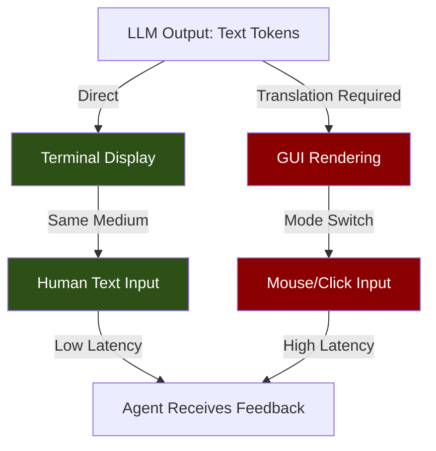
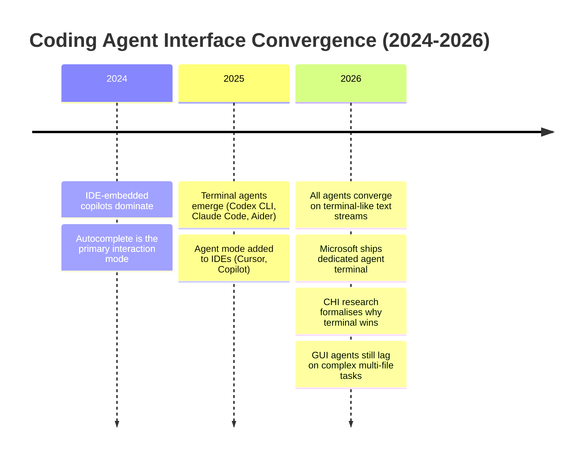

# Terminal Is All You Need: What HCI Research Reveals About Codex CLI's Terminal-First Advantage


---

Every major coding agent in 2026 — Codex CLI, Claude Code, Gemini CLI, Cursor Agent — has converged on the same interface primitive: a text-based sequential interaction loop that looks remarkably like a terminal session [^1]. This convergence is not coincidental. A CHI 2026 workshop paper from the University of Geneva formally identifies three design properties that make terminal-based agent collaboration effective, grounding them in established HCI theory [^2]. Meanwhile, Microsoft validated the pattern industrially by forking Windows Terminal into a dedicated agent host [^3], and benchmark data consistently shows terminal-native agents outperforming GUI-based alternatives on complex development tasks [^4].

This article unpacks the research, maps each finding to Codex CLI's architecture, and offers practical configuration for teams who want to maximise the terminal-first advantage.

## The Three Design Properties

Alexandre De Masi's "Terminal Is All You Need" paper, accepted at CUCHI'26 (CHI 2026 Workshop on Human-AI-UI Interactions Across Modalities, Barcelona, April 2026), argues that effective human-AI-UI collaboration depends on three properties that terminal interfaces satisfy by default [^2]:

### 1. Representational Compatibility

The agent's native output format (text) matches the interface format (text). There is zero translation overhead between what the model produces and what the developer reads. GUI agents must transcode reasoning into visual actions — clicking buttons, navigating menus — introducing a lossy translation layer.

### 2. Transparency of the Interaction Medium

Every agent action — file reads, shell commands, diffs, reasoning traces — appears inline in the interaction stream. The developer sees exactly what the agent did, in the order it did it. IDE-embedded agents often hide actions behind notification badges or collapsible panels, breaking the auditability chain.

### 3. Low Barriers to Human Participation

Natural language input requires no special syntax or gesture vocabulary. A developer can intervene, redirect, or constrain the agent mid-stream with the same typing they already do. GUI agents require mode-switching — finding the right pane, clicking the right button — which increases intervention latency.



## Empirical Evidence: Terminal Agents vs GUI Agents

The theoretical argument gains weight from benchmark data across multiple evaluation frameworks.

### OSWorld: GUI Agents Struggle

The OSWorld benchmark tests multimodal agents on open-ended desktop tasks. When introduced, the best GUI agent achieved just 12.24% task success versus 72.36% for humans [^5]. By 2026, Claude Sonnet 4.6 reached 72.5% on OSWorld-Verified and OpenAI's Operator posted 38.1% on the full set [^6] — meaningful progress, but the gap between GUI agent capability and human performance remains substantial for complex, multi-step workflows.

### Terminal-Bench 2.0: Codex CLI Leads

Terminal-Bench 2.0, which evaluates realistic long-horizon tasks in terminal-centric workflows, tells a different story. GPT-5.5 powering Codex CLI scores 82.7% [^7], and GPT-5.3-Codex leads on SWE-bench Pro at 56.8% [^4]. Terminal-native agents consistently outperform their GUI counterparts on tasks that mirror real development work.

### The Specialised ACI Advantage

De Masi's paper cites research showing that a specialised text-based Agent-Computer Interface outperformed agents using the default Linux shell by 10.7 percentage points on SWE-bench [^2]. This suggests the terminal advantage is not merely about the display medium but about the entire interaction contract — reading files, executing commands, and receiving feedback through a unified text channel.

### The METR Cursor Paradox

The most provocative data point comes from METR's controlled study of experienced open-source developers using Cursor Pro with Claude 3.5 Sonnet. Tasks took 19% longer with AI assistance, despite developers subjectively estimating a 20% speedup [^8]. The study's authors attributed the gap partly to validation overhead — experienced developers spent time verifying GUI-mediated suggestions they could not fully trace.

This maps directly to De Masi's transparency property: when agent actions are opaque, experienced developers must reconstruct what happened before they can trust the output. Terminal-based agents make this reconstruction trivial because the action history *is* the interface.

## Microsoft's Industrial Validation

On 2 June 2026, Microsoft shipped Intelligent Terminal 0.1 at Build — a deliberate fork of Windows Terminal dedicated to AI agent interaction [^3]. The architectural choices validate the research findings:

| Design Decision | HCI Property Served |
|---|---|
| Separate application (not embedded in VS Code) | Representational compatibility — agents get a pure text channel |
| Agent pane shows full command history | Transparency of interaction medium |
| Auto-detects installed CLI agents (Codex, Claude Code, Copilot CLI) | Low barriers to participation |
| Error detection triggers agent context automatically | Transparency — failure states surface immediately |

The fork strategy itself is telling. After the Windows Recall backlash, Microsoft chose to keep experimental AI features in an opt-in application rather than embedding them into the IDE. The terminal was the natural home [^3].

## How Codex CLI Embodies the Three Properties

Codex CLI's architecture maps cleanly onto De Masi's framework:

### Representational Compatibility

Codex CLI streams model reasoning, tool calls, and results as sequential text in the TUI. Diffs appear as unified patches. Shell output appears verbatim. There is no rendering engine between the model and the developer.

```toml
# config.toml — maximise representational compatibility
[tui]
# Show reasoning tokens inline (v0.135+)
show_reasoning = true
# Markdown links remain clickable via OSC 8 (v0.136+)
markdown_links = true
```

### Transparency

Every tool invocation — `shell`, `read_file`, `write_file`, `apply_patch` — appears in the session transcript with full arguments and output. The `/history` command replays the complete action trace. The `codex doctor --json` diagnostic exposes internal state for support cases [^9].

```bash
# Replay exact agent actions from any session
codex history show --session-id <id> --format jsonl
```

### Low Barriers to Participation

The developer interrupts with natural language at any point. No need to find a "stop" button or navigate to an intervention pane. The `/` commands (`/compact`, /`model`, `/approve`, `/deny`) are discoverable inline. The approval policy system (`suggest`, `auto-edit`, `full-auto`) calibrates exactly how much intervention the developer wants [^10].

```toml
# Named profile: maximum transparency with minimal interruption
# ~/.codex/dev.config.toml
[model]
name = "gpt-5.5"
reasoning_effort = "high"

[approval]
policy = "auto-edit"  # Agent edits freely; shell commands require approval

[sandbox]
mode = "workspace-write"
```

## Configuring for the Terminal-First Advantage

The research suggests specific configuration strategies to maximise the three properties:

### 1. Keep Reasoning Visible

Enable `show_reasoning = true` and use `reasoning_effort = "high"` for complex tasks. Visible reasoning chains are the terminal equivalent of "showing your working" — they let experienced developers catch logic errors before they manifest as code [^2].

### 2. Use Hooks for Inline Feedback

PostToolUse hooks that run linters, type checkers, or tests after every shell command keep feedback in the same text stream rather than requiring the developer to switch to a separate terminal [^11]:

```toml
[[hooks]]
event = "PostToolUse"
tool = "shell"
command = "if echo '$INPUT' | jq -r '.command' | grep -q 'npm\\|yarn\\|pnpm'; then npm test 2>&1 | tail -20; fi"
```

### 3. Preserve Session Transcripts

Terminal transparency is only valuable if the record persists. Use `codex archive` (v0.136+) to protect important sessions, and `codex history show --format jsonl` for machine-readable audit trails [^12]:

```bash
# Archive a completed feature session for future reference
codex archive --name "auth-refactor-june"
```

### 4. Prefer Terminal Over IDE Extensions

When both options exist, the research suggests the terminal surface will outperform IDE-embedded equivalents for experienced developers on complex tasks. Reserve IDE integrations for code completion and inline suggestions; route multi-file refactoring, debugging, and architecture work through `codex` directly.

## The Convergence Thesis

De Masi's most provocative claim is that the three properties are "core design requirements, not optional features" for *any* human-AI modality [^2]. The convergence of Codex CLI, Claude Code, Cursor Agent, and even Google's Antigravity toward text-based sequential interaction supports this. When Microsoft's IDE division ships a *separate terminal application* for agent work rather than embedding it in VS Code, the thesis gains industrial weight [^3].

For Codex CLI teams, the implication is clear: the terminal is not a legacy interface awaiting replacement by a richer GUI. It is the theoretically optimal surface for human-agent collaboration, and Codex CLI's architecture is purpose-built to exploit it.



## Limitations and Caveats

The De Masi paper is a workshop position paper, not a large-scale empirical study. The three properties are derived from theory and supported by indirect evidence (benchmark data, adoption trends) rather than a controlled A/B trial of terminal vs GUI agent interfaces.

The METR Cursor study used an earlier model (Claude 3.5 Sonnet, early 2025) and the productivity penalty may have diminished with newer models and better IDE integration [^8]. ⚠️ No direct controlled study has compared Codex CLI terminal interaction against Codex IDE Extension interaction on identical tasks with the same model.

Additionally, the OSWorld improvements to 72.5% suggest GUI agents are closing the gap for certain task types, particularly those involving visual design or browser interaction [^6].

## Conclusion

The terminal-first architecture is not a constraint Codex CLI teams must work around — it is a structural advantage grounded in HCI theory. The three design properties (representational compatibility, transparency, low participation barriers) explain why experienced developers are more productive with terminal agents, why all major coding agents are converging on text-based interaction, and why Microsoft shipped a dedicated terminal for agent work.

Configure Codex CLI to maximise these properties: keep reasoning visible, use hooks for inline feedback, preserve session transcripts, and route complex work through the terminal rather than IDE extensions.

## Citations

[^1]: The New Stack, "Claude Code vs Cursor vs Codex vs Antigravity — Six Months In," June 2026. https://thenewstack.io/claude-code-vs-cursor-vs-codex-vs-antigravity-2026/

[^2]: De Masi, A., "Terminal Is All You Need: Design Properties for Human-AI Agent Collaboration," CHI 2026 Workshop on Human-AI-UI Interactions (CUCHI'26), April 2026, Barcelona. https://arxiv.org/abs/2603.10664

[^3]: TechTimes, "Microsoft Intelligent Terminal Ships at Build 2026: AI Agent Fork Leaves Mainline Terminal Alone," June 4, 2026. https://www.techtimes.com/articles/317761/20260604/microsoft-intelligent-terminal-ships-build-2026-ai-agent-fork-leaves-mainline-terminal-alone.htm

[^4]: MarkTechPost, "Best AI Agents for Software Development Ranked: A Benchmark-Driven Look at the Current Field," May 2026. https://www.marktechpost.com/2026/05/15/best-ai-agents-for-software-development-ranked-a-benchmark-driven-look-at-the-current-field/

[^5]: Xie, T. et al., "OSWorld: Benchmarking Multimodal Agents for Open-Ended Tasks in Real Computer Environments," 2024. https://os-world.github.io/

[^6]: Coasty Blog, "OSWorld Benchmark 2026: 82% Real, 73% Exploited — Why Your Computer Use Agent Choice Matters," 2026. https://coasty.ai/blog/osworld-benchmark-2026-results-ai-computer-use

[^7]: Codex Knowledge Base, "Multi-Model Daily Workflows with Codex CLI," June 2026. https://codex.danielvaughan.com/2026/06/07/codex-cli-multi-model-daily-workflows-gpt55-spark-mini-open-weight-cost-quality-routing/

[^8]: METR, "Measuring the Impact of Early-2025 AI on Experienced Open-Source Developer Productivity," July 2025. https://metr.org/blog/2025-07-10-early-2025-ai-experienced-os-dev-study/

[^9]: OpenAI Developers, "Codex CLI Features," 2026. https://developers.openai.com/codex/cli/features

[^10]: OpenAI Developers, "Codex CLI Configuration Reference," 2026. https://developers.openai.com/codex/config-reference

[^11]: OpenAI Developers, "Hooks — Codex," 2026. https://developers.openai.com/codex/hooks

[^12]: OpenAI Developers, "Codex Changelog — v0.136.0," June 1, 2026. https://developers.openai.com/codex/changelog
