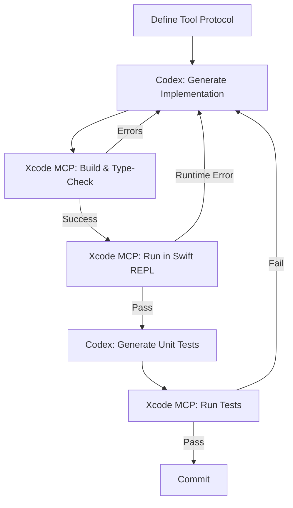
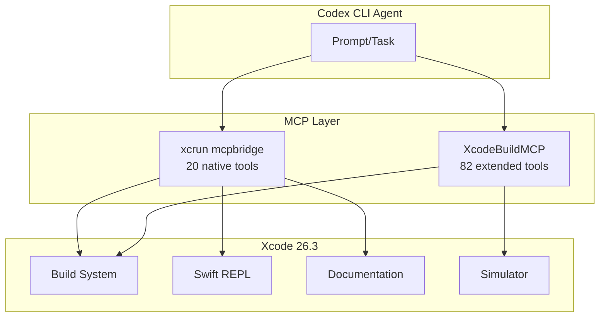

# Codex CLI and Apple's Foundation Models Framework: Agent-Assisted On-Device AI Development


---

## Introduction

Apple's Foundation Models framework — first introduced at WWDC 2025 and significantly expanded through iOS 26.4 — gives Swift developers direct access to the on-device large language model powering Apple Intelligence[^1]. With WWDC 2026 kicking off today (8 June), Apple has doubled down on this framework as the canonical way to build intelligent features that run entirely on-device, with no network round-trip and full user privacy[^2].

The challenge for developers adopting this framework is twofold: the API surface is new and rapidly evolving, and the 4,096-token context window forces careful architectural decisions[^3]. Codex CLI, connected to Xcode via `xcrun mcpbridge`, provides the ideal development accelerator — an agent that can scaffold `@Generable` types, verify guided generation constraints, run Swift REPL sessions, and iterate on tool-calling implementations without leaving the terminal[^4].

This article covers the practical workflow for building Foundation Models features using Codex CLI as your development agent.

---

## The Framework at a Glance

Apple's Foundation Models framework exposes three core primitives[^1]:

1. **Guided Generation** — constrained decoding that forces the on-device model to produce output conforming to Swift types annotated with `@Generable` and `@Guide`
2. **Tool Calling** — the model can invoke developer-defined functions to retrieve external data or perform side effects
3. **Sessions** — stateful `LanguageModelSession` objects that maintain conversation history and transcript

```mermaid
graph LR
    A[App Code] --> B[LanguageModelSession]
    B --> C{On-Device LLM}
    C -->|Guided Generation| D[@Generable Types]
    C -->|Tool Calling| E[Developer Tools]
    C -->|Streaming| F[UI Updates]
    E -->|Results| C
```

The entire inference pipeline runs on Apple Silicon via Apple's MLX acceleration layer — no API keys, no network dependency, no data leaving the device[^2].

---

## Connecting Codex CLI to Xcode

Since Xcode 26.3, Apple ships `xcrun mcpbridge` — a Model Context Protocol server that exposes 20 Xcode tools to any MCP-compatible agent[^4]. The one-liner setup:

```bash
codex mcp add xcode -- xcrun mcpbridge
```

This gives Codex CLI access to builds, test execution, SwiftUI preview capture, Swift REPL, symbol navigation, simulator control, and Apple's documentation search (powered by the local "Squirrel MLX" semantic embedding model)[^5].

### Prerequisites

- Xcode 26.3+ installed with Command Line Tools
- MCP enabled in Xcode > Settings > Intelligence
- Xcode running (mcpbridge communicates via XPC to the active Xcode instance)
- Codex CLI v0.137+

---

## Scaffolding @Generable Types with Codex

The `@Generable` macro marks a Swift struct whose instances the on-device model can generate directly[^6]. The companion `@Guide` macro constrains individual properties with natural-language descriptions or enumerated values[^6].

A typical Codex CLI prompt for scaffolding:

```bash
codex "Create a @Generable struct called RecipeAnalysis with fields:
calories (Int, guide: 'estimated total calories'),
dietaryFlags (array of strings, constrained to Vegan/Vegetarian/GlutenFree/DairyFree/NutFree),
briefSummary (String, one sentence max).
Include the LanguageModelSession call and error handling for exceededContextWindowSize."
```

Codex generates:

```swift
import FoundationModels

@Generable
struct RecipeAnalysis {
    @Guide(description: "Estimated total calories for the recipe")
    let calories: Int

    @Guide(.anyOf(["Vegan", "Vegetarian", "GlutenFree", "DairyFree", "NutFree"]))
    let dietaryFlags: [String]

    @Guide(description: "A single-sentence summary of the recipe")
    let briefSummary: String
}

func analyseRecipe(_ description: String) async throws -> RecipeAnalysis {
    let session = LanguageModelSession()
    do {
        let response = try await session.respond(
            to: "Analyse this recipe: \(description)",
            generating: RecipeAnalysis.self
        )
        return response.content
    } catch let error as LanguageModelSession.GenerationError
        where error == .exceededContextWindowSize {
        // Context window is 4096 tokens — truncate input and retry
        let truncated = String(description.prefix(500))
        let response = try await session.respond(
            to: "Analyse this recipe: \(truncated)",
            generating: RecipeAnalysis.self
        )
        return response.content
    }
}
```

Because Codex CLI has access to `xcrun mcpbridge`, it can immediately verify this compiles by invoking the Xcode build tool and checking for diagnostics[^4].

---

## Tool Calling: Agent-Assisted Implementation

Foundation Models tool calling follows a protocol-based pattern where you define argument types with `@Generable` and implement a `call` method[^7]:

```swift
import FoundationModels

struct LookupNutritionTool: Tool {
    let name = "lookup_nutrition"
    let description = "Look up nutritional information for a food item"

    @Generable
    struct Arguments {
        @Guide(description: "The food item to look up")
        let foodItem: String
    }

    func call(arguments: Arguments) async throws -> String {
        // Query local database or HealthKit
        let info = try await NutritionDatabase.lookup(arguments.foodItem)
        return "Calories: \(info.calories), Protein: \(info.protein)g"
    }
}
```

The session is then initialised with tools:

```swift
let session = LanguageModelSession(
    tools: [LookupNutritionTool()],
    instructions: "You are a nutrition assistant. Use tools to look up food data."
)
```

### Codex CLI Workflow for Tool Development

The iterative loop for building tools with Codex CLI:



A practical prompt:

```bash
codex "Implement a HealthKit tool for the Foundation Models framework that reads
the user's latest heart rate. Use the Tool protocol with @Generable Arguments.
Build and verify with Xcode, then write a unit test."
```

Codex CLI will:
1. Generate the tool implementation
2. Call `xcrun mcpbridge` to build
3. Fix any compiler errors
4. Execute in the Swift REPL to verify runtime behaviour
5. Generate and run XCTest cases

---

## Managing the 4,096-Token Context Window

The on-device model's fixed 4,096-token context window is the primary architectural constraint[^3]. iOS 26.4 introduced `contextSize` and `tokenCount(for:)` for programmatic bookkeeping[^8], but developers must still design around the limit.

### Strategies Codex CLI Can Implement

| Strategy | Description | When to Use |
|----------|-------------|-------------|
| **Input truncation** | Limit user input to a measured token budget | Chat-style interfaces |
| **Session rotation** | Create a fresh session when approaching the limit | Multi-turn conversations |
| **Summary compaction** | Summarise prior turns before continuing | Long interactions |
| **Single-shot generation** | One prompt, one response, no history | Classification/extraction |

Configure Codex CLI to enforce these patterns via AGENTS.md:

```markdown
# Foundation Models Guidelines

## Context Window Rules
- Always check `tokenCount(for:)` before calling `respond()`
- Never assume more than 4096 tokens of context
- Prefer single-shot `respond()` over multi-turn sessions for extraction tasks
- Handle `.exceededContextWindowSize` gracefully — never let it crash

## Type Safety
- All @Generable structs must have @Guide annotations on every property
- Use `.anyOf()` for enumerations rather than free-text String fields
- Test guided generation with adversarial inputs that push token limits
```

---

## AGENTS.md Template for Foundation Models Projects

```markdown
# AGENTS.md — Foundation Models Project

## Stack
- Swift 6.2, iOS 26+ / macOS 26+
- Foundation Models framework (on-device inference only)
- Xcode 26.3+ with xcrun mcpbridge

## Build & Test
- Build: use Xcode MCP `build` tool or `xcodebuild -scheme <name>`
- Test: `xcodebuild test -scheme <name> -destination 'platform=iOS Simulator,name=iPhone 16'`
- REPL verification: use Xcode MCP `swift_repl` tool for quick iteration

## Rules
- Context window is 4096 tokens — design all prompts to fit within this
- All @Generable types require @Guide annotations
- Tool implementations must be pure or clearly marked with side effects
- Never import networking libraries in Foundation Models code paths
- Handle LanguageModelSession.GenerationError exhaustively
- Use `tokenCount(for:)` from iOS 26.4+ for input validation
- Prefer guided generation over free-text parsing

## Anti-Hallucination
- The Foundation Models framework does NOT support: custom model loading,
  fine-tuning, embedding generation, image generation, or audio processing
- SystemLanguageModel is the ONLY available model — no model selection
- There is no `temperature` or `top_p` parameter — output is deterministic
  for guided generation
```

---

## Composing XcodeBuildMCP with xcrun mcpbridge

For larger projects, combine Apple's native mcpbridge with the community XcodeBuildMCP server (82 tools including LLDB debugging, UI automation, and simulator screenshots)[^5]:

```toml
# ~/.codex/config.toml

[mcp_servers.xcode]
command = "xcrun"
args = ["mcpbridge"]

[mcp_servers.xcodebuild]
command = "npx"
args = ["-y", "@anthropic/xcodebuild-mcp@latest"]
```

This gives Codex CLI a two-layer toolkit:
- **xcrun mcpbridge**: native Xcode integration (builds, previews, REPL, documentation search)
- **XcodeBuildMCP**: extended capabilities (LLDB, UI automation, simulator screenshots, Instruments profiling)



---

## Model Selection for Foundation Models Development

Foundation Models development benefits from high-reasoning models because the framework's type system is new and not deeply represented in training data[^9]:

```toml
# Profile for Foundation Models development
[profiles.foundation-models]
model = "o4-mini"
model_reasoning_effort = "high"
approval_policy = "unless-allow-listed"
```

Use `o4-mini` at high reasoning effort for:
- Correct `@Generable` and `@Guide` macro usage
- Proper error handling for the constrained context window
- Tool protocol implementations that satisfy Swift's type checker

For boilerplate (test scaffolding, documentation), drop to medium effort:

```bash
codex -e medium "Generate XCTest cases for RecipeAnalysis guided generation"
```

---

## Limitations and Gotchas

Several constraints affect this workflow:

1. **Training data lag** — The Foundation Models framework shipped with iOS 26 (September 2025) but Codex's training data may not include iOS 26.4 additions like `contextSize` and `tokenCount(for:)`[^8]. Use the Xcode MCP documentation search tool to ground the agent in current API references.

2. **Simulator requirement** — Foundation Models requires Apple Intelligence to be enabled, which means testing on a physical device or a supported simulator. The Swift REPL via mcpbridge can verify compilation but not runtime inference[^4].

3. **No streaming in guided generation** — While `streamResponse()` works for free-text generation, guided generation with `@Generable` types returns only the complete result. Design UIs accordingly.

4. **Sandbox interaction** — Codex CLI's default read-only sandbox does not affect Xcode MCP tool calls (they execute within Xcode's process), but tool implementations that access HealthKit, contacts, or location require entitlements that the simulator may not grant.

5. **Context window arithmetic** — The 4,096-token limit includes system instructions, tools definitions, all prior turns, and the current prompt. In practice, a session with two tools and instructions leaves approximately 3,000 tokens for conversation[^3].

---

## Practical Workflow: End-to-End Feature

Here is a complete workflow for adding a "smart recipe tagging" feature:

```bash
# 1. Scaffold the @Generable output type
codex "Create a @Generable RecipeTags struct with fields: cuisine (constrained to
Italian/Mexican/Japanese/Indian/French/American/Other), difficulty (Easy/Medium/Hard),
prepTimeMinutes (Int, guide: estimated prep time), keyIngredients (array of strings,
max 5 items). Include full error handling."

# 2. Build and verify
codex "Build the project and fix any compiler errors"

# 3. Add context window safety
codex "Add a helper function that measures input token count using tokenCount(for:)
and truncates recipe descriptions to stay within 2000 tokens, leaving headroom for
the response"

# 4. Write tests
codex "Write XCTests that verify: (a) guided generation produces valid RecipeTags,
(b) exceededContextWindowSize is handled gracefully, (c) all cuisine values match
the @Guide constraint"

# 5. Run tests
codex "Run the test suite and fix any failures"
```

---

## Citations

[^1]: Apple Developer Documentation, "Foundation Models", [https://developer.apple.com/documentation/FoundationModels](https://developer.apple.com/documentation/FoundationModels)

[^2]: Apple Newsroom, "Apple's Foundation Models framework unlocks new intelligent app experiences", September 2025, [https://www.apple.com/newsroom/2025/09/apples-foundation-models-framework-unlocks-new-intelligent-app-experiences/](https://www.apple.com/newsroom/2025/09/apples-foundation-models-framework-unlocks-new-intelligent-app-experiences/)

[^3]: Apple Developer Documentation, "TN3193: Managing the on-device foundation model's context window", [https://developer.apple.com/documentation/technotes/tn3193-managing-the-on-device-foundation-model-s-context-window](https://developer.apple.com/documentation/technotes/tn3193-managing-the-on-device-foundation-model-s-context-window)

[^4]: Rudrank Riyam, "Exploring AI Driven Coding: Using Xcode 26.3 MCP Tools in Cursor, Claude Code and Codex", 2026, [https://rudrank.com/exploring-xcode-using-mcp-tools-cursor-external-clients](https://rudrank.com/exploring-xcode-using-mcp-tools-cursor-external-clients)

[^5]: GitHub, "kleinpanic/xcode-mcp-suite: SDK, CLI, and MCP proxy for Xcode's agentic coding bridge (xcrun mcpbridge)", [https://github.com/kleinpanic/xcode-mcp-suite](https://github.com/kleinpanic/xcode-mcp-suite)

[^6]: AppCoda, "Working with @Generable and @Guide in Foundation Models", 2026, [https://www.appcoda.com/generable/](https://www.appcoda.com/generable/)

[^7]: Apple Developer Documentation, "Expanding generation with tool calling", [https://developer.apple.com/documentation/foundationmodels/expanding-generation-with-tool-calling](https://developer.apple.com/documentation/foundationmodels/expanding-generation-with-tool-calling)

[^8]: InfoQ, "Apple Improves Context Window Management for its Foundation Models", March 2026, [https://www.infoq.com/news/2026/03/apple-foundation-models-context/](https://www.infoq.com/news/2026/03/apple-foundation-models-context/)

[^9]: OpenAI Developers, "Codex CLI Features", [https://developers.openai.com/codex/cli/features](https://developers.openai.com/codex/cli/features)
