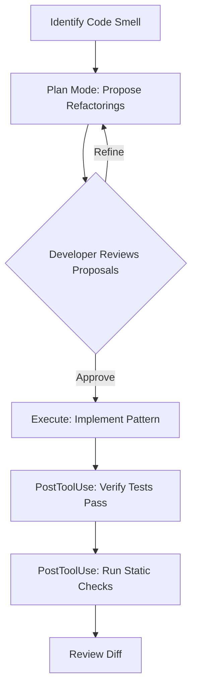
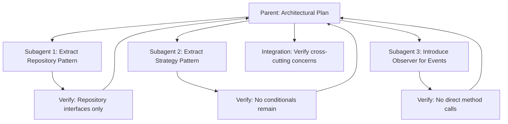
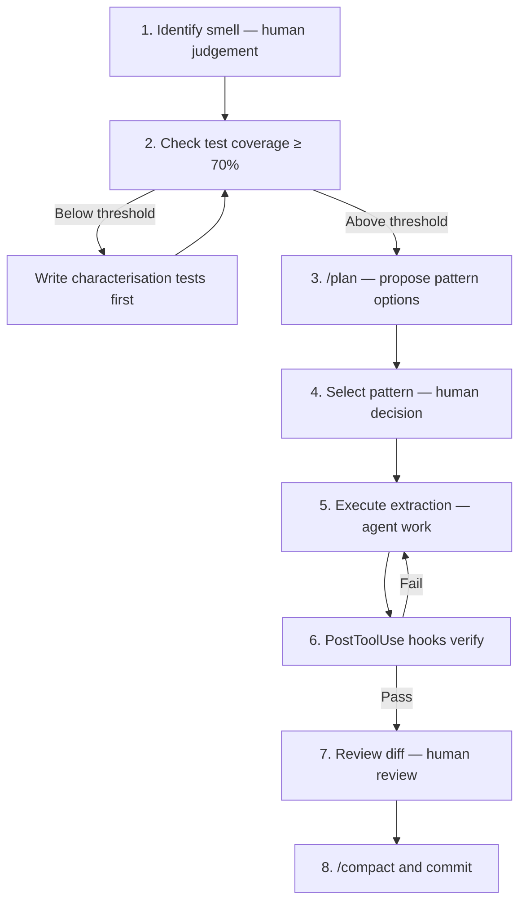

# Codex CLI for Design Pattern Refactoring: Agent-Assisted GoF Patterns, SOLID Enforcement, and Architectural Improvement


---

Coding agents are excellent at localised edits — renaming variables, extracting methods, upgrading API calls. They are markedly worse at the kind of structural refactoring that experienced developers perform when they recognise a design smell and reach for a Gang of Four pattern or a SOLID principle. The CodeTaste benchmark (Thillen et al., March 2026) quantifies the gap: frontier models achieve up to 69.6% alignment when given detailed refactoring instructions, but only 7.7% when asked to autonomously discover the refactoring a human developer would choose [^1]. The Agentic Refactoring study (November 2025) confirms the pattern at scale — across 15,451 refactoring instances in real-world Java projects, agent-initiated refactoring is dominated by low-level, consistency-oriented edits (rename variable 8.5%, change variable type 11.8%, rename parameter 10.4%), with virtually no high-level design pattern applications [^2].

The practical implication is clear: if you want Codex CLI to apply design patterns effectively, you must supply the architectural judgement yourself and let the agent handle the mechanical transformation. This article shows how to build that workflow using AGENTS.md constraints, PostToolUse hooks, dedicated skills, and the propose-then-implement decomposition that CodeTaste found most effective.

## The Propose-Then-Implement Decomposition

The CodeTaste paper's most actionable finding is that a two-phase approach — first propose candidate refactorings, then implement the best one — significantly outperforms single-shot refactoring [^1]. In Codex CLI terms, this maps to a plan-then-execute workflow.



Start every design-pattern refactoring session in plan mode. Press `Shift+Tab` or type `/plan` before describing the smell:

```
/plan The OrderProcessor class in src/orders/processor.ts handles validation,
pricing, tax calculation, notification, and persistence. It has 847 lines
and 14 public methods. Propose three refactoring options using GoF patterns
that would decompose this into smaller, single-responsibility classes.
```

Codex will propose options — typically Strategy for the pricing variants, Observer for notifications, and a Chain of Responsibility for validation. Review the proposals, select one, then exit plan mode and instruct the implementation.

## AGENTS.md Constraints for Pattern-Level Refactoring

Unconstrained agents produce inconsistent pattern implementations. An agent might implement Observer with event emitters in one module and callback registration in another. Encode your pattern conventions in AGENTS.md to prevent this drift [^3].

```markdown
# AGENTS.md — Design Pattern Conventions

## Refactoring Rules
- Never change public API signatures during a refactoring pass
- Each refactoring pass must address exactly one design smell
- Run `npm test` after every structural change
- State behavioural assertions before patching — document what the code
  currently does before changing how it does it

## Pattern Conventions
- **Strategy**: Use interface + constructor injection. Name strategies
  `<Behaviour>Strategy` (e.g., `FlatRatePricingStrategy`). Register
  strategies in a factory, never with switch/case.
- **Observer**: Use a typed `EventBus<EventMap>` class. Listeners
  subscribe via `on(event, handler)`. No direct method calls between
  publisher and subscriber.
- **Factory Method**: Abstract factories return interfaces, never
  concrete classes. Place factories in `src/factories/`.
- **Repository**: Data access classes implement a `Repository<T>`
  interface. No SQL or ORM calls outside repository implementations.

## SOLID Enforcement
- **SRP**: No class may have more than 200 lines or 7 public methods.
  If a class exceeds either threshold, propose extraction before adding
  new functionality.
- **OCP**: New behaviour must be added via extension (new strategy,
  new handler), not by modifying existing switch/case or if/else chains.
- **DIP**: High-level modules must depend on abstractions. Constructor
  parameters must be interfaces, not concrete classes, for any
  dependency that has or could have multiple implementations.
```

These constraints serve two purposes. First, they give the agent the architectural judgement it lacks — the CodeTaste finding that models fail at autonomous discovery but succeed at specified execution means your AGENTS.md effectively bridges that gap [^1]. Second, they create a reviewable contract: when you inspect the agent's diff, you can verify it followed the conventions rather than inventing its own interpretation.

## Hook-Based Verification for Architectural Compliance

Text-based conventions in AGENTS.md are necessary but not sufficient. The agent may drift, particularly in long sessions. PostToolUse hooks provide machine-enforced verification after every file edit [^4].

### Complexity Gate Hook

```toml
# .codex/config.toml

[[hooks.PostToolUse]]
matcher = "apply_patch"

[[hooks.PostToolUse.hooks]]
type = "command"
command = "python3 .codex/hooks/check_complexity.py"
timeout = 30
statusMessage = "Checking cyclomatic complexity"
```

The hook script checks that no function exceeds a complexity threshold after the edit:

```python
#!/usr/bin/env python3
# .codex/hooks/check_complexity.py
import subprocess, sys, json

result = subprocess.run(
    ["npx", "escomplex-cli", "--format", "json", "src/"],
    capture_output=True, text=True
)
if result.returncode != 0:
    sys.exit(0)  # Tool not available — skip

report = json.loads(result.stdout)
violations = []
for module in report.get("reports", []):
    for fn in module.get("functions", []):
        if fn.get("cyclomatic", 0) > 10:
            violations.append(
                f"  {module['module']}:{fn['name']} "
                f"(complexity {fn['cyclomatic']})"
            )

if violations:
    print("DENY: Cyclomatic complexity exceeds threshold (max 10):")
    print("\n".join(violations))
    sys.exit(1)
```

### Class Size Gate Hook

```python
#!/usr/bin/env python3
# .codex/hooks/check_class_size.py
"""Verify no TypeScript/JavaScript class exceeds 200 lines."""
import re, sys, pathlib

MAX_LINES = 200
violations = []

for p in pathlib.Path("src").rglob("*.ts"):
    lines = p.read_text().splitlines()
    in_class = False
    class_name = ""
    class_start = 0

    for i, line in enumerate(lines):
        match = re.match(r"^(?:export\s+)?class\s+(\w+)", line)
        if match:
            in_class = True
            class_name = match.group(1)
            class_start = i
        elif in_class and re.match(r"^}", line):
            length = i - class_start + 1
            if length > MAX_LINES:
                violations.append(
                    f"  {p}:{class_name} ({length} lines)"
                )
            in_class = False

if violations:
    print(f"DENY: Classes exceeding {MAX_LINES} lines:")
    print("\n".join(violations))
    sys.exit(1)
```

These hooks transform SOLID conventions from aspirational text into enforced gates. The agent receives the denial message, understands the constraint, and typically self-corrects by extracting the oversized class into smaller components [^4].

## Refactoring Skills for Repeatable Patterns

When the same pattern application recurs across projects — extracting a God class into Strategy + Factory, converting callback chains to Observer, introducing Repository over raw database calls — encode the workflow as a Codex CLI skill [^5].

### Strategy Pattern Extraction Skill

```
.codex/skills/extract-strategy/
├── SKILL.md
├── examples/
│   ├── before.ts
│   └── after.ts
└── references/
    └── strategy-pattern-checklist.md
```

```markdown
<!-- SKILL.md -->
# Extract Strategy Pattern

## When to Use
A class contains conditional logic (switch/case, if/else chains) that
selects between different algorithms or behaviours based on a type,
mode, or configuration value.

## Steps
1. Identify the varying behaviour and name the strategy interface
2. Extract each branch into a class implementing the interface
3. Add a factory or registry that maps the selector to a strategy
4. Replace the conditional with strategy injection via constructor
5. Verify: no switch/case or if/else on the selector remains
6. Run tests after each extraction — do not batch

## Constraints
- Strategy classes must be pure: no side effects, no I/O
- The context class delegates to the strategy; it does not
  inherit from it
- Name pattern: `<Behaviour>Strategy` (e.g., `TieredPricingStrategy`)

## Verification
After completing extraction, confirm:
- [ ] Original tests still pass
- [ ] No conditional logic on the selector remains in the context
- [ ] Each strategy class has fewer than 100 lines
- [ ] The factory/registry is the single place that maps selectors
```

Invoke with:

```bash
codex "Use the extract-strategy skill to refactor the payment
calculation logic in src/billing/calculator.ts. The switch on
paymentType should become a strategy."
```

The skill provides the architectural guidance the agent needs. Combined with the AGENTS.md conventions and PostToolUse hooks, the agent is constrained to produce a standards-compliant implementation.

## Subagent Orchestration for Multi-Pattern Refactoring

Large-scale refactoring — decomposing a monolithic service into clean-architecture layers, for instance — requires multiple pattern applications across dozens of files. Codex CLI's multi-agent v2 (v0.137.0) lets you delegate each pattern extraction to a dedicated subagent whilst the parent agent maintains the overall architectural plan [^6].



The parent agent prompt might read:

```
Decompose src/orders/order-service.ts (1,247 lines) into clean
architecture layers. Use subagents for each extraction:

1. Extract all database calls into OrderRepository implementing
   Repository<Order>
2. Extract pricing logic into strategies via the extract-strategy skill
3. Convert direct notification calls to an EventBus Observer pattern

After all subagents complete, verify the integration: OrderService
should depend only on abstractions, contain no I/O, and have fewer
than 150 lines.
```

Each subagent operates in its own context, follows the AGENTS.md conventions, and triggers the PostToolUse hooks independently. The parent aggregates results and runs the integration verification pass.

## SOLID Violation Detection Prompts

Rather than waiting for violations to accumulate, run periodic SOLID audits using `codex exec` in CI [^7]:

```bash
codex exec --model gpt-5.4-mini \
  --approval-mode full-auto \
  -p "Audit src/ for SOLID violations. For each violation, output:
      - File and line number
      - Which principle is violated (S, O, L, I, D)
      - A one-sentence description
      - Suggested refactoring pattern
      Output as JSON array. Do not modify any files." \
  --output-schema '{"type":"array","items":{"type":"object",
    "properties":{"file":{"type":"string"},"line":{"type":"integer"},
    "principle":{"type":"string"},"description":{"type":"string"},
    "pattern":{"type":"string"}},"required":["file","principle",
    "description","pattern"]}}'
```

This produces structured output suitable for tracking in a technical debt dashboard. Run it weekly in CI to measure whether design quality is improving or degrading [^7].

## Practical Limitations

### Agents Struggle with Pattern Discovery

The CodeTaste benchmark's 7.7% alignment score for autonomous pattern discovery is not a temporary gap — it reflects a fundamental limitation in how current models reason about code structure [^1]. Always supply the pattern choice yourself. Use the agent for execution, not for architectural judgement.

### Cross-Cutting Refactoring Risks

The Agentic Refactoring study found that whilst agents improve basic structural metrics, they "fail to meaningfully reduce actual design smells" when operating autonomously [^2]. Multi-file refactoring that touches shared abstractions, dependency injection containers, or event bus registrations is particularly risky. Review these diffs carefully.

### Context Window Pressure

Large classes — the ones most in need of pattern refactoring — consume significant context. A 1,200-line God class plus its tests, interfaces, and dependent modules can easily exceed 30,000 tokens. Use `/compact` aggressively between extraction passes, and consider breaking the work across sessions using `codex resume` [^8].

### Test Coverage Prerequisite

Design pattern refactoring without test coverage is reckless regardless of whether a human or an agent performs it. Before starting any pattern extraction, verify coverage exceeds 70% for the target module. If it does not, write characterisation tests first — Codex CLI is excellent at generating tests for existing behaviour [^9].

## The Pattern Refactoring Workflow in Practice

Bringing these pieces together, the complete workflow for a single pattern refactoring pass:



The human provides steps 1, 4, and 7 — the architectural decisions and the final review. The agent handles steps 3, 5, and 6 — the exploration, the mechanical transformation, and the iterative correction when hooks reject non-compliant output. This division of labour aligns with the CodeTaste finding: specify the refactoring, let the agent execute it.

## Citations

[^1]: Thillen, A., Mündler, N., Raychev, V. & Vechev, M. (2026). "CodeTaste: Can LLMs Generate Human-Level Code Refactorings?" arXiv:2603.04177. [https://arxiv.org/abs/2603.04177](https://arxiv.org/abs/2603.04177)

[^2]: Chen, Y. et al. (2025). "Agentic Refactoring: An Empirical Study of AI Coding Agents." arXiv:2511.04824. [https://arxiv.org/abs/2511.04824](https://arxiv.org/abs/2511.04824)

[^3]: OpenAI. (2026). "Custom instructions with AGENTS.md." OpenAI Developers. [https://developers.openai.com/codex/guides/agents-md](https://developers.openai.com/codex/guides/agents-md)

[^4]: OpenAI. (2026). "Hooks – Codex." OpenAI Developers. [https://developers.openai.com/codex/hooks](https://developers.openai.com/codex/hooks)

[^5]: OpenAI. (2026). "Agent Skills – Codex." OpenAI Developers. [https://developers.openai.com/codex/skills](https://developers.openai.com/codex/skills)

[^6]: OpenAI. (2026). "Codex CLI 0.137.0 Release." GitHub Releases. [https://github.com/openai/codex/releases](https://github.com/openai/codex/releases)

[^7]: OpenAI. (2026). "Non-interactive mode – Codex." OpenAI Developers. [https://developers.openai.com/codex/noninteractive](https://developers.openai.com/codex/noninteractive)

[^8]: OpenAI. (2026). "Refactor your codebase." Codex Use Cases. [https://developers.openai.com/codex/use-cases/refactor-your-codebase](https://developers.openai.com/codex/use-cases/refactor-your-codebase)

[^9]: OpenAI. (2026). "Best practices – Codex." OpenAI Developers. [https://developers.openai.com/codex/learn/best-practices](https://developers.openai.com/codex/learn/best-practices)
