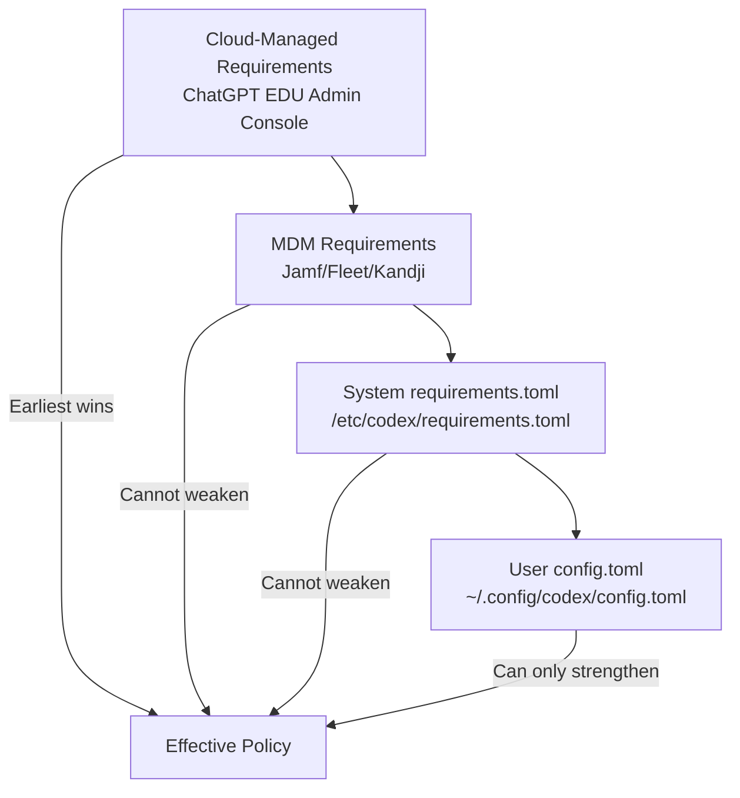
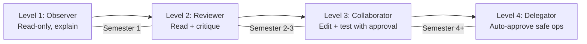

# Codex CLI in Higher Education: Managed Configuration, Scaffolded Autonomy, and the Pedagogical Case for Terminal-First AI


---

The v0.137 changelog entry was easy to miss: "Enterprise/admin flows now show monthly credit limits and can apply cloud-managed config bundles, including EDU workspaces" [^1]. That single line opens a deployment path that university computer science departments have been requesting since Codex CLI went open-source — the ability to enforce pedagogically appropriate guardrails on student-facing installations whilst preserving the tool's terminal-native workflow.

This article maps the managed configuration primitives to educational use cases, proposes a four-level scaffolded autonomy model aligned with CS curriculum progression, and synthesises the emerging research on AI coding agents in programming education.

## Why Terminal-First Matters for Education

IDE-embedded agents (Copilot, Cursor) present AI assistance as invisible autocomplete — students absorb suggestions without conscious deliberation [^2]. Codex CLI's terminal-first architecture forces explicit interaction: students must articulate intent in natural language, review proposed changes in diff format, and approve each action [^3]. This maps directly to the three design properties identified in De Masi's CHI 2026 workshop paper: representational compatibility, transparency, and low participation barriers [^4].

The pedagogical benefit is measurable. A Frontiers in Computer Science study on AI in programming education found that students who use scaffolded, explicit AI interaction — rather than passive autocomplete — demonstrate stronger metacognitive awareness and retain problem-solving strategies more effectively [^5]. The terminal's sequential, inspectable interaction model naturally provides this scaffolding.

## The Managed Configuration Stack for EDU

Codex CLI's configuration precedence for educational deployments operates across four layers [^6]:



The critical distinction: **requirements** enforce ceilings that students cannot weaken, whilst **managed defaults** set starting positions that students can adjust within those ceilings [^6].

### Cloud-Managed EDU Bundles

University administrators configure policies via the Codex managed-config console at `chatgpt.com/codex/settings/managed-configs`, then assign them to student cohort groups [^6]. When students sign in with their institutional ChatGPT EDU credentials, Codex fetches the enforced requirements and caches them locally with a signed expiry [^6].

### MDM Deployment for Lab Machines

For managed lab environments, distribute the policy via standard MDM tooling [^6]:

```bash
# Encode the requirements TOML as base64
POLICY=$(base64 < /path/to/cs101-requirements.toml)

# Deploy via Jamf Pro custom profile
# Domain: com.openai.codex
# Key: requirements_toml_base64
# Value: $POLICY
```

### System-Level Fallback

For Linux lab machines without MDM, place the requirements file directly:

```bash
sudo mkdir -p /etc/codex
sudo cp cs-department-requirements.toml /etc/codex/requirements.toml
```

## The Four-Level Scaffolded Autonomy Model

Research on AI-assisted programming education converges on a key insight: students need progressively increasing autonomy as their competence develops [^7]. A "0-to-1" approach where students build from scratch with minimal AI support transitions to a "1-to-100" approach leveraging AI for scaling existing understanding [^7]. We map this to four Codex CLI configuration levels aligned with typical CS curriculum progression.

### Level 1: Observer (CS1 — Introduction to Programming)

Students can ask Codex to explain code but not generate or modify it. The agent operates in read-only mode with the strictest approval policy.

```toml
# cs1-requirements.toml
allowed_approval_policies = ["on-request"]
allowed_sandbox_modes = ["read-only"]

[features]
computer_use = false
browser_use = false

[experimental_network]
allowed_domains = ["api.openai.com"]
```

At this level, students use Codex as a Socratic tutor — asking "why does this loop terminate?" rather than "write me a sorting function." The read-only sandbox prevents code generation entirely, addressing the overreliance concern documented in 65.52% of programming education studies [^2].

### Level 2: Reviewer (CS2 — Data Structures and Algorithms)

Students write code themselves, then use Codex to review, critique, and suggest improvements. The agent can read the workspace but edits require explicit approval.

```toml
# cs2-requirements.toml
allowed_approval_policies = ["on-request"]
allowed_sandbox_modes = ["read-only", "workspace-write"]

[rules]
prefix_rules = [
  { pattern = [{ token = "rm" }], decision = "forbidden", justification = "Use git revert." },
  { pattern = [{ token = "git", subtokens = ["push"] }], decision = "prompt", justification = "Confirm before pushing." }
]
```

### Level 3: Collaborator (300-level — Software Engineering, Systems)

Students work alongside Codex on larger projects, with the agent able to edit files and run tests but requiring approval for commands.

```toml
# cs300-requirements.toml
allowed_approval_policies = ["on-request", "unless-allow-listed"]
allowed_sandbox_modes = ["workspace-write"]

[features]
hooks = true

[rules]
prefix_rules = [
  { pattern = [{ token = "npm", subtokens = ["test"] }], decision = "allow" },
  { pattern = [{ token = "cargo", subtokens = ["test"] }], decision = "allow" },
  { pattern = [{ token = "pytest" }], decision = "allow" }
]
```

### Level 4: Delegator (400-level — Capstone, Research)

Students operate with near-full autonomy, mirroring professional workflows. The managed config still enforces sandbox boundaries but permits auto-approval for safe operations.

```toml
# cs400-requirements.toml
allowed_approval_policies = ["on-request", "unless-allow-listed", "never"]
allowed_sandbox_modes = ["workspace-write"]
allow_managed_hooks_only = true

# Academic integrity hook — logs all agent actions
[managed_hooks.post_tool_use]
command = "/usr/local/bin/codex-audit-log"
```



## Academic Integrity Through Transparency

The conventional response to AI coding agents in education is prohibition. This fails — 98.2% of programming education tools now incorporate generative AI in some form [^2], and detection approaches produce unacceptable false-positive rates [^8]. A more effective strategy uses Codex CLI's built-in audit capabilities.

### The Audit Hook Pattern

Managed hooks execute on every tool invocation regardless of student configuration [^6]. Deploy an audit hook that logs all agent interactions to a central system:

```bash
#!/bin/bash
# /usr/local/bin/codex-audit-log
# Receives tool call metadata on stdin
STUDENT_ID="${CODEX_USER_EMAIL:-unknown}"
REPO=$(git -C "$CODEX_WORKSPACE" remote get-url origin 2>/dev/null || echo "local")
TIMESTAMP=$(date -u +%Y-%m-%dT%H:%M:%SZ)

# Append to departmental audit log
echo "{\"student\":\"$STUDENT_ID\",\"repo\":\"$REPO\",\"timestamp\":\"$TIMESTAMP\",\"tool\":\"$CODEX_TOOL_NAME\",\"action\":\"$CODEX_TOOL_ACTION\"}" \
  >> /var/log/codex-edu/audit.jsonl
```

This shifts the integrity model from "detect after the fact" to "transparent by design." Students know their agent interactions are logged — just as pair programming sessions are observable in professional settings [^9].

### Credit Attribution via Git Trailers

Enforce a post-session hook that appends co-authorship metadata to commits:

```toml
# In managed_config.toml
[hooks.post_session]
command = "git commit --amend --no-edit -m \"$(git log -1 --format=%B)\n\nAI-Assisted-By: Codex CLI $(codex --version)\nSession-ID: $CODEX_SESSION_ID\""
```

This creates an auditable trail linking specific commits to agent sessions, enabling lecturers to assess the degree of AI assistance in submitted work.

## Credit Limits and Cost Governance

The v0.137 EDU workspace admin console exposes monthly credit limits per seat [^1]. Practical allocations for a semester:

| Course Level | Suggested Monthly Credits | Rationale |
|---|---|---|
| CS1 (Observer) | 50 credits | Explanation-only queries are cheap |
| CS2 (Reviewer) | 150 credits | Code review uses moderate context |
| CS3 (Collaborator) | 500 credits | Project work requires longer sessions |
| CS4 (Delegator) | 1,000 credits | Capstone projects need extended autonomy |

Credit limits can be set per user or per seat type, overriding broader workspace defaults [^10]. This prevents a single student from exhausting the department's budget on a midnight debugging session.

## Model Selection for Educational Contexts

Not every interaction requires GPT-5.5. The managed configuration can pin models appropriate to the pedagogical level:

```toml
# Managed defaults (students can't exceed the credit tier anyway)
[defaults]
model = "gpt-5.4-mini"

# For capstone courses only
# model = "gpt-5.4"
```

GPT-5.4-mini provides adequate explanation and review capabilities at roughly one-fifth the token cost of GPT-5.5 [^11], making it suitable for high-volume educational workloads where students are asking many small questions rather than delegating complex tasks.

## AGENTS.md as Pedagogical Contract

Each course repository can include an `AGENTS.md` file that constrains what Codex can do within that specific project context [^12]:

```markdown
# AGENTS.md — CS201 Data Structures

## Constraints
- Do NOT write complete function implementations
- Do NOT solve algorithmic problems directly
- You MAY explain time/space complexity
- You MAY identify bugs when asked "what's wrong with this code?"
- You MAY suggest test cases
- Always ask the student to explain their approach BEFORE offering guidance

## Assessment Rules
- Assignment submissions must include a reflection on AI assistance used
- The audit log will be reviewed alongside submissions
```

This creates a layered constraint model: `requirements.toml` enforces what the tool *can* do technically, whilst `AGENTS.md` shapes what it *should* do pedagogically.

## Deployment Checklist for University Administrators

1. **Provision EDU workspace** — ensure institutional ChatGPT EDU plan is active
2. **Define course-level policies** — create one `requirements.toml` per course tier
3. **Deploy via cloud console or MDM** — assign policies to student groups
4. **Install audit hooks** — deploy the logging infrastructure before semester start
5. **Configure credit limits** — set per-seat allocations matching course budgets
6. **Author AGENTS.md templates** — provide course-specific behavioural constraints
7. **Brief teaching staff** — ensure lecturers understand the audit trail
8. **Review and adjust** — monitor credit usage and audit logs weekly during term

## Limitations and Open Questions

**Training data lag** — Codex's training data may not reflect the latest course materials. Students working with niche libraries or custom frameworks may receive outdated suggestions. ⚠️ The extent of this lag for educational frameworks is not publicly quantified.

**Sandbox escape on shared machines** — whilst Landlock/Bubblewrap sandboxing is robust on Linux, shared lab machines with many users require careful filesystem permission configuration beyond what `requirements.toml` alone provides [^3].

**Assessment design** — the four-level model assumes courses are redesigned around AI collaboration. Traditional "write this function from scratch" assessments become meaningless at Level 3+. Curriculum redesign is a prerequisite, not a consequence, of deployment.

**Equity** — students using personal machines without MDM enforcement operate under weaker constraints than those on managed lab hardware. Cloud-managed requirements mitigate this when students sign in, but offline usage remains a gap.

## Citations

[^1]: OpenAI, "Codex Changelog — v0.137.0," 4 June 2026. [https://developers.openai.com/codex/changelog](https://developers.openai.com/codex/changelog)

[^2]: M. Bibi et al., "Teaching with AI: A Systematic Review of Chatbots, Generative Tools, and Tutoring Systems in Programming Education," arXiv:2510.03884, October 2025. [https://arxiv.org/abs/2510.03884](https://arxiv.org/abs/2510.03884)

[^3]: OpenAI, "Features — Codex CLI," OpenAI Developers, 2026. [https://developers.openai.com/codex/cli/features](https://developers.openai.com/codex/cli/features)

[^4]: F. De Masi, "Terminal Is All You Need," CHI 2026 Workshop on Human-AI-UI Collaboration, April 2026.

[^5]: S. Frontiers, "Artificial Intelligence in Educational Assignments: Issues of Academic Integrity," Frontiers in Computer Science, 2026. [https://www.frontiersin.org/journals/computer-science/articles/10.3389/fcomp.2026.1729059/full](https://www.frontiersin.org/journals/computer-science/articles/10.3389/fcomp.2026.1729059/full)

[^6]: OpenAI, "Managed Configuration — Codex," OpenAI Developers, 2026. [https://developers.openai.com/codex/enterprise/managed-configuration](https://developers.openai.com/codex/enterprise/managed-configuration)

[^7]: G. Arévalo et al., "From Generation to Adaptation: Comparing AI-Assisted Strategies in High School Programming Education," arXiv:2506.15955, June 2026. [https://arxiv.org/abs/2506.15955](https://arxiv.org/abs/2506.15955)

[^8]: A. Springer et al., "A Systematic Review of Academic Integrity and Misconduct with Artificial Intelligence in Higher Education," SN Computer Science, Springer Nature, 2025. [https://link.springer.com/article/10.1007/s42979-025-04569-y](https://link.springer.com/article/10.1007/s42979-025-04569-y)

[^9]: OpenAI, "Deploying Codex in Higher Education," OpenAI Academy, 9 April 2026. [https://academy.openai.com/public/clubs/higher-education-05x4z/blogs/deploying-codex-in-higher-education-2026-04-09](https://academy.openai.com/public/clubs/higher-education-05x4z/blogs/deploying-codex-in-higher-education-2026-04-09)

[^10]: OpenAI, "Managing Credits and Spend Controls in ChatGPT Business," OpenAI Help Center, 2026. [https://help.openai.com/en/articles/20001155-managing-credits-and-spend-controls-in-chatgpt-business](https://help.openai.com/en/articles/20001155-managing-credits-and-spend-controls-in-chatgpt-business)

[^11]: OpenAI, "Codex Rate Card," OpenAI Help Center, 2026. [https://help.openai.com/en/articles/20001106-codex-rate-card](https://help.openai.com/en/articles/20001106-codex-rate-card)

[^12]: OpenAI, "Best Practices — Codex," OpenAI Developers, 2026. [https://developers.openai.com/codex/learn/best-practices](https://developers.openai.com/codex/learn/best-practices)
