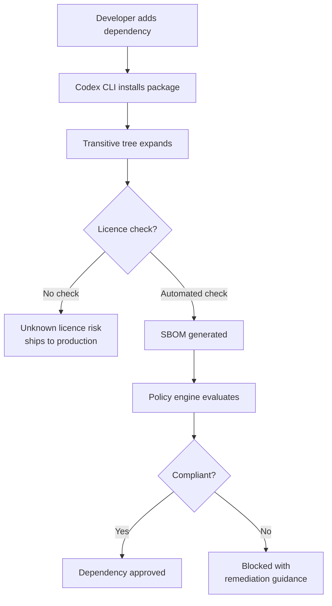
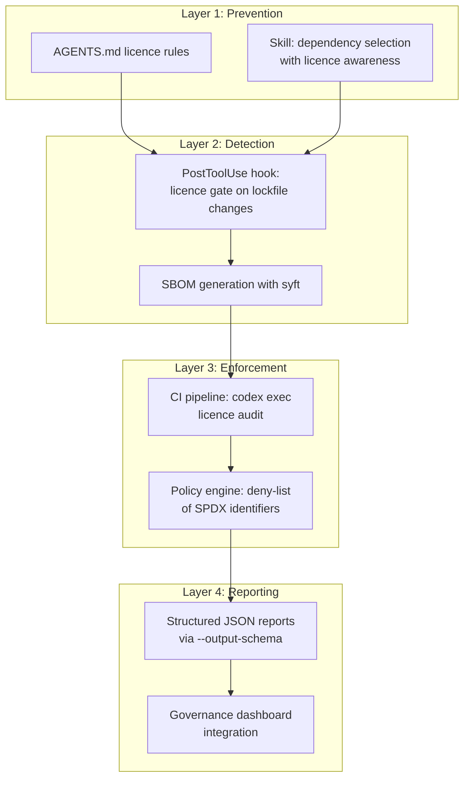

# Codex CLI for Licence Compliance: Automated Dependency Auditing, SBOM Generation, and Policy Enforcement with Agent Workflows


---

Open source components now constitute 80–90% of modern applications [^1]. Yet most engineering teams treat licence compliance as something legal handles once a year — if at all. The Sonatype 2026 State of the Software Supply Chain report found that organisations should aim for all major components to have approved licences and compliance metrics live in governance dashboards by year-end [^1]. The EU Cyber Resilience Act and NIS2 are converting what were once internal guidelines into regulatory obligations [^2].

Meanwhile, AI coding agents have introduced a new vector: **licence laundering**. When a model trained on GPL-licensed code reproduces that code without attribution, the developer who accepts the suggestion may unwittingly ship copyleft-encumbered code into a proprietary product [^3]. The tooling to detect this at development speed does not broadly exist yet [^3].

Codex CLI sits at a useful intersection. It can orchestrate SBOM generation tools, parse their output, classify licence risk, and enforce policy through hooks — all within the same agent loop that writes and reviews code. This article covers the practical workflow.

---

## The Licence Compliance Problem in Agent-Assisted Development

The core challenge has three dimensions:

1. **Transitive depth.** A single `npm install` can pull hundreds of transitive dependencies, each with its own licence. Manual review is infeasible.
2. **Licence ambiguity.** Packages frequently declare licences incorrectly, use custom licence text, or change licence between versions [^4].
3. **Agent-introduced risk.** When Codex CLI or any coding agent adds a dependency, it may not consider licence implications unless explicitly instructed [^3].



---

## SBOM Generation: The Foundation Layer

A Software Bill of Materials (SBOM) is the machine-readable inventory that makes automated compliance possible. Two formats dominate [^5]:

| Format | Strength | Best for |
|--------|----------|----------|
| **SPDX** (ISO/IEC 5962:2021) | Licence metadata, regulatory acceptance | Licence compliance, government contracts |
| **CycloneDX** | Vulnerability correlation, CI/CD integration | Security-focused workflows |

For licence compliance specifically, **SPDX is the stronger choice** [^5]. The tooling to generate SBOMs has matured considerably:

- **Syft** (Anchore) — the most versatile standalone generator, supporting both CycloneDX and SPDX across multiple ecosystems [^6]
- **cdxgen** — the official CycloneDX generator, strongest for deep language-specific dependency analysis [^6]
- ⚠️ **Trivy** — following two supply chain attacks in March 2026, some organisations have moved away from Trivy for SBOM generation [^6]

### Generating an SBOM with Codex CLI

The simplest integration uses `codex exec` to generate an SBOM as part of a CI pipeline:

```bash
codex exec "Generate an SPDX 2.3 SBOM for this repository using syft. \
  Output to sbom/spdx.json. Include all direct and transitive dependencies. \
  Flag any packages where the licence field is NOASSERTION or empty."
```

For repeatable automation, wrap this in a skill:

```markdown
<!-- .codex/skills/licence-sbom/SKILL.md -->
# Licence SBOM Generator

## Description
Generate an SPDX SBOM and flag licence anomalies.

## Instructions
1. Run `syft . -o spdx-json=sbom/spdx.json` from the repository root
2. Parse the output JSON for packages with licence = "NOASSERTION"
3. Cross-reference ambiguous packages against the SPDX licence list
4. Report findings grouped by: clear licence, ambiguous licence, no licence
5. Never install new packages or modify lockfiles during this analysis
```

---

## Licence Policy Enforcement with Hooks

Codex CLI hooks fire on lifecycle events during the agent loop [^7]. A `PostToolUse` hook can intercept dependency additions and check licence compliance before the change is committed.

### The PostToolUse Licence Gate

```toml
# .codex/config.toml

[hooks.PostToolUse]
command = ".codex/hooks/licence-check.sh"
timeout_ms = 30000
```

The hook script examines whether a lockfile has changed and, if so, runs a licence scan:

```bash
#!/usr/bin/env bash
# .codex/hooks/licence-check.sh

set -euo pipefail

# Detect lockfile changes
CHANGED_LOCKS=$(git diff --name-only HEAD -- \
  package-lock.json yarn.lock pnpm-lock.yaml \
  Gemfile.lock go.sum Cargo.lock poetry.lock \
  requirements.txt)

if [ -z "$CHANGED_LOCKS" ]; then
  exit 0  # No dependency changes, pass through
fi

# Generate incremental SBOM for changed dependencies
syft . -o spdx-json=/tmp/licence-check.json 2>/dev/null

# Check against policy (deny list of licence SPDX identifiers)
DENIED_LICENCES="GPL-3.0-only GPL-3.0-or-later AGPL-3.0-only AGPL-3.0-or-later SSPL-1.0"

for licence in $DENIED_LICENCES; do
  if grep -q "\"$licence\"" /tmp/licence-check.json; then
    echo "BLOCKED: Dependency with $licence licence detected."
    echo "This licence is incompatible with the project's commercial licence."
    echo "Please find an alternative dependency or request a licence exception."
    exit 1
  fi
done

echo "Licence check passed."
exit 0
```

When the hook returns a non-zero exit code, Codex CLI surfaces the message to the agent, which can then propose an alternative dependency or flag the issue for human review.

---

## The AI Licence Laundering Problem

The more subtle compliance risk with coding agents is not in the dependencies they add but in the **code they generate**. A model trained on GPL-licensed code may reproduce functionally identical snippets without any licence indicator [^3].

The chardet/charset-normalizer incident in early 2026 demonstrated this concretely: AI-assisted reimplementation of a GPL-licensed library was used to create an MIT-licensed alternative, raising questions about whether AI-mediated "clean room" reimplementation truly constitutes independent work [^8].

### Mitigation Patterns in Codex CLI

There is no perfect solution to licence laundering, but several patterns reduce risk:

**1. AGENTS.md licence awareness**

```markdown
<!-- AGENTS.md -->
## Licence Compliance

- When implementing algorithms, prefer well-known, permissively-licensed
  implementations from established libraries over writing from scratch.
- Never reimplement functionality from a known GPL/AGPL library.
- When adding a new dependency, state its SPDX licence identifier
  in the commit message.
- Flag any generated code that closely mirrors a specific open source
  project's implementation for human review.
```

**2. Scancode snippet matching**

ScanCode Toolkit can scan generated code for matches against its database of known open source snippets [^9]. This can be wired as a pre-commit hook:

```bash
# Run snippet matching on staged files
scancode --license --license-text --only-findings \
  --json-pp /tmp/scancode-results.json \
  $(git diff --cached --name-only --diff-filter=A)
```

**3. Exec-mode audit pipeline**

Run a full licence audit as a scheduled `codex exec` pipeline in CI:

```bash
codex exec --approval-policy never \
  --sandbox read-only \
  --output-schema licence-report.schema.json \
  "Audit this repository for licence compliance:
   1. Generate an SPDX SBOM with syft
   2. Identify all copyleft licences (GPL, AGPL, LGPL, MPL, EUPL, SSPL)
   3. Map each copyleft dependency to the code paths that import it
   4. Classify risk: direct dependency vs transitive-only
   5. Check for licence changes between the previous and current lockfile
   6. Return structured JSON matching the output schema"
```

The `--output-schema` flag constrains the agent's response to a predictable JSON structure that downstream tools can parse [^10].

---

## A Four-Layer Compliance Architecture

Effective licence compliance with Codex CLI uses four complementary layers:



### Layer 1: Prevention

Encode licence preferences into `AGENTS.md` and skills. When Codex CLI selects a dependency, it should consider licence compatibility as a first-class constraint — not an afterthought.

### Layer 2: Detection

The PostToolUse hook catches licence violations in real time during the agent loop. This is the fastest feedback cycle: the agent learns immediately that a dependency is blocked and can propose alternatives.

### Layer 3: Enforcement

The CI pipeline runs a full SBOM-based audit on every pull request. This catches anything the hook missed — particularly transitive dependencies that only appear after a full dependency resolution.

### Layer 4: Reporting

Structured output from `codex exec` feeds governance dashboards. The Sonatype report recommends that compliance metrics should be live in dashboards by 2026 [^1], and Codex CLI's `--output-schema` makes this achievable without custom tooling.

---

## Practical Configuration for Enterprise Teams

A production-ready setup combines a dedicated Codex CLI profile with project-level configuration:

```toml
# ~/.codex/licence-audit.config.toml
model = "gpt-5.4-mini"
approval_policy = "on-failure"
sandbox_mode = "read-only"
reasoning_effort = "medium"
```

```toml
# .codex/config.toml

[hooks.PostToolUse]
command = ".codex/hooks/licence-check.sh"
timeout_ms = 30000

[hooks.PreCommit]
command = ".codex/hooks/scancode-snippet-check.sh"
timeout_ms = 60000
```

Run the audit with:

```bash
codex --profile licence-audit exec \
  "Run a full licence compliance audit and generate a report"
```

For teams managing multiple repositories, a shared plugin can bundle the hooks, skills, and configuration into a single installable unit:

```bash
codex plugin add @yourorg/licence-compliance
```

---

## The Regulatory Horizon

The EU Cyber Resilience Act (effective from September 2027) will require manufacturers of products with digital elements to exercise due diligence on open source components, including licence compliance [^2]. The US Executive Order on Software Security has made SBOMs a procurement requirement for federal suppliers [^11].

For teams already using Codex CLI, the infrastructure described in this article — SBOM generation, policy enforcement, structured reporting — maps directly onto these requirements. The agent does not replace legal counsel, but it eliminates the manual inventory work that makes compliance prohibitively expensive for most engineering teams.

---

## What This Does Not Solve

- **Licence interpretation.** Whether a particular use constitutes "distribution" under the GPL is a legal question, not a technical one. Codex CLI can flag the risk; only a lawyer can assess it.
- **AI-generated code provenance.** No current tool can definitively determine whether a code snippet was derived from a copyleft-licensed source through an LLM. ScanCode snippet matching is the best available heuristic, but it is not exhaustive [^9].
- **Custom licences.** Approximately 15–20% of open source packages use non-standard licence text [^4]. Automated tools frequently misclassify these. Manual review remains necessary for any dependency flagged as having an ambiguous licence.

---

## Citations

[^1]: Sonatype, "2026 State of the Software Supply Chain Report — Software Compliance," [https://www.sonatype.com/state-of-the-software-supply-chain/2026/software-compliance](https://www.sonatype.com/state-of-the-software-supply-chain/2026/software-compliance)

[^2]: Sonatype, "What the 2026 State of the Software Supply Chain Report Reveals About Regulation," [https://www.sonatype.com/blog/what-the-2026-state-of-the-software-supply-chain-report-reveals-about-regulation](https://www.sonatype.com/blog/what-the-2026-state-of-the-software-supply-chain-report-reveals-about-regulation)

[^3]: Pickuma, "AI License Laundering: How Code Generators Strip Open Source Obligations," DEV Community, 2026, [https://dev.to/pickuma/ai-license-laundering-how-code-generators-strip-open-source-obligations-2i0m](https://dev.to/pickuma/ai-license-laundering-how-code-generators-strip-open-source-obligations-2i0m)

[^4]: SafeDep, "License Compliance with SBOM," [https://safedep.io/license-compliance-with-sbom/](https://safedep.io/license-compliance-with-sbom/)

[^5]: Aikido, "Understanding SBOM Standards: A Look at CycloneDX, SPDX, and SWID," [https://www.aikido.dev/blog/understanding-sbom-standards-a-look-at-cyclonedx-spdx-and-swid](https://www.aikido.dev/blog/understanding-sbom-standards-a-look-at-cyclonedx-spdx-and-swid)

[^6]: Sbomify, "SBOM Generation Tools Compared: Syft, Trivy, cdxgen, and More," January 2026, [https://sbomify.com/2026/01/26/sbom-generation-tools-comparison/](https://sbomify.com/2026/01/26/sbom-generation-tools-comparison/)

[^7]: OpenAI, "Codex CLI Features — Hooks," [https://developers.openai.com/codex/cli/features](https://developers.openai.com/codex/cli/features)

[^8]: AI Minor, "License Evasion via AI Reimplementation? The Copyleft Crisis Behind the Speed Boost of 'chardet'," March 2026, [https://ai-minor.com/blog/en/2026-03-10-1773089536338-is_legal_the_same_as_legitimate__ai_reimplementati/](https://ai-minor.com/blog/en/2026-03-10-1773089536338-is_legal_the_same_as_legitimate__ai_reimplementati/)

[^9]: ScanCode Toolkit, GitHub, [https://github.com/aboutcode-org/scancode-toolkit](https://github.com/aboutcode-org/scancode-toolkit)

[^10]: OpenAI, "Codex CLI Non-Interactive Mode — Output Schema," [https://developers.openai.com/codex/noninteractive](https://developers.openai.com/codex/noninteractive)

[^11]: OpenAI, "Codex Use Cases — Audit Dependency Incidents," [https://developers.openai.com/codex/use-cases/dependency-incident-audits](https://developers.openai.com/codex/use-cases/dependency-incident-audits)
