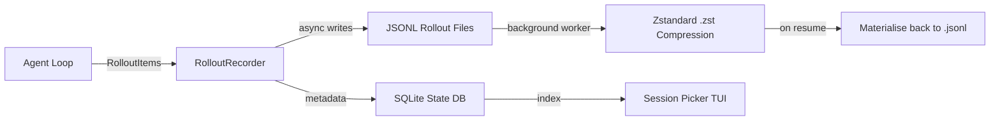
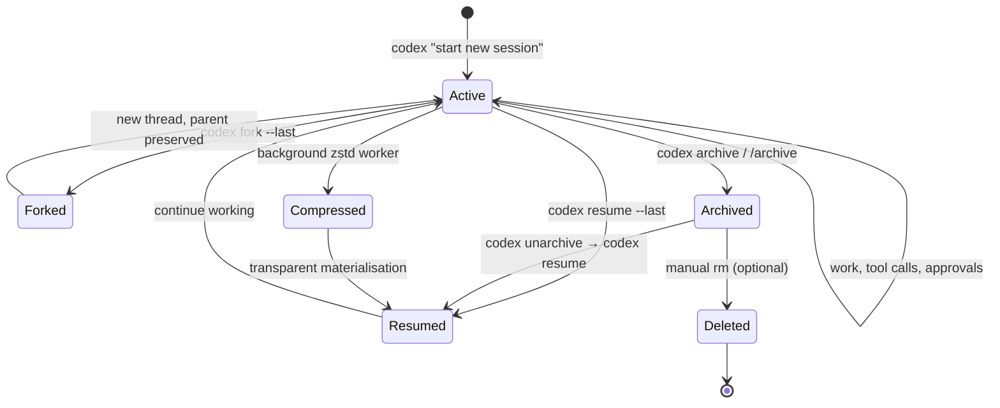

# Codex CLI Session Lifecycle: Archive, Resume, Fork, and Rollout Persistence


---

Every Codex CLI session generates a conversation transcript — prompts, model responses, tool calls, approval decisions — persisted as a structured rollout file on disk[^1]. Since v0.136 (June 2026), sessions also support explicit archiving, giving teams a complete lifecycle: **create → work → archive → resume or fork → compress → clean up**[^2]. This article dissects that lifecycle, the underlying storage format, and the practical workflows that make session management a first-class concern rather than an afterthought.

## The Rollout File Format

Codex persists every session as a newline-delimited JSON (JSONL) file stored under a date-partitioned hierarchy[^3]:

```
~/.codex/sessions/
└── 2026/
    └── 06/
        └── 08/
            ├── rollout-1717840200-a1b2c3d4.jsonl
            └── rollout-1717843800-e5f6g7h8.jsonl.zst
```

Each line wraps a `RolloutItem` with a UTC timestamp. The system records five primary item types[^3]:

| Type | Purpose |
|------|---------|
| `ResponseItem` | Raw model responses, tool calls, turn-end markers |
| `EventMsg` | Protocol events: `UserMessage`, `AgentMessage`, `TokenCount`, lifecycle |
| `SessionMeta` | Session-level data: ID, source surface, cwd, model provider, CLI version |
| `TurnContext` | Per-turn snapshot of model, approval policy, sandbox policy |
| `Compacted` | Summary items generated during history compaction |

Not every internal event reaches disk. The `EventPersistenceMode` gates what is written[^3]:

- **Limited** (default): essential conversation markers — `UserMessage`, `AgentMessage`, `TokenCount`, `TurnComplete`
- **Extended**: diagnostic data — `ExecCommandEnd`, `Error`, `McpToolCallEnd`

Large execution outputs in `ExecCommandEnd` events are truncated to 10,000 bytes to keep rollout files manageable[^3].

## Two-Layer Persistence Architecture

Session state lives in two complementary stores[^4]:



**Rollout files** are the source of truth — the full `RolloutItem` sequence for every turn. **The SQLite state database** tracks thread metadata (`git_sha`, `archived_at`, model name) and powers the session picker's search and filtering[^4].

The `RolloutRecorder` manages asynchronous filesystem writes via a background `RolloutWriterTask`, preventing disk I/O from blocking the agent loop[^3]. It accepts four commands over an internal channel:

```toml
# Internal RolloutCmd variants (not user-facing config)
AddItems   # Buffer new items for write
Persist    # Force immediate write with acknowledgement
Flush      # Ensure prior writes complete
Shutdown   # Gracefully close the writer
```

On startup, `reconcile_rollout` scans rollout files to ensure the SQLite index stays consistent with the filesystem — particularly important after migration or manual file moves[^4].

## Session Resume

Resume reopens a session with its original transcript, plan history, and approvals intact[^5]:

```bash
# Interactive picker — shows recent sessions with summaries
codex resume

# Skip the picker, resume the most recent session in this directory
codex resume --last

# Resume a specific session by UUID
codex resume a1b2c3d4-e5f6-7890-abcd-ef1234567890

# Include sessions from all directories, not just cwd
codex resume --last --all
```

When resuming, the system transparently handles both plain `.jsonl` and compressed `.jsonl.zst` files through `open_rollout_line_reader`[^3]. If a write operation occurs on a compressed rollout — because the user sends a new message — the file is materialised back to plain JSONL to allow appends[^3].

Configuration overrides (model, personality) are verified against the original session state. Mismatches are logged via `collect_resume_override_mismatches` rather than silently applied, so you know when a resumed session diverges from its original settings[^4].

### Non-Interactive Resume

For automation and CI pipelines, `codex exec resume` supports headless session continuation[^6]:

```bash
# Resume the last session with a follow-up prompt
codex exec resume --last "Now run the integration tests"

# Resume with an image attachment
codex exec resume --last -i screenshot.png "Fix the layout issue shown here"

# Pipe a prompt via stdin
echo "Generate the coverage report" | codex exec resume --last -
```

## Session Fork

Forking creates a new thread branching from a parent without mutating the original transcript[^4][^5]:

```bash
# Interactive picker — choose a session, then fork from it
codex fork

# Fork the most recent session automatically
codex fork --last

# Fork a specific session by UUID
codex fork a1b2c3d4-e5f6-7890-abcd-ef1234567890
```

Internally, fork[^4]:

1. Generates a new `ThreadId`
2. Sets `forked_from_id` metadata pointing to the parent
3. Copies the parent's history up to the fork point into a new rollout file
4. Leaves the parent rollout untouched

This enables divergent exploration — try an alternative approach without losing the original reasoning chain. A common pattern is to fork before attempting a risky refactoring:

```bash
# Fork the session where you analysed the codebase
codex fork --last

# In the forked session, try the aggressive approach
# If it fails, the original session is still intact for resume
```

You can also fork mid-session from the TUI: press Escape twice with an empty composer to edit a previous message and branch from that point[^5].

## Session Archiving (v0.136+)

Archiving, introduced in Codex CLI v0.136 (June 2026), marks a session as inactive and protects it from accidental resume or fork[^2]:

```bash
# Archive from the CLI
codex archive <SESSION_ID>

# Archive from the TUI
/archive

# Restore an archived session
codex unarchive <SESSION_ID>
```

Archived sessions set an `archived_at` timestamp in the SQLite state database. The session picker excludes them by default, keeping your active session list focused on current work[^2][^4].

### Why Archive Instead of Delete?

Archiving preserves the full rollout for audit, compliance, or later reference. The community has requested true deletion for sensitive sessions[^7], but the current design favours reversibility. For teams that need hard deletion, the rollout files under `~/.codex/sessions/` can be removed directly — though this leaves orphaned metadata in the SQLite index until the next `reconcile_rollout` pass[^4].

## Compression and Disk Management

Cold rollout files are compressed by a background worker using Zstandard (`.zst`), chosen for its strong compression ratio and streaming support — well-suited to log-like JSONL data[^3].

A practical cleanup workflow for teams generating high session volumes[^8]:

```bash
# Check disk usage of session storage
du -sh ~/.codex/sessions/

# List sessions older than 30 days (by directory structure)
find ~/.codex/sessions/ -name "*.jsonl" -mtime +30

# Archive automation runs you no longer need
codex archive <SESSION_ID>

# For hard cleanup of very old sessions
# (removes both .jsonl and .jsonl.zst files)
find ~/.codex/sessions/2026/0{1,2,3}/ -name "rollout-*" -delete
```

⚠️ Hard deletion bypasses the SQLite index. Run Codex CLI once afterwards to trigger `reconcile_rollout` and restore index consistency.

## Session Lifecycle Workflow

The complete lifecycle for a disciplined team workflow:



### Recommended Patterns

**Daily cleanup**: archive completed sessions at the end of each day. This keeps the session picker fast and focused.

```bash
# Archive all sessions from yesterday's directory
for f in ~/.codex/sessions/2026/06/07/rollout-*.jsonl; do
  session_id=$(basename "$f" | sed 's/rollout-[0-9]*-//' | sed 's/.jsonl//')
  codex archive "$session_id" 2>/dev/null
done
```

**Fork before risky operations**: before attempting a destructive refactoring or migration, fork the current session. If the approach fails, resume the original.

**Separate execution from memory**: use handoff documents (markdown files in your repo) to capture decisions and context worth preserving long-term. Sessions are working memory; documentation is permanent memory[^8].

**CI session hygiene**: non-interactive `codex exec` runs in CI generate rollout files on the build agent. Either mount a persistent volume for `~/.codex/sessions/` or clean up after each pipeline run to avoid unbounded disk growth.

## Cross-Surface Continuity

Sessions are not CLI-only artefacts. The App Server — a long-lived process exposing a bidirectional JSON-RPC 2.0 API — owns thread lifecycle across all Codex surfaces: CLI, Desktop, VS Code extension, and web[^9]. A session started in the CLI can be resumed in the Desktop app, and vice versa, because both connect to the same backend and the same persisted rollout state.

The v0.137 release extended this further: remote-control clients can now start pairing and list or revoke controller grants through app-server v2 RPCs, and resumed threads carry their initial turns page for richer context display[^10].

## Practical Implications

Session lifecycle management matters most at scale. A solo developer might never archive a session. A team of twenty, each running multiple Codex sessions daily across CLI and Desktop, will accumulate thousands of rollout files within weeks. The combination of structured archiving, background compression, and SQLite indexing keeps this manageable — but only if the team adopts deliberate session hygiene.

The fork-before-risk pattern deserves particular attention. Unlike version control branches, session forks preserve not just code state but the full reasoning chain — which model was used, what approval policy was active, which tool calls were made, and what the model's intermediate reasoning looked like. This makes session forks a uniquely valuable audit trail for understanding *why* a particular approach was taken, not just *what* changed.

## Citations

[^1]: [Codex CLI Features — Session Persistence](https://developers.openai.com/codex/cli/features) — OpenAI Developer Documentation, 2026
[^2]: [Codex CLI Changelog — v0.136.0](https://developers.openai.com/codex/changelog) — OpenAI Developer Documentation, June 2026
[^3]: [Rollout Persistence and Replay](https://deepwiki.com/openai/codex/3.5.2-rollout-persistence-and-replay) — DeepWiki analysis of openai/codex source
[^4]: [Session Resumption and Forking](https://deepwiki.com/openai/codex/4.4-session-resumption-and-forking) — DeepWiki analysis of openai/codex source
[^5]: [Codex CLI Command Reference](https://developers.openai.com/codex/cli/reference) — OpenAI Developer Documentation, 2026
[^6]: [Non-Interactive Mode](https://developers.openai.com/codex/noninteractive) — OpenAI Developer Documentation, 2026
[^7]: [Codex Cloud needs real deletion, not just archive](https://community.openai.com/t/codex-cloud-needs-real-deletion-not-just-archive-for-developer-session-history/1382259) — OpenAI Developer Community, 2026
[^8]: [How I Made Codex 10× Faster With a Simple 15-Point Cleanup](https://medium.com/coding-nexus/how-i-made-codex-10-faster-with-a-simple-15-point-cleanup-fb21292459ed) — Medium / Coding Nexus, May 2026
[^9]: [Cross-Surface Session Sync](https://codex.danielvaughan.com/2026/04/08/cross-surface-session-sync/) — Codex Knowledge Base, April 2026
[^10]: [Codex CLI Changelog — v0.137.0](https://developers.openai.com/codex/changelog) — OpenAI Developer Documentation, June 2026
