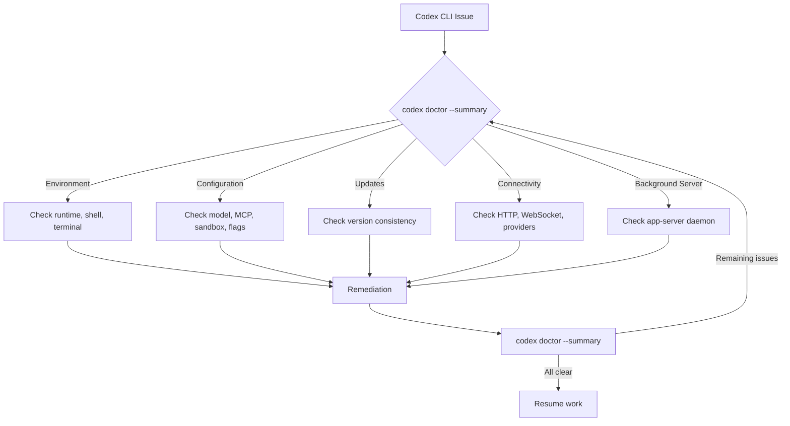
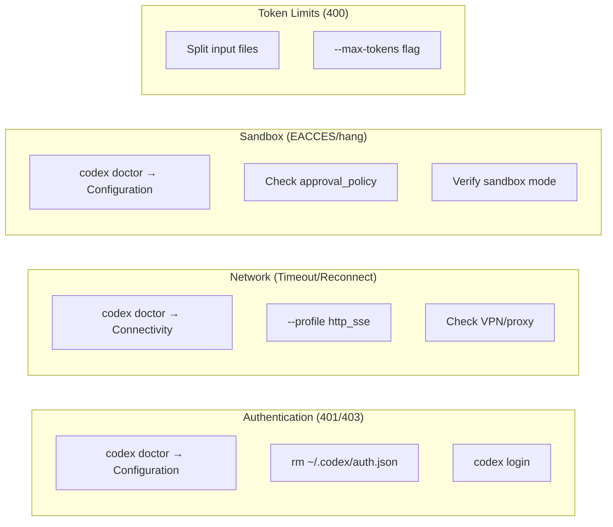

# Codex Doctor and the Diagnostic Toolkit: A Practitioner's Troubleshooting Guide


---

When Codex CLI stops working, most developers reach for the same blunt instrument: delete `auth.json`, reinstall, hope for the best. Since v0.131 introduced `codex doctor` and v0.135 substantially expanded its diagnostic coverage [^1], there is a far better approach. This article maps the complete Codex CLI diagnostic toolkit — from `codex doctor` through log analysis and debug subcommands — into a systematic troubleshooting workflow.

## The Diagnostic Surface

Codex CLI failures generally fall into five categories: environment, configuration, authentication, connectivity, and state corruption. Before v0.131, diagnosing these required manual inspection of config files, log tailing, and guesswork. `codex doctor` consolidates all of this into a single command [^2].



## Running codex doctor

The basic invocation requires no arguments:

```bash
codex doctor
```

This produces a hierarchical, colour-coded report with five sections — Environment, Configuration, Updates, Connectivity, and Background Server — plus a promoted "Notes" section at the top highlighting anomalies that warrant immediate attention [^2].

### Output Modes

| Flag | Purpose | When to use |
|------|---------|-------------|
| `--summary` | Grouped check rows with pass/warn/fail counts | Quick triage |
| `--json` | Redacted machine-readable report | CI pipelines, automated monitoring |
| `--all` | Expands long lists in verbose detail | Deep investigation |
| `--ascii` | ASCII labels instead of Unicode | Piping to tools that mangle UTF-8 |
| `--no-color` | Strips ANSI escape codes | Logging to files or issue trackers |

For most troubleshooting sessions, start with `--summary` and drill into the full report only for sections showing warnings or failures [^3]:

```bash
# Quick triage
codex doctor --summary

# Full detail for a support ticket
codex doctor --all --no-color > doctor-report.txt
```

### JSON Output for Automation

The `--json` flag produces structured output keyed by stable check identifiers, making it suitable for CI health gates or monitoring dashboards [^2]:

```bash
# Parse with jq to extract failing checks
codex doctor --json | jq '[.checks[] | select(.status == "fail")]'
```

The JSON output is automatically redacted — API keys and tokens are masked — so it is safe to attach to issue reports without manual sanitisation [^2].

## The Five Diagnostic Sections

### 1. Environment

This section inspects runtime provenance (npm global, Homebrew, standalone binary), shell configuration, terminal multiplexer state (tmux, Zellij), search tool availability, and SQLite database integrity for both state and log stores [^2].

**Common findings:**

- **Update target mismatch**: The running binary was installed via npm but updates are configured for Homebrew, or vice versa. Fix by aligning your update channel:

```bash
# If installed via npm
npm update -g @openai/codex

# If installed via Homebrew
brew upgrade codex-cli
```

- **Large rollout directory**: Accumulated rollout data consuming excessive disc space. Safe to prune with `rm -rf ~/.codex/rollouts/*`.

- **Database integrity failure**: Corrupted SQLite state database. Back up and remove `~/.codex/state.db` to force recreation [^4].

### 2. Configuration

Reports model settings, authentication method, MCP server configurations, feature flag overrides, and sandboxing policies. This is where mixed signals surface — for instance, having both `OPENAI_API_KEY` set as an environment variable and an active ChatGPT login session [^2].

**Common findings:**

- **Mixed auth signals**: Both API key and ChatGPT auth present. Codex may use one or the other unpredictably. Choose one:

```bash
# API key only
unset CODEX_USE_CHATGPT_AUTH
export OPENAI_API_KEY="sk-..."

# ChatGPT login only
unset OPENAI_API_KEY
codex login
```

- **MCP server misconfiguration**: Missing environment variables referenced by MCP server definitions in `config.toml`. Check `~/.codex/log/codex-tui.log` for `mcp` entries to pinpoint which server is failing [^5].

### 3. Updates

Checks whether the installed version, the running executable, and the configured update channel are consistent. A mismatch here — common after switching between npm and standalone installs — causes silent failures when new features are referenced in configuration [^1].

### 4. Connectivity

Tests HTTP endpoint reachability and WebSocket handshake status for all configured providers, including the ChatGPT WebSocket endpoint. This section catches corporate proxy issues, VPN interference, and DNS resolution failures [^2].

**WebSocket reconnection loops** are the single most common connectivity issue reported in the community [^6]. If this section shows WebSocket failures:

```toml
# ~/.codex/config.toml — HTTP/SSE fallback profile
[profiles.http_sse]
model_provider = "openai-http"
supports_websockets = false
```

```bash
# Test with the fallback profile
codex --profile http_sse
```

### 5. Background Server

Reports the app-server daemon status. The app-server handles session persistence, remote control connections, and cross-surface sync. If it is down, sessions cannot be resumed or forked [^2].

## Beyond codex doctor: The Full Toolkit

### Log Analysis

Codex CLI writes structured logs to `~/.codex/log/codex-tui.log`. For targeted investigation [^4]:

```bash
# MCP connection events
grep -i "mcp" ~/.codex/log/codex-tui.log | tail -20

# Authentication failures
grep -i "401\|auth\|token" ~/.codex/log/codex-tui.log | tail -20

# WebSocket events
grep -i "websocket\|ws://" ~/.codex/log/codex-tui.log | tail -20
```

### The /feedback Command

Inside an active session, `/feedback` outputs diagnostic metadata including the Request ID, Session ID, connection status, active tool count, and MCP server count [^4]. The Request ID is essential when raising issues with OpenAI support — it maps directly to their server-side telemetry.

### codex debug Subcommands

Two debug subcommands assist with specific investigations [^3]:

```bash
# Inspect the model catalogue Codex sees
codex debug models

# Show only bundled models (skip network refresh)
codex debug models --bundled

# Test app-server V2 messaging
codex debug app-server send-message-v2 "test message"
```

The model catalogue dump is particularly useful when a model name in your configuration no longer resolves — common after deprecations like the GPT-5.2 retirement on 5 June 2026 [^7].

## The Ten Most Common Failures

Based on community reports and the official troubleshooting documentation [^8][^6], here are the failures you will encounter most frequently, mapped to diagnostic commands:



| # | Error | Diagnostic | Fix |
|---|-------|-----------|-----|
| 1 | 401 Unauthorized | `codex doctor` → Configuration | Delete `auth.json`, re-login [^4] |
| 2 | WebSocket reconnect loop | `codex doctor` → Connectivity | Use `http_sse` profile [^6] |
| 3 | 429 Rate Limited | Check API usage dashboard | Space requests; wait and retry [^8] |
| 4 | 300s Timeout | `codex doctor` → Connectivity | Break tasks smaller; check VPN [^8] |
| 5 | Token limit (400) | Review prompt size | Use `--max-tokens`; split files [^8] |
| 6 | Sandbox EACCES | `codex doctor` → Configuration | Fix npm ownership or use nvm [^8] |
| 7 | MCP handshake timeout | Check `codex-tui.log` for MCP | Disable failing server; fix env vars [^5] |
| 8 | Update target mismatch | `codex doctor` → Updates | Align install method with update channel |
| 9 | Mixed auth signals | `codex doctor` → Configuration | Choose one auth method [^2] |
| 10 | Database corruption | `codex doctor` → Environment | Remove and recreate `state.db` [^4] |

## Integrating codex doctor into Workflows

### CI Health Gate

Run `codex doctor --json` as a pipeline step before any `codex exec` invocation to catch environment drift early:

```bash
#!/bin/bash
# ci-codex-health.sh
DOCTOR_STATUS=$(codex doctor --json | jq -r '.overall_status')
if [ "$DOCTOR_STATUS" != "pass" ]; then
    echo "Codex doctor reports issues:"
    codex doctor --summary
    exit 1
fi
codex exec "$@"
```

### Automated Feedback Attachment

Since v0.137, the doctor report auto-attaches to feedback uploads via Sentry as `codex-doctor-report.json`, with derived tags for overall status and failing check identifiers [^2]. This means running `/feedback` after encountering an issue automatically includes your diagnostic state — no manual copy-paste required.

### Team Standardisation

For teams managing multiple developer environments, pipe `codex doctor --json` into a shared dashboard to spot configuration drift across machines:

```bash
# Emit doctor report as a structured log line
codex doctor --json | jq -c '{
  user: env.USER,
  host: env.HOSTNAME,
  status: .overall_status,
  failing: [.checks[] | select(.status != "pass") | .id]
}'
```

## Conclusion

`codex doctor` transforms Codex CLI troubleshooting from guesswork into systematic diagnosis. The command covers the five failure domains — environment, configuration, updates, connectivity, and background server — in a single invocation, with output modes for quick triage (`--summary`), deep investigation (`--all`), and automated pipelines (`--json`). Combined with log analysis, `/feedback`, and `codex debug` subcommands, it provides a complete diagnostic surface that eliminates the "delete everything and reinstall" anti-pattern.

When something breaks, start with `codex doctor --summary`. Most of the time, it will tell you exactly what to fix.

---

## Citations

[^1]: [Codex CLI Changelog — OpenAI Developers](https://developers.openai.com/codex/changelog) — v0.131 introduced `codex doctor`; v0.135 (28 May 2026) expanded diagnostics; v0.136 (1 June 2026) and v0.137 (4 June 2026) added further enhancements.

[^2]: [feat(cli): add codex doctor diagnostics — Pull Request #22336, openai/codex](https://github.com/openai/codex/pull/22336) — Implementation details covering five diagnostic sections, output formats, JSON redaction, and Sentry integration.

[^3]: [Codex CLI Command Line Reference — OpenAI Developers](https://developers.openai.com/codex/cli/reference) — Official documentation for `codex doctor` flags and `codex debug` subcommands.

[^4]: [Codex CLI Logs: Location, Debug Flags & 401 Error Fix — SmartScope](https://smartscope.blog/en/generative-ai/chatgpt/codex-cli-diagnostic-logs-deep-dive/) — Diagnostic log locations, `/feedback` fields, and common failure patterns.

[^5]: [MCP Debugging and Diagnostics in Codex CLI: The Complete Troubleshooting Guide — Codex Knowledge Base](https://codex.danielvaughan.com/2026/04/24/codex-cli-mcp-debugging-diagnostics-troubleshooting-guide/) — MCP-specific diagnostic approaches and log analysis.

[^6]: [Codex CLI Reconnecting Fix: WebSocket Fallback and Recovery Guide — SmartScope](https://smartscope.blog/en/generative-ai/chatgpt/codex-cli-reconnecting-issue-2025/) — WebSocket reconnection troubleshooting, HTTP/SSE fallback profile, and diagnostic submission via `/feedback`.

[^7]: [GPT-5.2 and GPT-5.2-Codex deprecated — GitHub Changelog](https://github.blog/changelog/2026-06-05-gpt-5-2-and-gpt-5-2-codex-deprecated/) — Model deprecation affecting configuration validity.

[^8]: [Codex Error Fix — Timeout, API Failures & 10 Common Errors — Uniflow](https://www.uniflow.kr/en/codex-error-messages-troubleshooting-guide/) — Comprehensive error catalogue with causes and fixes.
