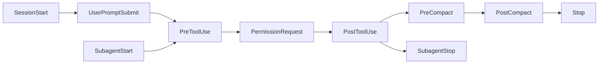

# The End of Fine-Tuning: What OpenAI's API Wind-Down Means for Your Codex CLI Customisation Strategy


---

On 7 May 2026, OpenAI notified developers that its self-serve fine-tuning platform is being wound down in phases[^1]. Organisations that had never run a fine-tuning job lost access immediately. By 2 July 2026, restrictions tighten further, and by 6 January 2027, no new training jobs will be accepted at all[^1]. Inference on existing fine-tuned models continues until the underlying base model is deprecated, but the message is unambiguous: fine-tuning is no longer OpenAI's recommended customisation path[^2].

For Codex CLI practitioners, this shift is less disruptive than it first appears. The tool's architecture was already built around prompt-time customisation rather than model-time training. But the deprecation crystallises an important strategic question: how do you encode domain knowledge, enforce coding standards, and shape agent behaviour without touching model weights? The answer is Codex CLI's four-layer customisation stack — AGENTS.md, skills, hooks, and configuration — and understanding when to reach for each layer is now a core competency.

## Why OpenAI Is Retiring Fine-Tuning

OpenAI's stated rationale is straightforward: newer base models have become capable enough to make fine-tuning unnecessary for most use cases[^2]. GPT-5.5, launched on 23 April 2026 at \$5/\$30 per million input/output tokens[^3], is substantially better at following instructions and maintaining output formats than its predecessors. The official guidance now reads: "Start with gpt-5.5 for new work, and use reasoning model guidance to tune outcome-level instructions, reasoning effort, and verbosity"[^4].

The economics reinforce this. Fine-tuning required training compute, data curation, evaluation pipelines, and ongoing model management. Prompt-based approaches — system prompts with examples, structured outputs, retrieval-augmented generation — deliver comparable results at lower operational overhead[^2]. For coding agent workflows specifically, the customisation mechanisms built into Codex CLI already operate at the prompt and tool layer, making the fine-tuning wind-down largely academic.

That said, specific use cases remain genuinely affected. Teams that fine-tuned models for proprietary code style enforcement, domain-specific terminology, or specialised output formats need migration plans. The table below maps common fine-tuning use cases to their Codex CLI equivalents[^2][^5]:

| Fine-Tuning Use Case | Codex CLI Equivalent | Layer |
|---|---|---|
| Code style enforcement | AGENTS.md conventions + linter hooks | AGENTS.md + Hooks |
| Domain terminology | AGENTS.md glossary + skill references | AGENTS.md + Skills |
| Output formatting | `--output-schema` or structured output config | Configuration |
| Specialised workflows | SKILL.md with scripts and examples | Skills |
| Safety/compliance rules | `requirements.toml` + `deny_read`/`deny_write` | Configuration |
| Reduced latency | Model routing with `codex-spark` for fast tasks | Configuration |

## Layer 1: AGENTS.md — Durable Project Guidance

AGENTS.md is the foundation of Codex CLI customisation. It loads before every task and shapes every interaction[^5]. Where fine-tuning encoded behaviour into model weights, AGENTS.md encodes it into text that travels with your repository.

The file supports a hierarchy: global defaults in `~/.codex/AGENTS.md`, repository-level standards at the project root, and directory-specific overrides in nested paths[^5]. Codex walks from the project root to your current working directory, reading each AGENTS.md it encounters, with `AGENTS.override.md` taking precedence at each level[^5].

Effective AGENTS.md files replace the most common fine-tuning motivation — consistent code style — by being explicit about conventions:

```markdown
## Coding Standards

- Use British English in all comments and documentation
- Prefer `const` over `let` unless reassignment is required
- All public functions require JSDoc with @param and @returns
- Error handling: never swallow exceptions; log and re-throw
- Test naming: `should <expected behaviour> when <condition>`
```

The combined size limit is 32 KiB by default (configurable via `project_doc_max_bytes`)[^5]. This constraint forces precision — a virtue that fine-tuning datasets often lacked.

## Layer 2: Skills — Reusable Workflow Packages

Skills replace the fine-tuning pattern of training a model on task-specific examples. A skill is a directory containing a `SKILL.md` file plus optional `scripts/`, `references/`, and `assets/` directories[^6]. Where a fine-tuned model internalised workflow knowledge, a skill externalises it as executable documentation.

```
.agents/skills/api-review/
├── SKILL.md
├── scripts/
│   └── check-breaking-changes.sh
└── references/
    └── api-style-guide.md
```

The `SKILL.md` declares metadata (name, description, trigger phrases) and instructions[^6]. Skills are discovered automatically — invoke them with `$skill-name` in prompts or let Codex match trigger phrases implicitly[^6].

For teams migrating from fine-tuned models, skills offer a critical advantage: **they are version-controlled, reviewable, and testable**. A fine-tuned model's behaviour was opaque; a skill's behaviour is a markdown file you can diff in a pull request.

Personal skills live in `$HOME/.agents/skills`; shared team skills go into `.agents/skills` within the repository[^6]. This mirrors the global-versus-local pattern of AGENTS.md and provides natural onboarding — new team members inherit the skill library with their first `git clone`.

## Layer 3: Hooks — Programmatic Lifecycle Interception

Hooks inject shell scripts into Codex CLI's agentic loop at ten defined lifecycle events[^7]:



Where fine-tuning could steer a model away from undesirable outputs, hooks enforce constraints programmatically. A `PreToolUse` hook can block commands matching dangerous patterns. A `PostToolUse` hook can run a linter after every file edit, rejecting changes that violate standards[^7].

Configuration lives in `.codex/hooks.json` or inline within `config.toml`[^7]:

```toml
[hooks.PostToolUse]
matcher = "apply_patch"

[[hooks.PostToolUse.hooks]]
type = "command"
command = "scripts/lint-changed-files.sh"
timeout = 30
statusMessage = "Running lint check..."
```

Hooks require the `hooks = true` feature flag[^7]. For enterprise deployments, managed hooks from system or MDM sources bypass the trust review requirement, enabling organisation-wide enforcement without per-developer opt-in[^7].

## Layer 4: Configuration — Model Routing and Behavioural Tuning

The `config.toml` hierarchy (`~/.codex/config.toml` for personal defaults, `.codex/config.toml` for repository-specific settings) replaces several fine-tuning use cases through model selection and behavioural parameters[^8].

Key configuration options that substitute for fine-tuning:

```toml
# Model routing replaces task-specific fine-tuned models
model = "gpt-5.5"
reasoning_effort = "medium"

# Subagent model delegation for cost optimisation
[profiles.fast]
model = "codex-spark"
reasoning_effort = "low"

[profiles.thorough]
model = "gpt-5.5"
reasoning_effort = "high"
```

Named profiles, selectable via `--profile fast` or `--profile thorough`, let you match model behaviour to task complexity without maintaining separate fine-tuned checkpoints[^8]. The `review_model` parameter can route code review to a different model than the primary coding model, replicating the pattern where teams fine-tuned separate review-focused models[^8].

For teams that fine-tuned models to reduce latency, Codex-Spark and GPT-5.4-mini provide sub-second response times at a fraction of the cost, configurable per profile or per subagent[^8].

## The Enterprise Dimension: requirements.toml

Enterprise teams that used fine-tuning for compliance — restricting model outputs to approved patterns — now have `requirements.toml` for organisation-wide enforcement[^9]. Workspace admins can enforce minimum sandbox modes, mandate approval policies, restrict model selection, and define file access boundaries via `deny_read` and `deny_write` arrays[^9].

Cloud-managed configuration bundles, introduced in v0.137.0, allow centralised policy distribution to EDU workspaces and enterprise fleets without requiring local file management[^10]. This is arguably more powerful than fine-tuning for compliance use cases — it operates at the enforcement layer rather than the probabilistic behaviour layer.

## Migration Checklist

For teams currently using fine-tuned models with Codex CLI or considering the transition:

1. **Audit your fine-tuning dataset** — identify what behaviour it encodes (style, terminology, workflow, safety)
2. **Map each behaviour to a customisation layer** — use the table above as a starting point
3. **Write AGENTS.md first** — encode conventions, standards, and constraints
4. **Extract repeatable workflows into skills** — one skill per distinct task pattern
5. **Add hooks for hard constraints** — anything that must never happen belongs in a `PreToolUse` or `PostToolUse` hook, not in a prompt
6. **Configure model routing** — replace task-specific fine-tuned models with named profiles
7. **Test with `/review`** — use Codex CLI's local review command to verify the customisation stack produces the expected output quality

## The Broader Signal

OpenAI's fine-tuning deprecation is part of a wider industry trend. As foundation models become more capable at instruction following, the customisation surface shifts from model training to runtime configuration. For Codex CLI users, this is validation: the tool was designed from the outset for prompt-time customisation through AGENTS.md, skills, hooks, and layered configuration.

The developers most affected are those building custom applications on the fine-tuning API — not coding agent users. But the strategic lesson applies broadly: invest in the customisation mechanisms that are transparent, version-controlled, and composable. Fine-tuned model weights were none of those things. Markdown files, shell scripts, and TOML configuration are all three.

## Citations

[^1]: OpenAI Developer Community, "OpenAI is winding down the fine-tuning API and platform — Discussion Thread," May 2026. [https://community.openai.com/t/openai-is-winding-down-the-fine-tuning-api-and-platform-discussion-thread/1380522](https://community.openai.com/t/openai-is-winding-down-the-fine-tuning-api-and-platform-discussion-thread/1380522)

[^2]: ExplainX, "OpenAI Winds Down Fine-Tuning API: GPT-5.5 Pricing, Cost Hikes, and What Developers Should Do," May 2026. [https://explainx.ai/blog/openai-gpt-55-pricing-fine-tuning-api-wind-down-2026](https://explainx.ai/blog/openai-gpt-55-pricing-fine-tuning-api-wind-down-2026)

[^3]: OpenAI, "Introducing GPT-5.5," April 2026. [https://openai.com/index/introducing-gpt-5-5/](https://openai.com/index/introducing-gpt-5-5/)

[^4]: OpenAI, "Model optimization," 2026. [https://platform.openai.com/docs/guides/model-optimization](https://platform.openai.com/docs/guides/model-optimization)

[^5]: OpenAI Developers, "Custom instructions with AGENTS.md," 2026. [https://developers.openai.com/codex/guides/agents-md](https://developers.openai.com/codex/guides/agents-md)

[^6]: OpenAI Developers, "Agent Skills," 2026. [https://developers.openai.com/codex/skills](https://developers.openai.com/codex/skills)

[^7]: OpenAI Developers, "Hooks," 2026. [https://developers.openai.com/codex/hooks](https://developers.openai.com/codex/hooks)

[^8]: OpenAI Developers, "Configuration Reference," 2026. [https://developers.openai.com/codex/config-reference](https://developers.openai.com/codex/config-reference)

[^9]: OpenAI Developers, "Managed configuration," 2026. [https://developers.openai.com/codex/enterprise/managed-configuration](https://developers.openai.com/codex/enterprise/managed-configuration)

[^10]: OpenAI Developers, "Changelog — Codex CLI 0.137.0," June 2026. [https://developers.openai.com/codex/changelog](https://developers.openai.com/codex/changelog)
