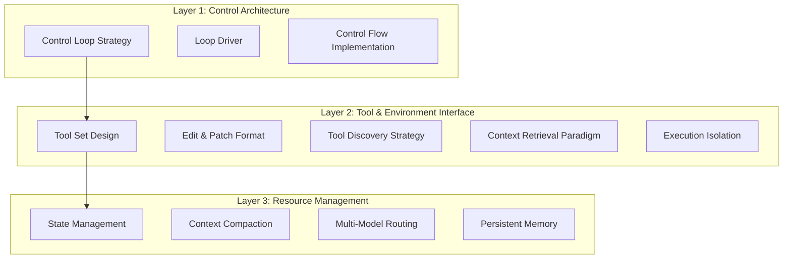
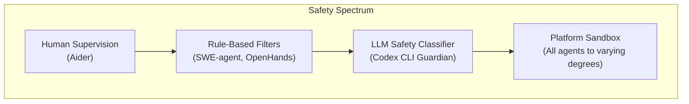
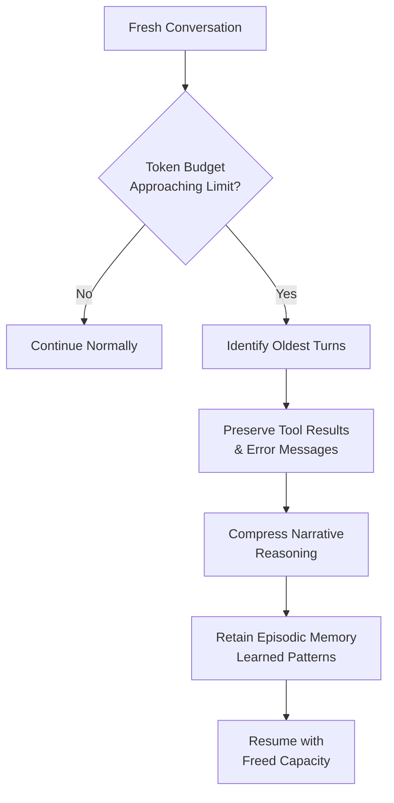

# Inside the Scaffold: What Academic Research Reveals About Codex CLI's Agent Architecture

---

A wave of academic papers published between January and April 2026 has begun dissecting the architectures of production coding agents at the source-code level. For the first time, researchers are moving beyond benchmark scores to examine *how* these tools actually work — the control loops, tool registries, safety mechanisms, and context strategies that distinguish one agent from another. Four papers in particular offer insights that every Codex CLI practitioner should understand.

## The 98.4% You Never Think About

The most striking finding comes from "Dive into Claude Code: The Design Space of Today's and Future AI Agent Systems" (Liu et al., April 2026)[^1]. After analysing Claude Code's open-source TypeScript codebase, the researchers found that only **1.6% of the code constitutes AI decision logic** — the actual model calls that generate reasoning and tool invocations. The remaining 98.4% builds the operational harness: permission systems, context compaction pipelines, extensibility mechanisms, session storage, and safety classifiers.

This ratio reframes how practitioners should think about Codex CLI. When you tune an `AGENTS.md` file, configure a hook, or adjust a permission profile, you are not tweaking the margins — you are engineering the 98.4% that determines whether the 1.6% produces useful results. The paper identifies five human values driving this harness design: human decision authority, safety and security, reliable execution, capability amplification, and contextual adaptability[^1].

Codex CLI's architecture follows a similar pattern. The `codex-rs` Cargo workspace contains approximately 70 crates[^2], yet the core agent loop — the ReAct cycle that calls the model, executes tools, and observes results — occupies a small fraction of the codebase. The bulk handles sandbox enforcement, approval policies, plugin discovery, session persistence, TUI rendering, and multi-platform compatibility.

## Twelve Dimensions, Three Layers

"Inside the Scaffold: A Source-Code Taxonomy of Coding Agent Architectures" (April 2026)[^3] provides the most systematic comparison to date, analysing 13 open-source coding agents at pinned commit hashes across 12 architectural dimensions organised into three layers:

### Where Codex CLI sits

The taxonomy characterises Codex CLI as a **sequential ReAct loop** driven via async event channels, with **per-turn dynamic tool rebuild** — tools are reconstructed each turn rather than fixed at startup[^3]. This dynamic approach means the tool surface adapts as the agent requests permissions, discovers MCP servers, or spawns subagents.

The tool count ranges from 0 (Aider, which delegates all navigation to the user) to 37 (Moatless Tools, with dedicated validation tools for test execution). Codex CLI sits in the upper range with approximately 20+ LLM-callable tools, including distinctive **meta-tools** such as `tool_search`, `tool_suggest`, and `request_permissions` that let the model reason about its own capabilities[^3].

### Five composable loop primitives

Rather than falling into discrete categories, the paper identifies five loop primitives that agents compose in different combinations[^3]:

| Primitive | Pattern | Primary Users |
|-----------|---------|---------------|
| ReAct | Thought → Action → Observation cycle | 7 of 13 agents as primary structure |
| Generate-test-repair | Write code → Run tests → Fix failures | Aider's inner loop |
| Plan-execute | Create plan → Execute steps | AutoCodeRover, Prometheus |
| Multi-attempt retry | Iterative error recovery | Most agents as secondary primitive |
| Tree search | Sampling to full MCTS | DARS-Agent, Moatless Tools |

Critically, **11 of 13 agents compose multiple primitives** rather than relying on a single control structure[^3]. Codex CLI's architecture layers ReAct as its primary loop with multi-attempt retry for error recovery and optional plan-execute when users invoke `/plan` mode.

## The Guardian Distinction

The taxonomy's most consequential finding about Codex CLI concerns safety architecture. Of the 13 agents studied, **Codex CLI is the only one that uses an LLM to evaluate another LLM's tool-call safety**[^3]. This is the Guardian sub-agent — a separate model invocation that scores each proposed tool call for risk before execution proceeds.

The broader agent landscape relies on one of three safety approaches:

Codex CLI combines the LLM classifier with OS-level sandboxing — Landlock on Linux, Seatbelt on macOS — creating a **defence-in-depth** model that the paper notes is architecturally unique among the agents studied[^3]. Since v0.122, the Guardian classifies actions into three risk tiers, with the auto-review sub-agent catching 96.1% of malicious behaviour whilst reducing human interruptions by roughly 200×[^4].

⚠️ The 96.1% figure and 200× reduction originate from OpenAI's own reporting rather than independent academic verification.

## AGENTS.md: 28.64% Faster, Empirically

While the architectural taxonomy examines *how* agents work, "On the Impact of AGENTS.md Files on the Efficiency of AI Coding Agents" (Lulla et al., January 2026)[^5] measures *how much repository-level configuration matters*. Presented at the ICSE 2026 Journal Ahead Workshop in Rio de Janeiro, the study analysed 124 pull requests across 10 repositories and found:

- **28.64% median runtime reduction** when AGENTS.md files were present
- **16.58% reduction in output token consumption**
- **Comparable task completion behaviour** — efficiency gains came without sacrificing correctness[^5]

These numbers validate what Codex CLI practitioners have long suspected: well-crafted `AGENTS.md` files do not merely provide guidance — they measurably reduce computational waste by preventing the model from exploring irrelevant code paths, misunderstanding project conventions, or regenerating context that could have been stated upfront.

For Codex CLI specifically, the `AGENTS.md` instruction chain operates as a cascading merge from `~/.codex/AGENTS.md` through every directory level to the working directory, capped at 32 KiB by default[^6]. The ICSE findings suggest that teams investing time in this configuration hierarchy are earning a nearly 30% efficiency dividend on every agent interaction.

## The Harness Engineering Pattern

A third paper, "Building AI Coding Agents for the Terminal" (March 2026)[^7], introduces the concept of **harness engineering** through its analysis of the OpenDev agent system. The paper describes a four-layer architecture — Entry & UI, Agent, Tool & Context, and Persistence — with an **Extended ReAct execution loop** comprising six phases per iteration:

1. Pre-check and context compaction
2. Thinking (optional chain-of-thought)
3. Self-critique (optional refinement)
4. Action (LLM reasoning with tools)
5. Tool execution with approval gating
6. Post-processing and persistence[^7]

The paper's most useful contribution for Codex CLI practitioners is the concept of **eager scaffolding** — fully constructing system prompts and tool schemas *before* accepting user input to eliminate first-call latency[^7]. Codex CLI's Rust implementation follows this pattern: the binary initialises the sandbox, loads the AGENTS.md chain, discovers MCP servers, and compiles the tool registry before presenting the TUI prompt.

### Context compaction strategies

The taxonomy paper identifies **seven distinct context compaction strategies** across the 13 agents[^3], whilst the OpenDev paper describes a five-stage progressive compression system[^7]. Codex CLI's approach — which automatically compacts older conversation turns when token usage approaches the context window limit — falls into what the taxonomy calls the **summarisation-with-retention** category, preserving tool call results and error messages whilst compressing narrative reasoning.

## Practical Implications for Codex CLI Users

These papers collectively suggest four actionable takeaways:

### 1. Invest in AGENTS.md proportionally to its measured impact

A 28.64% runtime reduction is not a marginal gain — for a team running 100 agent sessions per day, that translates directly into reduced token costs and faster iteration cycles[^5]. Treat AGENTS.md authoring as engineering work, not documentation.

### 2. Understand that you are configuring the harness, not the model

The 98.4% harness ratio means that your `config.toml` settings, permission profiles, hook definitions, and skill files have far more influence on agent behaviour than prompt wording alone[^1]. When a Codex CLI session produces poor results, the most productive debugging path is usually the configuration layer, not the prompt.

### 3. Leverage the Guardian architecture

Codex CLI's unique LLM-based safety classifier means you can run at higher autonomy levels — `auto-edit` or `auto-approve` — with architectural safety guarantees that agents lacking this layer cannot provide[^3][^4]. The trade-off is additional token expenditure per tool call; the benefit is reduced human approval fatigue in long-running sessions.

### 4. Match loop primitives to task type

The five composable loop primitives map naturally to different Codex CLI workflows:

| Task Type | Recommended Primitive | Codex CLI Feature |
|-----------|----------------------|-------------------|
| Bug fixing | Generate-test-repair | `codex exec` with test suite |
| Feature development | Plan-execute | `/plan` mode → implementation |
| Exploration | ReAct (default) | Interactive TUI session |
| Migration | Multi-attempt retry | Hooks for build verification |
| Complex refactoring | Plan-execute + retry | Subagent delegation with rollback |

## What the Research Does Not Yet Cover

These papers have notable gaps. Claude Code was excluded from the "Inside the Scaffold" taxonomy because it was distributed as a compiled binary with no published source repository at the time of analysis[^3]. ⚠️ Claude Code has since been open-sourced (May 2025), and future taxonomies will likely include it.

None of the papers benchmark the *interaction* between architectural choices — for instance, whether the Guardian's token overhead is recovered through fewer failed tool calls. The AGENTS.md study measures efficiency but not correctness quality. And the harness engineering paper analyses OpenDev rather than Codex CLI directly, requiring practitioners to draw architectural parallels rather than relying on direct measurement.

The field is young. But for the first time, we have empirical, source-code-level evidence for architectural decisions that Codex CLI practitioners have been making intuitively. That evidence deserves attention.

## Citations

[^1]: Liu, J., Zhao, X., Shang, X., & Shen, Z. (2026). "Dive into Claude Code: The Design Space of Today's and Future AI Agent Systems." arXiv:2604.14228. [https://arxiv.org/abs/2604.14228](https://arxiv.org/abs/2604.14228)

[^2]: OpenAI. (2026). "codex-rs README." GitHub. [https://github.com/openai/codex/blob/main/codex-rs/README.md](https://github.com/openai/codex/blob/main/codex-rs/README.md)

[^3]: "Inside the Scaffold: A Source-Code Taxonomy of Coding Agent Architectures." (2026). arXiv:2604.03515. [https://arxiv.org/abs/2604.03515](https://arxiv.org/abs/2604.03515)

[^4]: OpenAI. (2026). "Agent approvals & security – Codex CLI." OpenAI Developers. [https://developers.openai.com/codex/agent-approvals-security](https://developers.openai.com/codex/agent-approvals-security)

[^5]: Lulla, J.L., Mohsenimofidi, S., Galster, M., Zhang, J.M., Baltes, S., & Treude, C. (2026). "On the Impact of AGENTS.md Files on the Efficiency of AI Coding Agents." arXiv:2601.20404. Presented at ICSE 2026 JAWs Workshop, Rio de Janeiro. [https://arxiv.org/abs/2601.20404](https://arxiv.org/abs/2601.20404)

[^6]: OpenAI. (2026). "CLI – Codex." OpenAI Developers. [https://developers.openai.com/codex/cli](https://developers.openai.com/codex/cli)

[^7]: "Building AI Coding Agents for the Terminal: Scaffolding, Harness, Context Engineering, and Lessons Learned." (2026). arXiv:2603.05344. [https://arxiv.org/abs/2603.05344](https://arxiv.org/abs/2603.05344)
