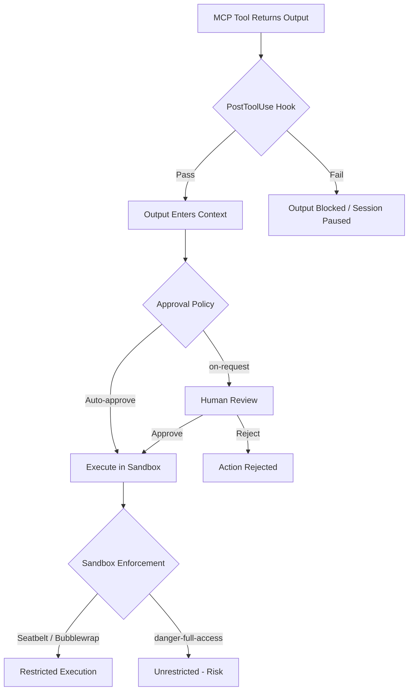

# The OWASP MCP Top 10 and Codex CLI: Mapping Every Risk to a Concrete Defence


---

The Model Context Protocol now connects coding agents to databases, cloud consoles, project trackers, and browser automation tools. That connectivity is powerful — and exploitable. Between January and February 2026 alone, researchers filed over thirty CVEs targeting MCP servers, clients, and tooling; forty-three per cent were shell injections [^1]. The OWASP MCP Top 10 project, led by Vandana Verma Sehgal under the OWASP Foundation, catalogues the ten risk categories most likely to compromise an MCP deployment [^2]. Separately, the OWASP Cheat Sheet Series published an MCP Security Cheat Sheet with prescriptive mitigations [^3].

This article maps each of the ten risks to Codex CLI's existing defence surface — sandbox profiles, approval policies, `requirements.toml` enforcement, OpenTelemetry telemetry, and hook-based gates — so you can assess your exposure and close gaps with configuration rather than custom code.

## Why This Matters Now

The Agentic AI Foundation, formed under the Linux Foundation in December 2025 with founding contributions from Anthropic (MCP), Block (goose), and OpenAI (AGENTS.md), now stewards MCP as an open standard [^4]. The MCP Dev Summit Bengaluru (9–10 June 2026) includes a dedicated session on the OWASP MCP Top 10 [^5]. As MCP adoption accelerates — Codex CLI supports both `stdio` and Streamable HTTP transports natively [^6] — the attack surface grows with every server you add.

## The Ten Risks and Codex CLI's Defences

### MCP01: Token Mismanagement and Secret Exposure

**Risk:** Hard-coded credentials, long-lived tokens, or secrets stored in model memory or protocol logs expose connected systems to unauthorised access [^2].

**Codex CLI defence:**

- **Per-server environment variables** in `config.toml` scope secrets to individual MCP servers rather than exposing a global token [^6]. Since v0.136, each `[mcp-servers.<name>]` block accepts its own `env` table.
- **`requirements.toml`** can deny write access to paths containing credential files (`.env`, `credentials.json`), preventing the agent from accidentally committing secrets [^7].
- **OpenTelemetry audit logging** records every tool invocation with timestamps and user context; pipe traces to your SIEM to detect anomalous credential access [^8].

```toml
# config.toml — scoped secret per MCP server
[mcp-servers.github]
transport = "http"
url = "https://api.githubcopilot.com/mcp/v1"
env = { GITHUB_TOKEN = "${GITHUB_TOKEN}" }
```

### MCP02: Privilege Escalation via Scope Creep

**Risk:** Loosely defined permissions expand over time, granting agents capabilities far beyond what the original integration required [^2].

**Codex CLI defence:**

- **Named permission profiles** (v0.135+) let you lock down sandbox modes per context. A `ci` profile can enforce `read-only` sandbox while a `dev` profile permits `workspace-write` [^9].
- **Approval policies** (`on-request`, `never`, `untrusted`) control when the agent must ask before acting. Granular policies can auto-reject specific action categories whilst permitting others [^9].
- **Protected paths** — `.git`, `.agents`, and `.codex` directories remain read-only regardless of sandbox mode, preventing the agent from modifying its own governance files [^9].

```toml
# ci.config.toml — locked-down CI profile
sandbox = "read-only"
approval_policy = "on-request"
```

### MCP03: Tool Poisoning

**Risk:** An adversary compromises a tool's definition or output, injecting malicious context that manipulates model behaviour [^2]. The OWASP Cheat Sheet recommends cryptographically hashing and pinning tool schemas to detect tampering [^3].

**Codex CLI defence:**

- **`PostToolUse` hooks** execute after every tool call and can validate outputs before they re-enter the model's context. A hook that checks for unexpected shell commands in tool responses acts as a runtime tripwire [^10].
- **Approval policy `on-request`** forces the agent to surface tool call parameters for human review before execution — the Cheat Sheet's "display full tool call parameters, not summaries" recommendation maps directly [^3].
- **`codex plugin list --json`** (v0.137) provides machine-readable plugin metadata, enabling automated integrity checks against a pinned manifest in CI [^11].

### MCP04: Supply Chain Attacks and Dependency Tampering

**Risk:** Compromised MCP server dependencies introduce backdoors or alter agent functionality [^2].

**Codex CLI defence:**

- **`requirements.toml`** can enforce allow-listed MCP server binaries by path, preventing the agent from spawning arbitrary processes [^7].
- **Plugin trust scores** — community registries like the HOL Plugin Registry run automated `plugin-scanner` analysis on every listing, producing security scores [^12]. Validate scores before adding servers to your `config.toml`.
- **Lockfile verification hooks** — a `PostToolUse` hook on `apply_diff` can reject changes to lockfiles (`package-lock.json`, `Cargo.lock`) unless they pass `npm audit` or `cargo audit` [^10].

### MCP05: Command Injection and Execution

**Risk:** The agent constructs and executes system commands using untrusted input without proper sanitisation [^2]. This was the single largest CVE category in early 2026 [^1].

**Codex CLI defence:**

- **OS-level sandboxing** is the primary barrier. On macOS, Seatbelt profiles dynamically generated from the sandbox policy restrict process capabilities. On Linux, Bubblewrap isolates user, PID, and network namespaces (`--unshare-user`, `--unshare-pid`, `--unshare-net`), and seccomp filters block dangerous syscalls [^13].
- **Network isolation by default** — the `workspace-write` sandbox blocks all network access unless explicitly allowed via domain allow-lists, neutralising exfiltration payloads in injected commands [^9].
- **`danger-full-access`** disables all restrictions. Never use it with untrusted MCP servers. Treat it as a development-only escape hatch.



### MCP06: Intent Flow Subversion

**Risk:** Malicious instructions embedded in context hijack the agent away from user objectives — the MCP-specific form of prompt injection [^2].

**Codex CLI defence:**

- **AGENTS.md governance** anchors the agent's objectives at session start. Because AGENTS.md is loaded before any tool output, its instructions carry higher precedence in the model's attention [^14].
- **Context compaction** (automatic at ~90% of the context window) preserves AGENTS.md instructions whilst summarising tool outputs, reducing the window in which injected instructions persist [^15].
- **Auto-review capability** routes eligible approvals through a reviewer sub-agent that evaluates requests for data exfiltration, credential probing, and destructive actions, failing closed on timeouts [^9].

### MCP07: Insufficient Authentication and Authorisation

**Risk:** Thirty-eight per cent of 500+ scanned MCP servers lack any form of authentication [^1]. Weak identity verification exposes critical interaction paths [^2].

**Codex CLI defence:**

- **Streamable HTTP transport with OAuth** — Codex CLI supports bearer token and OAuth authentication for remote MCP servers, configured per-server in `config.toml` [^6].
- **`CODEX_API_KEY` registration** for remote execution (v0.135+) replaces the earlier credential flow with standard Codex auth, reducing the number of long-lived tokens in circulation [^11].
- **Bind to localhost** — stdio servers run as local child processes, never exposed on a network socket. For HTTP servers you control, bind to `127.0.0.1` as the OWASP Cheat Sheet recommends [^3].

### MCP08: Lack of Audit and Telemetry

**Risk:** Without comprehensive logging, organisations cannot detect compromise or perform incident response [^2].

**Codex CLI defence:**

- **Built-in OpenTelemetry** exports traces, metrics, and logs via OTLP (gRPC or HTTP) to any compatible backend — Datadog, Grafana, Coralogix, SigNoz [^8]. Each session emits a `session_loop` root span with child spans for API calls and tool invocations.
- **JSONL rollout files** persist every session event locally, providing an offline audit trail even when telemetry backends are unavailable [^16].
- **`codex doctor --json`** (v0.137) outputs structured diagnostic data suitable for automated compliance checks [^11].

```toml
# config.toml — enable OTLP trace export
[telemetry]
trace_exporter = "otlp"
otlp_endpoint = "https://otel-collector.internal:4317"
```

### MCP09: Shadow MCP Servers

**Risk:** Unapproved MCP server deployments operate outside security governance, often with default credentials and permissive configurations [^2].

**Codex CLI defence:**

- **Cloud-managed config bundles** (v0.137) allow enterprise administrators to push approved MCP server configurations to all developers, overriding local additions [^11]. EDU workspaces use the same mechanism.
- **`requirements.toml` enforcement** can restrict which MCP server binaries the sandbox is permitted to spawn, blocking shadow servers that do not appear in the approved list [^7].
- **`codex mcp` management commands** provide a single interface for adding, removing, and listing servers — combined with `codex plugin list --json`, teams can audit the active server set in CI [^6].

### MCP10: Context Injection and Over-Sharing

**Risk:** Shared context windows expose sensitive information across different tasks or users [^2].

**Codex CLI defence:**

- **Per-session context isolation** — each Codex CLI session maintains its own context window. Multi-agent v2 (v0.137) keeps runtime choice with each thread, preventing cross-thread context leakage [^11].
- **`.codexignore`** excludes sensitive files from the agent's file-reading scope, functioning like `.gitignore` for context control [^17].
- **`tool_output_token_limit`** caps how much data any single tool response can inject into context, reducing the blast radius of a verbose or malicious tool [^15].

## A Practical Hardening Checklist

The following table summarises the minimum configuration for each risk category:

| OWASP Risk | Primary Codex CLI Control | Config Key / Flag |
|---|---|---|
| MCP01 Token Mismanagement | Per-server env scoping | `[mcp-servers.<name>].env` |
| MCP02 Privilege Escalation | Named permission profiles | `--profile ci`, `sandbox = "read-only"` |
| MCP03 Tool Poisoning | PostToolUse validation hooks | `.agents/hooks/PostToolUse` |
| MCP04 Supply Chain | Plugin integrity scanning | `codex plugin list --json` |
| MCP05 Command Injection | OS-native sandbox | `sandbox = "workspace-write"` (default) |
| MCP06 Intent Subversion | AGENTS.md governance anchoring | `.agents/AGENTS.md` |
| MCP07 Weak Auth | OAuth / bearer per-server | `[mcp-servers.<name>].auth` |
| MCP08 No Audit Trail | OpenTelemetry export | `[telemetry].trace_exporter` |
| MCP09 Shadow Servers | Cloud-managed config bundles | Enterprise admin policies |
| MCP10 Over-Sharing | `.codexignore` + token limits | `.codexignore`, `tool_output_token_limit` |

## What Codex CLI Does Not Cover

Codex CLI's defences are strong but not complete:

- **Tool schema pinning** — the OWASP Cheat Sheet recommends cryptographic hashing of tool definitions [^3]. Codex CLI does not yet natively verify tool schema integrity at connection time. ⚠️ Teams should implement this via a `PreToolUse` hook or external MCP gateway.
- **Message-level signing** — JSON-RPC payload signing with ECDSA, recommended by the Cheat Sheet, is not implemented in Codex CLI's MCP client [^3]. ⚠️ This is an open gap for remote Streamable HTTP connections over untrusted networks.
- **AGENTS.md is guidance, not enforcement** — instructions shape behaviour through the model's attention, not through hard technical controls. A long, complex session where the model loses track of earlier context may drift from AGENTS.md rules [^14].

## Conclusion

The OWASP MCP Top 10 provides a structured threat model for the tool-connected agent era. Codex CLI already addresses the majority of these risks through its layered security architecture — OS-native sandboxing, approval policies, `requirements.toml` enforcement, per-server credential scoping, and OpenTelemetry telemetry. The remaining gaps (schema pinning, message signing) are addressable through hooks and external gateways. With the MCP Dev Summit in Bengaluru this week and the Agentic AI Foundation now stewarding MCP governance, treating these ten risks as a configuration checklist rather than an aspirational framework is the pragmatic path forward.

## Citations

[^1]: Practical DevSecOps, "MCP Security Vulnerabilities: How to Prevent Prompt Injection and Tool Poisoning Attacks in 2026," [https://www.practical-devsecops.com/mcp-security-vulnerabilities/](https://www.practical-devsecops.com/mcp-security-vulnerabilities/)
[^2]: OWASP Foundation, "OWASP MCP Top 10," [https://owasp.org/www-project-mcp-top-10/](https://owasp.org/www-project-mcp-top-10/)
[^3]: OWASP Cheat Sheet Series, "MCP Security Cheat Sheet," [https://cheatsheetseries.owasp.org/cheatsheets/MCP_Security_Cheat_Sheet.html](https://cheatsheetseries.owasp.org/cheatsheets/MCP_Security_Cheat_Sheet.html)
[^4]: Linux Foundation, "Linux Foundation Announces the Formation of the Agentic AI Foundation (AAIF)," [https://www.linuxfoundation.org/press/linux-foundation-announces-the-formation-of-the-agentic-ai-foundation](https://www.linuxfoundation.org/press/linux-foundation-announces-the-formation-of-the-agentic-ai-foundation)
[^5]: MCP Dev Summit Bengaluru 2026 Schedule, [https://mcpbengaluru26.sched.com/](https://mcpbengaluru26.sched.com/)
[^6]: OpenAI Developers, "Model Context Protocol – Codex," [https://developers.openai.com/codex/mcp](https://developers.openai.com/codex/mcp)
[^7]: OpenAI Developers, "Configuration Reference – Codex," [https://developers.openai.com/codex/config-reference](https://developers.openai.com/codex/config-reference)
[^8]: OpenAI Developers, "Codex CLI OpenTelemetry and Observability," referenced via DeepWiki, [https://deepwiki.com/openai/codex/9.4-observability-and-telemetry](https://deepwiki.com/openai/codex/9.4-observability-and-telemetry)
[^9]: OpenAI Developers, "Agent Approvals and Security – Codex," [https://developers.openai.com/codex/agent-approvals-security](https://developers.openai.com/codex/agent-approvals-security)
[^10]: OpenAI Developers, "Customization – Codex," [https://developers.openai.com/codex/concepts/customization](https://developers.openai.com/codex/concepts/customization)
[^11]: OpenAI Developers, "Changelog – Codex," [https://developers.openai.com/codex/changelog](https://developers.openai.com/codex/changelog)
[^12]: Hashgraph Online, "Awesome Codex Plugins Registry," [https://github.com/hashgraph-online/awesome-codex-plugins](https://github.com/hashgraph-online/awesome-codex-plugins)
[^13]: DeepWiki, "Sandboxing Implementation – openai/codex," [https://deepwiki.com/openai/codex/5.6-sandboxing-implementation](https://deepwiki.com/openai/codex/5.6-sandboxing-implementation)
[^14]: OpenAI Developers, "Custom Instructions with AGENTS.md – Codex," [https://developers.openai.com/codex/guides/agents-md](https://developers.openai.com/codex/guides/agents-md)
[^15]: OpenAI Developers, "Advanced Configuration – Codex," [https://developers.openai.com/codex/config-advanced](https://developers.openai.com/codex/config-advanced)
[^16]: OpenAI Developers, "Non-interactive Mode – Codex," [https://developers.openai.com/codex/noninteractive](https://developers.openai.com/codex/noninteractive)
[^17]: OpenAI Developers, "Best Practices – Codex," [https://developers.openai.com/codex/learn/best-practices](https://developers.openai.com/codex/learn/best-practices)
