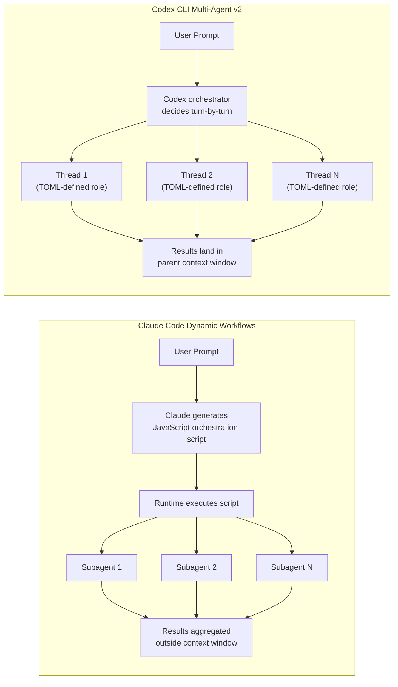
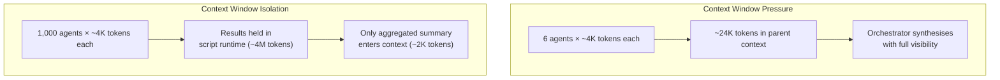
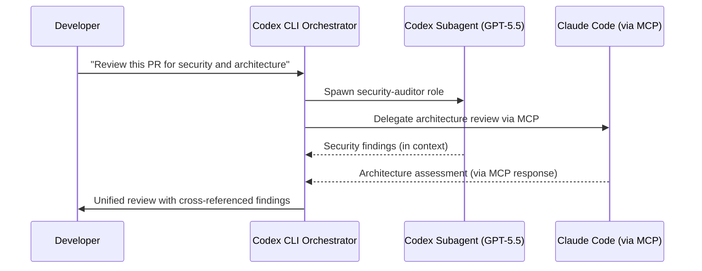

# The Parallel Subagent Race: Codex CLI Multi-Agent v2, Claude Code Dynamic Workflows, and Choosing Your Agent Architecture


---

Within seven days — 28 May to 4 June 2026 — the two dominant terminal-first coding agents both shipped major multi-agent upgrades. Anthropic launched **Dynamic Workflows** in Claude Code alongside Opus 4.8 [^1], enabling a single orchestrator session to spawn up to 1,000 subagents through generated JavaScript. OpenAI followed with **Multi-Agent v2** in Codex CLI v0.137 [^2], preserving per-thread runtime choice and exposing cleaner metadata defaults for spawned agents through TOML-defined roles.

The timing is not coincidental. Multi-agent orchestration has become the competitive frontier for coding agents in 2026. Understanding the architectural differences between these two approaches — and when each excels — is now essential for any team running agent-assisted development at scale.

---

## Two Philosophies of Orchestration

The core difference is where the orchestration logic lives.



### Claude Code: Script-Generated Orchestration

Dynamic Workflows move the plan into code. When you describe a task, Claude writes a JavaScript orchestration script on the fly, and a separate runtime executes that script in the background [^3]. The script holds the loop, the branching, and the intermediate results itself, so Claude's context window holds only the final answer [^4].

Key primitives include `agent()` for spawning a single subagent with validated structured output, `parallel()` as a barrier that fans out work and waits for all results, and `pipeline()` for streaming items through sequential stages [^3]. The maximum concurrency is 16 agents executing simultaneously, with up to 1,000 total agents per execution [^5].

The architectural bet is that orchestration logic is better expressed as executable code than as natural language instructions. This makes workflows repeatable — the generated script can be saved, reviewed, and rerun — but it introduces a layer of indirection: Claude must correctly generate the orchestration script before any subagent work begins.

### Codex CLI: Config-Driven Turn-by-Turn Orchestration

Codex CLI's approach keeps the orchestrator model in the loop at every turn. The parent agent decides what to spawn, routes follow-up instructions to active threads, waits for results, and closes agent threads — all within the standard agent loop [^6]. Subagent roles are defined declaratively in TOML files stored in `~/.codex/agents/` or `.codex/agents/` [^6].

```toml
# .codex/agents/reviewer.toml
name = "reviewer"
description = "PR reviewer focused on correctness and security"
model = "gpt-5.4"
model_reasoning_effort = "high"
sandbox_mode = "read-only"
developer_instructions = "Review like an owner. Prioritise correctness and security."
```

The v0.137 Multi-Agent v2 upgrade added three significant improvements: runtime choice persists with each thread (so a spawned agent keeps its assigned model even if the parent switches), follow-up metadata defaults are cleaner for spawned agents, and the `/agent` command provides direct thread management from the TUI [^2].

Global concurrency is controlled through `config.toml`:

```toml
[agents]
max_threads = 6
max_depth = 1
job_max_runtime_seconds = 1800
```

The default `max_depth = 1` prevents recursive spawning — child agents cannot spawn further children unless you explicitly increase the depth [^6]. This is a deliberate safety constraint that trades expressiveness for predictability.

---

## Architectural Comparison

| Dimension | Codex CLI Multi-Agent v2 | Claude Code Dynamic Workflows |
|---|---|---|
| **Orchestration model** | Turn-by-turn, model-in-the-loop | Script-generated, runtime-executed |
| **Max concurrent agents** | 6 (configurable via `max_threads`) | 16 concurrent, 1,000 total [^5] |
| **Nesting depth** | Configurable (`max_depth`), default 1 | Hierarchical orchestrators supported [^3] |
| **Role definition** | TOML files in `.codex/agents/` | Inline in generated JavaScript |
| **Result aggregation** | Parent context window | External to context window [^4] |
| **Repeatability** | Prompt-dependent (same prompt, similar behaviour) | Script can be saved and rerun [^3] |
| **Model per agent** | Per-role TOML field | Per-agent in script |
| **Sandbox inheritance** | Inherits parent policy, overridable [^6] | Inherits parent permissions |
| **Batch processing** | `spawn_agents_on_csv` (experimental) [^6] | `parallel()` with array inputs [^3] |
| **Plan visibility** | Orchestrator reasoning visible in TUI | Generated script visible before execution |

---

## The Context Window Trade-Off

The most consequential difference is where intermediate results live. In Codex CLI, every subagent result lands in the parent's context window [^4]. This means the orchestrator has full visibility over all results — it can reason about cross-cutting concerns, spot contradictions, and synthesise nuanced conclusions. The cost is that context fills faster. For a six-agent review, you are paying for six results plus the orchestrator's reasoning tokens.

Claude Code's Dynamic Workflows solve this by keeping intermediate results in the script runtime, outside the context window [^4]. Only the final aggregated answer enters Claude's context. This is why Dynamic Workflows scale to 1,000 agents — the context window never sees the raw output from each one. The trade-off is that the orchestrator cannot reason about intermediate results in real time; it relies on the generated script's aggregation logic being correct.



For tasks requiring cross-referencing — such as security audits where findings in one module may invalidate assumptions in another — Codex CLI's in-context approach produces better-connected results. For embarrassingly parallel tasks — applying the same transformation across 500 files — Dynamic Workflows' isolation is superior.

---

## When to Choose Each Architecture

### Codex CLI Multi-Agent v2 Excels At

**Structured team reviews.** Define permanent roles (security reviewer, performance auditor, documentation checker) as TOML files, spawn them on every PR, and get results the orchestrator can cross-reference in context [^6]:

```
Spawn reviewer, security-auditor, and docs-checker on this PR.
Wait for all three, then synthesise a unified review.
```

**Cost-predictable workflows.** The `max_threads` cap and `job_max_runtime_seconds` timeout provide hard ceilings on resource consumption. You know the maximum cost before spawning.

**Heterogeneous model routing.** Each TOML-defined role can specify a different model. Route exploration tasks to `codex-spark` and security review to `gpt-5.5` with `model_reasoning_effort = "high"` — all within a single session [^6].

**Interactive oversight.** The `/agent` command lets you inspect, stop, or redirect active threads mid-execution. You remain in the loop.

### Claude Code Dynamic Workflows Excel At

**Codebase-scale migrations.** When you need to apply a consistent transformation across hundreds of files, Dynamic Workflows' script-based fan-out handles the scale that would overwhelm a 6-thread limit [^5].

**Self-verifying tasks.** The workflow pattern supports adversarial verification: one set of agents performs the work, another set attempts to refute the results, and the workflow iterates until findings converge [^4]. This is difficult to achieve with turn-by-turn orchestration.

**Unknown decomposition strategies.** When you cannot predict in advance how to split the work, Dynamic Workflows let Claude generate the decomposition plan as executable code. Codex CLI's approach requires either pre-defined roles or explicit spawn instructions.

**Offline execution.** Dynamic Workflows run headlessly [^3]. Fire off a migration before leaving for the day; check results tomorrow. Codex CLI's subagents, by contrast, run within an interactive session (though `codex exec` with subagent-spawning prompts partially bridges this gap).

---

## Cross-Agent Orchestration: Using Both Together

For teams running both Codex CLI and Claude Code, MCP provides the bridge. Codex CLI can be exposed as an MCP server [^7], allowing Claude Code's Dynamic Workflows to delegate specific tasks to Codex — particularly useful when you want Claude's orchestration scale with Codex's OpenAI model access.

The inverse also works: Codex CLI can connect to Claude Code via MCP, routing tasks that benefit from Opus 4.8's reasoning to Claude while keeping the primary workflow in Codex.



This hybrid pattern gives you Codex CLI's in-context cross-referencing for the final synthesis while leveraging each model's strengths for individual tasks.

---

## Practical Configuration for Codex CLI Teams

If you are running Codex CLI and want to maximise multi-agent effectiveness with v0.137, here are the key configuration decisions:

### 1. Set Thread Limits Based on Task Complexity

```toml
[agents]
max_threads = 4          # Conservative: review tasks
# max_threads = 8        # Aggressive: migration tasks
max_depth = 1            # Prevent recursive spawning
job_max_runtime_seconds = 900  # 15-minute timeout per worker
```

Raising `max_threads` beyond 6 increases token consumption roughly linearly. Monitor costs for the first week after any increase [^6].

### 2. Define Roles as Reusable TOML Files

Store team-specific roles in `.codex/agents/` within your repository so they are versioned, reviewed, and shared:

```toml
# .codex/agents/perf-auditor.toml
name = "perf_auditor"
description = "Performance reviewer for hot paths and algorithmic complexity"
model = "gpt-5.4"
model_reasoning_effort = "medium"
sandbox_mode = "read-only"
developer_instructions = """
Focus on algorithmic complexity, database query patterns, and memory allocation.
Flag any O(n²) or worse operations in changed files.
Cite specific line numbers.
"""
```

### 3. Use CSV Batch Processing for Repetitive Tasks

The experimental `spawn_agents_on_csv` primitive is ideal for applying the same analysis across many files [^6]:

```
Call spawn_agents_on_csv with:
- csv_path: /tmp/endpoints.csv
- id_column: path
- instruction: "Review {path} for input validation. Return JSON via report_agent_job_result."
- output_csv_path: /tmp/validation-results.csv
- output_schema: {path, has_validation, issues, severity}
```

This is Codex CLI's closest analogue to Dynamic Workflows' parallel fan-out, though limited by `max_threads` concurrency.

---

## The Convergence Trajectory

Both architectures are converging. Claude Code's Dynamic Workflows are moving towards more declarative role definitions (the current JavaScript generation is a stepping stone). Codex CLI's Multi-Agent v2 is expanding towards higher concurrency and deeper nesting. The fundamental question — script-generated vs config-driven orchestration — will likely resolve into a hybrid where teams define roles declaratively but orchestration logic can be either model-directed or script-directed depending on task scale.

For now, the practical guidance is straightforward: use Codex CLI's Multi-Agent v2 for tasks requiring cross-referenced results from fewer than ten specialised agents, and reach for Claude Code's Dynamic Workflows when you need to fan out across hundreds of files with self-verifying convergence. If you are running both tools, wire them together via MCP and let each do what it does best.

---

## Citations

[^1]: Anthropic, "Claude Opus 4.8 Release Notes," 28 May 2026. [https://www.macrumors.com/2026/05/28/anthropic-claude-opus-4-8/](https://www.macrumors.com/2026/05/28/anthropic-claude-opus-4-8/)

[^2]: OpenAI, "Codex CLI Changelog — v0.137.0," 4 June 2026. [https://developers.openai.com/codex/changelog](https://developers.openai.com/codex/changelog)

[^3]: Anthropic, "Orchestrate subagents at scale with dynamic workflows," Claude Code Docs. [https://code.claude.com/docs/en/workflows](https://code.claude.com/docs/en/workflows)

[^4]: InfoQ, "Claude Code Adds Dynamic Workflows for Parallel Agent Coordination," June 2026. [https://www.infoq.com/news/2026/06/dynamic-workflows-claude-code/](https://www.infoq.com/news/2026/06/dynamic-workflows-claude-code/)

[^5]: Anthropic, "Introducing dynamic workflows in Claude Code," Claude Blog, May 2026. [https://claude.com/blog/introducing-dynamic-workflows-in-claude-code](https://claude.com/blog/introducing-dynamic-workflows-in-claude-code)

[^6]: OpenAI, "Subagents — Codex CLI," OpenAI Developers. [https://developers.openai.com/codex/subagents](https://developers.openai.com/codex/subagents)

[^7]: OpenAI, "Codex CLI as MCP Server," OpenAI Developers. [https://developers.openai.com/codex/cli/features](https://developers.openai.com/codex/cli/features)
