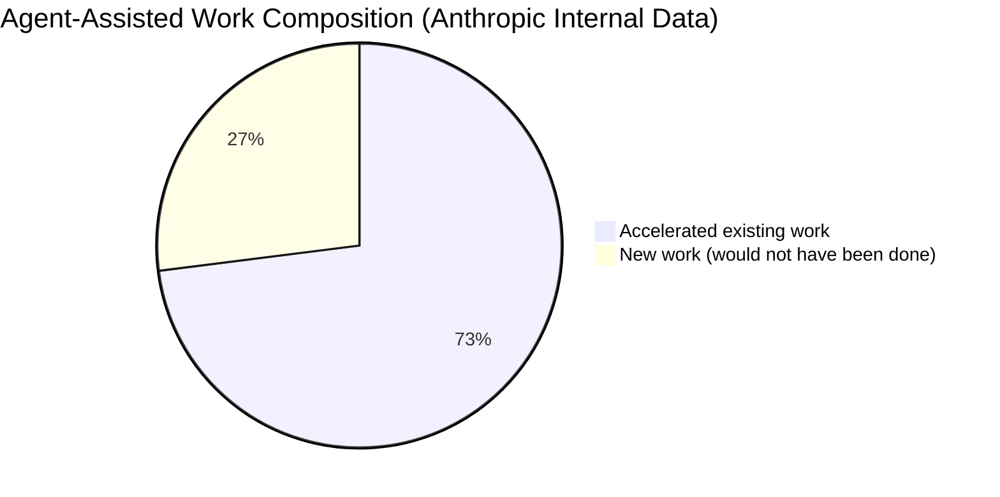

# The 27% Dividend: How Coding Agents Unlock Previously Uneconomical Work, and Codex CLI Patterns for Capturing It


---

Most discussions about coding agent productivity focus on acceleration: how much faster can a developer ship a feature they were already going to build? That framing misses the more interesting story. In January 2026, Anthropic surveyed 132 of its own engineers and researchers, conducted 53 in-depth interviews, and analysed 200,000 internal Claude Code transcripts[^1]. One finding stands apart: **27% of AI-assisted work consists of tasks that would not have been done at all without the agent**[^1]. Not done faster — done *instead of never*.

This article examines what that 27% actually contains, why it matters more than raw acceleration metrics, and how to build Codex CLI workflows that systematically capture this "new work dividend" for your own team.

---

## What the 27% Actually Contains

Anthropic's report breaks the new-work category into four clusters[^1]:

| Cluster | Examples |
|---|---|
| **Scaling projects** | Extending a proof-of-concept to cover edge cases, adding multi-language support, broadening test matrices beyond the minimum |
| **Nice-to-have tooling** | Interactive data dashboards, performance visualisation tools, terminal shortcuts, internal CLI utilities |
| **Exploratory work** | Testing multiple approaches concurrently, running experiments that would not justify the time investment manually |
| **Papercuts** | Refactoring code for maintainability, fixing minor UX annoyances, tidying configuration sprawl, updating stale documentation |

The common thread is economic viability. None of these tasks lacked *value* — they lacked a favourable cost-to-value ratio under manual effort[^2]. An agent that can fix a ten-file naming inconsistency in four minutes changes the calculus entirely.

---

## Why 27% Matters More Than 2× Speedup

The Pragmatic Engineer's March 2026 survey of 906 engineers found 95% using AI tools weekly, with 75% using them for at least half their engineering work[^3]. Yet the METR randomised controlled trial — the most rigorous productivity study to date — found experienced open-source developers were **19% slower** with AI tools on familiar codebases[^4]. The acceleration story is, at best, contested.

The new-work story is not. If 27% of agent-assisted output would otherwise not exist, that is *net-new capacity* — not a speed multiplier applied to existing throughput. It is the difference between a team that ships eight features and a team that ships eight features, fixes forty papercuts, and builds three internal tools.



The Anthropic data also shows a trajectory. Over the twelve months studied, Claude usage in daily work rose from 28% to 59%, the average productivity boost doubled from 20% to 50%, and the proportion of Claude Code tasks involving feature implementation grew from 14% to 37%[^1]. The dividend compounds: as developers trust the agent with more complex tasks, the frontier of "previously uneconomical" work expands.

---

## The Five Categories of Previously Uneconomical Work

Drawing from the Anthropic data, the Pragmatic Engineer survey, and practitioner reports, five categories of new work emerge consistently:

### 1. Comprehensive Test Coverage Expansion

Most teams maintain test suites that cover the critical path and little else. Edge cases, error paths, and integration boundaries go untested because the time cost outweighs the marginal risk reduction.

```bash
codex exec "Audit src/ for functions with zero test coverage. \
  For each, write a focused unit test covering the happy path \
  and at least two edge cases. Run the test suite after each file." \
  --sandbox workspace-write
```

### 2. Documentation Repair and Generation

Stale documentation is universal and universally deprioritised. Agent-generated documentation is imperfect, but agent-*repaired* documentation — where the agent reads the code, compares it against existing docs, and fixes discrepancies — is consistently useful[^5].

```bash
codex exec "Compare every public function signature in src/api/ \
  against its JSDoc comment. Flag mismatches, fix them, and \
  add @example blocks where missing." \
  --sandbox workspace-write
```

### 3. Codebase Hygiene and Consistency

Naming conventions that drifted over three years. Configuration files with dead keys. Import orderings that vary by contributor. These are the definition of "not worth a human's time" — and the definition of "trivial for an agent."

### 4. Internal Tooling and Developer Experience

The Anthropic report specifically cites "interactive data dashboards" and "terminal shortcuts" as new-work examples[^1]. Backend engineers building UIs they would never have attempted manually. Researchers creating visualisation tools for datasets that previously lived in spreadsheets.

### 5. Exploratory Prototyping and Approach Comparison

One Anthropic researcher described running multiple Claude instances simultaneously as "having a million horses allows you to test different ideas"[^1]. The subagent pattern maps directly to this: spawn three agents with competing approaches to a design problem, evaluate the outputs, and keep the best.

---

## Codex CLI Patterns for Systematic New-Work Capture

### Pattern 1: The Papercut Backlog Sweep

Create a dedicated Codex CLI skill that systematically processes a `PAPERCUTS.md` file:

```toml
# .codex/config.toml — papercut-sweep profile
[profiles.papercut]
model = "gpt-5.4-mini"
approval_policy = "on-request"

[profiles.papercut.sandbox]
mode = "workspace-write"
```

```markdown
<!-- .agents/skills/papercut-sweep/SKILL.md -->
# Papercut Sweep

Read PAPERCUTS.md in the repository root. For each item marked [ ]:
1. Assess whether it can be fixed without changing public API behaviour
2. If yes, implement the fix
3. Run the test suite
4. If tests pass, mark the item [x] and move to the next
5. If tests fail, revert and add a comment explaining why

Stop after 10 items or 30 minutes, whichever comes first.
```

Run it weekly via a Codex app automation or a cron job:

```bash
codex exec --profile papercut "$papercut-sweep" --ephemeral
```

### Pattern 2: The Coverage Ratchet

Use `codex exec` in CI to enforce a monotonically increasing coverage floor:

```bash
#!/bin/bash
CURRENT=$(codex exec "Run the test suite with coverage. \
  Return ONLY the line coverage percentage as a number." \
  --json | jq -r '.item.text' | grep -oP '\d+\.\d+')

BASELINE=$(cat .coverage-baseline 2>/dev/null || echo "0")

if (( $(echo "$CURRENT < $BASELINE" | bc -l) )); then
  echo "Coverage dropped from $BASELINE% to $CURRENT%"
  exit 1
fi

echo "$CURRENT" > .coverage-baseline
```

The agent writes new tests; the ratchet ensures nobody removes them.

### Pattern 3: Subagent Exploration Fan-Out

When evaluating architectural options, use Multi-Agent v2 to run competing prototypes in parallel[^6]:

```toml
# .codex/agents.toml
[[agents]]
name = "approach-a"
model = "gpt-5.4"
instructions = "Implement the event store using append-only PostgreSQL tables."

[[agents]]
name = "approach-b"
model = "gpt-5.4"
instructions = "Implement the event store using DynamoDB single-table design."

[[agents]]
name = "approach-c"
model = "gpt-5.4"
instructions = "Implement the event store using SQLite with WAL mode."
```

Each agent works in its own thread with isolated context. You review the three implementations, benchmark them, and keep the winner — an exploration that would have taken a full sprint manually.

### Pattern 4: The Documentation Freshness Automation

Schedule a weekly automation in the Codex app:

```
Prompt: "Scan all markdown files in docs/. For each file, check whether
the code examples still compile and the API references match the current
source. Fix any that are stale. Commit with message 'docs: automated
freshness pass'."

Schedule: Weekly, Sunday 02:00
Environment: Dedicated worktree
```

This is archetypal 27% work: high value, low urgency, perpetually deprioritised.

### Pattern 5: The Structured Audit Pipeline

Use `--output-schema` to produce machine-readable audit reports that feed into dashboards:

```bash
codex exec "Audit the repository for deprecated API usage, \
  TODO comments older than 90 days, and functions exceeding \
  50 lines of cyclomatic complexity." \
  --output-schema ./audit-schema.json \
  -o ./audit-report.json \
  --sandbox workspace-write
```

Where `audit-schema.json` defines a strict JSON Schema with arrays of findings, severity levels, and file locations. The output feeds directly into a Grafana dashboard or Slack notification — an internal tool built from a single command.

---

## Measuring the Dividend

The challenge with 27% work is that it is invisible to traditional engineering metrics. Story points do not capture papercuts. Velocity does not count documentation fixes. DORA metrics do not measure internal tooling shipped.

Three pragmatic proxies:

1. **Commit categorisation**: Tag agent-assisted commits with a `[new-work]` prefix or conventional commit scope. Count them monthly.
2. **Token spend by category**: If you use named profiles for new-work tasks (`--profile papercut`, `--profile exploration`), your token telemetry naturally segments spend by work type.
3. **Backlog turnover**: Track the age and count of items in your `PAPERCUTS.md` or equivalent low-priority backlog. A declining age curve indicates the dividend is being captured.

---

## The Organisational Shift

Anthropic's data contains a subtler finding: over the twelve-month study period, human turns per transcript dropped from 6.2 to 4.1 — a 33% reduction in required intervention[^1]. Engineers described a role shift toward "managing AI systems" rather than writing individual functions, with some reporting 70%+ of their work now involves code review and revision rather than net-new authorship[^1].

The 27% dividend is a leading indicator of this shift. When agents handle previously uneconomical work, they do not just produce more output — they change which work is *thinkable*. The team that builds the habit of asking "what would we do if this were free?" will capture more of the dividend than the team that asks "how can we do our current work faster?"

---

## Caveats and Limitations

The 27% figure comes from Anthropic's internal workforce — engineers with early access to frontier models, building the technology they are measuring[^1]. The company acknowledges this limits generalisability. The Pragmatic Engineer survey shows 55% of the broader engineering population regularly using agents[^3], but the "new work" proportion at organisations with less mature agent practices is likely lower.

⚠️ There is no independent replication of the 27% figure outside Anthropic as of June 2026. Treat it as a directional signal, not a universal constant.

The METR study's finding that experienced developers were slower with AI tools[^4] is also relevant: acceleration requires calibration. New work, by contrast, has a lower bar — any output from a task that would otherwise produce zero output is a net gain, regardless of speed.

---

## Conclusion

The productivity debate has been stuck on a binary: are coding agents faster, or are they not? The Anthropic data suggests the more consequential question is: what work becomes possible that was not possible before?

Twenty-seven per cent of agent-assisted work at Anthropic would not have existed without the agent. For Codex CLI practitioners, the actionable response is to build workflows that systematically surface and process this latent demand — papercut backlogs, coverage ratchets, documentation freshness sweeps, and exploratory fan-outs.

The teams that benefit most from coding agents will not be the ones that ship existing features marginally faster. They will be the ones that ship work nobody else thought was worth starting.

---

## Citations

[^1]: Anthropic, "How AI Is Transforming Work at Anthropic," January 2026. https://www.anthropic.com/research/how-ai-is-transforming-work-at-anthropic

[^2]: PYMNTS, "Anthropic Found AI Makes Impractical Work Worth Doing," 2026. https://www.pymnts.com/artificial-intelligence-2/2026/anthropic-found-ai-makes-impractical-work-worth-doing/

[^3]: Orosz, G., "AI Tooling for Software Engineers in 2026," The Pragmatic Engineer, March 7, 2026. https://newsletter.pragmaticengineer.com/p/ai-tooling-2026

[^4]: METR, "We are Changing our Developer Productivity Experiment Design," February 24, 2026. https://metr.org/blog/2026-02-24-uplift-update/

[^5]: Anthropic, "2026 Agentic Coding Trends Report: How Coding Agents Are Reshaping Software Development," 2026. https://resources.anthropic.com/hubfs/2026%20Agentic%20Coding%20Trends%20Report.pdf

[^6]: OpenAI, "Subagents — Codex CLI," OpenAI Developers, 2026. https://developers.openai.com/codex/subagents
