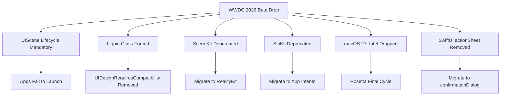
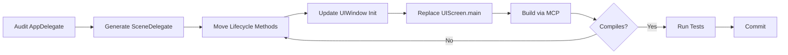

# WWDC 2026 Beta Season: Using Codex CLI to Navigate the iOS 27 and macOS 27 Migration Wave


---

WWDC 2026 opens today, 8 June, and with it comes the first developer betas of iOS 27, macOS 27, and Xcode 27 [^1]. This year's platform shift is unusually aggressive: mandatory UIScene lifecycle adoption (apps will not launch without it), forced Liquid Glass design compliance, SceneKit deprecation, the SiriKit-to-App Intents transition, and the permanent end of Intel Mac support [^2][^3]. For teams maintaining non-trivial iOS or macOS codebases, the migration surface is large, mechanical, and precisely the kind of work where Codex CLI earns its keep.

This article provides a practitioner's playbook for configuring Codex CLI to systematically work through the WWDC 2026 migration wave, covering each breaking change, the specific Codex workflow to address it, and the AGENTS.md patterns that keep the agent on track.

## The Breaking Change Landscape

Before configuring any tooling, understand what ships today.



### Priority 1: UIScene Lifecycle (Launch-Blocking)

The most critical change is that iOS 27 will refuse to launch apps that have not adopted the UIScene lifecycle [^2]. The deprecated AppDelegate methods — `applicationDidBecomeActive(_:)`, `applicationWillResignActive(_:)`, `applicationDidEnterBackground(_:)`, `applicationWillEnterForeground(_:)` — must be migrated to their `UISceneDelegate` equivalents. Additionally, `UIWindow.init(frame:)` is deprecated in favour of `UIWindow(windowScene:)`, and `UIScreen.main` must be replaced with access via `windowScene.screen` [^2].

### Priority 2: Liquid Glass Compliance

The `UIDesignRequiresCompatibility = true` Info.plist flag — the opt-out that let apps defer Liquid Glass adoption — will be removed in Xcode 27 [^2]. Every `UINavigationBar`, `UITabBar`, `UIToolbar`, and `UISegmentedControl` must work with the translucent glass material. Custom background colours break glass effects, and the system-inserted `UIDropShadowView` can break existing layouts [^2].

### Priority 3: Framework Deprecations

**SceneKit** is officially deprecated across all platforms, with RealityKit as the migration target [^2]. **SiriKit** (pre-App Intents) receives its formal deprecation notice, giving developers a 2–3 year window, but apps without App Intents will miss the first wave of Gemini-powered Siri integration [^4]. SwiftUI's `actionSheet` modifier is removed, requiring migration to `confirmationDialog` [^2].

### macOS 27: The Intel Exit

macOS 27 drops support for all Intel Macs [^3]. The four remaining Intel models — MacBook Pro 16-inch (2019), MacBook Pro 13-inch (2020), iMac 27-inch (2020), and Mac Pro (2019) — are cut. This is also the final macOS release to include the general-purpose version of Rosetta, giving developers one last cycle to ship native Apple Silicon binaries [^5].

## Configuring Codex CLI for the Migration

### XcodeBuildMCP: The Agent-to-IDE Bridge

Since Xcode 26.3 (February 2026), Apple's `mcpbridge` binary exposes 20 built-in tools via the Model Context Protocol [^6]. The architecture is straightforward: Codex CLI connects via MCP, `mcpbridge` translates to XPC, XPC communicates with Xcode [^6]. No cloud relay or API keys are required for the local connection.

Configure XcodeBuildMCP in your project-scoped Codex configuration:

```toml
# .codex/config.toml
[mcp_servers.xcodebuild]
command = "xcrun"
args = ["mcpbridge"]
```

This gives Codex access to five tool categories: File System Operations (9 tools), Build and Test (5 tools), Diagnostics (2 tools), Intelligence (3 tools), and Workspace (1 tool) [^6]. The `Intelligence` tools are particularly valuable during migration — they query Apple's documentation corpus and WWDC session transcripts using on-device semantic search [^7].

### Migration-Specific AGENTS.md

Create a migration-focused instruction file at the project root:

```markdown
<!-- AGENTS.md -->
# iOS 27 Migration Context

## Active Migration: UIScene Lifecycle
You are migrating this project from UIApplicationDelegate lifecycle
to UISceneDelegate. Follow these rules:

1. **Never delete** AppDelegate methods until the SceneDelegate
   equivalent is verified building and tested.
2. Map each deprecated method to its scene equivalent:
   - applicationDidBecomeActive → sceneDidBecomeActive
   - applicationWillResignActive → sceneWillResignActive
   - applicationDidEnterBackground → sceneDidEnterBackground
   - applicationWillEnterForeground → sceneWillEnterForeground
   - application(_:open:options:) → scene(_:openURLContexts:)
3. Replace UIWindow(frame:) with UIWindow(windowScene:).
4. Replace UIScreen.main with windowScene.screen.
5. Use `if #available(iOS 27, *)` guards for new APIs.
6. After each file change, run the build via XcodeBuildMCP to
   verify compilation before moving to the next file.

## Constraints
- Do NOT remove UIDesignRequiresCompatibility from Info.plist yet
  (handle Liquid Glass in a separate pass).
- Keep changes atomic: one migration per commit.
```

### Named Profiles for Migration Work

Set up a dedicated profile that uses a high-reasoning model for the complex refactoring decisions migration demands:

```toml
# ~/.codex/ios27-migration.config.toml
model = "gpt-5.5"
reasoning_effort = "high"
approval_policy = "unless-allow-listed"

[project_doc]
max_bytes = 65536  # Migration AGENTS.md can be large
```

Invoke with:

```bash
codex --profile ios27-migration "Migrate AppDelegate to UISceneDelegate lifecycle"
```

## Systematic Migration Workflows

### Phase 1: UIScene Lifecycle

This is the launch-blocking change and must be addressed first. The workflow:



A practical Codex CLI invocation for this phase:

```bash
codex --profile ios27-migration \
  "Audit this project for UIApplicationDelegate lifecycle methods. \
   Create a SceneDelegate if none exists. Migrate all deprecated \
   AppDelegate lifecycle methods to their UISceneDelegate equivalents. \
   Replace UIWindow(frame:) with UIWindow(windowScene:). \
   Replace UIScreen.main references. Build after each file change. \
   Commit each migration step separately."
```

### Phase 2: Liquid Glass Compliance

Once the app launches on iOS 27, tackle the visual migration:

```bash
codex --profile ios27-migration \
  "Audit all UINavigationBar, UITabBar, UIToolbar, and \
   UISegmentedControl customisations. Remove custom background \
   colours that interfere with Liquid Glass rendering. Flag any \
   manual UIDropShadowView usage. Test each change visually using \
   XcodeBuildMCP's RenderPreview tool."
```

The `RenderPreview` tool from XcodeBuildMCP is critical here — it captures actual SwiftUI preview screenshots, allowing Codex to verify that glass effects render correctly without manual intervention [^7].

### Phase 3: Framework Deprecations

For SceneKit-to-RealityKit migration, the scope is large enough to warrant subagent delegation:

```toml
# .codex/config.toml — multi-agent migration
[agents.scenekit-audit]
description = "Audit all SceneKit usage and produce a migration manifest"
model = "gpt-5.5"

[agents.realitykit-migration]
description = "Execute RealityKit migration from the audit manifest"
model = "gpt-5.5"
```

For the SiriKit-to-App Intents migration, the key insight is urgency: apps without App Intents will miss Gemini-powered Siri integration entirely [^4]. Codex can scaffold the App Intents implementation:

```bash
codex --profile ios27-migration \
  "Find all SiriKit intent definitions in this project. For each \
   intent, create an equivalent App Intents implementation. Use \
   @AssistantIntent(schema:) where Apple provides a schema match. \
   Preserve the existing SiriKit code behind availability checks."
```

### Phase 4: SwiftUI Housekeeping

The `actionSheet` to `confirmationDialog` migration is mechanical and well-suited to `codex exec` for batch processing:

```bash
codex exec "Find all uses of .actionSheet in SwiftUI views. \
  Replace each with .confirmationDialog, preserving the title, \
  message, and button configuration. Build after each change."
```

## Apple Silicon Readiness

For teams still shipping universal binaries with Intel slices, macOS 27 changes the economics. Rosetta remains available in macOS 27, but this is its final general-purpose release [^5]. The practical implication: any CI pipeline building for Intel must plan its sunset.

Check your project's architecture targets:

```bash
codex exec "Audit the Xcode project build settings for any \
  ARCHS or VALID_ARCHS entries that include x86_64. List all \
  targets still building Intel slices. Check for any assembly \
  or architecture-specific code."
```

## Timeline and Deadlines

| Date | Milestone |
|------|-----------|
| 8 June 2026 | WWDC keynote; Xcode 27 beta 1 drops [^1] |
| June–August 2026 | Beta season; migration and testing window |
| September 2026 | iOS 27 / macOS 27 general availability (expected) [^2] |
| Mid-April 2027 | All App Store submissions must use iOS 27 SDK (expected) [^2] |

The window between beta 1 and the April 2027 SDK mandate is roughly ten months. For large codebases, starting migration in the first week of beta season — today — is not premature.

## PostToolUse Hooks for Migration Safety

Add a verification hook that prevents Codex from moving past a file without a successful build:

```json
{
  "hooks": [
    {
      "event": "PostToolUse",
      "matcher": { "tool_name": "write_file" },
      "command": "xcrun xcodebuild -scheme MyApp -destination 'generic/platform=iOS' build 2>&1 | tail -5",
      "on_failure": "block"
    }
  ]
}
```

This ensures every file write triggers a build verification — essential when migration changes can cascade through the dependency graph.

## Apple's Agent Strategy: What It Signals

Apple's decision to ship native Codex and Claude integrations in Xcode, rather than building a proprietary coding agent, validates the terminal-first agent model [^6]. The MCP bridge architecture means Codex CLI and Xcode's native agent support share the same protocol layer. Code migrated in the terminal via Codex CLI is indistinguishable from code migrated through Xcode's built-in agent panel.

Apple's broader WWDC 2026 strategy — outsourcing model intelligence (Gemini for Siri, Codex and Claude for coding) whilst controlling the two billion devices where those models run [^8] — suggests that the agent-as-infrastructure pattern is stabilising. For Codex CLI users, this means Apple platform work will continue to be a first-class use case, not an afterthought.

## Key Takeaways

1. **Start today.** The UIScene lifecycle change is launch-blocking. Every day of beta season counts.
2. **Use XcodeBuildMCP.** The `mcpbridge` MCP server gives Codex CLI direct access to Xcode's build system, documentation search, and SwiftUI preview rendering.
3. **Separate migration phases.** Tackle UIScene first, Liquid Glass second, framework deprecations third. Use dedicated AGENTS.md instructions per phase.
4. **Verify continuously.** PostToolUse hooks that trigger builds after every file change prevent cascading breakage.
5. **Plan the Intel exit.** macOS 27 is Rosetta's final general-purpose release. Audit your architecture targets now.

---

## Citations

[^1]: Apple, "Apple kicks off Worldwide Developers Conference on June 8," Apple Newsroom, May 2026. [https://www.apple.com/newsroom/2026/05/apple-kicks-off-worldwide-developers-conference-on-june-8/](https://www.apple.com/newsroom/2026/05/apple-kicks-off-worldwide-developers-conference-on-june-8/)

[^2]: DevelopersIO, "Things You Should Prepare for Now in Anticipation of Breaking Changes in iOS 27 / Xcode 27," June 2026. [https://dev.classmethod.jp/en/articles/ios27-xcode27-migration-preparation-guide/](https://dev.classmethod.jp/en/articles/ios27-xcode27-migration-preparation-guide/)

[^3]: MacRumors, "macOS 27 Will Mark the End of an Era," April 2026. [https://www.macrumors.com/2026/04/18/macos-27-compatibility-change/](https://www.macrumors.com/2026/04/18/macos-27-compatibility-change/)

[^4]: Abhishek Gautam, "WWDC 2026: June 8-12, iOS 27, Gemini Siri — Complete Developer Guide," June 2026. [https://www.abhs.in/blog/apple-wwdc-2026-dates-ios-27-gemini-siri-developer-guide](https://www.abhs.in/blog/apple-wwdc-2026-dates-ios-27-gemini-siri-developer-guide)

[^5]: TechRepublic, "Apple Begins Rosetta's Final Phase as Intel Mac Era Winds Down," June 2026. [https://www.techrepublic.com/article/news-apple-macos-27-drops-intel-mac-support-rosetta/](https://www.techrepublic.com/article/news-apple-macos-27-drops-intel-mac-support-rosetta/)

[^6]: Apple, "Xcode 26.3 unlocks the power of agentic coding," Apple Newsroom, February 2026. [https://www.apple.com/newsroom/2026/02/xcode-26-point-3-unlocks-the-power-of-agentic-coding/](https://www.apple.com/newsroom/2026/02/xcode-26-point-3-unlocks-the-power-of-agentic-coding/)

[^7]: Zen Van Riel, "Apple Xcode 26.3 Brings Agentic Coding to iOS Development," 2026. [https://zenvanriel.com/ai-engineer-blog/apple-xcode-agentic-coding-mcp-guide/](https://zenvanriel.com/ai-engineer-blog/apple-xcode-agentic-coding-mcp-guide/)

[^8]: FourWeekMBA, "WWDC 2026 Preview: Apple's AI Strategy Is the Opposite of Everyone Else's," 2026. [https://fourweekmba.com/ai-apple-wwdc-2026-preview-strategy-siri-gemini/](https://fourweekmba.com/ai-apple-wwdc-2026-preview-strategy-siri-gemini/)
