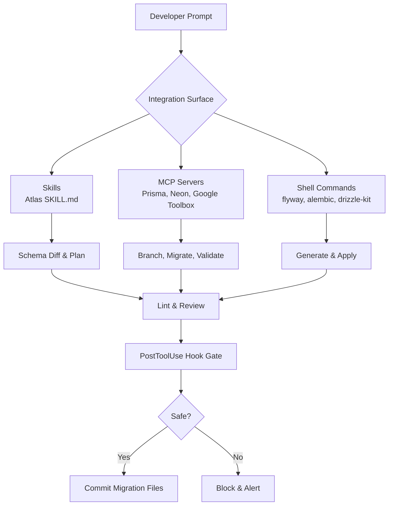
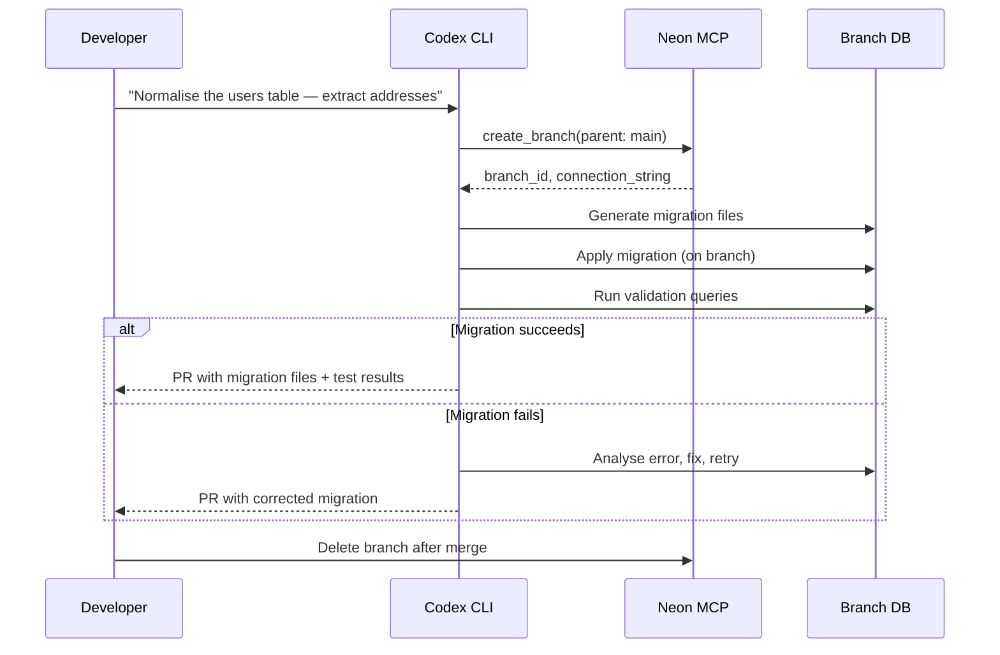
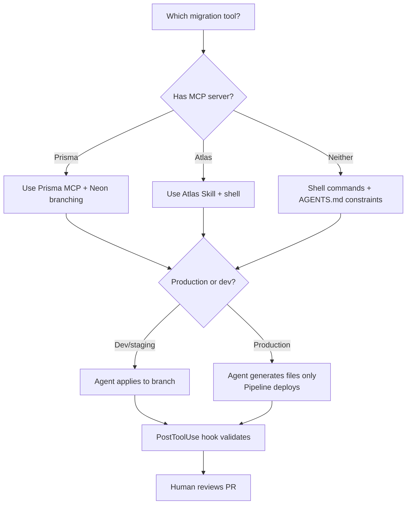

# Codex CLI for Database Schema Migrations: Atlas Skills, Prisma MCP, Neon Branching, and Safety-First Workflows


---

Schema migrations remain one of the highest-risk operations in any software delivery pipeline. A misapplied `ALTER TABLE` can lock a production database for minutes, corrupt data, or cascade failures across dependent services. Coding agents make this simultaneously better and worse: they can generate migration files faster than any human, but they can also execute destructive DDL with the same cheerful confidence they apply to renaming a variable.

This article maps the current Codex CLI tooling landscape for database schema migrations — skills, MCP servers, database branching, and safety controls — and provides concrete configuration patterns for each approach.

## The Migration Tooling Landscape in Codex CLI

Codex CLI offers three integration surfaces for database migration work: **skills** (packaged knowledge files that teach the agent a workflow), **MCP servers** (live tool connections exposing migration commands), and **shell commands** (the agent calling your existing CLI tools directly via the sandbox). Each suits a different point in the migration lifecycle.



## Atlas: The Skills-Based Approach

Atlas provides an official Agent Skill that teaches Codex CLI the entire migration lifecycle without requiring a live database connection for every step [^1]. The skill packages deterministic CLI knowledge into a portable `SKILL.md` file.

### Installation

```bash
mkdir -p ~/.codex/skills/atlas/references
# Download the official Atlas skill
curl -sL https://atlasgo.io/skills/atlas/SKILL.md \
  -o ~/.codex/skills/atlas/SKILL.md
curl -sL https://atlasgo.io/skills/atlas/references/schema-sources.md \
  -o ~/.codex/skills/atlas/references/schema-sources.md
```

Once installed, Codex automatically loads the skill when your prompt matches its description — asking to "generate a migration for the users table" triggers implicit invocation [^1].

### What the Skill Teaches

The Atlas skill enforces a nine-rule workflow [^1]:

1. Never hardcode credentials — use environment variables
2. Always use `--env` to reference `atlas.hcl` configuration
3. Run `atlas schema validate` after any schema edit
4. Complete linting before applying migrations
5. Always execute `--dry-run` before applying changes
6. Run `atlas migrate hash` after manual migration edits
7. Never ignore lint errors without explicit approval
8. Write tests for data migrations
9. Use `atlas login` for advanced features

The core commands the agent learns span two workflows:

| Workflow | Commands |
|----------|----------|
| **Declarative** (desired-state) | `atlas schema inspect`, `diff`, `plan`, `apply --dry-run`, `apply` |
| **Versioned** (migration files) | `atlas migrate diff`, `lint`, `test`, `apply`, `status` |

Atlas supports MySQL, PostgreSQL, SQLite, SQL Server, ClickHouse, and MariaDB, plus ORM integration with GORM, Drizzle, SQLAlchemy, Django, Ent, Sequelize, and TypeORM [^1].

### AGENTS.md Integration

Pair the Atlas skill with project-level constraints in your `AGENTS.md`:

```markdown
## Database Migration Rules

- ALWAYS use Atlas for schema changes. Never write raw DDL.
- Run `atlas schema validate` before generating any migration.
- Run `atlas migrate lint` on every generated migration file.
- NEVER apply migrations to production. Generate files only.
- Use the `dev` environment from atlas.hcl for all validation.
```

This layered approach — skill for knowledge, `AGENTS.md` for constraints — keeps the agent competent but bounded [^2].

## Prisma MCP: Live Migration Commands

Prisma ships an MCP server built into the CLI from v6.6.0 onwards, exposing migration tools directly to Codex CLI [^3]. This is the most complete ORM-native MCP integration currently available.

### Configuration

```toml
# .codex/config.toml
[mcp_servers.prisma]
command = "npx"
args = ["prisma", "mcp"]
```

The Prisma MCP server exposes three migration-specific tools [^3]:

- **`migrate-dev`** — creates and executes a migration via `prisma migrate dev`
- **`migrate-status`** — checks current migration state
- **`migrate-reset`** — resets the database (destructive — requires approval)

### Safety Consideration

The `migrate-reset` tool is destructive by design. In any approval policy other than `full-auto`, Codex CLI will prompt before execution. For CI pipelines using `codex exec`, configure an explicit approval policy:

```toml
# .codex/config.toml
[mcp_servers.prisma]
command = "npx"
args = ["prisma", "mcp"]
enabled_tools = ["migrate-dev", "migrate-status"]
```

By omitting `migrate-reset` from `enabled_tools`, the agent cannot invoke it at all — a harder guarantee than relying on approval prompts [^4].

## Neon Branching: Isolated Sandboxes for Migration Testing

Neon's copy-on-write database branching solves the fundamental safety problem: the agent needs a production-like environment to validate migrations, but you cannot let it touch production [^5]. Neon branches create instantly, carry the full schema and data of the parent, and cost nothing until they diverge.

### Configuration

```toml
# .codex/config.toml
[mcp_servers.neon]
url = "https://mcp.neon.tech/mcp"
bearer_token_env_var = "NEON_API_KEY"
```

```bash
export NEON_API_KEY=neon_api_xxxxxxxxxxxxx
neon set-context --project-id proj_abc123 --org-id org_def456
```

### The Branch-Migrate-Validate Pattern



If the migration SQL has a syntax error or constraint violation, it fails harmlessly on the isolated branch. Codex can autonomously analyse the error, fix the migration, and retry — a workflow that would be reckless against a shared staging database [^5].

## The boringSQL/dryrun Approach: Offline Safety Analysis

For teams that cannot expose database credentials to agent context, boringSQL's `dryrun` MCP server analyses migration files entirely offline [^6]. Written in Rust, it provides 16 tools focused on PostgreSQL migration safety:

- **Lock analysis** — detects `ACCESS EXCLUSIVE` locks that would block reads
- **Table rewrite detection** — flags `ALTER TABLE` operations that rewrite entire tables
- **Schema linting** — identifies missing indexes, nullable column additions without defaults
- **Safer DDL alternatives** — suggests `CREATE INDEX CONCURRENTLY` over `CREATE INDEX`

This is the only migration MCP server that operates without a live database connection, making it suitable for the strictest sandbox configurations [^6].

## Shell-First Migrations: When MCP Is Overkill

For Flyway, Alembic, golang-migrate, Rails migrations, and most other tools, no MCP server exists [^6]. The pragmatic approach: let Codex call the CLI directly.

```bash
# codex exec one-shot migration generation
codex exec "Generate a Flyway migration V003__add_audit_columns.sql \
  that adds created_at and updated_at timestamp columns to the orders table. \
  Use PostgreSQL syntax. Write the file to db/migration/" \
  --approval-mode suggest
```

For interactive sessions, an `AGENTS.md` constraint is sufficient:

```markdown
## Migration CLI Rules

- Use `flyway validate` after generating any migration file.
- Never run `flyway migrate` — only generate SQL files.
- Follow the V{NNN}__{description}.sql naming convention.
- Include both up and down migrations where the tool supports it.
```

The token cost of shell commands versus MCP is relevant here: a `flyway validate` call costs roughly 200 tokens, whilst loading an MCP server's tool definitions can add 4–32× that overhead per turn [^7]. For tools with mature, well-documented CLIs, the shell approach is often the better engineering choice.

## Safety Controls: Hooks and Approval Policies

Database migrations are a textbook case for Codex CLI's hook system. A `PostToolUse` hook can gate every migration-related shell command:

```bash
#!/usr/bin/env bash
# .codex/hooks/post-tool-use-migration-lint.sh
# Runs after any shell command that produces .sql migration files

CHANGED_SQL=$(git diff --name-only --diff-filter=A -- '*.sql' 'migrations/' 'db/')

if [ -n "$CHANGED_SQL" ]; then
  echo "Migration files detected — running safety checks..." >&2

  for f in $CHANGED_SQL; do
    # Check for dangerous patterns
    if grep -qiE 'DROP TABLE|TRUNCATE|DROP COLUMN|DROP DATABASE' "$f"; then
      echo "BLOCKED: $f contains destructive DDL. Requires manual review." >&2
      exit 1
    fi

    # Check for missing CONCURRENTLY on index creation
    if grep -qiE 'CREATE INDEX' "$f" && ! grep -qiE 'CONCURRENTLY' "$f"; then
      echo "WARNING: $f creates index without CONCURRENTLY — may lock table." >&2
      exit 1
    fi
  done
fi

exit 0
```

This hook fires after every tool use, inspects any newly created SQL files, and blocks the agent if it detects destructive DDL or missing concurrency modifiers [^8]. Combined with an approval policy of `suggest` or `ask-edit`, you get defence in depth: the agent must propose, the hook must pass, and the human must approve.

### Profile-Based Migration Safety

Create a dedicated migration profile that tightens controls:

```toml
# ~/.codex/profiles/migration.toml
model = "o4-mini"
approval_policy = "suggest"
sandbox = "read-only-workspace"

[mcp_servers.neon]
url = "https://mcp.neon.tech/mcp"
bearer_token_env_var = "NEON_API_KEY"

[mcp_servers.prisma]
command = "npx"
args = ["prisma", "mcp"]
enabled_tools = ["migrate-dev", "migrate-status"]
```

Invoke it with:

```bash
codex --profile migration "Add a payments table with foreign key to users"
```

## The Ecosystem Gap

The current MCP ecosystem for database migrations rates roughly 2.5/5 [^6]. The major gaps:

- **Flyway** (10.7k GitHub stars) — zero MCP presence
- **Alembic** (Python/SQLAlchemy standard) — zero MCP presence
- **golang-migrate** (16.4k stars) — zero MCP presence
- **Rails migrations** — zero MCP presence
- **Online schema migration tools** (gh-ost, pt-online-schema-change) — zero MCP presence

No MCP server can currently trigger a full migration CI/CD pipeline, execute zero-downtime schema changes, or orchestrate cross-database migrations [^6]. For production deployment, the agent's job ends at generating and validating migration files — the deployment pipeline must remain human-controlled.

## Decision Framework



| Approach | Best For | Risk Level | Token Cost |
|----------|----------|------------|------------|
| Atlas Skill | Multi-dialect, declarative schemas | Low (file generation only) | ~200 tokens/command |
| Prisma MCP | TypeScript/Prisma projects | Medium (can execute migrations) | ~800–2,000 tokens/turn |
| Neon MCP + branching | Safe migration testing | Low (isolated branches) | ~1,500 tokens/turn |
| boringSQL/dryrun | Offline safety analysis | Very low (no DB credentials) | ~600 tokens/turn |
| Shell commands | Flyway, Alembic, Rails, etc. | Configurable via hooks | ~200 tokens/command |

## Conclusion

The safest Codex CLI migration workflow combines three layers: **a skill or MCP server** for migration knowledge, **database branching** for isolated validation, and **hooks plus approval policies** for deterministic safety gates. The agent generates and validates; the pipeline deploys. Until the MCP ecosystem matures to cover Flyway, Alembic, and online schema migration tools, shell commands with tight `AGENTS.md` constraints remain the pragmatic default for most stacks.

## Citations

[^1]: Atlas, "Database Schema Migration Skill for AI Agents", [https://atlasgo.io/guides/ai-tools/agent-skills](https://atlasgo.io/guides/ai-tools/agent-skills)

[^2]: OpenAI, "Custom instructions with AGENTS.md — Codex", [https://developers.openai.com/codex/guides/agents-md](https://developers.openai.com/codex/guides/agents-md)

[^3]: Prisma, "Prisma MCP Server Documentation", [https://www.prisma.io/docs/postgres/integrations/mcp-server](https://www.prisma.io/docs/postgres/integrations/mcp-server)

[^4]: OpenAI, "Configuration Reference — Codex", [https://developers.openai.com/codex/config-reference](https://developers.openai.com/codex/config-reference)

[^5]: Neon, "Safe AI-powered schema refactoring with OpenAI Codex and Neon", [https://neon.com/guides/openai-codex-neon-mcp](https://neon.com/guides/openai-codex-neon-mcp)

[^6]: ChatForest, "Database Migration & Schema Management MCP Servers", [https://chatforest.com/reviews/database-migration-mcp-servers/](https://chatforest.com/reviews/database-migration-mcp-servers/)

[^7]: Daniel Vaughan, "The MCP Tax: When Shell Commands Beat MCP Servers in Codex CLI Workflows", Codex Knowledge Base, [https://codex.danielvaughan.com/2026/06/09/mcp-tax-when-shell-commands-beat-mcp-servers-codex-cli-token-cost-decision-framework/](https://codex.danielvaughan.com/2026/06/09/mcp-tax-when-shell-commands-beat-mcp-servers-codex-cli-token-cost-decision-framework/)

[^8]: OpenAI, "Agent approvals & security — Codex", [https://developers.openai.com/codex/agent-approvals-security](https://developers.openai.com/codex/agent-approvals-security)
