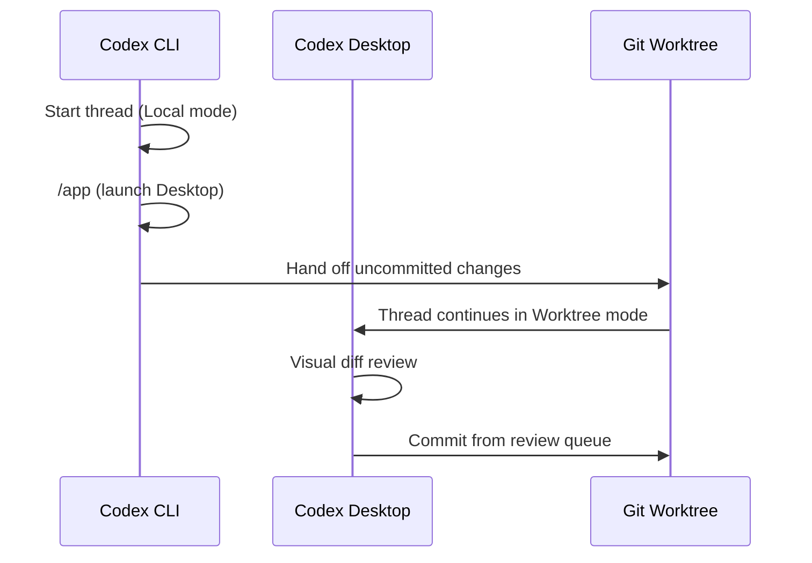
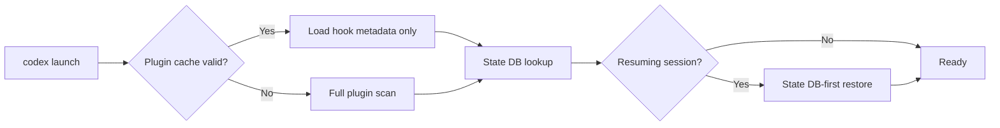

# Codex CLI v0.138: Desktop Handoff, Enterprise Access Tokens, and the Performance Gains That Actually Matter


---

Codex CLI v0.138.0 landed on 8 June 2026 with 115 changes: 35 features, 9 performance improvements, 2 security fixes, and 32 bug fixes [^1]. That change count makes it one of the larger point releases since the v0.128 goal-mode introduction. But raw numbers obscure signal. This guide cuts through the changelog noise and focuses on the four themes that will change how you work: the new `/app` Desktop handoff, v2 personal access tokens for enterprise automation, measurable startup and session-restore performance gains, and structured JSON output for plugin automation pipelines.

## Desktop Handoff with `/app`

The headline feature is deceptively simple. Running `codex app` from the CLI now launches the Codex Desktop application on macOS or Windows, opening directly into the current workspace [^1] [^2].

```bash
# Launch Desktop from your current project directory
cd ~/projects/payments-service
codex app
```

On macOS, this opens the Desktop app at the workspace path. On Windows, Codex prints the path for the Desktop app to open [^2]. The practical value emerges when you combine it with thread handoff: start an investigation in the terminal, decide it needs the Desktop's visual diff review queue, and hand the thread across without losing context.



The handoff mechanism uses Git operations under the hood to transfer uncommitted changes between the CLI's foreground checkout and a Desktop-managed worktree [^3]. Files listed in `.gitignore` will not transfer — a deliberate safety constraint to prevent secrets from leaking across execution contexts.

### When to use it

The `/app` handoff solves a specific workflow friction: you've been debugging in the terminal, the agent has accumulated a large diff, and you want the Desktop's structured review queue to inspect changes file by file. Previously this meant copying thread IDs and manually resuming. Now it is a single command.

For teams that standardise on the CLI for automation but use Desktop for review, this creates a clean separation: the CLI drives `codex exec` pipelines, Desktop handles human oversight.

## Enterprise Access Tokens v2

v0.138 adds support for v2 personal access tokens and exposes account token usage to app-server integrations [^1]. This is the feature enterprise teams have been waiting for since cloud-managed config bundles arrived in v0.137.

### What changed

Previous releases required either OAuth device-code flow or a raw `CODEX_API_KEY` for non-interactive workflows. Both had limitations: OAuth tokens expire and need refresh logic; API keys are organisation-scoped and cannot track usage per user. v2 access tokens solve both problems [^4].

Access tokens are tied to a specific ChatGPT workspace user and carry that identity through every `codex exec` invocation [^4]. This means audit logs attribute token spend to the human who created the token, not to a shared service account.

### Creating and using tokens

Tokens are created in the ChatGPT admin console under **Access tokens** [^4]:

```bash
# Ephemeral usage — pass token via environment variable
export CODEX_TOKEN="ct-abc123..."
codex exec --json "run the security audit skill against src/"

# Persistent usage — store credential locally
printf '%s' "$CODEX_TOKEN" | codex login --with-access-token
codex exec "summarise the last release diff"
```

Note: the environment variable is `CODEX_TOKEN` in practice — shortened here for brevity. See the official access tokens documentation for the canonical variable name [^4].

### Rotation and lifecycle

Tokens support finite expiration periods: 7, 30, 60, or 90 days. Admins control the maximum permissible duration from the workspace settings [^4]. The rotation workflow is straightforward:

1. Create a replacement token in the admin console
2. Update the secret in your CI runner or scheduler
3. Run a smoke test with `codex exec --json "echo health check"`
4. Revoke the old token from the Access tokens page

```toml
# config.toml — reference for CI pipelines
# The token itself lives in your secret manager, not here
[auth]
# v2 tokens are preferred over API keys for enterprise workflows
# Set CODEX_TOKEN in your CI environment
```

### Security considerations

The official documentation lists five risks to avoid [^4]:

- **Leaked secrets**: anyone with the token can initiate runs as the creator
- **Untrusted runners**: public CI or forked pull requests expose tokens
- **Shared identities**: reusing one person's token across teams breaks audit trails
- **Stale credentials**: long-lived tokens outlast the workflows they were created for
- **Wrong credential type**: these are for Codex local workflows, not general OpenAI API calls

For GitHub Actions, use repository secrets rather than environment variables, and restrict token access to protected branches:


```yaml
# .github/workflows/codex-audit.yml
jobs:
  security-audit:
    runs-on: ubuntu-latest
    environment: production  # requires approval
    steps:
      - uses: actions/checkout@v4
      - name: Run Codex security audit
        env:
          CODEX_TOKEN: ${{ secrets.CODEX_TOKEN }}
        run: codex exec --json "run security audit" -o audit-report.json
```


## Performance Optimisations

v0.138 ships three targeted performance improvements that compound into noticeably faster daily workflows [^1].

### Plugin discovery reuse and hook-only metadata loading

Previously, every `codex` invocation scanned the full plugin directory tree and loaded complete plugin manifests. v0.138 caches plugin discovery results across invocations and loads only hook metadata when that is all the runtime needs [^1]. For projects with 10+ plugins installed, this reduces startup overhead measurably — the difference between a perceptible pause and an instant prompt.

### State DB-first session restoration

The `codex resume --last` command now reads from the SQLite state database first, falling back to JSONL rollout file parsing only when necessary [^1]. The state DB contains indexed session metadata (thread IDs, timestamps, model choices, named titles), so the common case — resuming the most recent session — skips the expensive linear scan of rollout files entirely.

```bash
# This is now significantly faster for users with hundreds of sessions
codex resume --last
```

### Optimised byte scanning for MCP and Ollama streams

Message history processing and MCP/Ollama stream parsing use an optimised byte scanner [^1]. This matters most for long-running sessions with extensive tool-call histories, where the previous implementation spent non-trivial time deserialising message payloads.



## Plugin Automation with Structured JSON

v0.137 introduced `codex plugin list --json` for machine-readable plugin inventories [^5]. v0.138 extends this to add/remove operations and marketplace commands, with richer structured output that includes marketplace source, default prompts, remote MCP server configurations, and app template availability [^1].

### Practical automation patterns

The structured JSON output enables plugin compliance checking in CI:

```bash
# List installed plugins as JSON
codex plugin list --json | jq '.plugins[] | {name, version, marketplace_source}'

# Check that all required plugins are installed
REQUIRED='["security-audit", "test-runner", "docs-gen"]'
INSTALLED=$(codex plugin list --json | jq '[.plugins[].name]')

if ! echo "$INSTALLED" | jq --argjson req "$REQUIRED" '$req - . | length == 0' | grep -q true; then
  echo "Missing required plugins"
  exit 1
fi
```

Marketplace operations also emit JSON, enabling automated plugin procurement workflows:

```bash
# Search marketplace and filter by MCP server availability
codex plugin marketplace list --json | \
  jq '.[] | select(.remote_mcp_servers | length > 0) | {name, mcp_servers: .remote_mcp_servers}'
```

## Goal Workflow Fixes

v0.138 addresses three goal-mode pain points that have been persistent sources of frustration [^1]:

1. **Multiline paste in `/goal edit`** no longer submits prematurely. Previously, pasting a multi-line goal description would trigger submission at the first newline, truncating the goal.
2. **Idle auto-turns excluded from Plan mode**. Goal workflows in Plan mode no longer consume auto-turn budget on idle cycles, preserving turns for actual planning work.
3. **Goals halt auto-continuation after terminal failures**. If a goal's execution hits a terminal error (non-zero exit, sandbox violation), the agent now stops rather than retrying indefinitely.

These are not individually dramatic, but collectively they make goal mode reliable enough for overnight batch workflows — a requirement for the `codex exec` + access token automation story above.

## Additional Notable Changes

**Thread naming**: forked threads now preserve user-renamed titles instead of reverting to the original first-prompt name [^1]. This matters for teams that use thread names as lightweight task identifiers.

**TUI streaming**: eliminated extra blank space during streaming output, and cancelled prompts reopen with the cursor positioned at the end rather than the beginning [^1].

**Environment resilience**: `/usr/bin/bash` fallback support for minimal containers, shorter Linux proxy socket paths (fixing `ENAMETOOLONG` on deeply nested project directories), and OAuth-backed MCP credential pre-refresh [^1].

**Workspace instructions**: improved loading accuracy for remote and symlinked workspaces [^1]. If you maintain a monorepo with symlinked `AGENTS.md` files pointing to a central location, this fixes edge cases where the symlink target was not resolved correctly.

## Upgrade Path

```bash
# Self-update to v0.138
codex update

# Verify the version
codex --version

# Run diagnostics to confirm everything works
codex doctor
```

If you are on an enterprise-managed installation, the update flows through your admin's cloud-managed config bundles. Check with your workspace administrator if `codex update` is restricted.

## Summary

v0.138 is not a flashy release. There is no new model, no new approval policy tier, no architectural overhaul. What it delivers is infrastructure maturity: the `/app` handoff bridges the CLI-Desktop gap that has frustrated hybrid workflows since Desktop launched; v2 access tokens give enterprise CI pipelines a proper identity model; the performance work makes daily interactions measurably snappier; and structured plugin JSON closes the loop on plugin compliance automation.

For teams running Codex CLI in production, this is the release where the operational story catches up with the feature story.

## Citations

[^1]: OpenAI, "Codex CLI v0.138.0 Release Notes," GitHub Releases, 8 June 2026. [https://github.com/openai/codex/releases](https://github.com/openai/codex/releases)

[^2]: OpenAI, "Command line options — Codex CLI," OpenAI Developers, 2026. [https://developers.openai.com/codex/cli/reference](https://developers.openai.com/codex/cli/reference)

[^3]: OpenAI, "Features — Codex app," OpenAI Developers, 2026. [https://developers.openai.com/codex/app/features](https://developers.openai.com/codex/app/features)

[^4]: OpenAI, "Access tokens — Codex," OpenAI Developers, 2026. [https://developers.openai.com/codex/enterprise/access-tokens](https://developers.openai.com/codex/enterprise/access-tokens)

[^5]: OpenAI, "Changelog — Codex," OpenAI Developers, 2026. [https://developers.openai.com/codex/changelog](https://developers.openai.com/codex/changelog)
