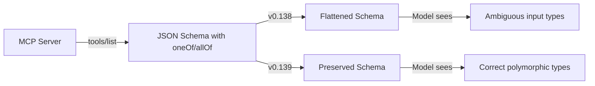
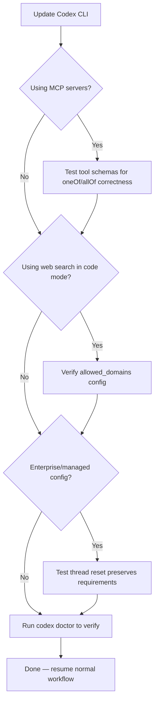

# Codex CLI v0.139: Code-Mode Web Search, MCP Schema Fidelity, and the Fixes That Compound


---

Version 0.139.0 landed on 9 June 2026 — twenty-four hours after the feature-heavy v0.138.0 that introduced Desktop handoff, v2 access tokens, and image path exposure[^1]. Where v0.138 grabbed headlines, v0.139 quietly ships the kind of improvements that compound over weeks: code-mode web search without context switching, faithful MCP tool schema preservation, scoped subagent warnings that eliminate TUI noise, and sandbox consistency fixes that matter in unattended pipelines. This guide covers every change and the configuration decisions each one implies.

## Code-Mode Web Search Goes Standalone

Prior to v0.139, web search in code-mode flows required the agent to chain through a hosted tool wrapper. The search worked, but it was indirect — the agent had to route through a separate orchestration path, adding latency and token overhead[^2].

v0.139 promotes web search to a first-class standalone call within code mode. The agent can now invoke web search directly, including from nested JavaScript tool calls executed inside the V8 runtime[^1]. Results arrive as plaintext, which means they slot into the agent's reasoning context without the structured-HTML parsing overhead that characterised earlier implementations.

### What This Means in Practice

When the agent encounters an unfamiliar API, a deprecation warning, or an error message it cannot resolve from local context, it can now search mid-task without leaving the code-mode flow. Previously, this research step sometimes forced a mode boundary that interrupted the agent's execution chain.

The practical configuration is straightforward. If you have not already enabled web search, the default cached mode activates automatically[^3]:

```toml
# ~/.codex/config.toml
# Default: cached search (fast, OpenAI-maintained index)
web_search = "cached"

# For live results (slower, real-time):
# web_search = "live"
```

For `codex exec` pipelines where the agent must resolve current documentation, pass `--search` to upgrade a single run to live mode without changing your persistent configuration[^4]:

```bash
codex exec --search "Check the latest React 20 migration guide and update our JSX transforms"
```

### Security Consideration

Standalone web search in code mode expands the agent's information surface. If you operate in a restricted environment, ensure your `allowed_domains` list in `config.toml` reflects what the agent should access[^5]:

```toml
[web_search]
allowed_domains = ["docs.python.org", "developer.mozilla.org", "pkg.go.dev"]
```

## MCP Tool Schema Fidelity: oneOf and allOf Preservation

This is the change that MCP server authors have been waiting for. Prior versions of Codex CLI would flatten `oneOf` and `allOf` JSON Schema composition keywords when converting MCP tool definitions into the internal tool representation. The result: tools with polymorphic inputs — common in database connectors, cloud APIs, and any server exposing union types — would present incorrect or overly permissive schemas to the model[^6].

v0.139 preserves these structures faithfully. Additionally, large schemas now maintain a shallower organisation during compaction rather than being aggressively flattened[^1].



### Who Benefits

If you maintain or consume MCP servers that define tool inputs using JSON Schema composition — and most non-trivial servers do — this fix reduces hallucinated tool arguments. The `codex-mcp-wrapper` project documented this exact problem: recursive traversal of `anyOf`, `oneOf`, `allOf`, `$defs`, and `definitions` containers was needed to normalise schemas before Codex could load them[^7]. That workaround is now unnecessary for the composition keywords v0.139 handles natively.

### Checking Your Servers

To verify your MCP servers benefit from the fix, inspect the tool definitions at runtime:

```bash
# List tools from a running MCP server
codex doctor --json | jq '.mcp_servers[].tools[]?.input_schema'
```

Look for `oneOf`, `allOf`, or `anyOf` keys in the output. If present, v0.139 is preserving them correctly.

## Enhanced `codex doctor` Diagnostics

The `codex doctor` command continues its evolution from a basic health check into a comprehensive diagnostic toolkit. v0.139 adds editor and pager environment details to local reports, whilst redacting sensitive values in JSON output[^1][^8].

This matters for support workflows. When filing an issue or debugging a configuration problem, `codex doctor --json` now captures the editor (`$EDITOR`, `$VISUAL`) and pager (`$PAGER`) settings that influence how Codex interacts with external tools — without leaking API keys or tokens into the report.

```bash
# Human-readable local report with editor/pager details
codex doctor

# Machine-readable, redacted output for support tickets
codex doctor --json > /tmp/codex-diagnostic.json

# Summary view for quick health checks
codex doctor --summary
```

### CI Integration Pattern

For teams running `codex doctor` as a CI health gate[^9], the JSON output improvements make automated parsing more reliable:

```bash
# CI step: verify Codex environment before agent tasks
codex doctor --json | jq -e '.checks | all(.status == "pass")' || exit 1
```

## Plugin Marketplace Improvements

v0.139 refines the plugin marketplace automation surface. The `codex plugin marketplace list --json` command now includes the marketplace source for each plugin, and plugin list responses return from cached remote catalogues before triggering a background refresh[^1].

This sounds minor, but it enables two practical patterns:

**Faster Startup in CI**: Cached catalogue responses mean `codex plugin marketplace list` no longer blocks on network round-trips during cold starts. For pipelines that verify plugin availability before execution, this cuts seconds off every run.

**Multi-Source Plugin Auditing**: With marketplace source included in JSON output, teams operating across multiple plugin registries can now programmatically audit which plugins come from which source:

```bash
codex plugin marketplace list --json | jq '.[] | {name, source}'
```

## Bug Fixes That Matter for Production

Six bug fixes in v0.139 address real-world pain points. Three deserve particular attention.

### Thread Resets Preserve Cloud Requirements

Previously, `/new`, `/clear`, and `/fork` commands could drop cloud-managed requirements and feature flags during the TUI configuration reload[^1]. For enterprise deployments where `requirements.toml` is fetched from the Codex service, this meant that a simple thread reset could temporarily remove security constraints.

v0.139 ensures these cloud-managed policies persist across thread resets. If you operate on a Business or Enterprise plan with managed configuration, this fix eliminates the risk of policy gaps during interactive sessions.

### MCP Startup Warnings Stay Scoped

Subagent MCP startup warnings are now scoped to their owning threads, eliminating duplicate parent alerts and stuck TUI spinners[^1]. If you run multi-agent workflows with several MCP servers, the TUI is now significantly cleaner — warnings from a subagent's MCP connections no longer bubble up and duplicate in the parent thread.

### Sandbox Escalation Consistency

Sandbox execution now more consistently preserves approved escalation decisions and enforces configured proxy-only networking[^1]. This is critical for `codex exec` pipelines: if a tool call was approved for escalated permissions in a previous turn, that decision now reliably persists rather than requiring re-approval on subsequent invocations.

### Other Fixes

- `codex resume --last` and `codex fork --last` now correctly treat trailing arguments as initial prompts rather than session IDs — fixing a regression that broke common scripting patterns[^1]
- Image edits now reference exact file paths rather than guessing from conversation history[^1]
- Bare URLs containing tilde characters (`~`) now linkify completely in the TUI[^1]

## V8 Toolchain Update

Under the hood, v0.139 updates the V8 toolchain to `rusty_v8` 149.2.0[^1]. This is the JavaScript engine that powers Codex CLI's internal tool execution, including the nested JavaScript tool calls that now support standalone web search. The update also restores separate symbol archives with line tables in release builds, improving crash diagnostics for the Codex engineering team[^1].

For end users, the V8 update means marginally faster JavaScript tool execution and better compatibility with newer ECMAScript features used by MCP server tool implementations.

## Upgrade Checklist



1. **Update**: `npm install -g @anthropic-ai/codex-cli@latest` or your preferred installation method
2. **Verify MCP schemas**: If you use complex MCP servers, check tool definitions render correctly
3. **Review web search config**: Ensure `allowed_domains` reflects your security posture
4. **Run diagnostics**: `codex doctor` now reports editor/pager — confirm the output looks correct
5. **Test thread resets**: If on managed config, verify `/new` preserves your requirements

## The Compounding Pattern

v0.139 exemplifies a pattern visible across Codex CLI's June 2026 releases: the ratio of bug fixes to features is shifting upward. v0.136 introduced session archiving. v0.137 expanded TUI controls and plugin automation. v0.138 delivered Desktop handoff and v2 access tokens. v0.139 focuses on making all of that work more reliably[^10].

For production users, this is the release pattern you want to see. Features without stability are liabilities. Stability without features is stagnation. The alternating rhythm — feature release, quality release, feature release — is how mature developer tools earn trust.

---

## Citations

[^1]: [Codex CLI v0.139.0 Changelog — OpenAI Developers](https://developers.openai.com/codex/changelog)
[^2]: [Codex CLI v0.137.0 Changelog — parallel web search in code-mode flows](https://developers.openai.com/codex/changelog)
[^3]: [Codex CLI Features — Web Search Configuration](https://developers.openai.com/codex/cli/features)
[^4]: [Codex CLI Command Line Reference — --search flag](https://developers.openai.com/codex/cli/reference)
[^5]: [Codex CLI Web Search Configuration: Cached vs Live Modes, Domain Allow-Lists — Codex Knowledge Base](https://codex.danielvaughan.com/2026/05/09/codex-cli-web-search-configuration-cached-live-domain-allow-lists-prompt-injection-defence/)
[^6]: [GitHub Issue #18233 — Agent confusion about MCP tool calls after upgrade](https://github.com/openai/codex/issues/18233)
[^7]: [codex-mcp-wrapper — MCP Server Wrapper for Codex CLI](https://github.com/kazuhideoki/codex-mcp-wrapper)
[^8]: [Codex CLI Doctor Diagnostics v0.131 — Codex Knowledge Base](https://codex.danielvaughan.com/2026/05/18/codex-cli-doctor-diagnostics-v0131-troubleshooting-runtime-auth-network/)
[^9]: [Codex CLI v0.136 Production Hardening Checklist — Codex Knowledge Base](https://codex.danielvaughan.com/2026/06/04/codex-cli-v0136-production-hardening-checklist-security-performance-reliability-enterprise/)
[^10]: [Codex CLI Releases — GitHub](https://github.com/openai/codex/releases)
