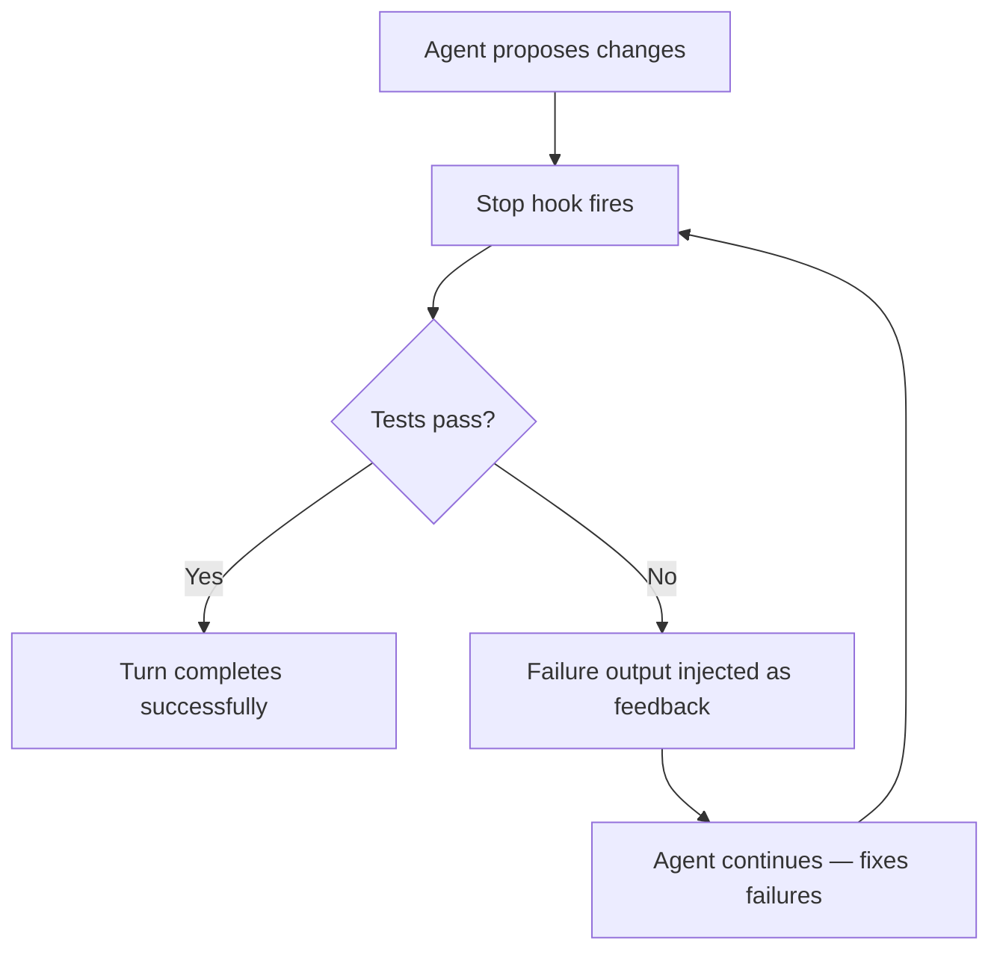
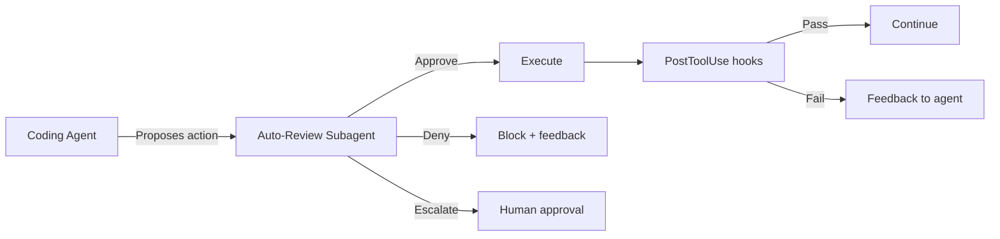
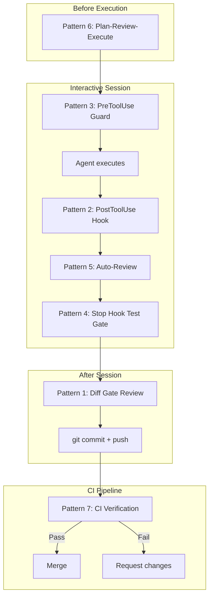

# Codex CLI Verification Patterns: Seven Strategies for Ensuring Agent-Generated Code Actually Works


---

A coding agent that writes code faster than you can read it creates a new problem: how do you know the output is correct? Anthropic's January 2026 study of 200,000 Claude Code transcripts found that engineers accepted agent-generated code without meaningful review in 37% of sessions[^1]. OpenAI's own auto-review research shows that human approval catches roughly 200x more boundary-crossing actions than unreviewed execution[^2]. The implication is clear: speed without verification is a liability.

This article presents seven verification patterns for Codex CLI, ordered from lightest-weight to most comprehensive. Each pattern is independently useful; together they form a layered defence that catches errors at different stages of the agent's output lifecycle.

---

## Pattern 1: The Diff Gate — Review Before You Accept

The simplest verification is visual inspection. Codex CLI's `/diff` command displays the full Git diff of all changes the agent has made, including staged changes, unstaged modifications, and untracked files[^3]. In `suggest` mode (the default), every file mutation requires explicit approval before landing — giving you a natural review checkpoint[^4].

The discipline is straightforward: after every logical unit of agent work, run `/diff` and read the output before approving. For larger changesets, combine `/diff` with `/review` to get the agent's own assessment of what changed:

```bash
# In the Codex TUI after the agent completes a task:
/diff          # Inspect raw Git changes
/review        # Agent-driven review of uncommitted changes
```

The `/review` command spawns a separate read-only sub-turn that analyses the diff without writing to your working tree[^5]. Findings appear as their own turn in the transcript. You can configure which model runs the review via the `review_model` key in `config.toml`:

```toml
# ~/.codex/config.toml
review_model = "gpt-5.5"
```

**When to use:** Every session. This is the baseline verification pattern and costs nothing beyond attention.

---

## Pattern 2: The PostToolUse Hook — Automated Checks After Every Command

The PostToolUse hook fires after every supported tool execution — shell commands, `apply_patch` file edits, and MCP tool calls[^6]. Exit code 2 replaces the tool result the agent sees with your stderr feedback, effectively steering the agent's next move without undoing what already ran[^6].

This is the most powerful verification insertion point because it operates at tool granularity rather than session granularity.

### Linter Gate

Run your project's linter after every file edit:

```json
{
  "hooks": [
    {
      "event": "PostToolUse",
      "matcher": "apply_patch",
      "command": "sh -c 'npx eslint --no-error-on-unmatched-pattern $(git diff --name-only --diff-filter=AM | grep -E \"\\.(ts|tsx|js|jsx)$\") 2>&1 || exit 2'"
    }
  ]
}
```

When the linter finds issues, Codex sees the lint output instead of the raw edit result and self-corrects on the next turn[^7].

### Test Runner Gate

Run affected tests after every shell command:

```json
{
  "hooks": [
    {
      "event": "PostToolUse",
      "matcher": "Bash",
      "command": "sh -c 'if echo \"$CODEX_TOOL_INPUT\" | grep -q \"apply_patch\\|write_file\"; then npm test --silent 2>&1 || exit 2; fi'"
    }
  ]
}
```

**When to use:** Projects with fast linters or test suites (under 30 seconds). For slower suites, move to Pattern 4.

---

## Pattern 3: The PreToolUse Guard — Block Before It Happens

PreToolUse fires before tool execution and can deny the action entirely[^6]. Return a JSON response with `permissionDecision: "deny"` to block the command:

```json
{
  "hookSpecificOutput": {
    "hookEventName": "PreToolUse",
    "permissionDecision": "deny",
    "permissionDecisionReason": "Destructive command blocked by policy."
  }
}
```

### Destructive Command Blocklist

```json
{
  "hooks": [
    {
      "event": "PreToolUse",
      "matcher": "Bash",
      "command": "sh -c 'CMD=$(echo \"$CODEX_TOOL_INPUT\" | jq -r .command); if echo \"$CMD\" | grep -qE \"rm -rf /|chmod 777|git push --force|DROP TABLE|TRUNCATE\"; then echo \"{\\\"hookSpecificOutput\\\":{\\\"hookEventName\\\":\\\"PreToolUse\\\",\\\"permissionDecision\\\":\\\"deny\\\",\\\"permissionDecisionReason\\\":\\\"Blocked by safety policy\\\"}}\" && exit 0; fi'"
    }
  ]
}
```

### File Scope Enforcement

Prevent the agent from editing files outside your current feature's scope:

```json
{
  "hooks": [
    {
      "event": "PreToolUse",
      "matcher": "apply_patch",
      "command": "sh -c 'FILE=$(echo \"$CODEX_TOOL_INPUT\" | jq -r .path); if echo \"$FILE\" | grep -qE \"^(package-lock\\.json|yarn\\.lock|migrations/)\"; then echo \"{\\\"hookSpecificOutput\\\":{\\\"hookEventName\\\":\\\"PreToolUse\\\",\\\"permissionDecision\\\":\\\"deny\\\",\\\"permissionDecisionReason\\\":\\\"Protected file: $FILE\\\"}}\" && exit 0; fi'"
    }
  ]
}
```

**When to use:** Any project where certain operations are categorically unsafe. Defence-in-depth alongside the sandbox.

---

## Pattern 4: The Stop Hook Test Gate — Nothing Merges Without Green Tests

The Stop hook fires when Codex halts at the end of a turn[^6]. It can inject feedback and force the agent to continue working. This is the natural place for a comprehensive test gate:

```json
{
  "hooks": [
    {
      "event": "Stop",
      "command": "sh -c 'TEST_OUTPUT=$(npm test 2>&1); if [ $? -ne 0 ]; then echo \"Tests failed. Fix the failures before completing:\\n$TEST_OUTPUT\" >&2; exit 2; fi'"
    }
  ]
}
```

When exit code 2 is returned, Codex receives the test failure output as feedback and continues working to fix the failures[^7]. This creates an automatic red-green loop: the agent proposes code, tests run, failures feed back, and the agent iterates until tests pass.



For projects with slow test suites, scope the test runner to affected files only:

```bash
#!/bin/bash
# .codex/hooks/stop-test-gate.sh
CHANGED=$(git diff --name-only HEAD | grep -E '\.(ts|tsx)$' | sed 's/\.tsx\?$//' | sort -u)
if [ -z "$CHANGED" ]; then exit 0; fi
npx jest --findRelatedTests $CHANGED --passWithNoTests 2>&1 || exit 2
```

**When to use:** Every project with a test suite. This is the single most impactful verification pattern.

---

## Pattern 5: The Auto-Review Subagent — A Second Opinion at Scale

Since v0.122, Codex CLI ships an auto-review subagent that interposes a separate model — architecturally distinct from the coding agent — between every boundary-crossing action and execution[^2]. The reviewer evaluates each request against a security policy and decides to approve, deny, or escalate to the human.

Enable it in `config.toml`:

```toml
# ~/.codex/config.toml
approval_policy = "auto-edit"
approvals_reviewer = "auto_review"
```

The auto-review model (`codex-auto-review`) is purpose-built for this task[^8]. In production, sessions using auto-review stop for human approval roughly 200x less often than manual approval mode while still catching actions humans would want blocked[^2].

The auto-review pattern complements rather than replaces hook-based verification. Hooks enforce deterministic rules (blocklists, test gates); auto-review handles fuzzy judgement calls (is this shell command reasonable for the stated task?).



**When to use:** Teams running Codex in `auto-edit` mode who want autonomous operation with a safety net.

---

## Pattern 6: The Plan-Review-Execute Loop — Verify the Strategy Before the Code

For complex tasks, verify the approach before any code is written. Switch to plan mode, have the agent propose its strategy, review the plan, then switch to execute:

```
# In the Codex TUI:
/plan                    # Switch to plan mode
> Refactor the auth module to use JWTs instead of session cookies
# Agent produces a plan — review it
/pair                    # Switch to pair mode for supervised execution
```

You can encode this as a mandatory workflow in `AGENTS.md`:

```markdown
## Workflow Rules

- For any task touching more than 3 files, produce a plan first and wait
  for human approval before writing code.
- Plans must include: files to modify, tests to add or update, and
  rollback steps if the change breaks existing tests.
```

The plan mode suppresses all file mutations at the prompt level[^9], making it impossible for the agent to write code until you explicitly transition to pair or execute mode.

For non-interactive workflows, the `PLANS.md` pattern extends this further — the agent writes a structured plan to a markdown file, and subsequent `codex exec` calls reference that plan[^10]:

```bash
# Generate the plan
codex exec "Analyse the auth module and write a migration plan to PLANS.md"

# Review the plan manually, then execute
codex exec "Execute the plan in PLANS.md. Run tests after each step."
```

**When to use:** Large refactors, architecture changes, or any task where a wrong approach is more expensive than wrong code.

---

## Pattern 7: The CI Verification Pipeline — Trust Nothing, Verify Everything

The final layer runs verification in CI, completely outside the agent's influence. Use the `codex-action` GitHub Action or `codex exec` in your pipeline to run an independent review:


```yaml
# .github/workflows/agent-verify.yml
name: Verify Agent Changes
on:
  pull_request:
    labels: [agent-generated]

jobs:
  verify:
    runs-on: ubuntu-latest
    steps:
      - uses: actions/checkout@v4
      - uses: openai/codex-action@v1
        with:
          codex_access_token: ${{ secrets.CODEX_ACCESS_TOKEN }}
          prompt: |
            Review the changes in this PR. Check for:
            1. Security vulnerabilities
            2. Logic errors
            3. Missing test coverage
            4. Style guide violations
            Output a JSON report with findings.
          output_schema_file: .codex/review-schema.json
          approval_mode: suggest
```


The `--output-schema` flag forces structured JSON output, making findings machine-parseable for automated gating[^11]. Combine this with conventional CI checks (linting, type-checking, test suites) for comprehensive coverage:

```yaml
      - name: Parse findings
        run: |
          CRITICAL=$(jq '[.findings[] | select(.severity == "critical")] | length' review-output.json)
          if [ "$CRITICAL" -gt 0 ]; then
            echo "::error::$CRITICAL critical findings from agent review"
            exit 1
          fi
```

**When to use:** Every repository that accepts agent-generated PRs. Non-negotiable for teams with more than one developer.

---

## Layering the Patterns

These seven patterns are not mutually exclusive. A production-grade verification stack layers them:



The lightweight patterns (1, 2, 3) run on every turn with negligible overhead. The heavier patterns (4, 6, 7) activate at natural boundaries — turn completion, task start, and merge time.

---

## The Verification Tax

Verification is not free. PostToolUse hooks add latency to every tool call. Stop hook test gates can add minutes per turn. CI pipelines add minutes per PR. The economics work because the cost of deploying broken code vastly exceeds the cost of catching it:

| Pattern | Latency cost | What it catches |
|---------|-------------|-----------------|
| Diff Gate | 30s human attention | Obvious mistakes, scope creep |
| PostToolUse lint | 2-5s per edit | Style violations, type errors |
| PreToolUse guard | <1s per command | Destructive operations |
| Stop hook tests | 10-120s per turn | Logic errors, regressions |
| Auto-review | 2-5s per action | Unsafe boundary crossings |
| Plan-review | 5-10min per task | Wrong approach, architectural errors |
| CI pipeline | 3-15min per PR | Everything, independently |

Start with Patterns 1 and 4 (diff review and stop hook tests). Add Pattern 3 (PreToolUse guards) for security-sensitive projects. Graduate to Pattern 5 (auto-review) when you want autonomous operation. Always run Pattern 7 (CI) on shared repositories.

---

## Citations

[^1]: Anthropic, "The Impact of AI on Developer Productivity: Lessons from 200,000 Claude Code Transcripts" (January 2026). [https://www.anthropic.com/research/ai-developer-productivity](https://www.anthropic.com/research/ai-developer-productivity)

[^2]: OpenAI Alignment, "Auto-review of agent actions without synchronous human oversight" (2026). [https://alignment.openai.com/auto-review/](https://alignment.openai.com/auto-review/)

[^3]: OpenAI, "Slash commands in Codex CLI" (2026). [https://developers.openai.com/codex/cli/slash-commands](https://developers.openai.com/codex/cli/slash-commands)

[^4]: OpenAI, "Agent approvals & security" (2026). [https://developers.openai.com/codex/agent-approvals-security](https://developers.openai.com/codex/agent-approvals-security)

[^5]: Daniel Vaughan, "Codex CLI Code Review Workflows: /review, review_model, and the MCP Extension" (March 2026). [https://codex.danielvaughan.com/2026/03/30/codex-cli-review-command-code-review-workflows/](https://codex.danielvaughan.com/2026/03/30/codex-cli-review-command-code-review-workflows/)

[^6]: OpenAI, "Hooks — Codex" (2026). [https://developers.openai.com/codex/hooks](https://developers.openai.com/codex/hooks)

[^7]: Agentic Control Plane, "Codex CLI hook governance: what works today (and what doesn't)" (2026). [https://agenticcontrolplane.com/blog/codex-cli-hooks-reference](https://agenticcontrolplane.com/blog/codex-cli-hooks-reference)

[^8]: OpenAI, "Auto-review — Codex" (2026). [https://developers.openai.com/codex/concepts/sandboxing/auto-review](https://developers.openai.com/codex/concepts/sandboxing/auto-review)

[^9]: OpenAI, "Features — Codex CLI" (2026). [https://developers.openai.com/codex/cli/features](https://developers.openai.com/codex/cli/features)

[^10]: OpenAI Cookbook, "Using PLANS.md for multi-hour problem solving" (2026). [https://developers.openai.com/cookbook/articles/codex_exec_plans](https://developers.openai.com/cookbook/articles/codex_exec_plans)

[^11]: OpenAI, "Non-interactive mode — Codex" (2026). [https://developers.openai.com/codex/noninteractive](https://developers.openai.com/codex/noninteractive)
