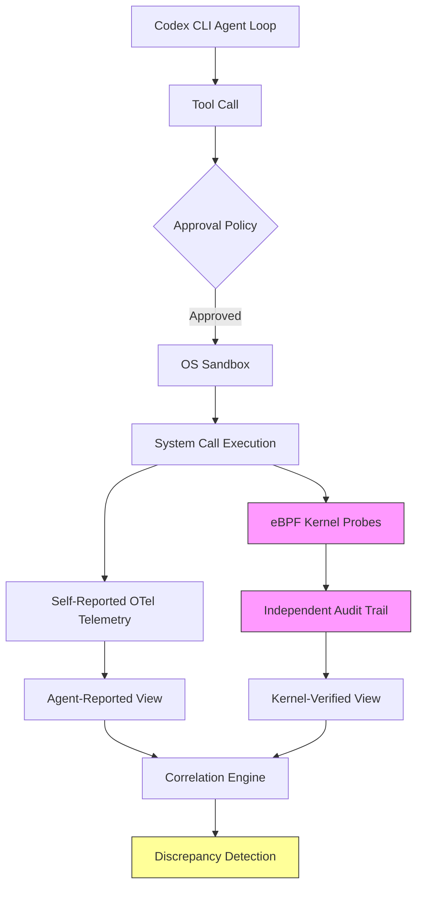
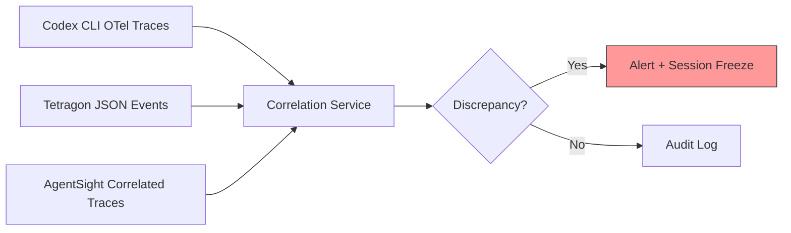

# eBPF Runtime Observability for Codex CLI: AgentSight, Tetragon, and Kernel-Level Agent Monitoring


---

Codex CLI ships with one of the strongest built-in sandboxes in the AI coding agent space — Seatbelt on macOS, Bubblewrap plus Landlock on Linux, and an emerging elevated sandbox on Windows [^1]. These mechanisms restrict what an agent *can do*. But they tell you nothing about what the agent *actually did*. That observability gap — the space between policy enforcement and runtime verification — is where eBPF enters the picture.

This article examines how eBPF-based tools, specifically AgentSight and Cilium Tetragon, provide kernel-level runtime observability for Codex CLI sessions, complementing the built-in sandbox and OpenTelemetry telemetry with an independent, tamper-resistant audit layer.

## The Observability Gap in Agentic Workflows

Codex CLI's security architecture operates at three levels:

1. **Approval policies** — gate tool calls before execution (`suggest`, `auto-edit`, `full-auto`) [^2]
2. **OS-native sandboxing** — restrict filesystem, network, and process capabilities at the kernel boundary [^1]
3. **OpenTelemetry telemetry** — export traces and logs to OTLP-compatible backends [^3]

The first two are preventive controls. The third is self-reported: Codex CLI instruments its own code paths and emits telemetry about what it believes happened. This creates a trust dependency — you are relying on the agent's own harness to accurately report its behaviour.

For most development workflows, this is perfectly adequate. But for regulated environments, long-running autonomous sessions, and multi-agent deployments where Codex CLI runs for hours unattended, an independent verification layer becomes essential.



## AgentSight: Boundary Tracing for Coding Agents

AgentSight [^4] is a research framework from Zheng et al. that applies *boundary tracing* to AI coding agents — monitoring at stable system interfaces (kernel syscalls and TLS-encrypted network traffic) rather than instrumenting volatile application code.

### Architecture

AgentSight uses eBPF to attach probes at two boundaries:

- **Intent stream** — uprobes intercept `SSL_read`/`SSL_write` calls to capture decrypted LLM request/response traffic without requiring agent cooperation or proxy configuration [^4]
- **Action stream** — tracepoints and kprobes monitor `sched_process_exec`, `openat2`, `connect`, and `execve` syscalls to observe what the agent actually does on the host [^4]

The key architectural insight is *dynamic process lineage filtering*. AgentSight tracks `fork`/`execve` chains from the root Codex CLI process, ensuring it captures actions from spawned subprocesses — including shell commands, MCP server processes, and subagent workers — whilst ignoring unrelated system activity.

### Two-Stage Correlation

Raw syscall events are noisy. AgentSight reduces this with a two-stage correlation process [^4]:

1. **Real-time causal linking** — correlates LLM responses with subsequent system actions using process lineage tracking, temporal proximity windows (100–500ms after model responses), and argument matching (filenames and commands from LLM output matched against syscall arguments)
2. **Semantic analysis** — a secondary LLM analyses the correlated trace as a security analyst, detecting threats beyond predefined patterns and generating natural-language explanations

In benchmarks against Claude Code 1.0.62, AgentSight added just 2.9% average overhead across repository understanding (3.4%), code writing (4.9%), and compilation (0.4%) workloads [^4].

### Practical Codex CLI Integration

AgentSight currently targets Claude Code and crewAI agents in its published evaluation [^4]. Applying it to Codex CLI requires pointing the process lineage filter at the `codex` binary:

```bash
# Launch AgentSight targeting the Codex CLI process tree
agentsight monitor \
  --target-binary codex \
  --output /var/log/agentsight/codex-sessions/ \
  --alert-webhook https://alerts.internal/ebpf-agent
```

The framework captures three categories of events particularly relevant to Codex CLI workflows:

- **Prompt injection detection** — correlating a `web_search` or `mcp_call` tool response containing hidden instructions with subsequent unexpected file access or network connections
- **Reasoning loop identification** — detecting repeated identical tool calls that indicate the agent is stuck in an error cycle, burning tokens without progress
- **Multi-agent coordination monitoring** — tracking file locking contention and sequential dependencies across `codex exec` subagent processes [^4]

## Cilium Tetragon: Production-Grade eBPF Enforcement

Where AgentSight is a research prototype focused on observability, Cilium Tetragon [^5] is a production-grade eBPF security platform already deployed across thousands of Kubernetes nodes. Its `TracingPolicy` custom resources define kernel-level observation and enforcement rules.

### The Non-Determinism Challenge

Tetragon was designed for deterministic workloads — web servers, databases, and microservices with predictable syscall patterns. AI coding agents are fundamentally non-deterministic: network destinations, file access patterns, and process behaviour change with every prompt [^6].

This means a `TracingPolicy` that blocks outbound connections to non-allowlisted IPs — sensible for a production web service — would break Codex CLI the first time it runs `npm install` or fetches a Git dependency from an unexpected registry.

The practical approach is to use Tetragon for *observation* rather than *enforcement* when monitoring Codex CLI, reserving enforcement for a small set of invariants that should never be violated regardless of prompt:

```yaml
# tetragon-codex-policy.yaml
# Observe all Codex CLI file and network operations
apiVersion: cilium.io/v1alpha1
kind: TracingPolicy
metadata:
  name: codex-cli-audit
spec:
  kprobes:
    - call: "security_file_open"
      syscall: false
      args:
        - index: 0
          type: "file"
      selectors:
        - matchBinaries:
            - operator: In
              values:
                - "/usr/local/bin/codex"
                - "/home/*/.codex/bin/codex"
          matchActions:
            - action: Post
    - call: "tcp_connect"
      syscall: false
      args:
        - index: 0
          type: "sock"
      selectors:
        - matchBinaries:
            - operator: In
              values:
                - "/usr/local/bin/codex"
          matchActions:
            - action: Post
  # Hard enforcement: kill any Codex subprocess
  # attempting to load a kernel module
  tracepoints:
    - subsystem: "module"
      event: "module_load"
      selectors:
        - matchBinaries:
            - operator: In
              values:
                - "/usr/local/bin/codex"
          matchActions:
            - action: Sigkill
```

### Combining Tetragon with Codex CLI's OTel

Codex CLI's built-in OpenTelemetry support [^3] exports traces and logs via OTLP. Tetragon independently exports events via JSON logs, gRPC, or its Prometheus metrics endpoint. Correlating both streams gives you two independent accounts of the same session:

```toml
# ~/.codex/config.toml — enable OTel export
[otel]
exporter = "otlp-http"
endpoint = "https://otel-collector.internal:4318"
trace_exporter = "otlp-http"
log_user_prompt = false
```

A reconciliation pipeline can then compare Codex CLI's self-reported tool calls with Tetragon's kernel-observed syscalls:



## When eBPF Observability Is Worth the Complexity

eBPF-based monitoring adds operational complexity — kernel version requirements (Linux 5.8+ for BTF, ideally 6.1+ for full Landlock v3 [^7]), eBPF programme maintenance, and a separate event pipeline. This is not justified for every team.

**Use eBPF agent monitoring when:**

- Running `codex exec` in `full-auto` mode for extended periods (hours, not minutes)
- Operating in regulated environments (financial services, healthcare) where independent audit trails are mandated
- Deploying multi-agent swarms where 6+ Codex CLI processes operate concurrently on the same host [^4]
- Your threat model includes prompt injection via MCP server responses or web content

**Stick with built-in sandbox + OTel when:**

- Running interactive sessions where a human reviews every tool call
- The approval policy is `suggest` or `auto-edit` (human remains in the loop)
- You are on macOS (Seatbelt provides adequate containment for most workflows; eBPF tooling on macOS lags behind Linux)

## The Three-Layer Defence Stack

For teams that do adopt eBPF monitoring, the resulting security architecture has three independent layers:

| Layer | Mechanism | What It Provides |
|-------|-----------|-----------------|
| **Prevention** | Seatbelt/Bubblewrap/Landlock sandbox [^1] | Blocks disallowed operations before they execute |
| **Self-reported telemetry** | Codex CLI OpenTelemetry [^3] | Agent's own account of tool calls, tokens, and outcomes |
| **Independent verification** | AgentSight/Tetragon eBPF probes [^4][^5] | Kernel-verified record of actual system calls and network activity |

The value of the third layer is not that it catches more incidents than the first two — in practice, the sandbox prevents the vast majority of harmful actions. Its value is *independent attestation*. When a compliance officer asks "how do you know the agent didn't exfiltrate data?", the answer shifts from "because we told it not to" to "because kernel-level monitoring independently confirmed it didn't make any outbound connections to non-allowlisted destinations during the session."

## Current Limitations and the Road Ahead

eBPF-based agent monitoring is early-stage technology with several practical constraints:

- **macOS support is limited** — Apple's Endpoint Security Framework provides some similar capabilities, but the eBPF ecosystem is Linux-first. AgentSight's published evaluation runs exclusively on Linux [^4]
- **`codex exec` OTel gaps** — Codex CLI's OTel export currently has gaps in non-interactive mode, reducing the value of the correlation approach [^8]
- **Semantic analysis cost** — AgentSight's LLM-based semantic analysis adds latency and cost to the audit pipeline; for high-throughput CI environments running dozens of concurrent `codex exec` instances, this may require batching or sampling
- **Encrypted traffic interception** — the uprobes on `SSL_read`/`SSL_write` work for OpenSSL but may miss traffic from agents using different TLS libraries or HTTP/3 with QUIC [^4]

The MCP Dev Summit Bengaluru (9–10 June 2026) featured a session on eBPF-based auditing for MCP tool calls [^9], signalling growing industry interest in kernel-level agent observability. As coding agents move from developer tools to enterprise infrastructure — with Codex CLI now serving over 5 million weekly users [^10] — the demand for independent runtime verification will only increase.

## Practical Next Steps

For teams wanting to experiment with eBPF agent monitoring alongside Codex CLI:

1. **Start with Tetragon in observation mode** — deploy a `TracingPolicy` that logs all Codex CLI syscalls without enforcement, and review the event volume and patterns for a week before writing any enforcement rules
2. **Enable Codex CLI OTel export** — configure the `[otel]` section in `config.toml` to export traces to your existing observability stack
3. **Build a correlation dashboard** — join Codex CLI trace IDs with Tetragon process events by PID and timestamp to create a unified session view
4. **Reserve enforcement for invariants** — only use Tetragon's `Sigkill` action for operations that should never occur (kernel module loading, `/etc/shadow` access, outbound connections to known-malicious IPs)

The goal is not to replace Codex CLI's built-in security — it is to provide the independent verification layer that turns "we trust the sandbox" into "we verified the sandbox worked."

## Citations

[^1]: OpenAI, "Inside the Codex Sandbox: Platform-Specific Implementation on macOS, Linux and Windows," Codex Knowledge Base, April 2026. [https://codex.danielvaughan.com/2026/04/08/codex-sandbox-platform-implementation/](https://codex.danielvaughan.com/2026/04/08/codex-sandbox-platform-implementation/)

[^2]: OpenAI, "Best practices – Codex," OpenAI Developers, 2026. [https://developers.openai.com/codex/learn/best-practices](https://developers.openai.com/codex/learn/best-practices)

[^3]: OpenAI, "Codex CLI OpenTelemetry: Observability and Metrics in Production," Codex Knowledge Base, March 2026. [https://codex.danielvaughan.com/2026/03/28/codex-cli-opentelemetry-observability/](https://codex.danielvaughan.com/2026/03/28/codex-cli-opentelemetry-observability/)

[^4]: Y. Zheng et al., "AgentSight: System-Level Observability for AI Agents Using eBPF," arXiv:2508.02736, 2025. [https://arxiv.org/abs/2508.02736](https://arxiv.org/abs/2508.02736)

[^5]: Isovalent/Cilium, "Tetragon — eBPF-based Security Observability and Runtime Enforcement," 2026. [https://tetragon.io/](https://tetragon.io/)

[^6]: ARMO, "eBPF for AI Agent Enforcement: What Kernel-Level Security Catches (and What It Misses)," 2026. [https://www.armosec.io/blog/ebpf-based-ai-agent-enforcement/](https://www.armosec.io/blog/ebpf-based-ai-agent-enforcement/)

[^7]: Linux kernel documentation, "Landlock: unprivileged access control," kernel.org, 2026. [https://docs.kernel.org/userspace-api/landlock.html](https://docs.kernel.org/userspace-api/landlock.html)

[^8]: GitHub Issue #12913, "`codex exec` emits no OTel metrics; `codex mcp-server` emits no OTel telemetry at all," openai/codex, 2026. [https://github.com/openai/codex/issues/12913](https://github.com/openai/codex/issues/12913)

[^9]: MCP Dev Summit Bengaluru 2026, Schedule, Linux Foundation Events, June 2026. [https://events.linuxfoundation.org/mcp-dev-summit-bengaluru/program/schedule/](https://events.linuxfoundation.org/mcp-dev-summit-bengaluru/program/schedule/)

[^10]: AWS, "GPT-5.5, GPT-5.4, and Codex from OpenAI are now generally available on Amazon Bedrock," June 2026. [https://aws.amazon.com/about-aws/whats-new/2026/06/amazon-bedrock-openai-models-codex-generally-available/](https://aws.amazon.com/about-aws/whats-new/2026/06/amazon-bedrock-openai-models-codex-generally-available/)
