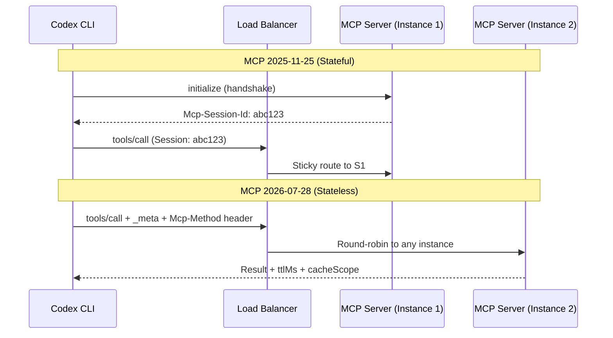
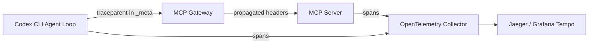
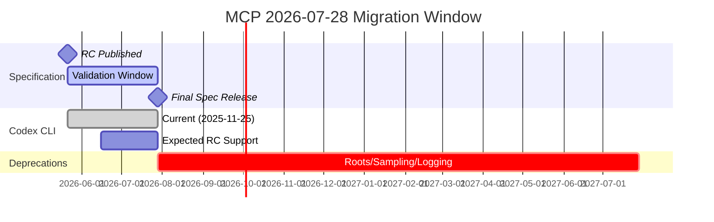

# The MCP 2026-07-28 Release Candidate: What the Stateless Protocol, Extensions, and Tasks Mean for Codex CLI Developers


---

The largest revision of the Model Context Protocol since launch landed as a release candidate on 21 May 2026 [^1]. The final specification ships on 28 July 2026, giving SDK maintainers and server authors a ten-week validation window [^1]. For Codex CLI developers, the changes touch MCP server configuration, gateway routing, caching behaviour, distributed tracing, and the deprecation of three primitives you may already rely on.

This article maps every material change in the RC to a concrete Codex CLI configuration or workflow decision.

## What Changed: The Nine-Point Summary

The RC introduces nine specification-level changes [^2]:

1. **Stateless protocol core** — session handshake and `Mcp-Session-Id` removed
2. **Extensions framework** — first-class opt-in capabilities with reverse-DNS identifiers
3. **Tasks migration** — moves from experimental core to official extension
4. **MCP Apps** — interactive HTML UIs rendered in sandboxed iframes
5. **Server discovery** — `server/discover` capability preflight replaces full initialisation
6. **Required HTTP headers** — `Mcp-Method` and `Mcp-Name` on every request
7. **Authorisation hardening** — six SEPs tighten OAuth 2.0 and OIDC alignment
8. **Deprecation of Roots, Sampling, and Logging** — twelve-month removal runway
9. **JSON Schema 2020-12 for tools** — composition, conditionals, and `$ref` support

The rest of this article focuses on the changes that require action from Codex CLI users.

## The Stateless Core: Why It Matters

The previous specification (2025-11-25) required an `initialize`/`initialized` handshake before any tool call could proceed [^3]. The client received an `Mcp-Session-Id` header that pinned it to a specific server instance, mandating sticky sessions or shared session stores at the load-balancer layer [^1].

The RC eliminates all of this. Protocol version, client capabilities, and client info now travel in a `_meta` field on every request [^1]. A new `server/discover` method lets clients fetch server capabilities on demand without a stateful handshake [^1].



### What This Means for Your `config.toml`

If you run remote MCP servers behind a reverse proxy, the stateless core simplifies your infrastructure. Your Codex CLI configuration does not change — the `[mcp_servers.<name>]` stanza in `config.toml` still uses either `command` (stdio) or `url` (Streamable HTTP) [^4]:

```toml
[mcp_servers.my-remote-tool]
url = "https://mcp.internal.example.com/v1"
bearer_token_env_var = "MCP_TOOL_TOKEN"
```

What changes is on the server side: you can retire sticky-session rules and shared session stores once your server implements the RC [^1]. Codex CLI will negotiate the protocol version automatically via the `_meta` field.

For **stdio servers** (local processes), nothing changes operationally. The handshake removal is transparent because the stdio transport never used HTTP headers or session IDs [^4].

## Required Headers: Routing Without Body Inspection

SEP-2243 mandates two new headers on every Streamable HTTP request [^3]:

| Header | Value | Purpose |
|--------|-------|---------|
| `Mcp-Method` | Matches `body.method` (e.g. `tools/call`) | Gateway routing without JSON parsing |
| `Mcp-Name` | For tool calls, matches `body.params.name` | Per-tool rate limiting |

Servers must reject requests where headers and body disagree [^3]. This enables gateways and rate-limiters to route on headers alone, reducing latency and eliminating deep packet inspection [^1].

**Codex CLI impact:** If you maintain a custom gateway or Nginx proxy in front of remote MCP servers, you will need to update routing rules to use these headers. A minimal Nginx configuration:

```nginx
location /mcp/ {
    proxy_pass http://mcp-upstream;

    # Route tools/call to the compute pool
    if ($http_mcp_method = "tools/call") {
        proxy_pass http://mcp-compute-upstream;
    }

    # Route tools/list to the catalogue pool
    if ($http_mcp_method = "tools/list") {
        proxy_pass http://mcp-catalogue-upstream;
    }
}
```

## Caching: `ttlMs` and `cacheScope`

SEP-2549 introduces cache metadata on list and resource-read responses [^1], modelled on HTTP `Cache-Control`:

| Field | Type | Meaning |
|-------|------|---------|
| `ttlMs` | integer | Milliseconds the response remains valid |
| `cacheScope` | string | `"global"` (share across users), `"user"` (per-user), `"session"` (do not cache) |

Previously, detecting changes to a `tools/list` response required holding an SSE stream open or polling. Now, Codex CLI can cache the tool catalogue locally for the duration specified by the server [^1].

**Practical impact for Codex CLI:** The `startup_timeout_sec` setting in your MCP server configuration already controls how long Codex waits for a server to initialise [^4]. With server-side caching metadata, Codex can skip redundant `tools/list` calls on subsequent turns within a session, reducing the token overhead documented in the MCP Tax pattern [^5]. Watch for Codex CLI releases that surface `ttlMs` behaviour in diagnostics (the `/mcp verbose` TUI command).

## Distributed Tracing: W3C Trace Context

SEP-414 standardises three keys in the `_meta` field for OpenTelemetry-compatible distributed tracing [^1]:

- `traceparent` — W3C trace parent identifier
- `tracestate` — vendor-specific trace data
- `baggage` — arbitrary key-value context

Before this SEP, different SDKs used inconsistent key names, breaking trace correlation across multi-SDK deployments [^3]. If you already use Codex CLI's OpenTelemetry export (enabled via the `OTEL_EXPORTER_OTLP_ENDPOINT` environment variable), traces from Codex CLI tool calls will now correlate cleanly with traces from your MCP servers [^6].



## The Extensions Framework

The RC introduces a formal Extensions Track (SEP-2133) [^1]. Extensions use reverse-DNS identifiers, negotiate through `extensions` maps on client and server capabilities, version independently from the core specification, and ship in dedicated `ext-*` repositories with delegated maintainers [^1].

Two extensions graduate immediately:

### Tasks Extension

Tasks moved from experimental core (2025-11-25) to an official extension [^2]. The redesigned lifecycle is stateless: servers answer `tools/call` with task handles, and clients drive progress via `tasks/get`, `tasks/update`, and `tasks/cancel` [^1]. The previous `tasks/list` method was removed due to scoping challenges without sessions [^1].

**Codex CLI relevance:** If you use long-running MCP tools (database migrations, infrastructure provisioning, test suites), the Tasks extension lets the server return a handle immediately and report progress asynchronously. Codex CLI's goal mode — which drives multi-hour autonomous sessions [^7] — benefits directly from this pattern: the agent can poll task progress without holding a connection open.

### MCP Apps Extension

Servers can now ship interactive HTML interfaces rendered in sandboxed iframes by hosts (SEP-1865) [^1]. Tools declare UI templates ahead of time; hosts prefetch, cache, and security-review them; rendered UI communicates via JSON-RPC; and UI-initiated actions follow standard audit and consent paths [^1].

**Codex CLI relevance:** The CLI's TUI cannot render HTML iframes, so MCP Apps are primarily relevant to Codex Desktop and the IDE extension. However, if you author MCP servers that will be consumed by both CLI and desktop users, you should design tool responses that degrade gracefully — returning structured JSON for CLI consumers and richer UI for desktop consumers.

## Authorisation Hardening

Six SEPs tighten OAuth 2.0 and OpenID Connect alignment [^1]:

| SEP | Change | CLI Impact |
|-----|--------|------------|
| SEP-2468 | Issuer validation per RFC 9207 | `codex mcp login` validates `iss` parameter |
| SEP-837 | Application type declaration | CLI clients declare `application_type` during registration |
| SEP-2352 | Credential binding to issuer | Re-registration needed if server migrates auth providers |
| SEP-2207 | Refresh token requests | Better long-session token management |
| SEP-2350 | Scope accumulation | Step-up auth during tool escalation |
| SEP-2351 | Discovery suffix | `.well-known` endpoint conventions |

If you use `codex mcp login <server-name>` for OAuth-authenticated remote servers [^4], the CLI will need to implement issuer validation (SEP-2468) and application type declaration (SEP-837). This is handled by the Codex CLI runtime — no user configuration change required — but you should expect a CLI update before 28 July that addresses these requirements.

## Three Deprecations: Roots, Sampling, and Logging

The RC deprecates three primitives under a new lifecycle policy (SEP-2577) that mandates a minimum twelve months between deprecation and removal [^1]:

| Primitive | Replacement | Earliest Removal |
|-----------|-------------|-----------------|
| **Roots** | Tool parameters, resource URIs, or server configuration | July 2027 |
| **Sampling** | Direct LLM provider API integration | July 2027 |
| **Logging** | `stderr` (stdio) or OpenTelemetry (HTTP) | July 2027 |

### Roots

Roots allowed clients to tell servers about filesystem paths. The replacement is straightforward: pass working directories as explicit tool parameters [^3]:

```toml
# Before: root paths managed by protocol
# After: pass paths as tool arguments — no config.toml change needed
```

Codex CLI's sandbox already controls filesystem access at the OS level (Seatbelt on macOS, Landlock on Linux) [^8], making protocol-level root declarations redundant for security purposes.

### Sampling

Sampling let servers request LLM completions from clients. This was never widely adopted in Codex CLI workflows, and the replacement — servers calling LLM APIs directly — is more predictable [^1].

### Logging

MCP's built-in logging primitive is replaced by `stderr` for stdio transports and OpenTelemetry for structured observability [^1]. This aligns with Codex CLI's existing telemetry architecture, which already exports spans via OpenTelemetry [^6].

## JSON Schema 2020-12: Richer Tool Definitions

Tool `inputSchema` and `outputSchema` now support full JSON Schema 2020-12 (SEP-2106) [^1]:

- **Composition:** `oneOf`, `anyOf`, `allOf`
- **Conditionals:** `if`/`then`/`else`
- **References:** `$ref` and `$defs` (external `$ref` URIs must not be auto-dereferenced)
- **Output schemas:** unrestricted (no `type: "object"` root constraint)

This is significant for MCP server authors who want to express complex tool signatures. Codex CLI's `--output-schema` flag for structured output in `codex exec` pipelines will benefit from richer validation [^9].

## Migration Checklist for Codex CLI Developers

Use this checklist to prepare before 28 July 2026:

- [ ] **Audit remote MCP servers** — identify any servers using the 2025-11-25 `initialize` handshake
- [ ] **Update gateways** — add `Mcp-Method` / `Mcp-Name` header routing if using custom proxies
- [ ] **Check error handling** — replace any client code matching error `-32002` with `-32602` [^3]
- [ ] **Review Roots usage** — migrate filesystem path declarations to explicit tool parameters
- [ ] **Test with RC-compatible SDKs** — Tier 1 SDKs (TypeScript, Python) should ship RC support within the validation window [^1]
- [ ] **Update Codex CLI** — watch for a release that implements the RC before 28 July
- [ ] **Verify tracing** — confirm `traceparent` correlation in your OpenTelemetry backend

## Timeline



⚠️ The exact Codex CLI release that implements the RC has not been announced. Monitor the Codex CLI changelog [^10] for a release noting MCP 2026-07-28 support.

## The Bottom Line

The MCP RC is overwhelmingly good news for Codex CLI developers. The stateless core simplifies remote MCP server deployment. Required headers enable smarter gateways. Caching metadata reduces token overhead. Distributed tracing finally works across SDKs. The three deprecations have twelve-month runways and straightforward replacements.

The primary action item is infrastructure: if you run remote MCP servers behind custom proxies or gateways, plan your header-routing and session-removal work now. The protocol changes are transparent for stdio-based local servers, which account for the majority of Codex CLI MCP configurations.

The ten-week validation window closes on 28 July. Start testing with RC-compatible SDKs today.

## Citations

[^1]: "The 2026-07-28 MCP Specification Release Candidate," Model Context Protocol Blog, 21 May 2026. [https://blog.modelcontextprotocol.io/posts/2026-07-28-release-candidate/](https://blog.modelcontextprotocol.io/posts/2026-07-28-release-candidate/)

[^2]: "MCP Protocol Updates 2026: 9 Spec Changes, RC Migration Map," TokenMix Blog, 2026. [https://tokenmix.ai/blog/mcp-updates-changelog-every-protocol-change-2026](https://tokenmix.ai/blog/mcp-updates-changelog-every-protocol-change-2026)

[^3]: "MCP Spec Ships July 28 — Every Breaking Change and How to Migrate," DEV Community, 2026. [https://dev.to/akaranjkar08/mcp-spec-ships-july-28-every-breaking-change-and-how-to-migrate-4co8](https://dev.to/akaranjkar08/mcp-spec-ships-july-28-every-breaking-change-and-how-to-migrate-4co8)

[^4]: "Model Context Protocol — Codex," OpenAI Developers, 2026. [https://developers.openai.com/codex/mcp](https://developers.openai.com/codex/mcp)

[^5]: "The MCP Tax: When Shell Commands Beat MCP Servers in Codex CLI Workflows," Codex Knowledge Base, 9 June 2026. [https://codex.danielvaughan.com/2026/06/09/mcp-tax-when-shell-commands-beat-mcp-servers-codex-cli-token-cost-decision-framework/](https://codex.danielvaughan.com/2026/06/09/mcp-tax-when-shell-commands-beat-mcp-servers-codex-cli-token-cost-decision-framework/)

[^6]: "Codex CLI OpenTelemetry Observability: Tracing Agent Sessions," Codex Knowledge Base, 16 April 2026. [https://codex.danielvaughan.com/2026/04/16/codex-cli-opentelemetry-observability-tracing-agent-sessions/](https://codex.danielvaughan.com/2026/04/16/codex-cli-opentelemetry-observability-tracing-agent-sessions/)

[^7]: "Codex CLI Goal Mode: Persistent Objectives and Token Budgets," Codex Knowledge Base, 3 May 2026. [https://codex.danielvaughan.com/2026/05/03/codex-cli-goal-mode-persistent-objectives-token-budgets-agentic-loops/](https://codex.danielvaughan.com/2026/05/03/codex-cli-goal-mode-persistent-objectives-token-budgets-agentic-loops/)

[^8]: "Codex CLI Sandbox Internals: Seatbelt, Bubblewrap, Landlock, and Windows DACL," Codex Knowledge Base, 3 May 2026. [https://codex.danielvaughan.com/2026/05/03/codex-cli-sandbox-internals-seatbelt-bubblewrap-landlock-windows-dacl/](https://codex.danielvaughan.com/2026/05/03/codex-cli-sandbox-internals-seatbelt-bubblewrap-landlock-windows-dacl/)

[^9]: "Codex CLI Non-Interactive Pipelines: exec, resume, and Structured Output," Codex Knowledge Base, 3 May 2026. [https://codex.danielvaughan.com/2026/05/03/codex-cli-non-interactive-pipelines-exec-resume-structured-output/](https://codex.danielvaughan.com/2026/05/03/codex-cli-non-interactive-pipelines-exec-resume-structured-output/)

[^10]: "Changelog — Codex," OpenAI Developers, 2026. [https://developers.openai.com/codex/changelog](https://developers.openai.com/codex/changelog)
