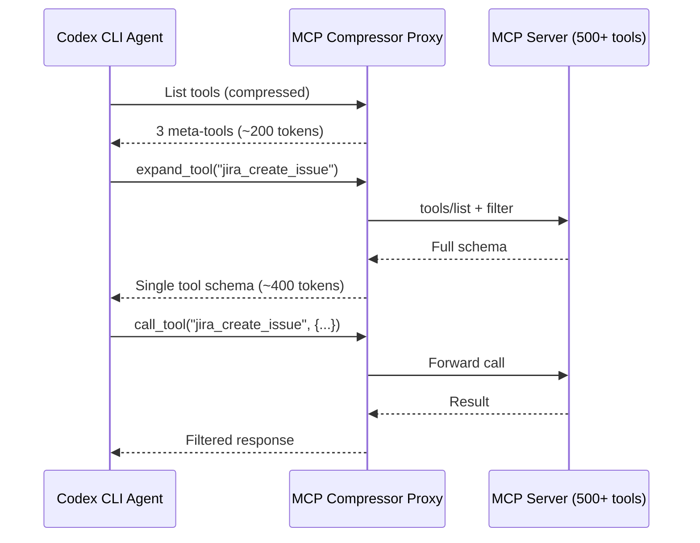
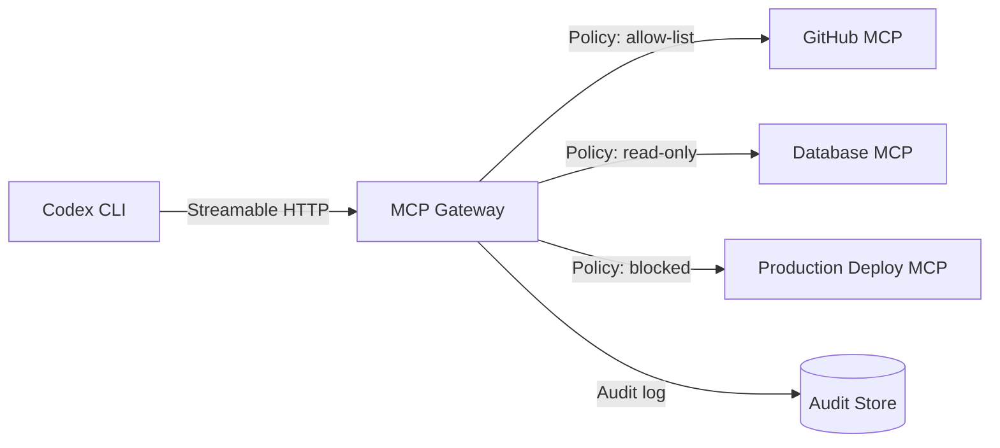

# MCP Dev Summit Bengaluru: Five Production Patterns Every Codex CLI Developer Should Know


---

The first major production-focused MCP conference opened today in Bengaluru, running 9–10 June 2026 under the Linux Foundation and the Agentic AI Foundation.[^1] With 58+ technical sessions, nine keynotes, and speakers from Google, AWS, IBM, Redis, Wipro, HDFC Bank, and Red Hat, this is not a protocol theory workshop — it is an inventory of what breaks when MCP servers hit real traffic.[^2]

For Codex CLI developers, the summit's programme reads like a checklist of configuration decisions you will face this quarter. This article distils the five production patterns most relevant to your daily workflow, maps each to specific Codex CLI features in v0.137, and provides the configuration you need to act on them now.

## 1 — Skills are not MCP servers

Harness Inc's Animesh Pathak and Jyoti Bisht present "Skills Are Not MCP Servers" on Day 2, arguing that conflating the two causes architectural bloat and unreliable tool selection.[^2] The distinction matters because skills and MCP servers occupy fundamentally different layers in the agent stack.

A **skill** is a prompt-based instruction file — markdown that modifies agent behaviour without any running process. It is loaded into context at session start and costs tokens but requires no runtime, no network connection, and no error handling beyond what the LLM provides.[^3] An **MCP server** is a process that exposes callable tools over a standardised protocol, with input/output schemas, authentication, transport management, and failure modes of its own.[^4]

Red Hat's developer guide frames the decision cleanly: "If the data changes between invocations, you need MCP because the agent needs live access. If the knowledge is stable enough that you could write it down once and have it be right for weeks, a skill file is simpler, cheaper, and does not require a separate runtime that can fail independently of the agent."[^3]

### How this maps to Codex CLI

Codex CLI supports both primitives natively. Skills live as `SKILL.md` files under `.codex/skills/` or `~/.codex/skills/`, loaded per-turn by the skills extension crate introduced in v0.137.[^5] MCP servers are declared in `config.toml` under `[mcp_servers]` with transport, command, and authentication options.[^6]

The practical test: if you are packaging a workflow that calls `git`, `npm`, or `cargo` commands through the agent's own shell tool, that is a skill. If you are connecting to a Slack API, a database, or a Kubernetes cluster, that is an MCP server. Mixing the two — writing an MCP server that merely wraps shell commands the agent could run directly — adds a failure surface with no capability gain.

```toml
# config.toml — skill via the skills directory, no MCP server needed
# Place the file at .codex/skills/coverage-ratchet.md instead

[mcp_servers.github]
# MCP server: live API access that the agent cannot replicate locally
command = "npx"
args = ["-y", "@modelcontextprotocol/server-github"]
env = { GITHUB_PERSONAL_ACCESS_TOKEN = "${GITHUB_TOKEN}" }
```

## 2 — Putting MCP on a diet: tool-description compression

Truefoundry's Prathamesh Saraf presents "Putting MCP on a Diet: A Proxy for Tool Scoping and Context Compression" on Day 1.[^2] The core problem: a single large MCP server can consume 10,000–17,000+ tokens of context per request just for tool definitions.[^7] With multiple servers configured, tool descriptions alone can exhaust a meaningful fraction of your context window before the agent writes a single line of code.

Atlassian Labs' open-source `mcp-compressor` demonstrates the proxy pattern — it wraps any MCP server and replaces its full toolset with a compact discovery interface, expanding individual tool schemas only when the model actually needs them.[^8] The reported overhead reduction is 70–97%.



### How this maps to Codex CLI

Codex CLI v0.137 already supports MCP tool search via the `custom-server tool search` feature, which allows servers to advertise tools lazily rather than dumping their full catalogue into context.[^5] For servers that do not support tool search natively, you can interpose `mcp-compressor` as a stdio wrapper:

```toml
[mcp_servers.jira-compressed]
command = "npx"
args = ["-y", "@atlassian/mcp-compressor", "--", "npx", "-y", "@atlassian/mcp-server-jira"]
env = { JIRA_API_TOKEN = "${JIRA_TOKEN}" }
```

Additionally, Codex CLI's `mcp_tool_timeout` and response-filtering patterns in PostToolUse hooks can trim output tokens. The summit talk by HDFC Bank's Suraj B, "Beyond Tool Calls: Unlocking Interactive, Token-Smart Agents," reinforces that tool output filtering at the MCP layer — requesting only the fields the agent needs — is as important as compressing definitions.[^2]

## 3 — From SSE to Streamable HTTP: the transport migration

Harness Inc's Animesh Pathak returns on Day 1 with "From SSE To Streamable HTTP," charting the transport change that the MCP specification formalised in May 2025 and that is now reaching enforcement deadlines across major platforms.[^2][^9]

The legacy HTTP+SSE transport required two endpoints: one for the SSE event stream (`/sse`) and a separate one for client-to-server messages (`/messages`). Streamable HTTP collapses both into a single `POST /mcp` endpoint, optionally upgrading to SSE for server-initiated streaming when needed.[^9] The benefits are concrete: simpler load-balancer configuration, no more "which endpoint do I send this to" bugs, and compatibility with standard HTTP infrastructure that does not understand long-lived SSE connections.[^10]

The migration timeline is tightening. Keboola dropped SSE support on 1 April 2026. Atlassian's deadline is 30 June 2026. The MCP 2026-07-28 release candidate, scheduled for final publication on 28 July, makes SSE formally deprecated.[^11]

### How this maps to Codex CLI

Codex CLI v0.136 added OAuth options specifically for streamable HTTP servers, and v0.137 stabilised per-server environment targeting for remote MCP connections.[^5][^12] When configuring a remote MCP server, use the `url` field (streamable HTTP) rather than the legacy `sse_url`:

```toml
[mcp_servers.production-api]
# Streamable HTTP — single endpoint, no SSE coordination
url = "https://mcp.internal.example.com/mcp"
auth = "oauth"
oauth_client_id = "codex-cli-prod"
oauth_scopes = ["tools:read", "tools:execute"]
```

If you are running MCP servers that still expose only SSE, the migration path is straightforward: update the server framework (most MCP SDKs now default to streamable HTTP) and change `sse_url` to `url` in your Codex CLI configuration. Test with `codex doctor` to verify connectivity.[^13]

## 4 — MCP gateway patterns for regulated environments

Wipro's Hariskumar Panakkal presents "From Intent To Production: MCP Gateway Patterns for Regulated Banking" on Day 2, and Freshworks' Rahul Ganesh Partheeban follows with "From MCP Discovery To Execution: Governed Marketplace & Gateway."[^2] Both sessions address the same architectural question: how do you put a policy layer between the agent and the tool servers?

The gateway pattern interposes a reverse proxy between the MCP client (Codex CLI) and the backend MCP servers. The gateway handles authentication, rate limiting, audit logging, tool allow-listing, and per-user access control — concerns that individual MCP servers should not own.[^14]



WSO2's Ayesha Dissanayaka adds a complementary layer with "Ambient Identity: Just-in-Time Authorisation Patterns," describing short-lived credential injection that prevents long-lived tokens from accumulating in agent configurations.[^2]

### How this maps to Codex CLI

Codex CLI's `requirements.toml` already provides a policy layer: administrators can enforce which MCP servers are allowed, block specific sandbox modes, and mandate approval policies that users cannot weaken.[^15] For teams operating in regulated environments, the gateway pattern extends this by moving policy enforcement to the network layer:

```toml
# requirements.toml — organisational policy
[mcp_servers]
# Only allow connections through the governed gateway
allowed_urls = ["https://mcp-gateway.internal.bank.com/*"]

[sandbox]
# Prevent developers from disabling the sandbox
disallow_modes = ["danger-full-access"]
```

Codex CLI's per-server environment targeting (v0.136+) supports injecting short-lived credentials per MCP connection, aligning with the just-in-time authorisation pattern.[^12] Combined with `CODEX_API_KEY` registration for approved hosts in remote execution setups, the credential surface shrinks to what each server actually needs.[^5]

## 5 — The stdio deadlock nobody warned you about

MIT ADT University's Yuvraj Pradhan and Archana Kumari present "The Stdio Deadlock Nobody Warned Us About" on Day 2, documenting the pipe buffer exhaustion problem that has bitten every major MCP client implementation.[^2]

The mechanics are simple: stdio MCP servers communicate via stdin/stdout pipes. Operating systems impose a fixed pipe buffer size (typically 64 KB on Linux, 8 KB effective on macOS).[^16] When an MCP server writes a response larger than the buffer — or writes copiously to stderr while the parent process is not reading — the `write()` syscall blocks. If the parent is simultaneously waiting for the response on stdout, both processes deadlock permanently.[^16][^17]

This is not a theoretical concern. Cursor's bug tracker documents stdio MCP servers hanging on macOS when responses exceed 8 KB.[^16] The Codex plugin companion (`codex-plugin-cc`) has logged IPC pipe deadlocks when Codex spawns stdout-heavy PowerShell commands on Windows.[^17] Claude Code's subagent orchestrator has observed Task() tool hangs when pipe buffers fill before the parent reads.[^18]

### How this maps to Codex CLI

Codex CLI mitigates this through several mechanisms:

1. **Async pipe reading** — the Rust runtime (`codex-core`) reads stdout and stderr concurrently via tokio, preventing the classic "blocked on stdout while stderr fills" deadlock.[^19]
2. **Response size limits** — MCP tool responses are subject to configurable size limits, preventing unbounded output from exhausting buffers.
3. **Streamable HTTP as an escape hatch** — for servers known to produce large responses, switching from stdio to streamable HTTP transport eliminates the pipe buffer constraint entirely.

If you are running a stdio MCP server that occasionally produces large output (database query results, log analysis, file content), the safest configuration is to move it to streamable HTTP or add response pagination in the server itself:

```toml
[mcp_servers.database]
# Switch from stdio to streamable HTTP to avoid pipe buffer limits
# Before: command = "node", args = ["db-mcp-server.js"]
url = "http://localhost:3100/mcp"
```

For stdio servers you cannot modify, IBM's Harini Anand presents "Auditing MCP Tool Calls at the Kernel Level: eBPF" as a complementary monitoring approach — using kernel-level tracing to detect when MCP processes stall on blocked pipe writes before the deadlock becomes visible to the agent.[^2]

## What to watch next

Three summit themes will shape Codex CLI's MCP stack through the rest of 2026:

- **MCP Apps** — the 2026-07-28 RC introduces server-shipped interactive HTML interfaces rendered in sandboxed iframes.[^11] Codex CLI's TUI will need to decide how to handle visual tool outputs.
- **Stateless protocol core** — the RC removes the initialisation handshake and protocol-level session header.[^11] This simplifies Codex CLI's MCP client but requires servers to handle state externally.
- **A2A boundary** — Adobe and Google's joint session "Where MCP Ends and A2A Begins" explores the protocol boundary between tool access (MCP) and agent-to-agent communication (A2A).[^2] For Codex CLI's multi-agent v2 runtime, this distinction determines whether subagent coordination uses MCP servers or a separate orchestration layer.

The MCP Dev Summit Bengaluru is not a spectator event for Codex CLI users — it is a preview of the configuration changes landing in your `config.toml` over the next two months.

## Citations

[^1]: Linux Foundation, "MCP Dev Summit Bengaluru," [https://events.linuxfoundation.org/mcp-dev-summit-bengaluru/](https://events.linuxfoundation.org/mcp-dev-summit-bengaluru/)
[^2]: MCP Dev Summit Bengaluru 2026, "Schedule & Directory," [https://mcpbengaluru26.sched.com/](https://mcpbengaluru26.sched.com/)
[^3]: Red Hat Developer, "MCP servers vs. skills: Choosing the right context for your AI," [https://developers.redhat.com/articles/2026/05/25/mcp-servers-vs-skills-choosing-right-context-your-ai](https://developers.redhat.com/articles/2026/05/25/mcp-servers-vs-skills-choosing-right-context-your-ai)
[^4]: OpenAI Developers, "Model Context Protocol – Codex," [https://developers.openai.com/codex/mcp](https://developers.openai.com/codex/mcp)
[^5]: Releasebot, "Codex Updates by OpenAI - June 2026," [https://releasebot.io/updates/openai/codex](https://releasebot.io/updates/openai/codex)
[^6]: OpenAI Developers, "Configuration Reference – Codex," [https://developers.openai.com/codex/config-reference](https://developers.openai.com/codex/config-reference)
[^7]: MindStudio, "How to Reduce Token Usage in AI Agents: 10 MCP Optimization Techniques," [https://www.mindstudio.ai/blog/reduce-token-usage-ai-agents-mcp-optimization](https://www.mindstudio.ai/blog/reduce-token-usage-ai-agents-mcp-optimization)
[^8]: Atlassian Labs, "mcp-compressor," [https://github.com/atlassian-labs/mcp-compressor](https://github.com/atlassian-labs/mcp-compressor)
[^9]: Auth0, "Why MCP's Move Away from Server Sent Events Simplifies Security," [https://auth0.com/blog/mcp-streamable-http/](https://auth0.com/blog/mcp-streamable-http/)
[^10]: Bright Data, "SSE vs Streamable HTTP: Why MCP Switched Transport Protocols," [https://brightdata.com/blog/ai/sse-vs-streamable-http](https://brightdata.com/blog/ai/sse-vs-streamable-http)
[^11]: Model Context Protocol Blog, "The 2026-07-28 MCP Specification Release Candidate," [https://blog.modelcontextprotocol.io/posts/2026-07-28-release-candidate/](https://blog.modelcontextprotocol.io/posts/2026-07-28-release-candidate/)
[^12]: Codex Knowledge Base, "Codex CLI MCP v0.136: Per-Server Env Targeting, OAuth, Streamable HTTP," [https://codex.danielvaughan.com/2026/06/03/codex-cli-mcp-v0136-per-server-env-targeting-oauth-streamable-http-concurrent-tools/](https://codex.danielvaughan.com/2026/06/03/codex-cli-mcp-v0136-per-server-env-targeting-oauth-streamable-http-concurrent-tools/)
[^13]: Codex Knowledge Base, "Codex Doctor and the Diagnostic Toolkit," [https://codex.danielvaughan.com/2026/06/08/codex-doctor-diagnostic-toolkit-troubleshooting-guide-environment-connectivity-checks/](https://codex.danielvaughan.com/2026/06/08/codex-doctor-diagnostic-toolkit-troubleshooting-guide-environment-connectivity-checks/)
[^14]: Chanl Blog, "From MCP Discovery To Execution: Governed Marketplace & Gateway," [https://www.channel.tel/blog/mcp-sampling-elicitation-patterns-builders-skip](https://www.channel.tel/blog/mcp-sampling-elicitation-patterns-builders-skip)
[^15]: OpenAI Developers, "Advanced Configuration – Codex," [https://developers.openai.com/codex/config-advanced](https://developers.openai.com/codex/config-advanced)
[^16]: Cursor Community Forum, "stdio MCP server hangs on macOS when response > 8 KB," [https://forum.cursor.com/t/bug-stdio-mcp-server-hangs-on-macos-when-response-8-kb-pipe-buffer-exhaustion/158804](https://forum.cursor.com/t/bug-stdio-mcp-server-hangs-on-macos-when-response-8-kb-pipe-buffer-exhaustion/158804)
[^17]: GitHub, "codex-companion IPC pipe deadlocks mid-review," [https://github.com/openai/codex-plugin-cc/issues/330](https://github.com/openai/codex-plugin-cc/issues/330)
[^18]: GitHub, "MCP tool calls hang when completed background agent exists," [https://github.com/anthropics/claude-code/issues/27431](https://github.com/anthropics/claude-code/issues/27431)
[^19]: OpenAI, "Codex CLI — Open Source," [https://github.com/openai/codex](https://github.com/openai/codex)
